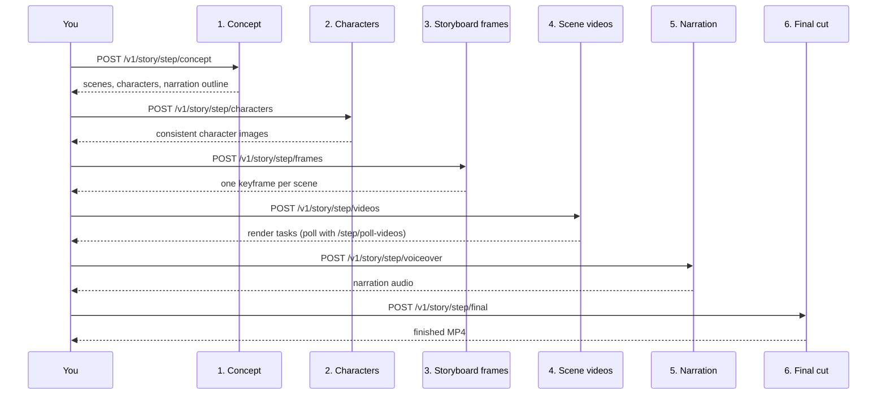

# Story Studio

Multi-scene narrative video from one prompt. Story Studio writes the story, designs the cast, draws a keyframe for every scene, renders each scene as a clip, narrates it and composes the finished MP4 — as one streaming call, or as eight separate calls you can review between.

::: info Six steps, two ways to drive them
`POST /v1/story/generate` runs the whole pipeline and streams progress as Server-Sent Events. The `/v1/story/step/*` endpoints run the same six steps one at a time, so your users can approve a concept, redraw a character or swap a video model before you pay for the expensive part.
:::

::: warning Scene renders are priced per model, per second — changed 2026-09-02
Step 4 used to cost one flat $0.535906 no matter what it rendered. It now costs what the clips cost: each scene is charged at its model's own per-second rate, the same rate `/v1/ai/generate/video` bills, and only for the scenes that are actually submitted. A four-scene story ranges from **$0.52** to **$4.66** depending on the model you pick, so `video_model` is now the field that decides your bill. See [What it costs](#what-it-costs).
:::

## Pipeline

Each step takes the previous step's output object back **unmodified** — you pass
`concept` through the whole chain, and `characters`, `frames`, `videos` forward
from the step that produced them. That is what keeps the cast and the look
consistent across scenes.

## One call, or eight

`POST /v1/story/generate` runs all six steps and streams progress as Server-Sent
Events.

| Field | Default | Notes |
|---|---|---|
| `prompt` | — | **Required.** 3–2000 characters. |
| `style` | planner chooses | e.g. `cinematic`, `anime`, `3D cartoon`, `documentary` |
| `num_scenes` | `4` | 2–6 |
| `duration_per_scene` | `5` | 3–15 seconds |
| `video_model` | `seedance` | See the model list below — **this field decides your bill** |
| `voice` | default narrator | Voice id for narration |
| `language` | `en` | `en`, `pl` or `de` |
| `aspect_ratio` | `16:9` | `16:9`, `9:16` or `1:1` |

### Video models

`seedance-2-0-mini` (default, cheapest), `seedance-2-0-fast`,
`seedance-2-0-pro`, `seedance-2-5` (up to 30 s), `seedance-1-5`,
`veo-3-1-fast`, `veo-3-1`, `wan` (Alibaba Wan 2.6) and `happyhorse`
(Alibaba HappyHorse 1.1).

## The step endpoints

| Step | Endpoint | Takes |
|---|---|---|
| 1 | `POST /v1/story/step/concept` | `prompt`, `style`, `num_scenes`, `duration_per_scene`, `language`, `aspect_ratio` |
| 2 | `POST /v1/story/step/characters` | `concept`, optional `style` |
| 3 | `POST /v1/story/step/frames` | `concept`, `characters`, optional `style` |
| 4 | `POST /v1/story/step/videos` | `concept`, `frames`, `video_model`, optional `duration_per_scene` / `aspect_ratio` |
| 4b | `POST /v1/story/step/poll-videos` | `videos` — the scenes step 4 returned, carrying their task ids |
| 5 | `POST /v1/story/step/voiceover` | `concept`, `scenes`, optional `voice` |
| 6 | `POST /v1/story/step/final` | `concept`, `videos`, optional `voiceover_url` |

Two repair endpoints let you fix one thing without re-running the pipeline:

- `POST /v1/story/regenerate/character` — `concept` plus `character_index`.
  Leave `style` out: keeping the concept's own style is exactly what keeps the
  rest of the cast looking like themselves.
- `POST /v1/story/regenerate/frame` — `concept` plus the scene to redraw.

::: warning An off-by-one that will bite a retry loop
`frames_failed` reports scene numbers **1-based**, while `frame_index` on
`regenerate/frame` is **0-based**. Looping straight over `frames_failed` and
feeding each value to `frame_index` silently regenerates the wrong scene.
:::

## What it costs

Scene rendering is charged **per model, per second** — the same rate
`/v1/ai/generate/video` bills — and only for the scenes actually submitted.
It is not a flat fee, and the spread is wide: a four-scene story runs from
about **$0.52** to **$4.66** depending on `video_model`.

Price the run before you make it with `GET /v1/pricing`, which is the table the
biller reads. The other five steps are small next to the clips.

## Two fields that are accepted and ignored

`StepFinalRequest` takes `music_url` and `transitions`. Neither does anything
yet — the composer does not mix a music bed, and it always crossfades between
scenes. They are reserved, and documented here so you do not spend an afternoon
wondering why your music never appears.

## Related

[Video quickstart](/guides/quickstart-video) ·
[API surface map](/api/surface-map) ·
[Pricing](/guides/pricing)
