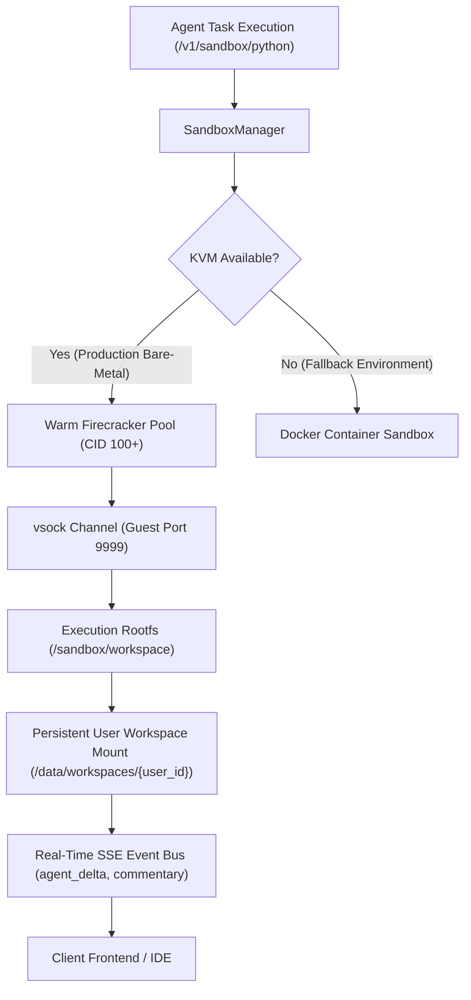

# Agent Sandboxes & Firecracker microVMs

Execute untrusted agent-generated code, shell scripts, and multi-step data processing tasks in high-isolation microVMs booted in under 200 milliseconds.

Managed by the **Agent Compute Engine** (`server/agent-compute/`), sandboxes isolate each tenant session using hardware-level KVM virtualization backed by AWS Firecracker with an automated Docker container fallback.

---

## Sandbox Architecture



---

## Key Capabilities

1. **Sub-200ms Cold Starts**: The `SandboxManager` maintains a warm pool (`pool_size=3`) of booted microVMs. When an execution request arrives, a pre-booted VM is allocated with zero cold-start delay.
2. **Vsock Channel Communication**: Commands and stdout/stderr payloads communicate over host-to-guest virtio-vsock sockets rather than virtual TCP/IP networks, neutralizing SSRF vulnerabilities.
3. **Persistent Virtual Workspace**: User files persist in `/data/workspaces/{user_id}` and map directly into `/sandbox/workspace` across successive sandbox restarts.
4. **Real-time SSE `agent_delta` Streaming**: Streams incremental agent reasoning tokens, stdout chunks, and execution commentary every 100ms over Server-Sent Events.
5. **Human-in-the-Loop Task Pausing**: Tasks pause execution automatically on sensitive operations or when an agent calls `ask_user`. Execution suspends cleanly until the user issues a `/resume` or `/cancel` command.

---

## Sandbox Execution API

### Running Python in an Isolated MicroVM

::: code-group

```python [Python]
from fotohub import FotoHub
import os

client = FotoHub(api_key=os.environ["FOTOHUB_API_KEY"])

# Execute data processing script in dedicated sandbox
result = client.post("/v1/sandbox/python", {
    "code": """
import pandas as pd
import numpy as np

# Generate statistical distribution
data = np.random.normal(loc=50, scale=10, size=1000)
df = pd.DataFrame({"sample": data})

mean = df["sample"].mean()
std = df["sample"].std()

print(f"Calculated Mean: {mean:.2f}, StdDev: {std:.2f}")

# Save artifact to persistent workspace
df.to_csv("/sandbox/workspace/distribution.csv", index=False)
print("Saved /sandbox/workspace/distribution.csv")
    """,
    "timeout": 30
})

print("Execution Exit Code:", result["exit_code"])
print("Standard Output:\n", result["stdout"])
```

```typescript [TypeScript]
import { FotoHub } from "fotohub";

const client = new FotoHub({ apiKey: process.env.FOTOHUB_API_KEY! });

async function runSandboxShell() {
  const result = await client.post("/v1/sandbox/shell", {
    command: "ffmpeg -version | head -n 1 && uname -a",
    timeout: 10,
  });

  console.log("Stdout:", result.data.stdout);
}

runSandboxShell();
```

```bash [cURL]
curl -X POST https://apis.fotohub.app/v1/sandbox/python \
  -H "Authorization: Bearer $FOTOHUB_API_KEY" \
  -H "Content-Type: application/json" \
  -d '{
    "code": "import sys; print(f\"Running on Python {sys.version}\")",
    "timeout": 10
  }'
```

:::

---

## Streaming Real-Time Execution with SSE

Subscribe to `GET /v1/tasks/{task_id}/events` to receive real-time streaming tokens and agent events:

```typescript
const eventSource = new EventSource(
  `https://apis.fotohub.app/v1/tasks/${taskId}/events?token=${apiKey}`
);

eventSource.addEventListener("agent_delta", (event) => {
  const payload = JSON.parse(event.data);
  // Real-time LLM token or terminal stdout chunk
  process.stdout.write(payload.delta);
});

eventSource.addEventListener("commentary", (event) => {
  const payload = JSON.parse(event.data);
  console.log(`[Agent Thought] ${payload.message}`);
});

eventSource.addEventListener("task_progress", (event) => {
  const payload = JSON.parse(event.data);
  console.log(`Progress: ${payload.percent}% - Status: ${payload.status}`);
});
```

---

## Human-in-the-Loop Control & Pausing

When an agent needs human confirmation (e.g. executing destructive operations or asking for clarification via `ask_user`), the task status transitions to `paused`.

### Pausing a Running Task

```bash
curl -X POST https://apis.fotohub.app/v1/tasks/task_8910ab/pause \
  -H "Authorization: Bearer $FOTOHUB_API_KEY"
```

### Resuming After User Confirmation

```bash
curl -X POST https://apis.fotohub.app/v1/tasks/task_8910ab/resume \
  -H "Authorization: Bearer $FOTOHUB_API_KEY" \
  -H "Content-Type: application/json" \
  -d '{
    "user_response": "Approved. Proceed with dataset migration."
  }'
```

---

## Virtual Workspace Management

Files created inside the sandbox can be inspected, downloaded, or updated directly via the workspace REST endpoints:

- **List Files**: `GET /v1/workspace/files`
- **Upload File**: `POST /v1/workspace/upload`
- **Download File**: `GET /v1/workspace/download/{path}`
- **Delete File**: `DELETE /v1/workspace/files/{path}`
