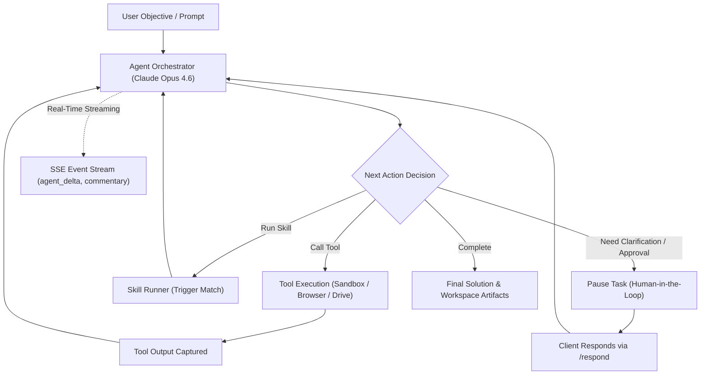

# Autonomous Agent Compute & Execution

Execute complex multi-turn reasoning loops, autonomous coding workflows, web research tasks, and tool-augmented agent graphs backed by Claude Opus 4.6, DeepSeek, and Google Gemini.

The **Agent Compute Engine** (`server/agent-compute/` on port 8795) orchestrates dynamic tool calling, skill execution, persistent workspace file storage, real-time SSE streaming, and human-in-the-loop controls.

---

## Agent Orchestration Graph



---

## Launching an Autonomous Task

Submit a multi-step project to the agent engine:

::: code-group

```python [Python]
from fotohub import FotoHub
import os

client = FotoHub(api_key=os.environ["FOTOHUB_API_KEY"])

# Dispatch autonomous task
task = client.post("/v1/tasks/create", {
    "prompt": """
    1. Scrape the latest top 10 trending AI papers on arXiv in multimodal generation.
    2. Extract their titles, authors, and executive abstracts.
    3. Generate a comparative Markdown report with an architectural taxonomy table.
    4. Save the report to the workspace as /research/multimodal_trends_2026.md.
    """,
    "model": "claude-opus-4.6",
    "skills": ["web_research", "document_generation"],
    "max_steps": 25,
    "budget_limit_usd": 2.50
})

task_id = task["task_id"]
print(f"Task started: {task_id}")
```

```typescript [TypeScript]
import { FotoHub } from "fotohub";

const client = new FotoHub({ apiKey: process.env.FOTOHUB_API_KEY! });

async function runResearchAgent() {
  const res = await client.post("/v1/tasks/create", {
    prompt: "Analyze the sales CSV in /data/sales.csv and produce an executive chart visualization.",
    model: "claude-opus-4.6",
    max_steps: 15,
    budget_limit_usd: 1.50
  });

  console.log("Agent dispatched:", res.data.task_id);
}

runResearchAgent();
```

```bash [cURL]
curl -X POST https://apis.fotohub.app/v1/tasks/create   -H "Authorization: Bearer $FOTOHUB_API_KEY"   -H "Content-Type: application/json"   -d '{
    "prompt": "Build a responsive React landing page for a coffee brand and save to /workspace/coffee-landing",
    "model": "claude-opus-4.6",
    "max_steps": 20
  }'
```

:::

---

## Real-Time SSE Token & Thought Streaming

Connect to `GET /v1/tasks/{task_id}/stream` to receive real-time updates as the agent reasons and executes tools:

| SSE Event | Description | Payload Structure |
|:---|:---|:---|
| **`agent_delta`** | Raw LLM token stream as generated | `{"delta": "Evaluating...", "seq": 12}` |
| **`commentary`** | Strategic inner monologue / agent rationale | `{"message": "I will inspect the CSV structure first", "importance": "high"}` |
| **`tool_call`** | Tool invocation announcement | `{"tool": "browser.navigate", "input": {"url": "https://arxiv.org"}}` |
| **`tool_result`**| Tool completion payload | `{"tool": "browser.navigate", "status": "success", "duration_ms": 420}` |
| **`task_progress`**| Completion estimation | `{"percent": 65, "step": 8, "status": "processing"}` |
| **`task_paused`** | Waiting for user approval | `{"question": "Do you want to overwrite existing files?", "options": ["Yes", "No"]}` |
| **`task_complete`**| Terminal success event | `{"summary": "Task complete", "artifacts": ["/research/trends.md"]}` |

### Client Streaming Example

```typescript
import EventSource from "eventsource";

const taskId = "task_01928374";
const eventSource = new EventSource(
  `https://apis.fotohub.app/v1/tasks/${taskId}/stream?token=${process.env.FOTOHUB_API_KEY}`
);

eventSource.addEventListener("agent_delta", (event) => {
  const data = JSON.parse(event.data);
  process.stdout.write(data.delta);
});

eventSource.addEventListener("commentary", (event) => {
  const data = JSON.parse(event.data);
  console.log(`\n[THOUGHT]: ${data.message}`);
});

eventSource.addEventListener("tool_call", (event) => {
  const data = JSON.parse(event.data);
  console.log(`\n[EXECUTING TOOL]: ${data.tool}`);
});

eventSource.addEventListener("task_complete", (event) => {
  console.log("\nTask finished successfully!");
  eventSource.close();
});
```

---

## Human-in-the-Loop Control & Pausing

When executing high-consequence actions (or when an agent explicitly triggers `ask_user`), the task automatically pauses.

### 1. Pausing a Running Task

```bash
curl -X POST https://apis.fotohub.app/v1/tasks/task_01928374/pause   -H "Authorization: Bearer $FOTOHUB_API_KEY"
```

### 2. Responding to the Agent

Provide the user answer to unblock execution:

```bash
curl -X POST https://apis.fotohub.app/v1/tasks/task_01928374/respond   -H "Authorization: Bearer $FOTOHUB_API_KEY"   -H "Content-Type: application/json"   -d '{
    "response": "Use the 2026 Q3 data and focus on the European market."
  }'
```

### 3. Multi-Turn Follow-Ups

Continue iterating on a completed task without starting from scratch:

```bash
curl -X POST https://apis.fotohub.app/v1/tasks/task_01928374/followup   -H "Authorization: Bearer $FOTOHUB_API_KEY"   -H "Content-Type: application/json"   -d '{
    "prompt": "Now translate the executive summary into Polish and German."
  }'
```

---

## Custom Skills Registry

Register specialized agent skills that inject domain knowledge and custom scripts whenever trigger keywords are matched:

```bash
curl -X POST https://apis.fotohub.app/v1/skills/create   -H "Authorization: Bearer $FOTOHUB_API_KEY"   -H "Content-Type: application/json"   -d '{
    "name": "shopify_catalog_sync",
    "description": "Exports generated packshots and descriptions directly to Shopify stores",
    "triggers": ["shopify", "storefront", "sync catalog"],
    "system_prompt": "You have access to Shopify API tools. Always format product descriptions with standard H2 tags and bullet points."
  }'
```

---

## Google Workspace Integrations

Connect user Google Workspace accounts (via OAuth 2.0) to allow agents to interact with real-world documents:
- **Gmail** (`/v1/integrations/google/gmail`): Draft, search, and send emails with human review gates.
- **Google Calendar** (`/v1/integrations/google/calendar`): Schedule meetings and check availability.
- **Google Drive** (`/v1/integrations/google/drive`): Ingest sheets and export generated artifacts.
