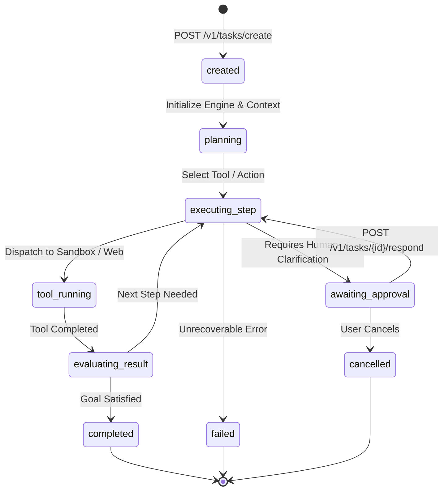
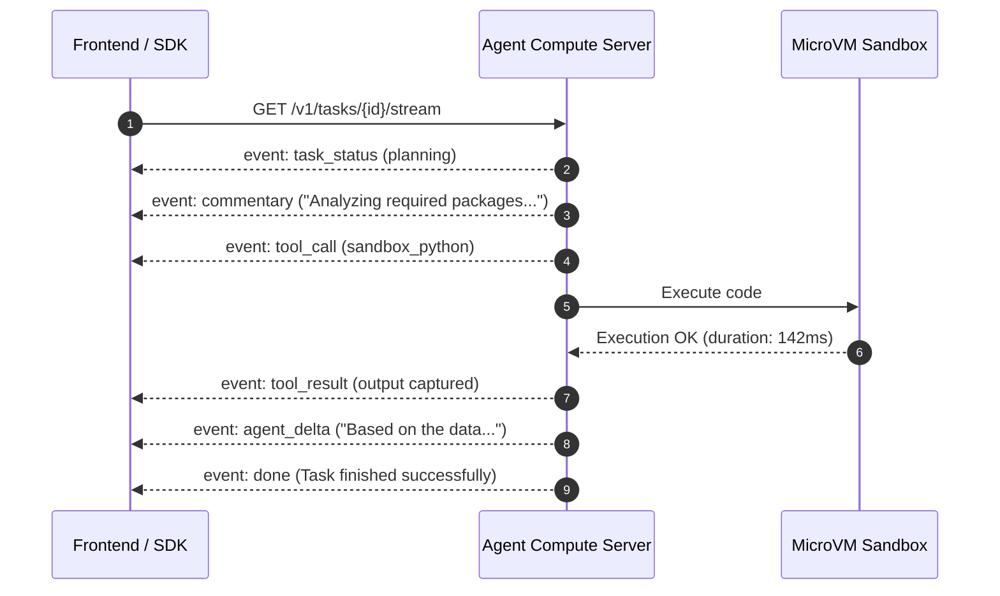

# Autonomous Agent Compute & Execution

Deploy multi-turn reasoning loops, autonomous coding workflows, web intelligence agents, and tool-augmented workflows powered by Claude Opus 4.6, DeepSeek R1, and Google Gemini.

The **Agent Compute Engine** (`server/agent-compute/` on port 8795) orchestrates dynamic tool calling, skill execution, persistent workspace file storage, real-time Server-Sent Events (SSE) streaming, and Human-in-the-Loop controls.

---

## Agent Lifecycle State Machine



---

## Launching an Autonomous Task

Submit a multi-step objective with tool constraints, budget ceilings, and LLM selection:

::: code-group

```python [Python]
from fotohub import FotoHub
import os

client = FotoHub(api_key=os.environ["FOTOHUB_API_KEY"])

task = client.post("/v1/tasks/create", {
    "prompt": """
    1. Scrape the top 5 trending open-source AI repositories on GitHub today.
    2. Extract their stars, authors, primary languages, and architecture summaries.
    3. Generate a comparative Markdown report with an executive taxonomy.
    4. Save the file to /workspace/reports/ai_trends_weekly.md.
    """,
    "model": "claude-opus-4.6",
    "skills": ["web_research", "document_generation", "code_interpreter"],
    "max_steps": 25,
    "budget_limit_usd": 2.50
})

task_id = task["task_id"]
print(f"Task created: {task_id}")
```

```typescript [TypeScript]
import { FotoHub } from "fotohub";

const client = new FotoHub({ apiKey: process.env.FOTOHUB_API_KEY! });

async function dispatchAgent() {
  const res = await client.post("/v1/tasks/create", {
    prompt: "Investigate customer error trace in /workspace/error.log, identify bug, and run unit tests to confirm fix.",
    model: "claude-opus-4.6",
    max_steps: 20,
    budget_limit_usd: 1.50,
  });

  console.log("Agent running with Task ID:", res.data.task_id);
}

dispatchAgent();
```

```bash [cURL]
curl -X POST https://apis.fotohub.app/v1/tasks/create \
  -H "Authorization: Bearer $FOTOHUB_API_KEY" \
  -H "Content-Type: application/json" \
  -d '{
    "prompt": "Build a responsive React landing page for a coffee brand and save to /workspace/coffee-landing",
    "model": "claude-opus-4.6",
    "max_steps": 20,
    "budget_limit_usd": 2.00
  }'
```

:::

---

## Real-Time SSE Token & Thought Streaming

Connect to `GET /v1/tasks/{task_id}/stream` to receive real-time updates as the agent reasons, invokes tools, and generates artifacts:



### SSE Event Stream Reference

| Event Name | Description | Payload Data Structure |
|:---|:---|:---|
| `task_status` | Status transition update | `{"status": "planning" | "executing_step" | "completed"}` |
| `commentary` | Agent internal reasoning step | `{"thought": "Evaluating regression coefficients..."}` |
| `tool_call` | Agent dispatched a tool | `{"tool": "sandbox_python", "args": {"code": "..."}}` |
| `tool_result` | Tool output returned | `{"tool": "sandbox_python", "success": true, "output": {...}}` |
| `agent_delta` | Streaming token fragment | `{"content": "Here is the summary table:\\n"}` |
| `done` | Task completed | `{"task_id": "tsk_...", "total_steps": 12, "cost_usd": 0.42}` |
| `error` | Failure event | `{"code": "budget_exceeded", "message": "Max budget reached"}` |

---

## Human-in-the-Loop Controls

For sensitive operations (deploying to production, deleting files, committing financial transactions), the agent can pause and await explicit user authorization.

### 1. Pausing a Task
```bash
curl -X POST https://apis.fotohub.app/v1/tasks/tsk_99a812df/pause \
  -H "Authorization: Bearer $FOTOHUB_API_KEY"
```

### 2. Responding to Agent Clarifications
When an agent reaches state `awaiting_approval`, submit your decision:

```bash
curl -X POST https://apis.fotohub.app/v1/tasks/tsk_99a812df/respond \
  -H "Authorization: Bearer $FOTOHUB_API_KEY" \
  -H "Content-Type: application/json" \
  -d '{
    "approved": true,
    "user_feedback": "Proceed with deploying the migration to the staging database."
  }'
```

### 3. Cancelling a Task
```bash
curl -X POST https://apis.fotohub.app/v1/tasks/tsk_99a812df/cancel \
  -H "Authorization: Bearer $FOTOHUB_API_KEY"
```\n