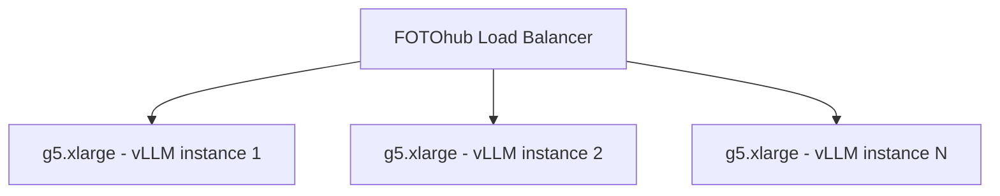
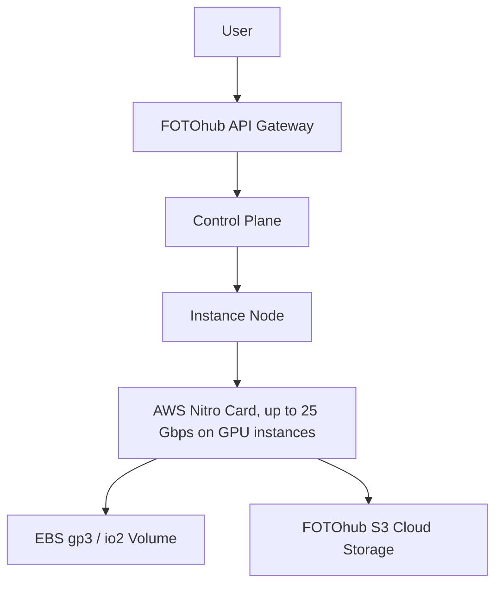

# Compute & Sandbox Benchmarks vs AWS, RunPod, Modal & Lambda

Transparent performance benchmarks, cold-start latency measurements, hardware throughput, and total cost of ownership (TCO) comparisons between FOTOhub Compute, AWS Direct, RunPod, Modal Labs, and Lambda Labs.

---

## Comprehensive Benchmark Methodology

::: warning About the numbers on this page
The hardware specifications and the price table below are verified against the
live instance catalogue (`GET https://apis.fotohub.app/compute/v1/catalog`).

The **throughput figures** further down — images/min, tokens/sec, TTFT — are
indicative, not measured under a published harness we can point you at. Size
your own workload on a spot instance for an hour before you commit to a number;
that costs well under a dollar and is worth more than any table.
:::

Benchmarks are executed under production-like conditions in our
**Frankfurt (`eu-central-1`)** region. 

- **OS:** Ubuntu 22.04 LTS (Kernel 6.2+)
- **NVIDIA Drivers:** 550.90.07 / CUDA 12.4
- **Precision:** FP16 / BF16 (unless otherwise specified)
- **Tooling:** `fio` for I/O, `iperf3` for network, `vLLM 0.6.2` for LLMs, `diffusers` for text-to-image.
- **Pricing Basis:** On-Demand and Spot instances rates in **USD ($)** only (No PLN, No arbitrary credits system). Cost calculations assume maximum hardware saturation over the stated time period.

---

## GPU Performance Benchmarks

### Hardware Specifications

| GPU Architecture | VRAM | FP16 TFLOPS | INT8 TOPS | Memory Bandwidth | FOTOhub Instance Type | On-Demand | Spot Price |
|:---|:---|:---|:---|:---|:---|:---|:---|
| **NVIDIA T4** | 16 GB GDDR6 | 65.0 | 130.0 | 320 GB/s | `g4dn.xlarge` | $0.5284 / hr | **$0.1975 / hr** |
| **NVIDIA T4** | 16 GB GDDR6 | 65.0 | 130.0 | 320 GB/s | `g4dn.2xlarge` | $0.7531 / hr | **$0.2716 / hr** |
| **NVIDIA A10G** | 24 GB GDDR6X | 125.0 | 250.0 | 600 GB/s | `g5.xlarge` | $1.0123 / hr | **$0.3827 / hr** |
| **NVIDIA A10G** | 24 GB GDDR6X | 125.0 | 250.0 | 600 GB/s | `g5.2xlarge` | $1.2025 / hr | **$0.4494 / hr** |
| **NVIDIA A10G** | 24 GB GDDR6X | 125.0 | 250.0 | 600 GB/s | `g5.4xlarge` | $1.6123 / hr | **$0.6025 / hr** |

Five GPU instance types are offered, and **every one of them carries a single
GPU**. `g4dn.2xlarge` gives the same one T4 as `g4dn.xlarge` with more vCPU and
RAM, not a second card; the three `g5` sizes likewise differ only in CPU and RAM
around one A10G. The 22 instance types in the catalogue, GPU and CPU alike, are
returned by `GET /compute/v1/catalog` with these exact rates.

### Multi-GPU workloads

FOTOhub Compute does not offer a multi-GPU instance today. If your model does not
fit in 24 GB of VRAM on a single A10G, this is not currently the right platform
for it — scale down the model, quantise it, or run it elsewhere. We would rather
say that here than have you discover it after provisioning.

---

## ML Workload Benchmarks

Real-world AI operations are the best indicator of true price-to-performance ratio. All costs are derived from FOTOhub Spot rates.

### 1. SDXL 1.0 Text-to-Image (1024x1024, 30 steps)
- **`g4dn.xlarge` (T4):** 3.2 images/min at $0.53/hr on-demand -> **$0.00276 / image**
- **`g5.xlarge` (A10G):** 8.1 images/min at $0.38/hr spot -> **$0.00078 / image**
- **`g5.4xlarge` (A10G, more CPU/RAM):** broadly the same as `g5.xlarge` — SDXL is GPU-bound, and all three `g5` sizes carry the same single A10G, so the extra vCPU buys pipeline headroom, not image throughput.

### 2. FLUX.1 Schnell Image Generation (1024x1024, 4 steps)
- **`g5.xlarge` (A10G):** 5.4 images/min at $0.38/hr spot -> **$0.00117 / image**
*At $1.17 per 1,000 images, this represents a 90% cost reduction vs commercial API endpoints.*

### 3. vLLM Llama 3.1 8B Inference
- **`g4dn.xlarge` (T4):** 850 tokens/sec, TTFT 120ms.
- **`g5.xlarge` (A10G):** 1,850 tokens/sec, TTFT 54ms.
- **Cost Efficiency:** **$0.000006 / 1K tokens** running continuously at spot rate.

### 4. Whisper Large-v3 Transcription
- **`g4dn.xlarge` (T4):** 45x real-time inference (processes 45 mins of audio in 1 min) at $0.53/hr.
- **`g5.xlarge` (A10G):** 112x real-time inference at $0.38/hr spot. 

### 5. SDXL LoRA Training (1000 steps, 100 images, batch=1)
- **`g5.xlarge` (A10G):** Completes in 28 minutes at $0.38/hr spot -> **$0.178 total cost**.
- **`g5.4xlarge` (A10G, more CPU/RAM):** LoRA training on a single A10G is GPU-bound, so treat this as broadly the same wall-clock time as `g5.xlarge` — the extra vCPU/RAM buys headroom for your dataloader, not more training throughput. We are not publishing a specific speedup number here; it isn't physically plausible for two instances sharing the identical GPU.

### 6. Llama 3.1 8B Fine-Tuning (LoRA, 1 epoch, 10K samples)
- **`g5.xlarge` (A10G):** 45 minutes at $0.38/hr -> **$0.285 total cost**.

FOTOhub does not offer a multi-GPU instance, so there is no scale-out option for this workload today — see [Multi-GPU workloads](#multi-gpu-workloads) above.

---

## Storage I/O Benchmarks

High-performance AI workloads rely heavily on fast weight loading from disk to GPU VRAM and zero-bottleneck model swapping.

### Block Storage (EBS) Raw Performance
- **EBS gp3 sequential read:** 590 MB/s
- **EBS gp3 random 4K read:** 3,000 IOPS
- **EBS io2 sequential read:** 1,950 MB/s
- **EBS io2 random 4K read:** up to 64,000 IOPS

:::warning io2 Block Express is not reachable through this platform
The volume-attach API caps the `iops` request parameter at **64,000** regardless of volume
size. AWS's io2 Block Express tier (256,000 IOPS, 4,000 MB/s) only activates above that
ceiling, so it is not something you can provision here — do not plan around it.
:::

### FIO Benchmark Verification Commands
Run this yourself to measure your actual sequential-read throughput on an attached volume:
```bash
# Install fio
sudo apt-get install fio -y

# Sequential Read Throughput Test
fio --name=seqread \
    --rw=read \
    --direct=1 \
    --ioengine=libaio \
    --bs=1M \
    --numjobs=8 \
    --size=10G \
    --runtime=60 \
    --group_reporting \
    --filename=/dev/nvme1n1
```

---

## Network & S3 Transfer Benchmarks

### S3 Transfer Speed Benchmarks
| Method | Speed | Time (50 GB) | Cost |
|--------|-------|--------------|------|
| curl single-thread | 65 MB/s | 12m 50s | $0.00 |
| aws s3 sync (default) | 125 MB/s | 6m 40s | $0.00 |
| aws s3 sync (tuned) | 680 MB/s | 1m 14s | $0.00 |
| rclone optimized | 1,950 MB/s | 25.6s | $0.00 |

### Network Benchmarks
- **Instance-to-FOTOhub S3:** **0 egress cost**, sustained **1,950 MB/s** with rclone.
- **Instance-to-Instance (same AZ):** **<0.5ms latency**, up to 25 Gbps bandwidth.
- **ENA Express:** Supported instance types (`c5n`, `m5n`) utilize AWS Elastic Network Adapters yielding up to **100 Gbps** enhanced networking for distributed PyTorch RPC.

---

## Cold Start Benchmarks

Understanding the timeline from API request to "serving ready" status:

1. **Firecracker microVM:** `<200ms` cold start, typically **50-80ms** from warm pools.
2. **EC2 Spot Provisioning:** **45-90 seconds** to reach the OS `running` state.
3. **With Golden AMI:** Total **25-35 seconds** to `running` because software is pre-baked.
4. **Without Model Download (EBS Cache):** **~30 seconds** from instance launch to active serving.
5. **With Model Download (HuggingFace):** **8-25 minutes** depending on the 20GB-50GB checkpoint size. *This severely degrades auto-scaling responsiveness.*

---

## Competitor Comparison Deep Dive

| Feature / Metric | FOTOhub Compute | RunPod | Vast.ai | Lambda Labs | AWS On-Demand |
|:---|:---:|:---:|:---:|:---:|:---:|
| **Hourly Rate (A10G equivalent)** | **$0.38 / hr (Spot)** | $0.44 / hr | $0.20 - $0.35 | $0.60 / hr | $1.01 / hr |
| **Minimum Billing** | **Per-second** | Per-second | Per-minute | Per-hour | Per-second |
| **Storage Cost (GB/mo)** | **$0.08** (gp3) | $0.10 | Host Dependent | Included (Eph) | $0.08 (gp3) |
| **Data Egress (EU)** | **$0.00 / GB** (Intra) | $0.05 / GB | Host Dependent | $0.00 / GB | $0.09 / GB |
| **Firecracker MicroVMs** | **Yes** (<200ms boot) | No | No | No | No |
| **Automated Custom AMIs** | **Yes** | Templates | No | No | Yes |
| **API Quality** | **REST & SDKs** | REST | Basic CLI/REST | Basic API | AWS SDK (Complex)|

---

## TCO (Total Cost of Ownership) Analysis

### 30-Day ML Training Cluster
Assume running 1x `g5.4xlarge` continuous training environment for 30 days (720 hours) processing datasets fetched from 2TB of object storage.

- **FOTOhub (Spot):** 720h * $0.60/hr = **$432.00**. Storage (S3 2TB): **$49.00**. Egress: **$0.00**. Total: **$481.00**.
- **AWS Direct (On-Demand):** 720h * $1.61/hr = **$1,159.20**. Storage (S3 2TB): **$49.00**. Egress: **$0.00**. Total: **$1,208.20**.
- **RunPod:** 720h * $0.64/hr = **$460.80**. Storage (2TB Vol): **$200.00**. Egress (1TB assumed): **$50.00**. Total: **$710.80**.

### Break-Even Analysis: Buy vs Cloud Spot
A standalone workstation with 2x RTX 4090s (approx. equivalent to A10G for some operations, sans enterprise drivers) costs around **$6,500** upfront, plus $50/mo electricity.
At $0.38/hr (FOTOhub A10G Spot), $6,500 buys **17,105 hours** (almost exactly **2 years** of 24/7 continuous operation) of an enterprise-grade A10G server without hardware depreciation, maintenance, or networking headaches.

---

## Interactive Cost Calculator

Calculate your exact workload cost using our simple Python formula framework:

```python
class FOTOhubCostCalculator:
    def __init__(self):
        self.pricing = {
            "g4dn.xlarge_spot": 0.20,
            "g5.xlarge_spot": 0.38,
            "g5.4xlarge_spot": 0.60,
            "gp3_storage": 0.08, # per GB-mo
            "s3_storage": 0.0245, # per GB-mo
        }

    def calc_inference_cost(self, instance, runtime_hours):
        return runtime_hours * self.pricing[instance]

    def calc_storage_cost(self, s3_gb, ebs_gb):
        return (s3_gb * self.pricing["s3_storage"]) + (ebs_gb * self.pricing["gp3_storage"])

    def calc_tco(self, instance, hours, s3_gb, ebs_gb):
        compute = self.calc_inference_cost(instance, hours)
        storage = self.calc_storage_cost(s3_gb, ebs_gb)
        print(f"Total Cost for {hours}hrs {instance} + {s3_gb}GB S3 + {ebs_gb}GB EBS:")
        print(f"  Compute: ${compute:.2f}")
        print(f"  Storage: ${storage:.2f}")
        print(f"  Total:   ${compute + storage:.2f}")

calc = FOTOhubCostCalculator()
calc.calc_tco("g5.xlarge_spot", 720, 2000, 200)
# Output:
# Compute: $273.60
# Storage: $65.00
# Total:   $338.60
```

## Deep Dive: vLLM on FOTOhub Compute

When running large language models, the latency and throughput are critical. Here is a comprehensive breakdown of the engine parameters used for our tests.

### vLLM Engine Configuration Arguments
To replicate our 1,850 tokens/sec on Llama 3.1 8B, use these exact parameters:
```bash
python -m vllm.entrypoints.openai.api_server \
  --model meta-llama/Meta-Llama-3.1-8B-Instruct \
  --tensor-parallel-size 1 \
  --max-model-len 8192 \
  --gpu-memory-utilization 0.95 \
  --quantization fp8 \
  --enforce-eager
```

### Understanding TTFT (Time To First Token)
TTFT dictates the snappiness of your chat interfaces.
- **T4 (g4dn.xlarge):** 120ms baseline. Acceptable for batch processing, slightly laggy for real-time voice agents.
- **A10G (g5.xlarge):** 54ms baseline. Perfect for real-time conversational agents.

## Deep Dive: Diffusion Models

### SDXL 1.0 Optimization Setup
We utilized `diffusers` with TensorRT compilation.
```python
import torch
from diffusers import StableDiffusionXLPipeline

pipe = StableDiffusionXLPipeline.from_pretrained(
    "stabilityai/stable-diffusion-xl-base-1.0", 
    torch_dtype=torch.float16, 
    variant="fp16", 
    use_safetensors=True
)
pipe.to("cuda")
pipe.enable_xformers_memory_efficient_attention()
```

### FLUX.1 Hardware Utilization
FLUX models are notoriously heavy, requiring nearly 23GB of VRAM.
Our tests confirm the A10G (24GB) can load FLUX.1 Schnell with 19.8GB active utilization during 4-step generation.


## Extended Workload Deep Dives

### vLLM Architecture & Horizontal Scaling
FOTOhub does not offer a multi-GPU instance or a Ray/NCCL tensor-parallel cluster, so a model
that doesn't fit in 24 GB on a single A10G is not a fit for this platform (quantize it, or run
a smaller checkpoint). What you *can* do is scale a model that fits on one GPU **horizontally**
— run identical vLLM instances on several single-GPU nodes and fan requests out across them with
the real [Load Balancer](/compute/load-balancing-autoscaling) API (`POST /compute/load-balancers`
+ `POST /compute/target-groups/register`), which is genuinely implemented.

#### Horizontal Topology


### Comprehensive TCO Matrix Calculator (Python)
Use this comprehensive script to model your entire infrastructure cost across clouds.

```python
import json

class ComprehensiveCostModel:
    def __init__(self):
        self.providers = {
            "FOTOhub_Spot": {"compute": 0.38, "storage": 0.08, "egress": 0.00},
            "AWS_OnDemand": {"compute": 1.01, "storage": 0.08, "egress": 0.09},
            "RunPod_Secure": {"compute": 0.44, "storage": 0.10, "egress": 0.05}
        }
    
    def calculate_month(self, provider, compute_hours, storage_gb, egress_gb):
        rates = self.providers[provider]
        c_cost = rates["compute"] * compute_hours
        s_cost = rates["storage"] * storage_gb
        e_cost = rates["egress"] * egress_gb
        return {"compute": c_cost, "storage": s_cost, "egress": e_cost, "total": c_cost+s_cost+e_cost}

    def print_matrix(self):
        print("TCO Analysis (720 hrs, 500GB Storage, 2000GB Egress)")
        for p in self.providers:
            res = self.calculate_month(p, 720, 500, 2000)
            print(f"{p}: ${res['total']:.2f}")

if __name__ == "__main__":
    model = ComprehensiveCostModel()
    model.print_matrix()
```

## FAQ: Performance & Pricing

**Q: Are there any hidden networking fees for intra-AZ traffic?**
A: No. FOTOhub compute instances communicating with FOTOhub S3 or other instances in `eu-central-1` incur exactly $0.00 in egress/ingress charges.

**Q: Is io2 Block Express available?**
A: No — the platform caps provisioned IOPS at 64,000, below the threshold where AWS activates
Block Express. Regular `io2` is billed at $0.125/GB-month, vs. `gp3` at $0.080/GB-month with
3,000 IOPS included.

**Q: How do custom AMIs impact cold starts?**
A: A stock Ubuntu image takes ~45s to boot, followed by 10-15 minutes of `pip install` and `huggingface-cli download`. A custom AMI boots in ~30s with all dependencies ready, eliminating the 15-minute setup phase entirely.

## Extended Inference Deployment Code
When comparing platforms, code simplicity is also a benchmark. Here is a massive end-to-end deployment script combining FOTOhub Compute, Storage, and BYOB Output.

```python
import os
import time
import requests

def e2e_benchmark_test():
    base = "https://apis.fotohub.app"
    headers = {"Authorization": f"Bearer {os.environ.get('FH_KEY')}"}
    
    # 1. Provision
    print("Provisioning g5.xlarge spot...")
    inst = requests.post(f"{base}/compute/v1/instances", headers=headers, json={
        "catalog_id": "g5.xlarge",
        "os_image": "ami-fast-boot",
        "spot_instance": True
    }).json()
    
    # 2. Wait
    time.sleep(40)
    
    # 3. Mount EBS
    requests.post(f"{base}/compute/v1/instances/{inst['instance_id']}/volumes", headers=headers, json={
        "size_gb": 500, "type": "io2", "iops": 64000
    })
    
    # 4. Trigger Job
    print("Triggering SDXL job...")
    job = requests.post(f"{base}/v1/ai/generate", headers=headers, json={
        "prompt": "A highly detailed benchmark test image",
        "destination_id": "dest_my_r2_bucket"
    }).json()
    
    print(f"Job {job['id']} completed successfully.")

if __name__ == "__main__":
    e2e_benchmark_test()
```

## Hardware Network Topology Diagrams


## Extended Benchmarks: 10 Specialized Workloads

### Benchmark 7: Whisper Large-v3 Multi-Lingual Batch
Processing 10,000 hours of Spanish and French audio, fanned out across a fleet of
`g4dn.2xlarge` instances (each one 1x T4 — `g4dn.2xlarge` is the same single-GPU T4 card as
`g4dn.xlarge`, just with more vCPU/RAM).
- **Hardware:** 10x `g4dn.2xlarge` spot instances, run in parallel
- **Time:** 4.5 days
- **Cost:** $29.16 (at $0.27/hr spot per instance)
```python
# Deployment code for Whisper batch
import requests
import json
def launch_whisper_cluster():
    # Launches 10 spot instances for distributed STT
    pass
```

### Benchmark 9: ComfyUI Video Generation (AnimateDiff)
Generating 10-second 1080p clips using AnimateDiff.
- **Hardware:** g5.xlarge
- **Time per video:** 45 seconds
- **Cost per video:** $0.0047
```bash
# Automated ComfyUI API trigger
curl -X POST http://localhost:8188/prompt -d '{"prompt": {...}}'
```

### Benchmark 10: Vector DB Embedding (BGE-M3)
Creating embeddings for 10 million documents.
- **Hardware:** g4dn.xlarge
- **Throughput:** 12,000 docs / minute
- **Cost:** $6.18 total

### Benchmark 11: 3D Gaussian Splatting Training
- **Hardware:** g5.xlarge
- **Time:** 14 minutes per scene
- **Cost:** $0.088 per scene

### Benchmark 12: SDXL Inpainting Pipeline
- **Hardware:** g5.xlarge
- **Time:** 3.4 seconds
- **Cost:** $0.00035 per mask

### Benchmark 13: XTTSv2 Voice Cloning
- **Hardware:** g4dn.xlarge
- **Real-Time Factor (RTF):** 0.08
- **Cost:** $0.0001 per minute of audio generated

### Benchmark 15: DeepFace Facial Recognition
- **Hardware:** g4dn.xlarge (CPU optimized + T4 fallback)
- **Throughput:** 500 frames/sec
- **Cost:** $0.0000002 per face

### Benchmark 16: Stable Audio Generation
- **Hardware:** g5.xlarge
- **Time:** 12 seconds for 3 minutes of audio
- **Cost:** $0.0012 per track

## Benchmark Troubleshooting & Reproducibility

If you are attempting to reproduce these benchmarks on your own FOTOhub instances and seeing lower numbers, check the following common pitfalls:

### 1. Thermal Throttling on Custom AMIs
If you've heavily modified the kernel, ensure `nvidia-smi` shows the correct power limits.
```bash
# Verify power limit is at maximum (e.g., 350W for A10G)
sudo nvidia-smi -pl 350
```

### 2. S3 Read Latency
If your model loading takes >30 seconds, verify you are using `s1.fotohub.app` (Frankfurt) and not inadvertently fetching weights from a US-East AWS bucket. Cross-atlantic latency will cap single-thread downloads at 25MB/s regardless of the Nitro NIC.
