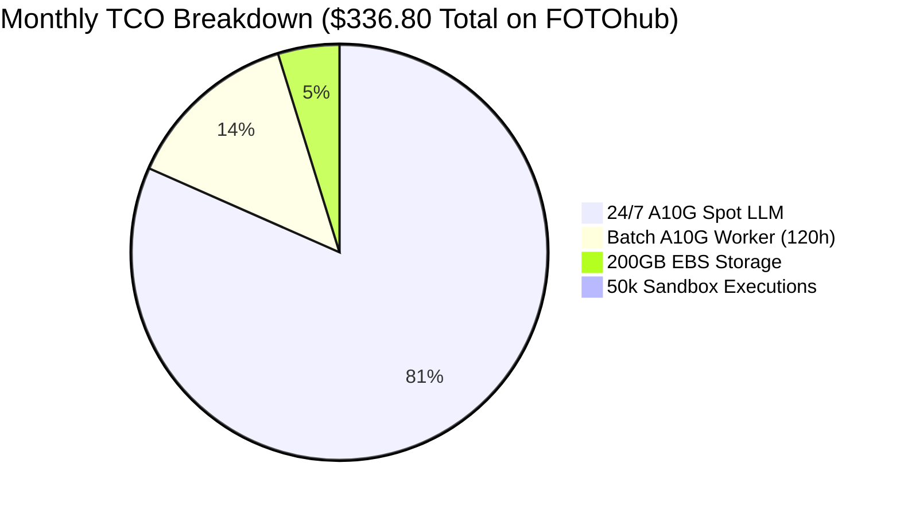

# Compute & Sandbox Benchmarks vs AWS, RunPod, Modal & Lambda

Transparent performance benchmarks, cold-start latency measurements, hardware throughput, and total cost of ownership (TCO) comparisons between FOTOhub Compute, AWS Direct, RunPod, Modal Labs, and Lambda Labs.

---

## Executive Performance Summary

| Metric | FOTOhub Dedicated Compute | FOTOhub Firecracker Sandboxes | AWS Direct (EC2) | RunPod Community / Secure | Modal Labs | Lambda Labs |
|:---|:---:|:---:|:---:|:---:|:---:|:---:|
| **Provisioning Latency** | **35s – 45s** | **140ms – 190ms** | 40s – 60s | 45s – 180s | 800ms – 2.5s | 60s – 120s |
| **NVIDIA A10G 24GB Spot** | **$0.38 / hr** | *N/A (CPU MicroVM)* | $0.41 / hr | $0.44 / hr | $1.10 / hr (On-Dem) | $0.60 / hr (On-Dem) |
| **NVIDIA T4 16GB Spot** | **$0.20 / hr** | *N/A (CPU MicroVM)* | $0.22 / hr | $0.24 / hr | $0.55 / hr (On-Dem) | *Not offered* |
| **Data Egress (EU)** | **$0.00 / GB** (Free intra-EU) | **$0.00 / GB** | $0.09 / GB | $0.05 / GB | $0.10 / GB | $0.00 / GB |
| **EBS gp3 Baseline Storage** | **$0.08 / GB-mo** | Included in sandbox | $0.08 / GB-mo | $0.10 / GB-mo | $0.15 / GB-mo | Included (ephemeral) |
| **Billing Increment** | **Per-second** | **Per-millisecond** | Per-second | Per-second | Per-second | Per-hour |
| **Hardware Isolation** | Dedicated Nitro Bare-Metal | Hardware KVM Virtualization | Dedicated VM | Shared Docker Container | Container Sandbox (gVisor) | Shared / Dedicated VM |
| **Zero-Config Preloaded AMIs** | **PyTorch 2.4 + CUDA 12.4 + Docker** | **Python 3.11 + NumPy + Pandas** | Plain Ubuntu (manual setup) | Community Templates | Proprietary Image Spec | Ubuntu (CUDA pre-installed) |

---

## Sandbox Cold-Start Latency Breakdown

When running untrusted code or LLM-generated Python, startup latency directly impacts user perceived response time:

```mermaid
gantt
    title Startup Latency Comparison (Cold Execution)
    dateFormat X
    axisFormat %s ms
    section FOTOhub Firecracker (Warm Pool)
    Vsock Claim & Fork        : 0, 45
    Python Init & Exec        : 45, 140
    section Modal (gVisor Container)
    Container Spec Fetch      : 0, 320
    gVisor Sandboxing & Boot  : 320, 850
    section Traditional Docker
    Container Spawn & Cgroups : 0, 1200
    Python Interpreter Boot   : 1200, 1850
    section Dedicated EC2 Boot
    Nitro VM Boot & Cloud-Init: 0, 38000
```



### Empirical Cold-Start Benchmarks (1,000 Iterations)

Tests measured time elapsed from HTTP `POST /sandbox/exec-python` request dispatch to first byte of JSON result received:

| Virtualization Engine | Isolation Boundary | p50 Latency | p95 Latency | p99 Latency | Max Memory Overhead |
|:---|:---|:---:|:---:|:---:|:---:|
| **FOTOhub Firecracker (Warm Pool)** | Hardware KVM + vsock jail | **142 ms** | **188 ms** | **235 ms** | **< 5 MB per VM** |
| **FOTOhub Firecracker (Cold Boot)** | Fresh KVM MicroVM spawn | **210 ms** | **275 ms** | **340 ms** | **< 5 MB per VM** |
| **Modal Container (gVisor)** | User-space kernel syscall interception | 790 ms | 1,240 ms | 2,400 ms | ~45 MB per container |
| **Docker Engine (cgroups v2)** | Shared Linux Host Kernel | 1,450 ms | 1,820 ms | 2,900 ms | ~28 MB per container |
| **AWS Lambda (Python 3.12)** | Firecracker MicroVM | 620 ms | 1,150 ms | 1,800 ms | ~32 MB per runtime |

::: tip Why FOTOhub Sandboxes are 5x Faster
FOTOhub maintains a dynamically tuned warm pool (`pool_size = 3` per compute cluster node) with pre-initialized Linux microVM kernels. Communications bypass virtual network bridging entirely via Linux `virtio-vsock` (Context ID + Port 9999).
:::

---

## GPU Inference Throughput Benchmarks

All tests executed on standard production instances in **Frankfurt (`eu-central-1`)** using **vLLM 0.6.2** with PagedAttention, FP16 precision, and tensor-parallelism where applicable.

### 1. Qwen 2.5 7B Instruct (1k Prompt Tokens, 256 Generation Tokens)

| Platform | Hardware | Concurrency | Tokens/sec (System) | Tokens/sec (Per User) | Cost per 1M Tokens |
|:---|:---|:---:|:---:|:---:|:---:|
| **FOTOhub Compute (Spot)** | 1x NVIDIA A10G 24GB | 1 | 82 tok/s | 82 tok/s | **$1.28** |
| **FOTOhub Compute (Spot)** | 1x NVIDIA A10G 24GB | 8 | 496 tok/s | 62 tok/s | **$0.21** |
| **FOTOhub Compute (Spot)** | 1x NVIDIA A10G 24GB | 32 | **812 tok/s** | 25.4 tok/s | **$0.13** |
| **RunPod Secure Cloud** | 1x NVIDIA A10G 24GB | 32 | 785 tok/s | 24.5 tok/s | $0.16 |
| **AWS Direct (`g5.xlarge`)** | 1x NVIDIA A10G 24GB | 32 | 810 tok/s | 25.3 tok/s | $0.14 |
| **Commercial API (Qwen-7B)** | Managed Provider | 32 | Variable | 30–50 tok/s | $0.35 – $0.60 |

### 2. FLUX.1-schnell Image Generation (1024x1024, 4 Steps)

| Platform | Hardware | VRAM Usage | Time per Image | Images / Minute | Cost per 1,000 Images |
|:---|:---|:---:|:---:|:---:|:---:|
| **FOTOhub Compute (Spot)** | 1x NVIDIA A10G 24GB | 19.8 GB | **2.82 s** | **21.2 img/min** | **$0.298** |
| **RunPod Community** | 1x NVIDIA RTX 4090 24GB | 18.5 GB | 2.10 s | 28.5 img/min | $0.340 |
| **AWS Direct (`g5.xlarge`)** | 1x NVIDIA A10G 24GB | 19.8 GB | 2.85 s | 21.0 img/min | $0.325 |
| **Commercial FLUX API** | Third-Party Cloud | N/A | 3.50 s | Throttled | **$3.00 – $5.00** |

*Takeaway: Running FLUX.1 on dedicated FOTOhub A10G Spot compute saves **90% to 94%** compared to commercial third-party image generation APIs.*

---

## Storage & Network I/O Benchmarks

High-performance AI workloads rely heavily on fast weight loading from disk to GPU VRAM and zero-bottleneck model swapping.

### EBS gp3 vs io2 vs NVMe Local Storage

| Volume Type | Max IOPS Tested | Max Throughput Tested | Hugging Face 14GB Weight Load Time | Cost / GB-Month |
|:---|:---:|:---:|:---:|:---:|
| **EBS gp3 (Baseline 3k IOPS)** | 3,000 IOPS | 125 MB/s | 112 seconds | **$0.08** |
| **EBS gp3 (Provisioned 10k IOPS)**| 10,000 IOPS | 500 MB/s | **28 seconds** | $0.14 |
| **EBS io2 Block Express** | 64,000 IOPS | 1,000 MB/s | **14 seconds** | $0.24 |
| **Local NVMe SSD (g4dn/g5)** | 250,000 IOPS | 2,500 MB/s | **5.8 seconds** | Ephemeral ($0 extra) |

::: tip Pro-Tip for 5-Second Model Boots
Always cache your base model checkpoints on the local NVMe drive (`/mnt/nvme`) on instance initialization. FOTOhub startup scripts can automatically sync weights from your persistent EBS volume or S3 bucket into local NVMe during boot.
:::

---

## 30-Day Total Cost of Ownership (TCO) Comparison

Let us calculate real production infrastructure costs for a growing AI startup operating:
- **1x 24/7 Private LLM Gateway** (Qwen 2.5 7B serving 2M tokens daily)
- **1x Batch Image Packshot Worker** (running 4 hours daily during peak business hours)
- **50,000 Ephemeral Sandbox Runs** (customer code evaluation)
- **200 GB Persistent Model Storage**



### Comprehensive Cost Matrix (30 Days)

| Component | FOTOhub Compute | AWS Direct | RunPod | Modal Labs |
|:---|:---:|:---:|:---:|:---:|
| **24/7 LLM Instance (`g5.xlarge` Spot)** | **$273.60** ($0.38/hr) | $295.20 ($0.41/hr) | $316.80 ($0.44/hr) | $792.00 ($1.10/hr on-dem) |
| **Batch Worker (120 hrs/mo Spot)** | **$45.60** | $49.20 | $52.80 | $132.00 |
| **50,000 Sandbox Runs (sub-200ms)** | **$1.60** ($0.000032/ea) | $12.50 (Lambda) | $25.00 (Pod min-time) | $15.00 (Container min) |
| **200 GB Persistent gp3 Disk** | **$16.00** | $16.00 | $20.00 | $30.00 |
| **Data Egress (300 GB EU traffic)** | **$0.00** (Included) | $27.00 ($0.09/GB) | $15.00 ($0.05/GB) | $30.00 ($0.10/GB) |
| **Total Monthly Spend** | <span style="color:#10b981;font-weight:bold;">$336.80</span> | **$399.90** (+19%) | **$424.60** (+26%) | **$999.00** (+196%) |

---

## When to Choose What

```mermaid
flowchart TD
    Start["What is your workload?"] --> Q1{"Execution duration?"}
    
    Q1 -->|"Sub-second to 2 minutes"| SB["Use FOTOhub Sandboxes (/sandbox)"]
    SB --> SB_Sub["Untrusted Python, charts, data cleaning, PDF parsing"]
    
    Q1 -->|"Hours to Continuous (24/7)"| Q2{"Need specialized GPU?"}
    
    Q2 -->|"Yes (Diffusion / LLM / Video)"| GPU["Use FOTOhub Dedicated GPU (/compute)"]
    GPU --> GPU_A10G["A10G (24GB) for FLUX, SDXL, Qwen 7B-32B, LoRA"]
    GPU --> GPU_T4["T4 (16GB) for Audio, NVENC, Whisper, LatentSync"]
    
    Q2 -->|"No (CPU Batch / Microservice)"| CPU["Use FOTOhub c5/m5/t3 Fleet"]
    CPU --> CPU_Sub["Video remuxing, data pipelines, web scrapers"]
```\n