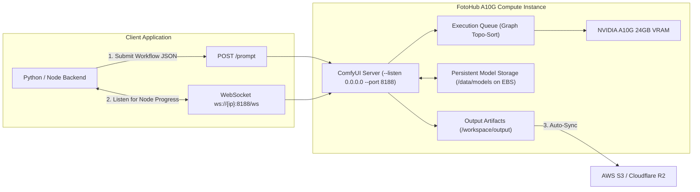

# Headless ComfyUI Automation & Render Farms

Run scalable, programmatic image and video generation pipelines using headless ComfyUI running on FOTOhub dedicated GPU clusters.

ComfyUI allows complex diffusion graphs (ControlNet, IP-Adapter, LoRA stacking, upscalers, FaceID) to execute deterministically via WebSocket and REST APIs.

---

## Architecture of a Headless ComfyUI Node



---

## Provisioning a Production ComfyUI Node

Provision an instance with pre-configured NVIDIA drivers, Docker, and the ComfyUI runtime:

```bash
curl -X POST https://apis.fotohub.app/compute/v1/instances \
  -H "Authorization: Bearer $FOTOHUB_API_KEY" \
  -H "Content-Type: application/json" \
  -d '{
    "name": "comfyui-render-node-01",
    "catalog_id": "g5.xlarge",
    "spot_instance": true,
    "max_runtime_hours": 12,
    "root_volume_type": "gp3",
    "root_volume_size_gb": 150,
    "security_group_rules": [
      {"protocol": "tcp", "port": 22, "cidr": "0.0.0.0/0"},
      {"protocol": "tcp", "port": 8188, "cidr": "0.0.0.0/0"}
    ],
    "startup_script": "#!/bin/bash\nmkdir -p /data/models/{checkpoints,loras,vae,controlnet}\ndocker run -d --gpus all -p 8188:8188 --restart unless-stopped --name comfyui -v /data/models:/workspace/ComfyUI/models yanwk/comfyui-boot:latest"
  }'
```

---

## Installing Essential Custom Nodes Programmatically

Add high-performance community nodes to your headless worker during instance boot:

```bash
#!/bin/bash
cd /workspace/ComfyUI/custom_nodes

# 1. ComfyUI Manager
git clone https://github.com/ltdrdata/ComfyUI-Manager.git

# 2. ControlNet Preprocessors & Auxiliaries
git clone https://github.com/Fannovel16/comfyui_controlnet_aux.git
pip install -r comfyui_controlnet_aux/requirements.txt

# 3. IP-Adapter Plus (Face & Style Transfer)
git clone https://github.com/cubiq/ComfyUI_IPAdapter_plus.git

# 4. Impact Pack (Face detailer & bbox segmenter)
git clone https://github.com/ltdrdata/ComfyUI-Impact-Pack.git
python ComfyUI-Impact-Pack/install.py

# Restart ComfyUI to reload nodes
supervisorctl restart comfyui
```

---

## Automating ComfyUI via Python WebSocket Client

This client submits an API-formatted workflow JSON, listens to real-time progress events over WebSocket, and downloads the rendered image:

```python
import json
import urllib.request
import websocket
import uuid
import os

COMFY_HOST = "18.197.82.14:8188"
CLIENT_ID = str(uuid.uuid4())

def queue_prompt(prompt_workflow: dict):
    payload = json.dumps({"prompt": prompt_workflow, "client_id": CLIENT_ID}).encode("utf-8")
    req = urllib.request.Request(f"http://{COMFY_HOST}/prompt", data=payload, headers={"Content-Type": "application/json"})
    with urllib.request.urlopen(req) as resp:
        return json.loads(resp.read())

def generate_image_and_wait(prompt_workflow: dict, output_filename: str):
    ws = websocket.WebSocket()
    ws.connect(f"ws://{COMFY_HOST}/ws?clientId={CLIENT_ID}")
    
    queued = queue_prompt(prompt_workflow)
    prompt_id = queued["prompt_id"]
    print(f"Queued task {prompt_id}, waiting for execution...")

    while True:
        out = ws.recv()
        if isinstance(out, str):
            message = json.loads(out)
            msg_type = message.get("type")
            
            if msg_type == "progress":
                val = message["data"]["value"]
                max_val = message["data"]["max"]
                print(f"Denoising step: {val}/{max_val} ({int(val/max_val*100)}%)")
                
            elif msg_type == "executed" and message["data"]["node"] is None:
                print("Workflow execution complete!")
                break

    # Fetch output history
    with urllib.request.urlopen(f"http://{COMFY_HOST}/history/{prompt_id}") as resp:
        history = json.loads(resp.read())[prompt_id]
        
    outputs = history["outputs"]
    for node_id in outputs:
        node_output = outputs[node_id]
        if "images" in node_output:
            for image_info in node_output["images"]:
                img_name = image_info["filename"]
                subfolder = image_info["subfolder"]
                img_url = f"http://{COMFY_HOST}/view?filename={img_name}&subfolder={subfolder}&type=output"
                urllib.request.urlretrieve(img_url, output_filename)
                print(f"Saved generated image: {output_filename}")
                return output_filename
```

---

## Persistent Model Mounting via Detachable EBS

Downloading 20 GB checkpoints (FLUX.1, SDXL, Wan 2.1) on every boot wastes bandwidth.

1. Attach a secondary **200 GB EBS persistent volume** (`/dev/xvdf`) mounted to `/data/models`.
2. Populate `/data/models/checkpoints/` once.
3. When batch rendering completes, detach the volume (`DELETE /instances/{id}/volumes/{vol_id}`).
4. Terminate the GPU instance ($0.00/hr compute).
5. Attach the existing EBS volume to a new instance the next time you need to generate!\n