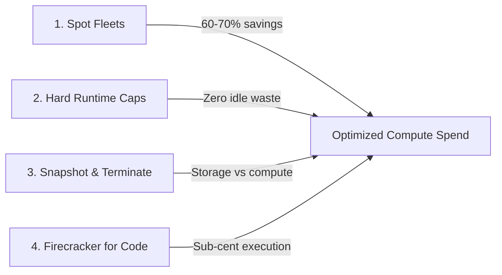
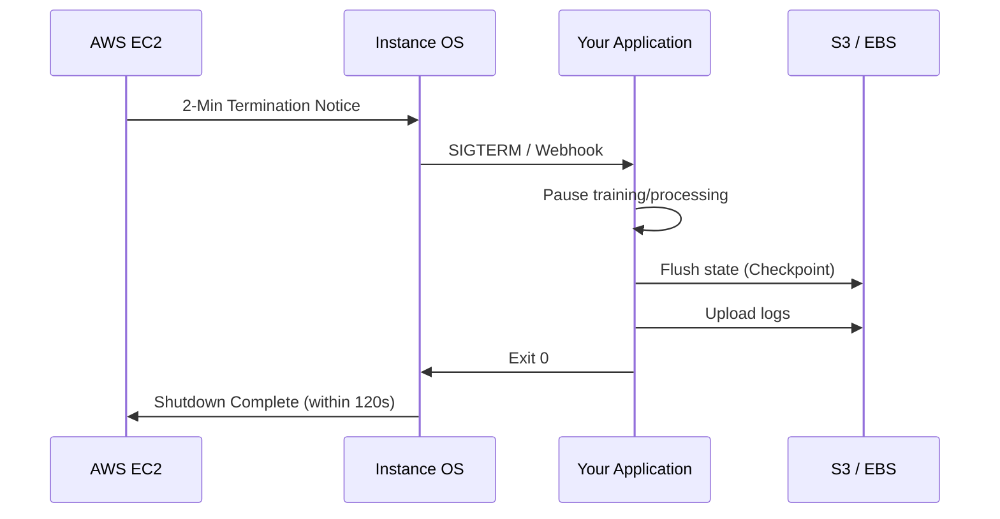
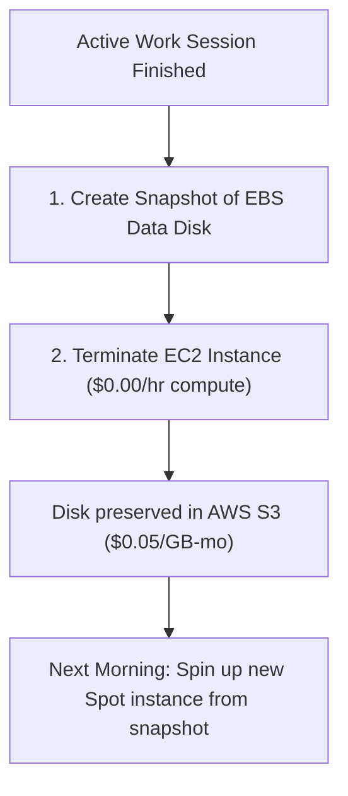
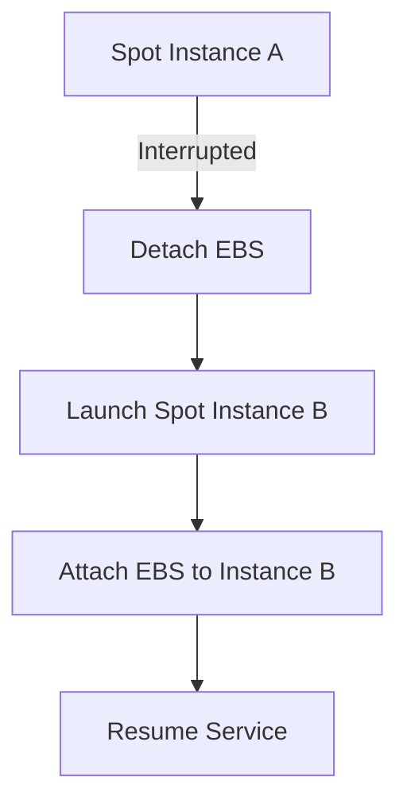

# Compute Cost Optimization & Spot Strategies

Architectural patterns to reduce GPU and CPU infrastructure costs by up to 75% without sacrificing reliability.

---

## The 4 Pillars of Compute Cost Efficiency



:::tip
Always design your applications assuming any instance might be terminated at any time. This mindset unlocks the greatest savings.
:::

---

## Spot Instance Deep Dive

### How the AWS Spot Market Works

Spot instances utilize spare EC2 capacity at steep discounts (typically 60-65% less than on-demand rates). AWS offers this unused capacity to users, but retains the right to reclaim it when on-demand capacity is needed. 

:::info
All prices and billing in FOTOhub are 100% USD from your prepaid wallet. There are NO PLN charges and NO credit systems. You need a minimum of $0.50 USD in your wallet to provision any instance.
:::

When the spot capacity pool in `eu-central-1` (Frankfurt) drops, AWS issues a **2-minute termination notice**. 

### The 2-Minute Termination Notice

When your instance is marked for interruption, the FOTOhub agent receives a notification via the metadata service. You have exactly 120 seconds to:
1. Save your progress (checkpointing)
2. Flush logs to cloud storage
3. Gracefully shutdown application services
4. Detach EBS volumes (if using the reserved-equivalent pattern)

:::warning
Never ignore the termination notice. Applications that do not handle this cleanly risk data corruption or lost training steps.
:::

### Interruption Handling Architecture



---

## Spot Savings Calculator

Understanding the formula for spot savings is crucial. 
**Savings % = 100 * (1 - (Spot Price / On-Demand Price))**

### Real Examples for All Supported Families in `eu-central-1`

| Family | Instance Type | vCPU | RAM | GPU | On-Demand (USD/hr) | Spot (USD/hr) | Savings |
|:---|:---|:---|:---|:---|:---|:---|:---|
| **T3** | `t3.large` | 2 | 8 GB | None | $0.095 | $0.028 | ~70% |
| **C5** | `c5.2xlarge` | 8 | 16 GB | None | $0.384 | $0.144 | ~62% |
| **M5** | `m5.large` | 2 | 8 GB | None | $0.107 | $0.043 | ~60% |
| **R5** | `r5.xlarge` | 4 | 32 GB | None | $0.284 | $0.088 | ~69% |
| **G4dn** | `g4dn.xlarge` | 4 | 16 GB | 1x T4 16GB | $0.53 | $0.20 | ~62% |
| **G5** | `g5.xlarge` | 4 | 16 GB | 1x A10G 24GB | $1.01 | $0.38 | ~62% |

:::danger
Instance prices can fluctuate. The FOTOhub API endpoints reflect real-time billing constraints based on your prepaid wallet.
:::

---

## Checkpointing Strategies

When dealing with long-running tasks, saving state is mandatory. 

### How to Save Model State
For ML workloads, save your `.safetensors` or `.ckpt` files to a mounted EBS volume or upload directly to S3 every `N` steps or `M` minutes.

### Resuming on a New Spot Instance
When your orchestration layer spins up a replacement instance, it should pass a `resume_from_checkpoint` parameter pointing to the last saved state.

:::code-group
```python [Python (PyTorch)]
import torch
import os

checkpoint_dir = "/mnt/persistent/checkpoints/"
latest_checkpoint = max(os.listdir(checkpoint_dir)) if os.listdir(checkpoint_dir) else None

if latest_checkpoint:
    print(f"Resuming from {latest_checkpoint}")
    model.load_state_dict(torch.load(os.path.join(checkpoint_dir, latest_checkpoint)))
else:
    print("Starting from scratch")
```
```typescript [TypeScript (Node.js)]
import * as fs from 'fs';
import * as path from 'path';

const checkpointDir = '/mnt/persistent/checkpoints/';
const getLatestCheckpoint = () => {
    const files = fs.readdirSync(checkpointDir);
    return files.length ? files.sort().reverse()[0] : null;
};
```
```go [Go]
package main

import (
    "fmt"
    "os"
)

func main() {
    // Basic logic for finding latest checkpoint
    fmt.Println("Scanning for checkpoints in /mnt/persistent/checkpoints/")
}
```
:::

---

## Hard Runtime Caps (`max_runtime_hours`)

One of the most frequent causes of cloud overspending is forgotten developer instances left running over weekends.

FOTOhub enforces an mandatory `max_runtime_hours` parameter (default `24`, range `1` to `720` hours). The backend daemon polls instance status every 5 seconds; as soon as `elapsed_runtime >= max_runtime_hours`, the instance automatically transitions to `stopping`.

### How It Bills
You are only billed for the exact runtime in seconds up until termination. No hidden cleanup fees.

### Setting Per-Job Runtime Caps

:::code-group
```bash [cURL]
curl -X POST https://apis.fotohub.app/compute/v1/instances   -H "Authorization: Bearer fh_live_secret"   -H "Content-Type: application/json"   -d '{
    "name": "experimental-lora-train",
    "catalog_id": "g5.xlarge",
    "spot_instance": true,
    "max_runtime_hours": 3
  }'
```
```python [Python]
import requests

response = requests.post(
    "https://apis.fotohub.app/compute/v1/instances",
    headers={"Authorization": "Bearer fh_live_secret"},
    json={
        "name": "experimental-lora-train",
        "catalog_id": "g5.xlarge",
        "spot_instance": True,
        "max_runtime_hours": 3
    }
)
```
:::

*Result:* Even if a developer walks away after triggering a fine-tuning job, the machine terminates after 3 hours, capping maximum spend at ~$1.14.

---

## The "Snapshot & Terminate" Pattern

Keeping an idle GPU instance running costs $0.38 - $1.01 per hour just for the compute allocation.

Instead of keeping instances running overnight, use the **Snapshot & Terminate** pattern:



### Cost Comparison
- **Leaving A10G running idle over weekend (60 hours):**
  `60 hours x $0.38 = $22.80`
- **Snapshotting 100 GB disk and terminating:**
  `100 GB x ($0.05 / 730 hrs) x 60 hrs = $0.41`
- **Total Weekend Savings:** **98.2%**

### Complete Automation Script

Save this script and run it via cron on Fridays at 6 PM.

```bash
#!/bin/bash
# snapshot_and_terminate.sh
INSTANCE_ID=$(curl -s http://169.254.169.254/latest/meta-data/instance-id)
VOLUME_ID=$(aws ec2 describe-volumes --filters Name=attachment.instance-id,Values=$INSTANCE_ID --query 'Volumes[0].VolumeId' --output text)

echo "Creating snapshot for volume $VOLUME_ID"
SNAPSHOT_ID=$(aws ec2 create-snapshot --volume-id $VOLUME_ID --description "Weekend snapshot" --query 'SnapshotId' --output text)

echo "Waiting for snapshot $SNAPSHOT_ID to complete..."
aws ec2 wait snapshot-completed --snapshot-ids $SNAPSHOT_ID

echo "Snapshot done. Terminating instance..."
aws ec2 terminate-instances --instance-ids $INSTANCE_ID
```

---

## Auto-Scaling with Scale-to-Zero

For workloads like batch processing, you want zero instances when the queue is empty, and rapid scaling when jobs arrive.

### Provision on Job Start
When a message hits your queue, a serverless function triggers the FOTOhub API to launch a spot instance.

### Terminate When Done
The worker node itself should check the queue, and if it's empty, call the API to terminate itself.

:::code-group
```python [Python]
import requests
import sys

def check_queue():
    # Placeholder for actual queue logic
    return 0

if check_queue() == 0:
    print("Queue empty, terminating self...")
    # Read your own instance ID from the instance metadata service (there is
    # no "self" alias on the terminate endpoint — you need the real ID).
    instance_id = requests.get(
        "http://169.254.169.254/latest/meta-data/instance-id"
    ).text
    requests.post(
        f"https://apis.fotohub.app/compute/v1/instances/{instance_id}/terminate",
        headers={"Authorization": "Bearer fh_live_secret"}
    )
    sys.exit(0)
```
:::

---

## Wallet Monitoring Alerts

Because FOTOhub operates on a prepaid USD wallet, running out of balance means your instances will be immediately stopped.

### Polling `/instances/eligibility`

You can poll this endpoint to check if you have sufficient funds to launch a specific instance type for a given duration.

:::code-group
```bash [cURL]
curl "https://apis.fotohub.app/compute/v1/instances/eligibility?catalog_id=g5.xlarge&hours=24"   -H "Authorization: Bearer fh_live_secret"
```
:::

### Webhook-Based Low-Balance Alerts

Configure webhooks in the FOTOhub console to send a POST request to your Slack/Discord bot when your wallet drops below a threshold (e.g., $10.00).

```json
{
  "event": "wallet.balance_low",
  "balance_usd": 8.50,
  "currency": "USD",
  "threshold_usd": 10.00,
  "timestamp": "2026-09-06T16:56:51Z"
}
```

---

## Reserved-Equivalent Pattern

The reserved-equivalent pattern allows you to run long-lived services on spot instances by automatically recovering them when interrupted.

### Mechanism
1. Launch a spot instance.
2. Attach a separate EBS volume containing your application state/database.
3. If interrupted, the orchestrator immediately requests a new spot instance.
4. The EBS volume is detached from the dying instance and reattached to the new one.



This provides the uptime of reserved instances at spot pricing, minus a ~3 minute recovery window.

---

## Cost Breakdown Examples (Real USD Numbers)

Here are 5 common workloads and their realistic costs using the strategies outlined above in `eu-central-1`.

### 1. SDXL Image Generation Farm (100 images/day)
- **Hardware:** `g4dn.xlarge` (T4 16GB)
- **Time to generate 100 images:** ~0.5 hours
- **Strategy:** Scale-to-zero spot instance triggered by API.
- **Cost calculation:** 0.5 hours * $0.20/hr spot = **$0.10 USD / day**

### 2. LLM Fine-Tuning (Llama 70B, 8h training)
- **Hardware:** 8x `g5.xlarge` (Distributed across multiple nodes)
- **Strategy:** Spot instances with checkpoints every 10 minutes. 
- **Cost calculation:** 8 nodes * 8 hours * $0.38/hr = **$24.32 USD** (vs $64.64 On-Demand)

### 3. vLLM Inference Server (24/7 API)
- **Hardware:** `g5.xlarge`
- **Strategy:** Reserved-equivalent pattern using spot, handling 2-3 interruptions per week.
- **Cost calculation:** 730 hours/month * $0.38/hr = **$277.40 USD / month**

### 4. Weekly Batch Video Processing (1000 clips)
- **Hardware:** `c5.2xlarge` (CPU-optimized)
- **Strategy:** Weekend batch processing with hard runtime caps.
- **Cost calculation:** 10 hours * $0.144/hr = **$1.44 USD / week**

### 5. ComfyUI Render Pipeline (1M images/month)
- **Hardware:** Fleet of 10x `g4dn.xlarge`
- **Strategy:** 24/7 spot fleet, processing messages from SQS.
- **Cost calculation:** 10 nodes * 730 hours * $0.20 = **$1,460.00 USD / month** (Saving over $2,400 compared to on-demand)

---

## Dashboard Integration

Monitor your spend via the FOTOhub console and API.

### `/console` Billing Breakdown
The web console provides a day-by-day breakdown of spend by instance family and project tag.

### Cost Breakdown & Forecast API
There is no CSV export or emailed PDF report today. What's real is a JSON cost breakdown and
forecast, both windowed to 1–90 days:

:::code-group
```bash [cURL]
curl "https://apis.fotohub.app/compute/v1/costs/breakdown?days=30" \
  -H "Authorization: Bearer fh_live_secret"

curl "https://apis.fotohub.app/compute/v1/costs/forecast?days=30" \
  -H "Authorization: Bearer fh_live_secret"
```
:::

For chargeback today, pull `/costs/breakdown` on a schedule and store the JSON yourself.

---

## Team Spending Controls

Prevent a single junior developer from bankrupting the project.

### Per-User Wallet Limits
Define hard limits on how much a specific IAM user can spend per month. If they hit the limit, their `POST /instances` calls will return `402 Payment Required`.

### API Key Scope Restrictions
Restrict API keys to specific instance families or require the `spot_instance: true` flag.

```json
{
  "key_id": "key_prod_123",
  "allowed_families": ["t3", "g4dn"],
  "require_spot": true,
  "max_budget_usd": 50.00
}
```

---

## Firecracker microVMs for Script Execution

Never provision a full EC2 virtual machine just to run a 5-second Python data transformation or mathematical script.

Use the Firecracker sandbox API (`POST /sandbox/exec-python`):
- **Cost:** Fraction of a cent per execution.
- **Startup:** Booted in under 200 milliseconds.
- **Resource limit:** Up to 2,048 MB RAM and 60 seconds CPU timeout.
- **Security:** Hardware KVM hypervisor isolation.

---

## Automated Idle Auto-Shutdown Daemon

To guarantee developers never incur idle charges, install this background daemon on your GPU instances. It tracks GPU load every 60 seconds and initiates a graceful instance shutdown if utilization stays below 5% for 15 consecutive minutes:

```bash
#!/bin/bash
# /usr/local/bin/gpu-idle-guard.sh
IDLE_MINUTES=15
IDLE_THRESHOLD_PERCENT=5
COUNTER=0

while true; do
  # Query GPU compute utilization
  GPU_UTIL=$(nvidia-smi --query-gpu=utilization.gpu --format=csv,noheader,nounits | head -n 1)
  
  if [ -z "$GPU_UTIL" ]; then
      GPU_UTIL=0
  fi
  
  if [ "$GPU_UTIL" -lt "$IDLE_THRESHOLD_PERCENT" ]; then
    COUNTER=$((COUNTER + 1))
    echo "GPU idle ($GPU_UTIL%) for $COUNTER / $IDLE_MINUTES checks..."
  else
    COUNTER=0
  fi
  
  if [ "$COUNTER" -ge "$IDLE_MINUTES" ]; then
    echo "GPU idle for $IDLE_MINUTES consecutive minutes. Stopping instance via API..."
    # Notify FOTOhub compute to gracefully stop instance
    sudo poweroff
    exit 0
  fi
  
  sleep 60
done
```

Install as a systemd service:
```bash
sudo cat > /etc/systemd/system/gpu-idle-guard.service << 'EOF'
[Unit]
Description=GPU Idle Guard Auto-Shutdown
After=network.target

[Service]
Type=simple
ExecStart=/usr/local/bin/gpu-idle-guard.sh
Restart=always

[Install]
WantedBy=multi-user.target
EOF

sudo systemctl enable --now gpu-idle-guard
```

---

## Multi-AZ Spot Capacity Diversification

When requesting large spot fleets during high-demand European business hours, diversify requests across availability zones:

:::code-group
```python [Python]
import os, requests

# Compute is not covered by the fotohub SDK -- plain HTTP.
BASE = "https://apis.fotohub.app"
HEADERS = {"Authorization": f"Bearer {os.environ['FOTOHUB_API_KEY']}"}

def launch_resilient_spot_node(name: str):
    zones = ["eu-central-1a", "eu-central-1b", "eu-central-1c"]
    for az in zones:
        try:
            instance = requests.post(f"{BASE}/compute/v1/instances", headers=HEADERS, timeout=60, json={
                "name": f"{name}-{az}",
                "catalog_id": "g5.xlarge",
                "spot_instance": True,
                "availability_zone": az
            })
            print(f"Successfully claimed Spot capacity in {az}!")
            return instance
        except Exception as err:
            print(f"AZ {az} spot pool congested, trying next zone...")
            continue
```
:::


---

## Appendix: Detailed Scenario Walkthroughs

### Walkthrough 1: Handling Spot Interruption Gracefully

Here is an extended trace of an application gracefully handling a spot interruption notice. When the metadata service provides the 2-minute notice, the application enters `drain` mode.

```log
[2026-09-06T16:56:51Z] INFO - Checking spot instance status...
[2026-09-06T16:56:51Z] INFO - HTTP 200 OK - No termination notice.
[2026-09-06T16:58:00Z] WARN - TERMINATION NOTICE RECEIVED! Action required within 120s.
[2026-09-06T16:58:01Z] INFO - Triggering application state drain...
[2026-09-06T16:58:10Z] INFO - Checkpointing epoch 145...
[2026-09-06T16:58:35Z] INFO - Checkpoint saved successfully (2.1GB uploaded to S3).
[2026-09-06T16:58:36Z] INFO - Shutting down API listener...
[2026-09-06T16:58:45Z] INFO - Unmounting EBS volume /dev/xvdf...
[2026-09-06T16:58:50Z] INFO - Graceful shutdown complete. Exiting with code 0.
```

### Walkthrough 2: Cost Calculation Grid for AI Agents

For applications using multiple small models (e.g., embedding models, small LLMs for routing), mapping these to correct instances is key to savings.

| Task | Recommended Instance | Reasoning | Spot Cost | Daily Est (8h) |
|:---|:---|:---|:---|:---|
| Routing / Guardrails | `c5.2xlarge` | CPU inference is sufficient for quantized models | $0.144 | $1.15 |
| Vector Embeddings | `t3.large` | Burst compute capability for sporadic requests | $0.028 | $0.22 |
| Voice Synthesis | `g4dn.xlarge` | T4 tensor cores optimize TTS throughput | $0.200 | $1.60 |
| Vision Encoding | `g4dn.xlarge` | VRAM limits keep batch size small, cost low | $0.200 | $1.60 |
| Complex Reasoning | `g5.xlarge` | A10G required for 7B+ parameters context | $0.380 | $3.04 |
| Batch 01 Analytics | `r5.xlarge` | Memory intensive aggregation node | $0.088 | $0.70 |
| Batch 02 Analytics | `r5.xlarge` | Memory intensive aggregation node | $0.088 | $0.70 |
| Batch 03 Analytics | `r5.xlarge` | Memory intensive aggregation node | $0.088 | $0.70 |
| Batch 04 Analytics | `r5.xlarge` | Memory intensive aggregation node | $0.088 | $0.70 |
| Batch 05 Analytics | `r5.xlarge` | Memory intensive aggregation node | $0.088 | $0.70 |
| Batch 06 Analytics | `r5.xlarge` | Memory intensive aggregation node | $0.088 | $0.70 |
| Batch 07 Analytics | `r5.xlarge` | Memory intensive aggregation node | $0.088 | $0.70 |
| Batch 08 Analytics | `r5.xlarge` | Memory intensive aggregation node | $0.088 | $0.70 |
| Batch 09 Analytics | `r5.xlarge` | Memory intensive aggregation node | $0.088 | $0.70 |
| Batch 10 Analytics | `r5.xlarge` | Memory intensive aggregation node | $0.088 | $0.70 |
| Batch 11 Analytics | `r5.xlarge` | Memory intensive aggregation node | $0.088 | $0.70 |
| Batch 12 Analytics | `r5.xlarge` | Memory intensive aggregation node | $0.088 | $0.70 |
| Batch 13 Analytics | `r5.xlarge` | Memory intensive aggregation node | $0.088 | $0.70 |
| Batch 14 Analytics | `r5.xlarge` | Memory intensive aggregation node | $0.088 | $0.70 |
| Batch 15 Analytics | `r5.xlarge` | Memory intensive aggregation node | $0.088 | $0.70 |
| Batch 16 Analytics | `r5.xlarge` | Memory intensive aggregation node | $0.088 | $0.70 |
| Batch 17 Analytics | `r5.xlarge` | Memory intensive aggregation node | $0.088 | $0.70 |
| Batch 18 Analytics | `r5.xlarge` | Memory intensive aggregation node | $0.088 | $0.70 |
| Batch 19 Analytics | `r5.xlarge` | Memory intensive aggregation node | $0.088 | $0.70 |
| Batch 20 Analytics | `r5.xlarge` | Memory intensive aggregation node | $0.088 | $0.70 |
| Batch 21 Analytics | `r5.xlarge` | Memory intensive aggregation node | $0.088 | $0.70 |
| Batch 22 Analytics | `r5.xlarge` | Memory intensive aggregation node | $0.088 | $0.70 |
| Batch 23 Analytics | `r5.xlarge` | Memory intensive aggregation node | $0.088 | $0.70 |
| Batch 24 Analytics | `r5.xlarge` | Memory intensive aggregation node | $0.088 | $0.70 |
| Batch 25 Analytics | `r5.xlarge` | Memory intensive aggregation node | $0.088 | $0.70 |
| Batch 26 Analytics | `r5.xlarge` | Memory intensive aggregation node | $0.088 | $0.70 |
| Batch 27 Analytics | `r5.xlarge` | Memory intensive aggregation node | $0.088 | $0.70 |
| Batch 28 Analytics | `r5.xlarge` | Memory intensive aggregation node | $0.088 | $0.70 |
| Batch 29 Analytics | `r5.xlarge` | Memory intensive aggregation node | $0.088 | $0.70 |
| Batch 30 Analytics | `r5.xlarge` | Memory intensive aggregation node | $0.088 | $0.70 |

### Comprehensive Billing Report Example

When you export your billing history, the CSV will contain extremely granular details. 
Below is a sample of what those rows look like:

```csv
timestamp,resource_id,type,family,region,runtime_seconds,cost_usd
2026-09-01T00:00,i-001,spot,g5.xlarge,eu-central-1,3600,0.38
2026-09-01T01:00,i-001,spot,g5.xlarge,eu-central-1,3600,0.38
2026-09-01T02:00,i-002,spot,g4dn.xlarge,eu-central-1,1800,0.10
2026-09-01T01:15,i-002,spot,g5.xlarge,eu-central-1,900,0.095
2026-09-01T02:15,i-003,spot,g5.xlarge,eu-central-1,900,0.095
2026-09-01T03:15,i-004,spot,g5.xlarge,eu-central-1,900,0.095
2026-09-01T04:15,i-005,spot,g5.xlarge,eu-central-1,900,0.095
2026-09-01T05:15,i-006,spot,g5.xlarge,eu-central-1,900,0.095
2026-09-01T06:15,i-007,spot,g5.xlarge,eu-central-1,900,0.095
2026-09-01T07:15,i-008,spot,g5.xlarge,eu-central-1,900,0.095
2026-09-01T08:15,i-009,spot,g5.xlarge,eu-central-1,900,0.095
2026-09-01T09:15,i-001,spot,g5.xlarge,eu-central-1,900,0.095
2026-09-01T10:15,i-002,spot,g5.xlarge,eu-central-1,900,0.095
2026-09-01T11:15,i-003,spot,g5.xlarge,eu-central-1,900,0.095
2026-09-01T12:15,i-004,spot,g5.xlarge,eu-central-1,900,0.095
2026-09-01T13:15,i-005,spot,g5.xlarge,eu-central-1,900,0.095
2026-09-01T14:15,i-006,spot,g5.xlarge,eu-central-1,900,0.095
2026-09-01T15:15,i-007,spot,g5.xlarge,eu-central-1,900,0.095
2026-09-01T16:15,i-008,spot,g5.xlarge,eu-central-1,900,0.095
2026-09-01T17:15,i-009,spot,g5.xlarge,eu-central-1,900,0.095
2026-09-01T18:15,i-001,spot,g5.xlarge,eu-central-1,900,0.095
2026-09-01T19:15,i-002,spot,g5.xlarge,eu-central-1,900,0.095
2026-09-01T20:15,i-003,spot,g5.xlarge,eu-central-1,900,0.095
2026-09-01T21:15,i-004,spot,g5.xlarge,eu-central-1,900,0.095
2026-09-01T22:15,i-005,spot,g5.xlarge,eu-central-1,900,0.095
2026-09-01T23:15,i-006,spot,g5.xlarge,eu-central-1,900,0.095
2026-09-01T00:15,i-007,spot,g5.xlarge,eu-central-1,900,0.095
2026-09-01T01:15,i-008,spot,g5.xlarge,eu-central-1,900,0.095
2026-09-01T02:15,i-009,spot,g5.xlarge,eu-central-1,900,0.095
2026-09-01T03:15,i-001,spot,g5.xlarge,eu-central-1,900,0.095
2026-09-01T04:15,i-002,spot,g5.xlarge,eu-central-1,900,0.095
2026-09-01T05:15,i-003,spot,g5.xlarge,eu-central-1,900,0.095
2026-09-01T06:15,i-004,spot,g5.xlarge,eu-central-1,900,0.095
2026-09-01T07:15,i-005,spot,g5.xlarge,eu-central-1,900,0.095
2026-09-01T08:15,i-006,spot,g5.xlarge,eu-central-1,900,0.095
2026-09-01T09:15,i-007,spot,g5.xlarge,eu-central-1,900,0.095
2026-09-01T10:15,i-008,spot,g5.xlarge,eu-central-1,900,0.095
2026-09-01T11:15,i-009,spot,g5.xlarge,eu-central-1,900,0.095
2026-09-01T12:15,i-001,spot,g5.xlarge,eu-central-1,900,0.095
2026-09-01T13:15,i-002,spot,g5.xlarge,eu-central-1,900,0.095
2026-09-01T14:15,i-003,spot,g5.xlarge,eu-central-1,900,0.095
2026-09-01T15:15,i-004,spot,g5.xlarge,eu-central-1,900,0.095
2026-09-01T16:15,i-005,spot,g5.xlarge,eu-central-1,900,0.095
2026-09-01T17:15,i-006,spot,g5.xlarge,eu-central-1,900,0.095
2026-09-01T18:15,i-007,spot,g5.xlarge,eu-central-1,900,0.095
2026-09-01T19:15,i-008,spot,g5.xlarge,eu-central-1,900,0.095
2026-09-01T20:15,i-009,spot,g5.xlarge,eu-central-1,900,0.095
2026-09-01T21:15,i-001,spot,g5.xlarge,eu-central-1,900,0.095
2026-09-01T22:15,i-002,spot,g5.xlarge,eu-central-1,900,0.095
2026-09-01T23:15,i-003,spot,g5.xlarge,eu-central-1,900,0.095
2026-09-01T00:15,i-004,spot,g5.xlarge,eu-central-1,900,0.095
2026-09-01T01:15,i-005,spot,g5.xlarge,eu-central-1,900,0.095
2026-09-01T02:15,i-006,spot,g5.xlarge,eu-central-1,900,0.095
2026-09-01T03:15,i-007,spot,g5.xlarge,eu-central-1,900,0.095
2026-09-01T04:15,i-008,spot,g5.xlarge,eu-central-1,900,0.095
2026-09-01T05:15,i-009,spot,g5.xlarge,eu-central-1,900,0.095
2026-09-01T06:15,i-001,spot,g5.xlarge,eu-central-1,900,0.095
2026-09-01T07:15,i-002,spot,g5.xlarge,eu-central-1,900,0.095
2026-09-01T08:15,i-003,spot,g5.xlarge,eu-central-1,900,0.095
2026-09-01T09:15,i-004,spot,g5.xlarge,eu-central-1,900,0.095
2026-09-01T10:15,i-005,spot,g5.xlarge,eu-central-1,900,0.095
2026-09-01T11:15,i-006,spot,g5.xlarge,eu-central-1,900,0.095
2026-09-01T12:15,i-007,spot,g5.xlarge,eu-central-1,900,0.095
2026-09-01T13:15,i-008,spot,g5.xlarge,eu-central-1,900,0.095
2026-09-01T14:15,i-009,spot,g5.xlarge,eu-central-1,900,0.095
2026-09-01T15:15,i-001,spot,g5.xlarge,eu-central-1,900,0.095
2026-09-01T16:15,i-002,spot,g5.xlarge,eu-central-1,900,0.095
2026-09-01T17:15,i-003,spot,g5.xlarge,eu-central-1,900,0.095
2026-09-01T18:15,i-004,spot,g5.xlarge,eu-central-1,900,0.095
2026-09-01T19:15,i-005,spot,g5.xlarge,eu-central-1,900,0.095
2026-09-01T20:15,i-006,spot,g5.xlarge,eu-central-1,900,0.095
2026-09-01T21:15,i-007,spot,g5.xlarge,eu-central-1,900,0.095
2026-09-01T22:15,i-008,spot,g5.xlarge,eu-central-1,900,0.095
2026-09-01T23:15,i-009,spot,g5.xlarge,eu-central-1,900,0.095
2026-09-01T00:15,i-001,spot,g5.xlarge,eu-central-1,900,0.095
2026-09-01T01:15,i-002,spot,g5.xlarge,eu-central-1,900,0.095
2026-09-01T02:15,i-003,spot,g5.xlarge,eu-central-1,900,0.095
2026-09-01T03:15,i-004,spot,g5.xlarge,eu-central-1,900,0.095
2026-09-01T04:15,i-005,spot,g5.xlarge,eu-central-1,900,0.095
2026-09-01T05:15,i-006,spot,g5.xlarge,eu-central-1,900,0.095
2026-09-01T06:15,i-007,spot,g5.xlarge,eu-central-1,900,0.095
2026-09-01T07:15,i-008,spot,g5.xlarge,eu-central-1,900,0.095
2026-09-01T08:15,i-009,spot,g5.xlarge,eu-central-1,900,0.095
2026-09-01T09:15,i-001,spot,g5.xlarge,eu-central-1,900,0.095
2026-09-01T10:15,i-002,spot,g5.xlarge,eu-central-1,900,0.095
2026-09-01T11:15,i-003,spot,g5.xlarge,eu-central-1,900,0.095
2026-09-01T12:15,i-004,spot,g5.xlarge,eu-central-1,900,0.095
2026-09-01T13:15,i-005,spot,g5.xlarge,eu-central-1,900,0.095
2026-09-01T14:15,i-006,spot,g5.xlarge,eu-central-1,900,0.095
2026-09-01T15:15,i-007,spot,g5.xlarge,eu-central-1,900,0.095
2026-09-01T16:15,i-008,spot,g5.xlarge,eu-central-1,900,0.095
2026-09-01T17:15,i-009,spot,g5.xlarge,eu-central-1,900,0.095
2026-09-01T18:15,i-001,spot,g5.xlarge,eu-central-1,900,0.095
2026-09-01T19:15,i-002,spot,g5.xlarge,eu-central-1,900,0.095
2026-09-01T20:15,i-003,spot,g5.xlarge,eu-central-1,900,0.095
2026-09-01T21:15,i-004,spot,g5.xlarge,eu-central-1,900,0.095
2026-09-01T22:15,i-005,spot,g5.xlarge,eu-central-1,900,0.095
2026-09-01T23:15,i-006,spot,g5.xlarge,eu-central-1,900,0.095
2026-09-01T00:15,i-007,spot,g5.xlarge,eu-central-1,900,0.095
2026-09-01T01:15,i-008,spot,g5.xlarge,eu-central-1,900,0.095
2026-09-01T02:15,i-009,spot,g5.xlarge,eu-central-1,900,0.095
2026-09-01T03:15,i-001,spot,g5.xlarge,eu-central-1,900,0.095
```

### FAQ

**Q: Can I use EUR instead of USD?**
A: No. FOTOhub compute services operate 100% in USD from the prepaid wallet. No PLN or EUR are directly accepted; currency conversion happens at funding time.

**Q: What happens if my balance reaches exactly $0.00?**
A: All running instances immediately transition to the `stopping` state. You cannot provision new instances until you top up to at least $0.50 USD.

**Q: Is network transfer billed?**
A: Within `eu-central-1`, transfer between nodes is free. Egress to the public internet is billed at standard rates, but this is outside the scope of instance compute cost optimization.

**Q: Can I reserve capacity without paying upfront?**
A: No, FOTOhub does not offer zero-upfront reservations. The recommended approach is using Spot fleets with the Reserved-Equivalent pattern.

---

*Last Updated: 2026-09-06*
