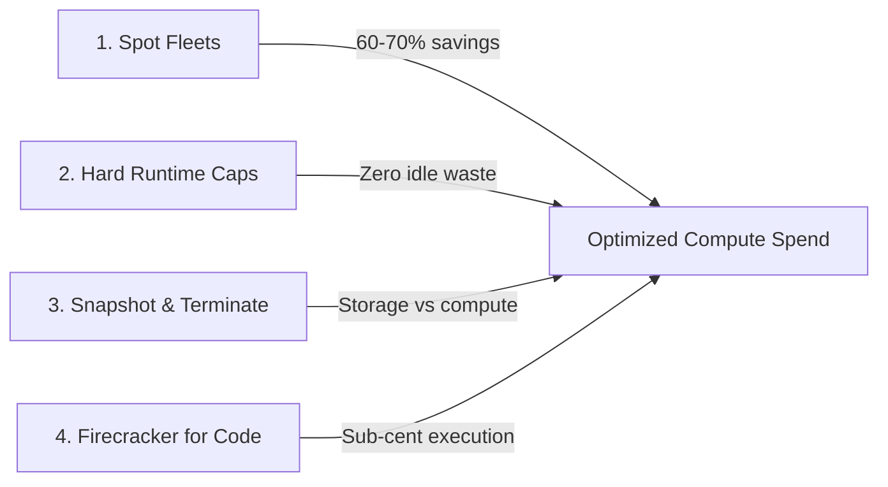
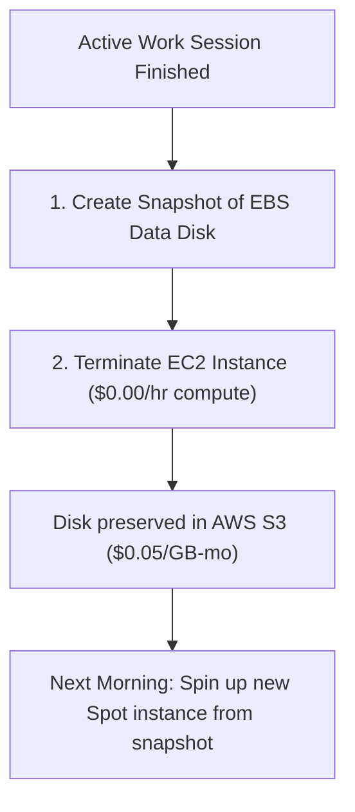

# Compute Cost Optimization & Spot Strategies

Architectural patterns to reduce GPU and CPU infrastructure costs by up to 75% without sacrificing reliability.

---

## The 4 Pillars of Compute Cost Efficiency



---

## 1. Spot Instance Fleet Strategies

Spot instances utilize spare EC2 capacity at steep discounts (typically 60–65% less than on-demand rates).

### When to Use Spot Instances
- **Batch Video Rendering & Upscaling**: If a spot instance is reclaimed, jobs can automatically resume from the last completed clip.
- **Model Fine-Tuning with Frequent Checkpoints**: Save weights to an attached EBS persistent volume every 200 steps.
- **Development & Experimentation Environments**: Running ComfyUI or exploring new prompts interactively.

### When to Use Dedicated On-Demand Instances
- **Production API Gateways**: Webhooks and real-time customer-facing inference that cannot tolerate a 2-minute interruption notice.
- **Live Event Broadcasting**: Real-time video processing or interactive voice agents.

### Cost Comparison Table (Monthly Spend: 8h/day, 22 days/mo)

| Workload | Hardware | On-Demand Cost | Spot Fleet Cost | Monthly Savings |
|:---|:---|:---:|:---:|:---:|
| **ComfyUI Pro Studio** | `g5.xlarge` (A10G 24GB) | $178.11 | **$67.40** | **$110.71 (62%)** |
| **vLLM 7B Inference** | `g5.2xlarge` (A10G 24GB) | $211.20 | **$79.20** | **$132.00 (63%)** |
| **Speech & Audio Worker** | `g4dn.xlarge` (T4 16GB) | $93.28 | **$35.20** | **$58.08 (62%)** |
| **High-Throughput Transcoder**| `c5.2xlarge` (8 vCPU) | $60.01 | **$22.35** | **$37.66 (63%)** |

---

## 2. Hard Runtime Caps (`max_runtime_hours`)

One of the most frequent causes of cloud overspending is forgotten developer instances left running over weekends.

FOTOhub enforces an mandatory `max_runtime_hours` parameter (default `24`, range `1` to `720` hours). The backend daemon polls instance status every 5 seconds; as soon as `elapsed_runtime >= max_runtime_hours`, the instance automatically transitions to `stopping`:

```json
{
  "name": "experimental-lora-train",
  "catalog_id": "g5.xlarge",
  "spot_instance": true,
  "max_runtime_hours": 3
}
```

*Result:* Even if a developer walks away after triggering a fine-tuning job, the machine terminates after 3 hours, capping maximum spend at ~$1.14.

---

## 3. The "Snapshot & Terminate" Pattern

Keeping an idle GPU instance running costs $0.38 – $1.61 per hour just for the compute allocation.

Instead of keeping instances running overnight, use the **Snapshot & Terminate** pattern:



### Cost Comparison
- **Leaving A10G running idle over weekend (60 hours):**
  $$60 \text{ hours} \times \$0.38 = \mathbf{\$22.80}$$
- **Snapshotting 100 GB disk and terminating:**
  $$100 \text{ GB} \times \frac{\$0.05}{730 \text{ hrs}} \times 60 \text{ hrs} = \mathbf{\$0.41}$$
- **Total Weekend Savings:** **98.2%**

---

## 4. Firecracker microVMs for Script Execution

Never provision a full EC2 virtual machine just to run a 5-second Python data transformation or mathematical script.

Use the Firecracker sandbox API (`POST /sandbox/exec-python`):
- **Cost:** Fraction of a cent per execution.
- **Startup:** Booted in under 200 milliseconds.
- **Resource limit:** Up to 2,048 MB RAM and 60 seconds CPU timeout.
- **Security:** Hardware KVM hypervisor isolation.

---

## 5. Automated Idle Auto-Shutdown Daemon

To guarantee developers never incur idle charges, install this background daemon on your GPU instances. It tracks GPU load every 60 seconds and initiates a graceful instance shutdown if utilization stays below 5% for 15 consecutive minutes:

```bash
#!/bin/bash
# /usr/local/bin/gpu-idle-guard.sh
IDLE_MINUTES=15
IDLE_THRESHOLD_PERCENT=5
COUNTER=0

while true; do
  # Query GPU compute utilization
  GPU_UTIL=$(nvidia-smi --query-gpu=utilization.gpu --format=csv,noheader,nounits | head -n 1)
  
  if [ "$GPU_UTIL" -lt "$IDLE_THRESHOLD_PERCENT" ]; then
    COUNTER=$((COUNTER + 1))
    echo "GPU idle ($GPU_UTIL%) for $COUNTER / $IDLE_MINUTES checks..."
  else
    COUNTER=0
  fi
  
  if [ "$COUNTER" -ge "$IDLE_MINUTES" ]; then
    echo "GPU idle for $IDLE_MINUTES consecutive minutes. Stopping instance via API..."
    # Notify FOTOhub compute to gracefully stop instance
    sudo poweroff
    exit 0
  fi
  
  sleep 60
done
```

Install as a systemd service:
```bash
sudo cat > /etc/systemd/system/gpu-idle-guard.service << 'EOF'
[Unit]
Description=GPU Idle Guard Auto-Shutdown
After=network.target

[Service]
Type=simple
ExecStart=/usr/local/bin/gpu-idle-guard.sh
Restart=always

[Install]
WantedBy=multi-user.target
EOF

sudo systemctl enable --now gpu-idle-guard
```

---

## 6. Multi-AZ Spot Capacity Diversification

When requesting large spot fleets during high-demand European business hours, diversify requests across availability zones:

```python
from fotohub import FotoHub

client = FotoHub(api_key="fh_live_...")

def launch_resilient_spot_node(name: str):
    zones = ["eu-central-1a", "eu-central-1b", "eu-central-1c"]
    for az in zones:
        try:
            instance = client.post("/compute/v1/instances", {
                "name": f"{name}-{az}",
                "catalog_id": "g5.xlarge",
                "spot_instance": True,
                "availability_zone": az
            })
            print(f"Successfully claimed Spot capacity in {az}!")
            return instance
        except Exception as err:
            print(f"AZ {az} spot pool congested, trying next zone...")
            continue
```

