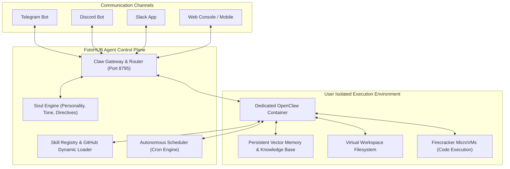

# FH Claw: Persistent Autonomous AI Assistants

Deploy dedicated, containerized autonomous agents powered by the **FH Claw Engine** (`server/agent-compute/app/routes_claw.py`).

Unlike ephemeral one-shot task scripts, **FH Claw** instances maintain persistent state, memory, customized personalities ("Souls"), external communication channels (Telegram, Discord, Slack, WhatsApp), and recurring background cron automations.

---

## Claw System Architecture



---

## 1. Provisioning a Claw Assistant

Create a dedicated autonomous agent instance with specific tier and intelligence mode:

### Endpoint: `POST /v1/claws`

| Parameter | Type | Required | Default | Description |
|:---|:---|:---:|:---:|:---|
| `name` | string | **Yes** | — | Unique identifier slug for your Claw assistant. |
| `display_name`| string | No | — | Human-readable name (e.g. "Ada - Lead Research Agent"). |
| `tier` | string | No | `"starter"` | Resource tier: `starter` (1 vCPU/2GB), `pro` (2 vCPU/4GB), `ultimate` (4 vCPU/8GB). |
| `model_mode` | string | No | `"standard"` | Reasoning tier: `standard`, `deep`, or `reasoning` (DeepSeek R1 / Claude Opus). |
| `soul_config` | object | No | `{}` | Initial personality and behavioral directives. |

::: code-group

```python [Python]
from fotohub import FotoHub
import os

client = FotoHub(api_key=os.environ["FOTOHUB_API_KEY"])

claw = client.post("/v1/claws", {
    "name": "market-intelligence-claw",
    "display_name": "Artemis (Market Intelligence)",
    "tier": "pro",
    "model_mode": "reasoning",
    "soul_config": {
        "personality": "Analytical, concise, and rigorous senior financial intelligence officer.",
        "instructions": "Always verify factual claims against primary SEC filings or reputable news sources.",
        "tone": "professional",
        "language": "en"
    }
})

print(f"Claw provisioned: {claw['claw_id']}")
```

```typescript [TypeScript]
import { FotoHub } from "fotohub";

const client = new FotoHub({ apiKey: process.env.FOTOHUB_API_KEY! });

async function createClaw() {
  const res = await client.post("/v1/claws", {
    name: "devops-support-claw",
    display_name: "Sentry (DevOps Guard)",
    tier: "starter",
    model_mode: "standard",
    soul_config: {
      personality: "Pragmatic Site Reliability Engineer focused on uptime and clean logs.",
      tone: "technical",
    },
  });

  console.log("Claw ID:", res.data.claw_id);
}

createClaw();
```

```bash [cURL]
curl -X POST https://apis.fotohub.app/v1/claws   -H "Authorization: Bearer $FOTOHUB_API_KEY"   -H "Content-Type: application/json"   -d '{
    "name": "content-curator-claw",
    "tier": "starter",
    "model_mode": "standard",
    "soul_config": {
      "personality": "Witty social media strategist",
      "tone": "casual"
    }
  }'
```

:::

---

## 2. Configuring Communication Channels

Connect your Claw assistant to external chat platforms with zero server infrastructure:

### Supported Connectors

- **Telegram**: Provide bot token from `@BotFather`.
- **Discord**: Provide bot token and application ID.
- **Slack**: Provide Bot User OAuth Token (`xoxb-...`).
- **WhatsApp**: Business Cloud API webhook.

```bash
curl -X POST https://apis.fotohub.app/v1/claws/market-intelligence-claw/channels   -H "Authorization: Bearer $FOTOHUB_API_KEY"   -H "Content-Type: application/json"   -d '{
    "channel": "telegram",
    "token": "7182938491:AAHk..._token",
    "config": {
      "allowed_user_ids": ["129481920"]
    }
  }'
```

---

## 3. Installing Custom Skills from GitHub

Extend your Claw's capabilities by pulling skills dynamically from open-source repositories:

```bash
curl -X POST https://apis.fotohub.app/v1/claws/market-intelligence-claw/skills   -H "Authorization: Bearer $FOTOHUB_API_KEY"   -H "Content-Type: application/json"   -d '{
    "skill_url": "https://github.com/fotohubapp/skill-financial-modeling.git",
    "name": "financial_modeling"
  }'
```

---

## 4. Setting Up Internal Cron Automations

Instruct your Claw to execute periodic routines autonomously:

```bash
curl -X POST https://apis.fotohub.app/v1/claws/market-intelligence-claw/crons   -H "Authorization: Bearer $FOTOHUB_API_KEY"   -H "Content-Type: application/json"   -d '{
    "description": "Daily 8 AM Market Briefing",
    "schedule": "0 8 * * 1-5",
    "task": "Scrape pre-market futures, summarize top 3 macro headlines, and send a summary to Telegram."
  }'
```
