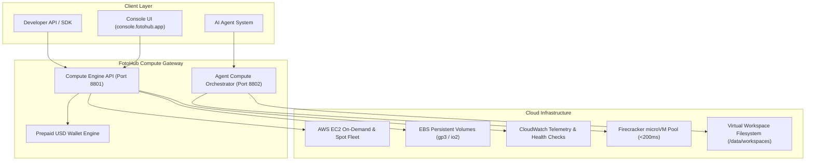

# Cloud Compute & Sandboxes Architecture

High-performance GPU instances, dedicated CPU compute nodes, and sub-second Firecracker microVM sandboxes for AI generation, agent execution, and custom model training.

FOTOhub Compute combines elastic AWS EC2 infrastructure managed by the **Compute Engine** (`server/compute-engine/`) with lightweight virtualization managed by the **Agent Compute Engine** (`server/agent-compute/`).

---

## Infrastructure Architecture

---

## Hardware Specifications & Instance Catalog

All compute hardware is provisioned within `eu-central-1` (Frankfurt) with multi-AZ resilience (`eu-central-1a`, `eu-central-1b`, `eu-central-1c`).

### GPU Accelerated Instances

| Instance Type | GPU Hardware | VRAM | vCPU | RAM | Bandwidth | On-Demand (PLN/hr) | Spot Price (PLN/hr) | USD Equiv. (Spot)* |
|:---|:---|:---|:---|:---|:---|:---|:---|:---|
| `g4dn.xlarge` | 1x NVIDIA T4 | 16 GB GDDR6 | 4 | 16 GB | 25 Gbps | **2.14 zł** | **0.80 zł** | ~$0.20/hr |
| `g4dn.2xlarge` | 1x NVIDIA T4 | 16 GB GDDR6 | 8 | 32 GB | 25 Gbps | **3.05 zł** | **1.10 zł** | ~$0.27/hr |
| `g5.xlarge` | 1x NVIDIA A10G | 24 GB GDDR6X | 4 | 16 GB | 25 Gbps | **4.10 zł** | **1.55 zł** | ~$0.38/hr |
| `g5.2xlarge` | 1x NVIDIA A10G | 24 GB GDDR6X | 8 | 32 GB | 25 Gbps | **4.87 zł** | **1.82 zł** | ~$0.45/hr |
| `g5.4xlarge` | 1x NVIDIA A10G | 24 GB GDDR6X | 16 | 64 GB | 25 Gbps | **6.53 zł** | **2.44 zł** | ~$0.60/hr |

*\*USD values based on ~4.05 PLN/USD reference rate.*

### General Purpose & High-Memory CPU Instances

| Family | Types | Specs Range | On-Demand Range | Spot Range | Primary Workloads |
|:---|:---|:---|:---|:---|:---|
| **t3** (Burstable) | `t3.micro` → `t3.2xlarge` | 2–8 vCPU, 1–32 GB RAM | 0.04 – 1.36 zł/hr | 0.01 – 0.46 zł/hr | Dev/test, lightweight webhooks, workers |
| **m5** (Standard) | `m5.large` → `m5.4xlarge` | 2–16 vCPU, 8–64 GB RAM | 0.39 – 3.12 zł/hr | 0.15 – 1.15 zł/hr | Batch processing, databases, microservices |
| **c5** (Compute) | `c5.large` → `c5.4xlarge` | 2–16 vCPU, 4–32 GB RAM | 0.35 – 2.76 zł/hr | 0.13 – 1.03 zł/hr | Video transcoding, scientific simulation |
| **r5** (Memory) | `r5.large` → `r5.2xlarge` | 2–8 vCPU, 16–64 GB RAM | 0.51 – 2.04 zł/hr | 0.19 – 0.77 zł/hr | In-memory caching, vector search, Redis |

---

## Storage & Volume Architecture

- **Root Volumes**: Boot disks default to AWS `gp3` (General Purpose SSD) with 3,000 baseline IOPS and 125 MB/s throughput, configurable from 10 GB to 4,096 GB.
- **High-Performance Storage**: Provisioned IOPS SSD (`io2`) available for I/O-intensive database clustering and multi-gigabyte dataset loading.
- **Additional EBS Volumes**: Up to 8 secondary volumes can be dynamically attached, detached, and resized while instances are live.

---

## Automated Safety & Financial Guarantees

1. **Sliding-Window Sync Loop**: The compute engine polls EC2 state every 5 seconds to sync IP addresses, runtimes, and status transitions (`pending` → `running` → `stopping` → `stopped`).
2. **Hard Runtime Caps (`max_runtime_hours`)**: When creating an instance, specify an automatic shutdown window (1 to 720 hours). Once elapsed, the instance is automatically transitioned to `stopping` to prevent runaway charges.
3. **Real-time Wallet Enforcement**: Active instances continuously verify the user's available USD balance. If the wallet is exhausted, the instance gracefully auto-stops and notifies the user via email and webhook.
