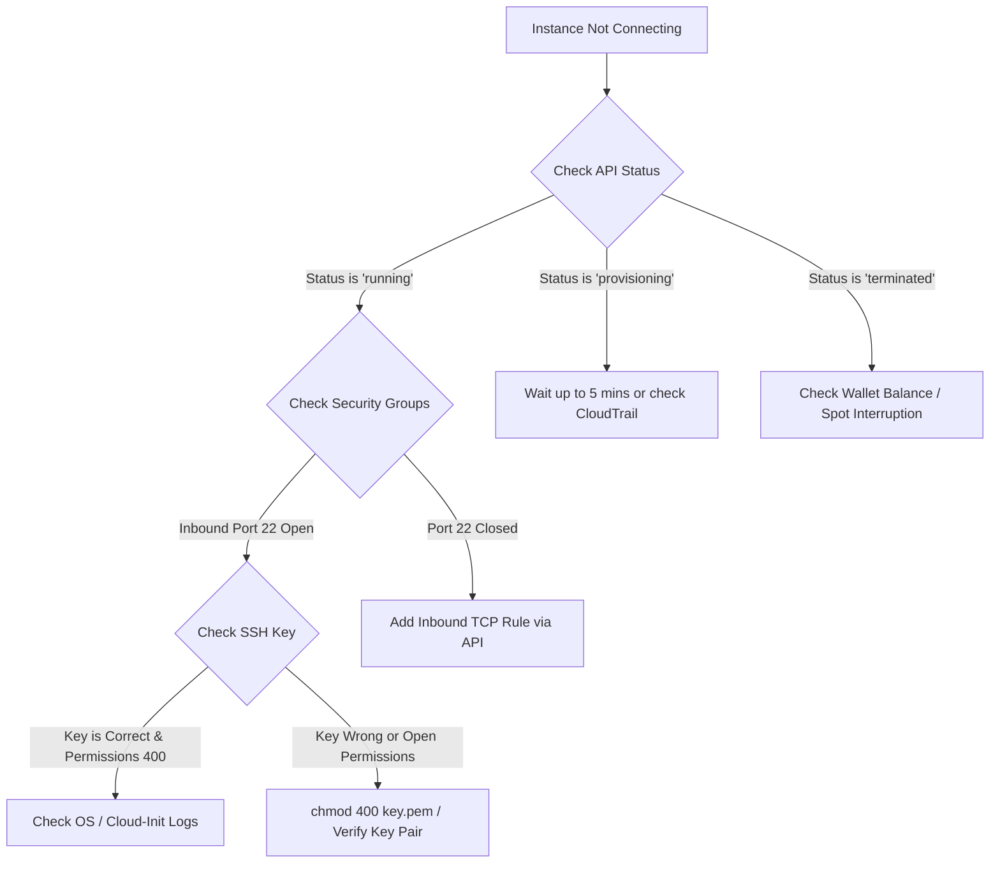

# Production Runbook & Troubleshooting

Operational diagnostics for debugging GPU out-of-memory errors, spot interruptions, disk space saturation, network firewalls, and sandbox execution timeouts.

:::info
This guide is designed for DevOps engineers, ML researchers, and systems administrators managing high-performance GPU instances on FotoHub Compute.
:::

---

## Diagnostic Decision Tree

Use this flowchart to rapidly isolate connectivity issues:



---

## Diagnostic Quick-Reference Matrix

| Error Symptom | Root Cause | First Diagnostic Step | Immediate Remediation |
|:---|:---|:---|:---|
| **`torch.cuda.OutOfMemoryError`** | VRAM exhausted during model load or KV-cache growth | Run `nvidia-smi` | Enable `--enforce-eager`, reduce batch size, or switch to AWQ 4-bit |
| **Instance terminated unexpectedly** | Spot capacity reclaimed by AWS or empty wallet balance | Query `GET /instances/{id}/status-checks` | Maintain minimum $5.00 wallet balance or launch in alternate AZ |
| **`Permission denied (publickey)`** | Private key file has loose permissions or wrong user | Check `ls -l worker_key.pem` | Run `chmod 400 worker_key.pem`; ensure SSH user is `ubuntu` |
| **`No space left on device`** | Root partition saturated by Hugging Face cache | Run `df -h` | Use `PUT /volumes/{id}` to hot-resize disk, then `resize2fs` |
| **Port 8000 / 8188 Unreachable** | Inbound security group firewall rule missing | Inspect `GET /instances/{id}/full` | Add inbound TCP rule via `POST /instances/{id}/security-rules` |
| **Sandbox Execution Timeout** | Code exceeded `timeout_s` wall clock limit | Inspect `error` in response JSON | Increase `timeout_s` (max 120s) or vectorize Python loop |
| **Vsock Connection Refused (9999)** | MicroVM guest execution daemon failed to boot | Inspect host kernel logs | Check dmesg for KVM virtualization errors; daemon auto-restarts |
| **NVIDIA Driver Not Found** | Linux kernel updated without dkms driver rebuild | Run `nvidia-smi` | Run `sudo apt-get install --reinstall nvidia-dkms-550` |
| **SSH Host Key Verification Failed** | Replaced instance reused the same Elastic IP | Inspect `~/.ssh/known_hosts` | Run `ssh-keygen -R <IP_ADDRESS>` |
| **EBS Volume Stuck in `attaching`** | NVMe device naming collision or AWS controller lock | Inspect AWS volume state | Detach volume via API, wait 10s, and re-attach |

---

## Comprehensive Runbooks for Common Failures

### 1. Instance Stuck in `provisioning` State >5 Min

If your instance remains in the `provisioning` state for more than 5 minutes, it is likely experiencing underlying capacity constraints or networking allocation delays.

:::warning
Do not attempt to repeatedly terminate and recreate the instance in a loop. This may trigger rate limiting.
:::

**Resolution Steps:**
1. Check the specific Availability Zone capacity.
2. If using Spot instances, the request may be queued. Consider switching to On-Demand.
3. Review your VPC subnet IP address availability.

:::code-group
```bash [cURL]
curl -X GET "https://apis.fotohub.app/compute/v1/instances/inst_123/events" \
  -H "Authorization: Bearer $FOTOHUB_API_KEY"
```
```python [Python]
import requests
headers = {"Authorization": f"Bearer {API_KEY}"}
response = requests.get("https://apis.fotohub.app/compute/v1/instances/inst_123/events", headers=headers)
print(response.json())
```
```typescript [TypeScript]
import axios from 'axios';
const response = await axios.get('https://apis.fotohub.app/compute/v1/instances/inst_123/events', {
  headers: { Authorization: `Bearer ${API_KEY}` }
});
console.log(response.data);
```
```go [Go]
req, _ := http.NewRequest("GET", "https://apis.fotohub.app/compute/v1/instances/inst_123/events", nil)
req.Header.Set("Authorization", "Bearer "+API_KEY)
client := &http.Client{}
resp, _ := client.Do(req)
// Handle response...
```
:::

### 2. SSH Connection Refused

Connection refused usually indicates either the firewall blocking port 22, the SSH daemon not running, or wrong credentials.

#### 2.1 File Permissions
SSH strictly rejects private keys with open read permissions:
```bash
chmod 400 worker_key.pem
```

#### 2.2 Verify Username
Connect to the public IP using the default `ubuntu` user:
```bash
ssh -i worker_key.pem ubuntu@18.197.82.14
```

#### 2.3 Inspect Cloud-Init Boot Logs
If the machine does not accept SSH after 60 seconds, inspect the serial console:
:::code-group
```bash [cURL]
curl -X GET "https://apis.fotohub.app/compute/v1/instances/inst_90f23b/logs?lines=100" \
  -H "Authorization: Bearer $FOTOHUB_API_KEY"
```
```python [Python]
import requests
headers = {"Authorization": f"Bearer {API_KEY}"}
response = requests.get("https://apis.fotohub.app/compute/v1/instances/inst_90f23b/logs?lines=100", headers=headers)
print(response.text)
```
```typescript [TypeScript]
import axios from 'axios';
const response = await axios.get('https://apis.fotohub.app/compute/v1/instances/inst_90f23b/logs?lines=100', {
  headers: { Authorization: `Bearer ${API_KEY}` }
});
console.log(response.data);
```
```go [Go]
req, _ := http.NewRequest("GET", "https://apis.fotohub.app/compute/v1/instances/inst_90f23b/logs?lines=100", nil)
req.Header.Set("Authorization", "Bearer "+API_KEY)
client := &http.Client{}
resp, _ := client.Do(req)
```
:::

### 3. Resolving CUDA Out of Memory (OOM)

When PyTorch throws `torch.cuda.OutOfMemoryError: CUDA out of memory`:

**Immediate Checks via SSH:**
```bash
# Check current VRAM allocation and active PID processes
nvidia-smi

# Inspect kernel logs for Linux OOM-killer interventions
sudo dmesg -T | grep -E -i "oom|killed process"
```

**Remediation Playbook:**
1. **Enable Gradient Checkpointing**: Reduces activation memory by ~60% during training at a cost of ~20% slower compute.
2. **Switch to 8-Bit Optimizers**: In training scripts, replace `AdamW` with `AdamW8bit` (`bitsandbytes`).
3. **Configure vLLM Memory Bounds**: Launch with `--gpu-memory-utilization 0.90` and `--max-model-len 16384`.
4. **Quantize Weights**: Run models in 4-bit (AWQ or GPTQ) instead of full 16-bit float.
5. **Reduce Batch Size**: The most direct way to reduce memory pressure during forward passes.

### 4. Handling Spot Interruptions Gracefully

AWS Spot instances receive a **2-minute warning metadata notification** before termination.
Spot instances are highly cost-effective but require resilience engineering.

#### Production Interruption Daemon
Run this lightweight bash daemon in the background of long-running batch workers:

```bash
#!/bin/bash
# spot-monitor.sh
while true; do
  HTTP_CODE=$(curl -s -o /dev/null -w "%{http_code}" http://169.254.169.254/latest/meta-data/spot/instance-action)
  if [ "$HTTP_CODE" = "200" ]; then
    echo "SPOT INTERRUPTION NOTICE RECEIVED!"
    # 1. Flush training checkpoints to persistent EBS disk
    sync
    # 2. Notify central API / webhook
    curl -X POST https://api.yourdomain.com/worker-interrupted -d '{"worker_id": "'$(hostname)'"}'
    # 3. Safely shutdown local processes
    pkill -f "python train.py"
    exit 0
  fi
  sleep 5
done
```

### 5. Expanding EBS Disk Capacity Live (Zero Downtime)

When disk space runs out during large model checkpoint downloads (`No space left on device`):

:::code-group
```bash [cURL]
curl -X PUT "https://apis.fotohub.app/compute/v1/instances/inst_90f23b/volumes/vol-0a812df934" \
  -H "Authorization: Bearer $FOTOHUB_API_KEY" \
  -H "Content-Type: application/json" \
  -d '{"size_gb": 250, "type": "gp3"}'
```
```python [Python]
import requests
headers = {"Authorization": f"Bearer {API_KEY}"}
payload = {"size_gb": 250, "type": "gp3"}
requests.put("https://apis.fotohub.app/compute/v1/instances/inst_90f23b/volumes/vol-0a812df934", json=payload, headers=headers)
```
```typescript [TypeScript]
import axios from 'axios';
await axios.put('https://apis.fotohub.app/compute/v1/instances/inst_90f23b/volumes/vol-0a812df934', {
  size_gb: 250, type: "gp3"
}, { headers: { Authorization: `Bearer ${API_KEY}` } });
```
```go [Go]
import "bytes"
import "net/http"
payload := []byte(`{"size_gb": 250, "type": "gp3"}`)
req, _ := http.NewRequest("PUT", "https://apis.fotohub.app/compute/v1/instances/inst_90f23b/volumes/vol-0a812df934", bytes.NewBuffer(payload))
req.Header.Set("Authorization", "Bearer "+API_KEY)
req.Header.Set("Content-Type", "application/json")
client := &http.Client{}
resp, _ := client.Do(req)
```
:::

After expanding via API, SSH into the instance and resize the filesystem:
```bash
# 1. Grow partition
sudo growpart /dev/nvme0n1 1

# 2. Resize ext4 filesystem online
sudo resize2fs /dev/nvme0n1p1

# 3. Verify new capacity
df -h /
```

### 6. Startup Script Failure: Reading cloud-init Logs

If your initialization script (`user_data`) fails to execute or hangs:

Check the execution logs directly on the instance:
```bash
# View cloud-init output log
cat /var/log/cloud-init-output.log

# Check cloud-init status
cloud-init status --long

# Re-run user scripts for debugging
sudo cloud-init single --name cc_scripts_user --frequency always
```

### 7. Performance Degradation: CPU & Memory Pressure

If inference is slow or the system is unresponsive, check for CPU throttling or memory pressure.

**Tools to run:**
- `htop`: Check per-core CPU utilization.
- `vmstat 1`: Check for high context switching or swapping (watch the `si` and `so` columns).
- `iostat -xz 1`: Check if the disk (`%util`) is bottlenecking the system.

:::tip
If you see high I/O wait (`wa` CPU state), consider upgrading your volume to a higher IOPS tier or switching to local NVMe instance store volumes.
:::

### 8. Network Unreachable: Elastic IP vs Dynamic IP

If external endpoints cannot reach your instance:
1. Ensure the instance has a Public IP assigned. Dynamic IPs change on stop/start. Elastic IPs are persistent.
2. Verify Security Group rules allow inbound traffic on the target port.

:::code-group
```bash [cURL]
# Add Security Group Rule for Port 8000
curl -X POST "https://apis.fotohub.app/compute/v1/instances/inst_90f23b/security-rules" \
  -H "Authorization: Bearer $FOTOHUB_API_KEY" \
  -H "Content-Type: application/json" \
  -d '{"port": 8000, "protocol": "tcp", "cidr": "0.0.0.0/0"}'
```
```python [Python]
import requests
headers = {"Authorization": f"Bearer {API_KEY}"}
payload = {"port": 8000, "protocol": "tcp", "cidr": "0.0.0.0/0"}
requests.post("https://apis.fotohub.app/compute/v1/instances/inst_90f23b/security-rules", json=payload, headers=headers)
```
```typescript [TypeScript]
import axios from 'axios';
await axios.post('https://apis.fotohub.app/compute/v1/instances/inst_90f23b/security-rules', {
  port: 8000, protocol: "tcp", cidr: "0.0.0.0/0"
}, { headers: { Authorization: `Bearer ${API_KEY}` } });
```
```go [Go]
import "bytes"
import "net/http"
payload := []byte(`{"port": 8000, "protocol": "tcp", "cidr": "0.0.0.0/0"}`)
req, _ := http.NewRequest("POST", "https://apis.fotohub.app/compute/v1/instances/inst_90f23b/security-rules", bytes.NewBuffer(payload))
req.Header.Set("Authorization", "Bearer "+API_KEY)
req.Header.Set("Content-Type", "application/json")
client := &http.Client{}
resp, _ := client.Do(req)
```
:::

### 9. vLLM Crash: OOM Profiling, Model Shard Sizing

If vLLM suddenly exits with a core dump or OOM:
- **KV Cache Allocation**: vLLM pre-allocates memory. If it miscalculates, it crashes. Lower `--gpu-memory-utilization` (e.g., from `0.9` to `0.8`).
- **Tensor Parallelism**: For large models (e.g., Llama-3-70B), ensure `--tensor-parallel-size` matches the number of available GPUs.
- **Max Model Length**: Reduce `--max-model-len` to prevent OOM on long sequences.

### 10. Docker Daemon Not Starting

If `systemctl status docker` shows failed:
- **Cgroup v2 compatibility**: Ensure NVIDIA container toolkit is configured for cgroupfs vs systemd appropriately.
- **Storage Driver**: Ensure `overlay2` is supported and `/var/lib/docker` is not corrupted. 
  ```bash
  sudo dockerd --debug
  ```

### 11. Debugging Firecracker Sandbox Timeouts

When `POST /sandbox/exec-python` returns `"error": "Execution timed out"`:

1. **Verify Vectorization**: Ensure Python code is not executing slow nested loops over large datasets. Use `numpy` or `pandas` vectorized primitives.
2. **Chunk Large Datasets**: Process data in smaller batches to avoid hitting the wall-clock limit.
3. **Increase `timeout_s`**: The default timeout is 30 seconds. Increase up to 120 seconds:
    ```json
    {
      "code": "...",
      "timeout_s": 90
    }
    ```
4. **Inspect Sandbox Memory Limits**: If memory exceeds `memory_mb`, the process will be terminated by Linux cgroups. Increase `memory_mb` up to `2048`.

### 12. Insufficient Wallet Balance & Auto-Stop

Instances will automatically terminate or stop if your wallet balance falls below $5.00 USD.

**How Auto-Stop Works:**
A background worker checks balances every 5 minutes. If `balance <= 0.00 USD`, running instances are gracefully stopped. If `balance <= -10.00 USD`, instances may be terminated to prevent debt accumulation.

**Topping up:**

There is no developer-callable top-up endpoint — billing-engine's real routes are limited to
VAT/exchange-rate lookups, invoice/JPK-VAT generation, fraud checks, and job/health status. Adding
funds to your prepaid USD wallet happens through the **Console checkout**
(`https://fotohub.app/console/wallet`), not through the API. If a request fails with `402`, send
the user (or yourself) to that page rather than trying to script a top-up.

---

## AWS CloudWatch Metrics Interpretation

If you export metrics to CloudWatch, understanding the following is critical:

- **CPUUtilization**: A metric of 100% means all cores are fully busy. For PyTorch workloads, high CPU but low GPU utilization implies a data-loading bottleneck.
- **GPUUtilization** (Custom Metric via CloudWatch Agent): Should ideally be >80% for efficient training.
- **NetworkIn / NetworkOut**: Spikes during checkpoint saving/loading. If this flatlines during distributed training, MPI/NCCL might be stuck.
- **EBSReadOps / EBSWriteOps**: Disk IOPS. If you hit your provisioned IOPS limit, performance will severely degrade.

---

## Log Collection Commands

When filing a bug or debugging internally, gather the following logs:

```bash
# 1. System journal logs (last 1000 lines)
sudo journalctl -n 1000 --no-pager > system_journal.log

# 2. Docker daemon logs
sudo journalctl -u docker.service > docker.log

# 3. All running container logs
docker ps -q | xargs -L 1 docker logs > containers.log

# 4. NVIDIA GPU State
nvidia-smi -q > nvidia_state.txt
nvidia-smi dmon -s uc -c 10 > nvidia_dmon.txt

# 5. CUDA Compiler version
nvcc --version > nvcc_version.txt

# 6. Tar up all logs
tar -czvf debug_logs.tar.gz *.log *.txt
```

---

## Emergency Procedures

### Snapshot Before Terminate
If an instance is corrupted but holds valuable data, always snapshot before termination:

:::code-group
```bash [cURL]
curl -X POST "https://apis.fotohub.app/compute/v1/volumes/vol-0a812df934/snapshot" \
  -H "Authorization: Bearer $FOTOHUB_API_KEY"
```
```python [Python]
import requests
headers = {"Authorization": f"Bearer {API_KEY}"}
requests.post("https://apis.fotohub.app/compute/v1/volumes/vol-0a812df934/snapshot", headers=headers)
```
```typescript [TypeScript]
import axios from 'axios';
await axios.post('https://apis.fotohub.app/compute/v1/volumes/vol-0a812df934/snapshot', {}, {
  headers: { Authorization: `Bearer ${API_KEY}` }
});
```
```go [Go]
req, _ := http.NewRequest("POST", "https://apis.fotohub.app/compute/v1/volumes/vol-0a812df934/snapshot", nil)
req.Header.Set("Authorization", "Bearer "+API_KEY)
client := &http.Client{}
resp, _ := client.Do(req)
```
:::

### EBS Detach and Reattach
If a volume is stuck or you need to mount it on a recovery instance:

1. Detach from old instance:
   ```bash
   curl -X POST "https://apis.fotohub.app/compute/v1/volumes/vol-123/detach" -H "Authorization: Bearer $FOTOHUB_API_KEY"
   ```
2. Attach to new instance:
   ```bash
   curl -X POST "https://apis.fotohub.app/compute/v1/volumes/vol-123/attach" -d '{"instance_id": "inst_456"}' -H "Authorization: Bearer $FOTOHUB_API_KEY"
   ```

---

## Support Escalation Path

Before contacting Fotohub Support, please gather the following information to expedite resolution:

1. **Instance ID**: e.g., `inst_xxxxxx`
2. **Region/AZ**: e.g., `us-east-1a`
3. **Exact Error Message**: The full stack trace or API response.
4. **Timestamp**: The exact UTC time the issue occurred.
5. **Debug Logs Archive**: The `debug_logs.tar.gz` created in the Log Collection section.

Send this information to `support@fotohub.app` or open a ticket in the Developer Console.

---

## API Error Codes & HTTP Responses

### 400 Bad Request
- `invalid_parameter`: A required parameter is missing or malformed.
- `capacity_unavailable`: Requested GPU type is currently out of stock in the target region.
- `invalid_state_transition`: Attempted to start a running instance or stop a terminated instance.

### 401 Unauthorized
- `invalid_api_key`: The provided API key is invalid or revoked.

### 402 Payment Required
- `insufficient_balance`: Wallet balance is below the required threshold ($5.00 USD).

### 403 Forbidden
- `permission_denied`: The API key lacks the required scopes for this operation.

### 404 Not Found
- `resource_not_found`: The requested instance, volume, or snapshot does not exist.

### 429 Too Many Requests
- `rate_limit_exceeded`: You have exceeded the allowed API calls per minute. Implement exponential backoff.

### 500 Internal Server Error
- `internal_error`: An unexpected error occurred on the Fotohub control plane. Retrying after 10 seconds is recommended.

### 503 Service Unavailable
- `service_maintenance`: The API is currently undergoing scheduled maintenance.

:::danger
If you repeatedly encounter 500 errors for more than 15 minutes, please check our [Status Page](https://status.fotohub.app) or initiate the Support Escalation Path.
:::

### Edge Case: Handling Stale NFS Mounts

If your instance relies on an NFS mount that goes stale:
```bash
# Check if mount is hung
df -h

# Force unmount
sudo umount -f -l /mnt/nfs

# Remount
sudo mount -a
```
    
---

## Extended API Reference

### Volume Operations

**List Volumes**

:::code-group
```bash [cURL]
curl -X GET "https://apis.fotohub.app/compute/v1/volumes" \
  -H "Authorization: Bearer $FOTOHUB_API_KEY"
```
```python [Python]
import requests
headers = {"Authorization": f"Bearer {API_KEY}"}
response = requests.get("https://apis.fotohub.app/compute/v1/volumes", headers=headers)
print(response.json())
```
```typescript [TypeScript]
import axios from 'axios';
const response = await axios.get('https://apis.fotohub.app/compute/v1/volumes', {
  headers: { Authorization: `Bearer ${API_KEY}` }
});
console.log(response.data);
```
```go [Go]
req, _ := http.NewRequest("GET", "https://apis.fotohub.app/compute/v1/volumes", nil)
req.Header.Set("Authorization", "Bearer "+API_KEY)
client := &http.Client{}
resp, _ := client.Do(req)
```
:::

**Delete Volume**

:::code-group
```bash [cURL]
curl -X DELETE "https://apis.fotohub.app/compute/v1/volumes/vol-123" \
  -H "Authorization: Bearer $FOTOHUB_API_KEY"
```
```python [Python]
import requests
headers = {"Authorization": f"Bearer {API_KEY}"}
requests.delete("https://apis.fotohub.app/compute/v1/volumes/vol-123", headers=headers)
```
```typescript [TypeScript]
import axios from 'axios';
await axios.delete('https://apis.fotohub.app/compute/v1/volumes/vol-123', {
  headers: { Authorization: `Bearer ${API_KEY}` }
});
```
```go [Go]
req, _ := http.NewRequest("DELETE", "https://apis.fotohub.app/compute/v1/volumes/vol-123", nil)
req.Header.Set("Authorization", "Bearer "+API_KEY)
client := &http.Client{}
resp, _ := client.Do(req)
```
:::

### Instance Lifecycle Operations

**Stop Instance**

:::code-group
```bash [cURL]
curl -X POST "https://apis.fotohub.app/compute/v1/instances/inst_123/stop" \
  -H "Authorization: Bearer $FOTOHUB_API_KEY"
```
```python [Python]
import requests
headers = {"Authorization": f"Bearer {API_KEY}"}
requests.post("https://apis.fotohub.app/compute/v1/instances/inst_123/stop", headers=headers)
```
```typescript [TypeScript]
import axios from 'axios';
await axios.post('https://apis.fotohub.app/compute/v1/instances/inst_123/stop', {}, {
  headers: { Authorization: `Bearer ${API_KEY}` }
});
```
```go [Go]
req, _ := http.NewRequest("POST", "https://apis.fotohub.app/compute/v1/instances/inst_123/stop", nil)
req.Header.Set("Authorization", "Bearer "+API_KEY)
client := &http.Client{}
resp, _ := client.Do(req)
```
:::

**Start Instance**

:::code-group
```bash [cURL]
curl -X POST "https://apis.fotohub.app/compute/v1/instances/inst_123/start" \
  -H "Authorization: Bearer $FOTOHUB_API_KEY"
```
```python [Python]
import requests
headers = {"Authorization": f"Bearer {API_KEY}"}
requests.post("https://apis.fotohub.app/compute/v1/instances/inst_123/start", headers=headers)
```
```typescript [TypeScript]
import axios from 'axios';
await axios.post('https://apis.fotohub.app/compute/v1/instances/inst_123/start', {}, {
  headers: { Authorization: `Bearer ${API_KEY}` }
});
```
```go [Go]
req, _ := http.NewRequest("POST", "https://apis.fotohub.app/compute/v1/instances/inst_123/start", nil)
req.Header.Set("Authorization", "Bearer "+API_KEY)
client := &http.Client{}
resp, _ := client.Do(req)
```
:::

**Terminate Instance**

:::code-group
```bash [cURL]
curl -X DELETE "https://apis.fotohub.app/compute/v1/instances/inst_123" \
  -H "Authorization: Bearer $FOTOHUB_API_KEY"
```
```python [Python]
import requests
headers = {"Authorization": f"Bearer {API_KEY}"}
requests.delete("https://apis.fotohub.app/compute/v1/instances/inst_123", headers=headers)
```
```typescript [TypeScript]
import axios from 'axios';
await axios.delete('https://apis.fotohub.app/compute/v1/instances/inst_123', {
  headers: { Authorization: `Bearer ${API_KEY}` }
});
```
```go [Go]
req, _ := http.NewRequest("DELETE", "https://apis.fotohub.app/compute/v1/instances/inst_123", nil)
req.Header.Set("Authorization", "Bearer "+API_KEY)
client := &http.Client{}
resp, _ := client.Do(req)
```
:::

---

## Frequently Asked Questions (FAQ)

### What happens to my data when I stop an instance?
When you stop an instance, the root volume and any attached EBS volumes are preserved. You only pay for the stored data ($0.08 per GB-month). When you start the instance again, all your files, packages, and configurations remain exactly as you left them.

### Do you charge for stopped instances?
No. Once an instance is in the `stopped` state, you are no longer billed the hourly compute rate. You only pay for the persistent storage (EBS volumes) and any allocated Elastic IPs.

### Can I change the instance type (e.g., from T4 to A100)?
Yes. Stop the instance, and use the Update API or Dashboard to change the instance type. Start the instance again. Note that changing instance types may require updating GPU drivers if moving between different NVIDIA architectures.

### What is the maximum number of GPUs per instance?
Currently, our `p4d.24xlarge` equivalents offer up to 8x A100 (40GB or 80GB) GPUs per instance. For larger workloads, you must orchestrate distributed training across multiple instances using Ray or PyTorch DDP.

### How do I SSH from Windows?
We recommend using Windows Subsystem for Linux (WSL) or the built-in OpenSSH client in PowerShell. Ensure your `worker_key.pem` is stored securely and permissions are set correctly using `icacls`. Alternatively, use PuTTY after converting the `.pem` to `.ppk`.

### Why am I getting "Too Many Requests" (429)?
The Compute API limits standard accounts to 60 requests per minute per IP address. If you are polling for status changes (e.g., checking if an instance has started), implement exponential backoff in your client and poll no faster than once every 5 seconds.

### Do you support IPv6?
At this time, Fotohub Compute instances only support IPv4 addressing. IPv6 support is on our roadmap for Q4 2026.

---

## Deep Dive: PyTorch Memory Management

Understanding how PyTorch allocates VRAM is critical to preventing OOM errors.

### The Caching Allocator
PyTorch uses a caching memory allocator to speed up memory allocations. This allows fast memory deallocation without device synchronizations. However, the unused memory managed by the allocator will still show as "used" in `nvidia-smi`.

To see the actual memory utilized by tensors vs the memory reserved by the caching allocator:
```python
import torch

print(f"Allocated: {torch.cuda.memory_allocated() / 1024**2:.2f} MB")
print(f"Reserved:  {torch.cuda.memory_reserved() / 1024**2:.2f} MB")
```

### Emptying the Cache
If you suspect memory fragmentation is causing issues, you can explicitly empty the cache. Note that this forces synchronization and can slow down execution.
```python
import torch
torch.cuda.empty_cache()
```
:::warning
Do not call `empty_cache()` inside a training loop. It will severely degrade performance. Only use it between discrete stages (e.g., between training and validation).
:::

### Max Split Size
In some cases of extreme fragmentation, PyTorch might throw an OOM even when total free memory is sufficient. Setting `max_split_size_mb` can help:
```bash
export PYTORCH_CUDA_ALLOC_CONF=max_split_size_mb:512
```

## Deep Dive: Docker Storage Drivers

Docker on Ubuntu 22.04 defaults to the `overlay2` storage driver.

### Checking Docker Disk Usage
```bash
docker system df
```
This shows how much space is used by images, containers, and local volumes.

### Cleaning Up Docker
If your root volume fills up due to Docker:
```bash
# Remove all stopped containers, unused networks, and dangling images
docker system prune -a -f --volumes
```

### Moving Docker Data Directory
If you have attached a large secondary EBS volume (e.g., to `/mnt/data`), you can configure Docker to store all its data there:

1. Stop Docker: `sudo systemctl stop docker`
2. Create `daemon.json`:
   ```json
   {
     "data-root": "/mnt/data/docker"
   }
   ```
   Save this to `/etc/docker/daemon.json`.
3. Rsync existing data (optional): `sudo rsync -aP /var/lib/docker/ /mnt/data/docker`
4. Start Docker: `sudo systemctl start docker`

## Appendix A: Useful Aliases

Add these to your `~/.bashrc` for quicker debugging:

```bash
alias nv="watch -n 1 nvidia-smi"
alias dlog="docker logs -f --tail 100"
alias dps="docker ps --format 'table {{.ID}}\t{{.Image}}\t{{.Status}}\t{{.Names}}'"
alias gpu-top="nvtop"
```

## Appendix B: Network Troubleshooting Tools

- `ping 1.1.1.1`: Check outbound internet connectivity.
- `nc -vz <ip> <port>`: Check if a specific TCP port is open and listening.
- `traceroute <ip>`: Identify network routing hops.
- `tcpdump -i any port 8000`: Capture raw packet data on port 8000.

## Final Note

This runbook is intended to cover 99% of common issues encountered on Fotohub Compute. If your issue is not listed here, please consult our Developer Community Forums or reach out via the Support Escalation Path.

