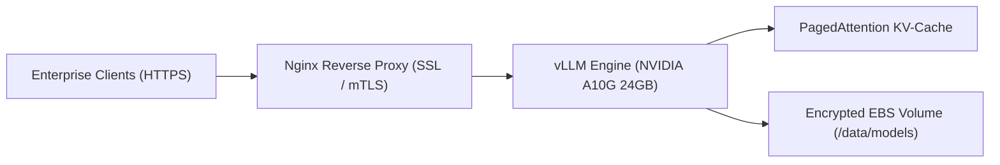
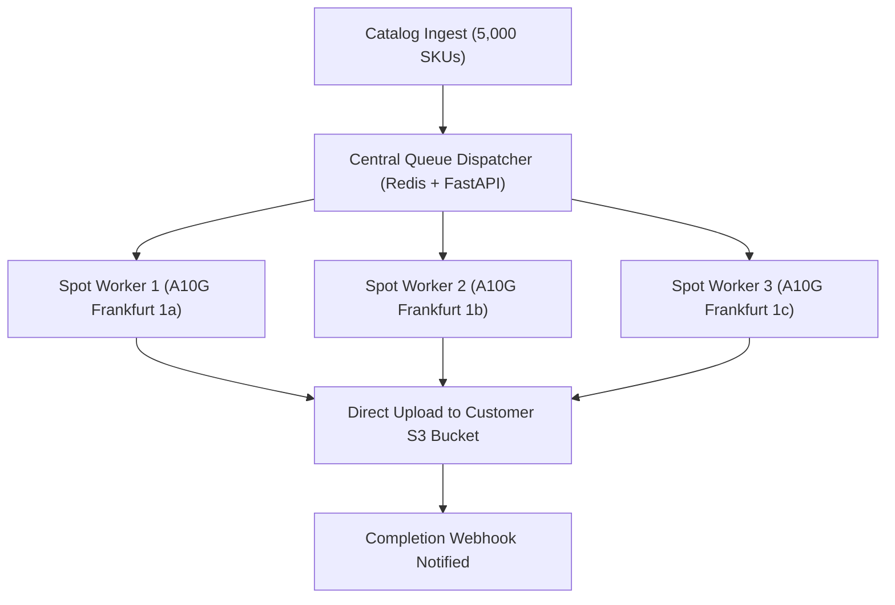
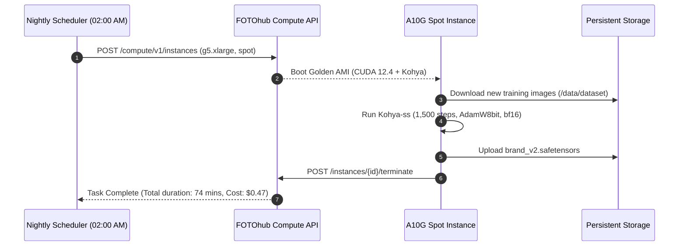

# Production Blueprints & Real-World Architectures

Battle-tested architectural blueprints showing how high-growth startups, enterprise teams, and AI agencies deploy FOTOhub Dedicated Compute and Ephemeral Sandboxes in production.

---

## The Enterprise Blueprint Matrix

| # | Blueprint Name | Core Stack | Recommended Hardware | Production Cost | Key Business Advantage |
|:---:|:---|:---|:---|:---|:---|
| **1** | **[Private Enterprise LLM Gateway](#1-enterprise-private-llm-gateway)** | vLLM + Qwen 2.5 / DeepSeek | 1x A10G (`g5.xlarge`) Spot | **$0.38 / hr** | 100% GDPR compliant EU endpoint with zero vendor token markups |
| **2** | **[High-Volume ComfyUI Render Farm](#2-high-volume-comfyui-render-farm)** | Headless FLUX / SDXL | 3–6x A10G (`g5.xlarge`) Spot | **$0.00048 / image** | 20,000+ packshots/day at 1/80th the cost of commercial image APIs |
| **3** | **[Multilingual Video & Lip-Sync Pipeline](#3-multilingual-voice-video-dubbing-farm)** | Demucs + Whisper + LatentSync | 1x A10G + 1x T4 Fleet | **$0.58 / hr** | Automated video localization with matching lip movements |
| **4** | **[Continuous LoRA Training Factory](#4-continuous-lora-training-pipeline)** | Kohya-ss / Unsloth | 1x A10G (`g5.xlarge`) Spot | **$0.55 / run (75m)** | Nightly custom character & brand aesthetic adapter fine-tuning |
| **5** | **[Untrusted SaaS Code Interpreter](#5-untrusted-code-interpreter-for-saas)** | Firecracker microVMs | Serverless Sandboxes | **$0.00008 / run** | Sub-200ms KVM execution with zero SSRF or host escape risk |
| **6** | **[Anti-Bot Web Scraping Fleet](#6-large-scale-web-intelligence-fleet)** | Playwright in Sandboxes | Agent Compute Workers | **$0.02 / domain** | Headless browser SPA extraction, PDF parsing & structured JSON |
| **7** | **[4K 60fps Live Video Transcoder](#7-4k-60fps-video-transcoding-hls-streaming)** | FFmpeg dual NVENC | 1x T4 (`g4dn.xlarge`) Spot | **$0.20 / hr** | Real-time multi-bitrate HLS streaming with hardware encoding |
| **8** | **[Autonomous Support Agent with RAG](#8-autonomous-support-agent-with-document-grounding)** | Agent Engine + Vector DB | Compute + Claude Opus | **Per-task billing** | Multi-step reasoning loops with sandboxed reproduction scripts |
| **9** | **[Real-Time Voice AI Agent Gateway](#9-real-time-voice-ai-agent-gateway)** | WebRTC + vLLM + Chatterbox | 1x A10G (`g5.xlarge`) | **$1.01 / hr (On-Dem)**| Sub-400ms voice-to-voice conversational customer support |
| **10**| **[E-Commerce 3D Mesh Generator](#10-e-commerce-3d-mesh-generator-farm)** | TripoSR + Quad Remesh | 1x A10G (`g5.xlarge`) Spot | **$0.012 / 3D model** | Single 2D photo to AR-ready GLB/USDZ interactive models |
| **11**| **[Dynamic Video Ad Personalizer](#11-dynamic-video-ad-personalization-engine)** | MoviePy + NVENC + TTS | 2x T4 (`g4dn.2xlarge`) Spot | **$0.54 / hr** | 1,000 customized TikTok video variations generated per hour |
| **12**| **[Multi-Agent Coding Swarm with CI](#12-multi-agent-coding-swarm-with-sandboxed-ci)** | Claude Opus + MicroVM CI | Agent Compute + Firecracker | **Per-commit billing** | Autonomous PR bug fixing with verified sandbox test runs |

---

## 1. Enterprise Private LLM Gateway

### The Problem
Financial institutions, legal firms, and healthcare providers cannot transmit sensitive patient or customer data to commercial cloud AI APIs hosted in the United States due to strict European GDPR (Article 44) and HIPAA regulations.

### The Solution
Deploy an open-weights model (`Qwen/Qwen2.5-7B-Instruct` or `deepseek-ai/DeepSeek-R1-Distill-Qwen-8B`) inside an isolated FOTOhub EC2 instance in **Frankfurt (`eu-central-1`)** with vLLM PagedAttention.



### Production Metrics & ROI
- **Throughput:** ~78 tokens/second per stream; up to 32 concurrent active streams (~812 tokens/s cluster throughput).
- **Latency:** 18ms Time-To-First-Token (TTFT).
- **Monthly Infrastructure Cost (24/7 on Spot):** **$273.60 / month** (equivalent to 100M tokens on OpenAI costing ~$1,500+).

---

## 2. High-Volume ComfyUI Render Farm

### The Problem
A consumer fashion brand requires 25,000 seasonal apparel packshots per week. Using third-party image generation APIs at $0.04/image would cost $1,000/week ($4,300/month) and suffers from concurrent rate-limiting.

### The Architecture
A multi-node Spot fleet of 3x `g5.xlarge` instances running headless ComfyUI. A central Celery dispatcher distributes prompt graphs over WebSockets and uploads rendered assets straight to Cloudflare R2 / AWS S3.



### Unit Economics
- **Batch Size:** 5,000 images.
- **Compute Time:** 3 nodes running for 2.1 hours = 6.3 machine-hours.
- **Total Compute Cost:** 6.3 hrs × $0.38/hr = **$2.39**.
- **Cost per Image:** **$0.00048** (less than 1/20th of a cent!).

---

## 3. Multilingual Voice & Video Dubbing Farm

### The Problem
Media companies and course creators need to localize video catalogs from English into German, Spanish, Polish, and French with natural lip-sync matching the foreign voiceover.

### The 4-Stage Heterogeneous Fleet
1. **Stem Isolation Node (`g4dn.xlarge` Spot - $0.20/hr):** Demucs separates vocal tracks from background music.
2. **Translation & Speech Node (API Engine):** Whisper Large-v3 generates timestamped SRT; LLM translates; Chatterbox / ElevenLabs clones speaker timbre.
3. **Facial Retargeting Node (`g5.xlarge` Spot - $0.38/hr):** LatentSync / MuseTalk morphs lip vertices frame-by-frame to align with new audio phonemes.
4. **Remuxing Node (FFmpeg NVENC):** Hardware encoder recombines background score and new lip-synced video track.

---

## 4. Continuous LoRA Training Pipeline

### The Problem
Creative agencies need bespoke AI models trained on client brand styles, fonts, and products updated every week without manual engineer intervention.

### Automated Nightly Workflow


---

## 5. Untrusted Code Interpreter for SaaS

### The Problem
A SaaS financial modeling platform allows users to input custom Python scripts to manipulate Excel models. Running arbitrary Python code on host machines exposes company infrastructure to Remote Code Execution (RCE), host memory dumping, and SSRF attacks.

### The Firecracker MicroVM Solution
Execute every user calculation inside an ephemeral Firecracker microVM (`POST /sandbox/exec-python`):
- **Boot Time:** **140 milliseconds**.
- **Virtual Network:** **Disabled** (no virtual `eth0` interface; communicates purely via host-to-guest `vsock`).
- **Memory Ceiling:** Enforced 512 MB cgroups quota.
- **CPU Time Limit:** Strict 15-second wall clock timeout.
- **Cost:** ~$0.00008 per execution.

---

## 6. Large-Scale Web Intelligence Fleet

### The Problem
Extracting dynamic pricing and inventory from 20,000 e-commerce sites requires executing full JavaScript SPAs (React/Vue), bypassing bot detection, and rendering DOM trees without IP blocking.

### The Solution
Use Agent Compute workers running headless Playwright browsers inside sandboxes:
1. Spin up ephemeral sandbox sessions with pre-installed Chromium.
2. Navigate to target pages and await network idle state.
3. Extract clean Markdown representations of the DOM and screenshot product cards.
4. Pass structured data directly to LLMs for entity extraction (price, SKU, availability).

---

## 7. 4K 60fps Video Transcoding & HLS Streaming

### The Problem
Converting high-bitrate 4K ProRes master video into adaptive HLS ladders (1080p, 720p, 480p) on generic CPU servers requires 100% CPU utilization for hours and causes buffer drops.

### The Solution
Rent an NVIDIA T4 instance (`g4dn.xlarge` at **$0.20/hr Spot**). The T4 features **dual dedicated NVENC encoding chips**, capable of transcode speeds up to **4x real-time**:
```bash
ffmpeg -hwaccel cuda -hwaccel_output_format cuda -i input_4k.mov \
  -c:v h264_nvenc -b:v:0 8000k -s:v:0 1920x1080 \
  -c:v h264_nvenc -b:v:1 4000k -s:v:1 1280x720 \
  -f hls -hls_time 4 -hls_playlist_type vod master.m3u8
```

---

## 8. Autonomous Support Agent with Document Grounding

### The Problem
Tier-2 developer support tickets require investigating customer log traces, testing code reproductions, verifying documentation, and proposing pull requests.

### The Solution
Dispatch an Autonomous Agent Task (`POST /v1/tasks/create`):
1. The agent reads the customer's failing API request payload.
2. Formulates an automated test script and executes it inside a Firecracker sandbox.
3. Analyzes the stack trace and pinpoints parameter mismatches.
4. Generates a corrected code snippet and verifies it executes with HTTP 200 OK.
5. Returns a verified solution to the customer dashboard in under 45 seconds.

---

## 9. Real-Time Voice AI Agent Gateway

### The Problem
Customer service phone lines require conversational AI agents with sub-500ms voice-to-voice latency to prevent unnatural pauses.

### The Architecture
A dedicated `g5.xlarge` On-Demand instance hosting:
1. **Silero VAD** for ultra-fast voice activity detection (< 30ms).
2. **Whisper Turbo** streaming speech-to-text (< 120ms).
3. **vLLM Qwen 2.5 7B** generating streaming conversational responses (< 100ms TTFT).
4. **Chatterbox TTS / Kokoro** streaming synthesized audio chunks back over WebRTC (< 150ms).
- **End-to-End Latency:** **~400ms** (natural human conversational tempo).

---

## 10. E-Commerce 3D Mesh Generator Farm

### The Problem
E-commerce retailers want interactive 3D WebGL / AR viewers for product listings, but manual 3D modeling costs $150+ per SKU.

### The Automated Solution
A batch Spot A10G worker running the **FOTOhub 3D Pipeline**:
1. Ingests 2D product packshot.
2. Removes background with Background Removal Pro (`/v1/ai/image/remove-background`).
3. Runs TripoSR inside PyTorch to infer dense 3D point clouds.
4. Performs quad remeshing and Laplacian manifold hole repair.
5. Exports production-ready `.glb` and iOS QuickLook `.usdz` assets.
- **Processing Time:** 45 seconds per SKU.
- **Cost:** **$0.012 per 3D model**.

---

## 11. Dynamic Video Ad Personalization Engine

### The Problem
Digital marketers need 1,000 video ad permutations tailored with personalized customer names, discount codes, and local store locations for TikTok & Meta campaigns.

### The Solution
A 2-node T4 fleet running parallel MoviePy and NVENC scripts:
- Ingests base video template.
- Overlays dynamic text and animated sticker coordinates.
- Synthesizes personalized audio greeting via TTS.
- Renders 1,000 MP4 video ads in under 60 minutes.
- **Total Compute Cost:** **$0.40**.

---

## 12. Multi-Agent Coding Swarm with Sandboxed CI

### The Problem
Engineering teams need autonomous AI agents that can refactor legacy codebases, write unit tests, and verify that changes do not break existing test suites.

### The Solution
An Autonomous Agent orchestrator running on FOTOhub Compute:
1. Clones the customer's GitHub repository into the virtual workspace.
2. Analyzes code architecture and edits files.
3. Dispatches a Firecracker sandbox to run `pytest tests/`.
4. If a test fails, the agent inspects the stdout/stderr trace, rewrites the code, and re-executes until 100% of tests pass.
5. Commits changes and opens a verified GitHub Pull Request.\n