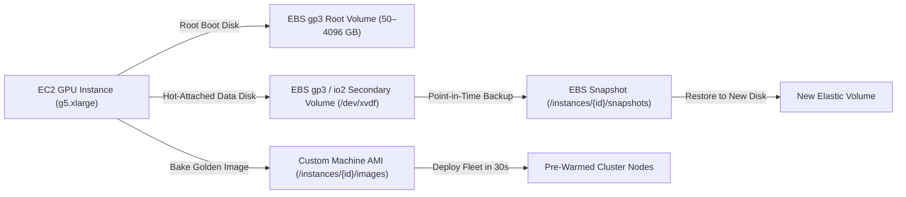

# EBS Persistent Volumes & Custom AMIs

Manage persistent Elastic Block Store (EBS) disks, online volume hot-resizing, point-in-time snapshots, and baking custom Amazon Machine Images (AMIs).

Persistent volumes allow you to store multi-gigabyte Hugging Face model weights, fine-tuning datasets, and output renders independently of instance compute lifecycles.

---

## Storage Architecture



---

## Supported EBS Volume Types

| Volume Type | Technology | Max Capacity | Baseline IOPS | Max Throughput | Billed Rate (USD/GB-mo) | Best For |
|:---|:---|:---|:---|:---|:---|:---|
| **`gp3`** (Default) | General Purpose SSD | 4,096 GB | 3,000 IOPS | 125 MB/s | **$0.080** | ML model checkpoints, OS boot disks, development |
| **`io2`** | Provisioned IOPS SSD | 4,096 GB | Up to 64,000 IOPS | 1,000 MB/s | **$0.125** + $0.065/IOPS | Low-latency databases, streaming vector search |
| **`st1`** | Throughput Optimized HDD | 4,096 GB | 500 IOPS | 500 MB/s | **$0.045** | Large video archives, cold sequential logging |

---

## Attaching Persistent Volumes

Attach up to **8 secondary EBS volumes** per instance. Disks attach cleanly without rebooting:

```bash
curl -X POST https://apis.fotohub.app/compute/v1/instances/inst_90f23b/volumes   -H "Authorization: Bearer $FOTOHUB_API_KEY"   -H "Content-Type: application/json"   -d '{
    "size_gb": 200,
    "type": "gp3",
    "device": "/dev/xvdf",
    "iops": 3000
  }'
```

### Initializing the Filesystem on Linux

Once attached, connect via SSH to format and mount the disk:

```bash
# Check block device
lsblk

# Format with ext4 if new disk
sudo mkfs.ext4 -m 0 /dev/nvme1n1

# Mount to data directory
sudo mkdir -p /data/models
sudo mount /dev/nvme1n1 /data/models

# Persist across reboots in /etc/fstab
echo "/dev/nvme1n1 /data/models ext4 defaults,nofail 0 2" | sudo tee -a /etc/fstab
```

---

## Online Hot-Resizing & IOPS Scaling

Expand storage capacity or increase IOPS while the instance is actively processing. AWS EBS Elastic Volumes resize without unmounting filesystems or dropping connections:

```bash
curl -X PUT https://apis.fotohub.app/compute/v1/instances/inst_90f23b/volumes/vol-0a812df934   -H "Authorization: Bearer $FOTOHUB_API_KEY"   -H "Content-Type: application/json"   -d '{
    "size_gb": 500,
    "type": "gp3",
    "iops": 5000
  }'
```

After the API call completes, extend the filesystem on the host:

```bash
# Grow the ext4 partition online
sudo resize2fs /dev/nvme1n1
df -h /data/models
```

---

## Creating Point-in-Time Snapshots

Create an incremental snapshot of an attached volume for disaster recovery or dataset versioning:

```bash
curl -X POST https://apis.fotohub.app/compute/v1/instances/inst_90f23b/snapshots   -H "Authorization: Bearer $FOTOHUB_API_KEY"   -H "Content-Type: application/json"   -d '{
    "description": "Stable Diffusion checkpoint backup pre-fine-tune"
  }'
```

### Listing Snapshots

```bash
curl -X GET https://apis.fotohub.app/compute/v1/instances/inst_90f23b/snapshots   -H "Authorization: Bearer $FOTOHUB_API_KEY"
```

---

## Baking Custom Machine Images (AMIs)

Once you have configured an instance with specific CUDA libraries, customized ComfyUI nodes, model weights, and custom python packages, bake it into a **Golden AMI**. You can spin up future spot instances from this image in under 45 seconds with zero setup overhead:

```bash
curl -X POST https://apis.fotohub.app/compute/v1/instances/inst_90f23b/images   -H "Authorization: Bearer $FOTOHUB_API_KEY"   -H "Content-Type: application/json"   -d '{
    "name": "comfyui-flux-v2-golden",
    "description": "Ubuntu 22.04 + CUDA 12.4 + ComfyUI with FLUX.1 dev weights pre-warmed"
  }'
```

Response:
```json
{
  "image_id": "ami-0a912837bc901ef",
  "name": "comfyui-flux-v2-golden",
  "status": "pending"
}
```

### Launching Directly from Your Custom AMI

```bash
curl -X POST https://apis.fotohub.app/compute/v1/instances   -H "Authorization: Bearer $FOTOHUB_API_KEY"   -H "Content-Type: application/json"   -d '{
    "name": "worker-from-golden",
    "catalog_id": "g5.xlarge",
    "spot_instance": true,
    "os_image": "ami-0a912837bc901ef",
    "root_volume_size_gb": 120
  }'
```
