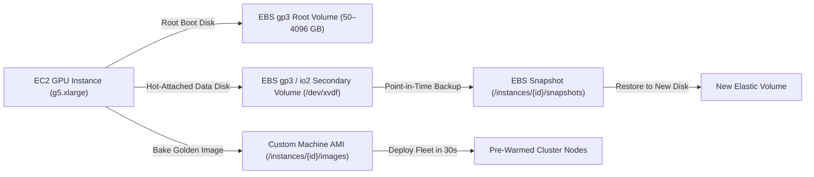

# EBS Persistent Volumes & Custom AMIs

Manage persistent Elastic Block Store (EBS) disks, online volume hot-resizing, point-in-time snapshots, and baking custom Amazon Machine Images (AMIs).

Persistent volumes allow you to store multi-gigabyte Hugging Face model weights, fine-tuning datasets, and output renders independently of instance compute lifecycles.

---

## Storage Architecture



---

## Supported EBS Volume Types

| Volume Type | Technology | Max Capacity | Baseline IOPS | Max Throughput | Billed Rate (USD/GB-mo) | Best For |
|:---|:---|:---|:---|:---|:---|:---|
| **`gp3`** (Default) | General Purpose SSD | 4,096 GB | 3,000 IOPS | 125 MB/s | **$0.080** | ML model checkpoints, OS boot disks, development |
| **`io2`** | Provisioned IOPS SSD | 4,096 GB | Up to 64,000 IOPS | 1,000 MB/s | **$0.125** + $0.065/IOPS | Low-latency databases, streaming vector search |
| **`st1`** | Throughput Optimized HDD | 4,096 GB | 500 IOPS | 500 MB/s | **$0.045** | Large video archives, cold sequential logging |

---

## Attaching Persistent Volumes

Attach up to **8 secondary EBS volumes** per instance. Disks attach cleanly without rebooting:

```bash
curl -X POST https://apis.fotohub.app/compute/v1/instances/inst_90f23b/volumes   -H "Authorization: Bearer $FOTOHUB_API_KEY"   -H "Content-Type: application/json"   -d '{
    "size_gb": 200,
    "type": "gp3",
    "device": "/dev/xvdf",
    "iops": 3000
  }'
```

### Initializing the Filesystem on Linux

Once attached, connect via SSH to format and mount the disk:

```bash
# Check block device
lsblk

# Format with ext4 if new disk
sudo mkfs.ext4 -m 0 /dev/nvme1n1

# Mount to data directory
sudo mkdir -p /data/models
sudo mount /dev/nvme1n1 /data/models

# Persist across reboots in /etc/fstab
echo "/dev/nvme1n1 /data/models ext4 defaults,nofail 0 2" | sudo tee -a /etc/fstab
```

---

## Online Hot-Resizing & IOPS Scaling

Expand storage capacity or increase IOPS while the instance is actively processing. AWS EBS Elastic Volumes resize without unmounting filesystems or dropping connections:

```bash
curl -X PUT https://apis.fotohub.app/compute/v1/instances/inst_90f23b/volumes/vol-0a812df934   -H "Authorization: Bearer $FOTOHUB_API_KEY"   -H "Content-Type: application/json"   -d '{
    "size_gb": 500,
    "type": "gp3",
    "iops": 5000
  }'
```

After the API call completes, extend the filesystem on the host:

```bash
# Grow the ext4 partition online
sudo resize2fs /dev/nvme1n1
df -h /data/models
```

---

## Creating Point-in-Time Snapshots

Create an incremental snapshot of an attached volume for disaster recovery or dataset versioning:

```bash
curl -X POST https://apis.fotohub.app/compute/v1/instances/inst_90f23b/snapshots   -H "Authorization: Bearer $FOTOHUB_API_KEY"   -H "Content-Type: application/json"   -d '{
    "description": "Stable Diffusion checkpoint backup pre-fine-tune"
  }'
```

### Listing Snapshots

```bash
curl -X GET https://apis.fotohub.app/compute/v1/instances/inst_90f23b/snapshots   -H "Authorization: Bearer $FOTOHUB_API_KEY"
```

---

## Baking Custom Machine Images (AMIs)

Once you have configured an instance with specific CUDA libraries, customized ComfyUI nodes, model weights, and custom python packages, bake it into a **Golden AMI**. You can spin up future spot instances from this image in under 45 seconds with zero setup overhead:

```bash
curl -X POST https://apis.fotohub.app/compute/v1/instances/inst_90f23b/images   -H "Authorization: Bearer $FOTOHUB_API_KEY"   -H "Content-Type: application/json"   -d '{
    "name": "comfyui-flux-v2-golden",
    "description": "Ubuntu 22.04 + CUDA 12.4 + ComfyUI with FLUX.1 dev weights pre-warmed"
  }'
```

Response:
```json
{
  "image_id": "ami-0a912837bc901ef",
  "name": "comfyui-flux-v2-golden",
  "status": "pending"
}
```

### Launching Directly from Your Custom AMI

```bash
curl -X POST https://apis.fotohub.app/compute/v1/instances \
  -H "Authorization: Bearer $FOTOHUB_API_KEY" \
  -H "Content-Type: application/json" \
  -d '{
    "name": "worker-from-golden",
    "catalog_id": "g5.xlarge",
    "spot_instance": true,
    "os_image": "ami-0a912837bc901ef",
    "root_volume_size_gb": 120
  }'
```

---

## Object Storage: FOTOhub S3 & BYOB Bucket Destinations

While EBS block storage provides ultra-low latency NVMe mount points for active model training and inference execution, large-scale media assets, final image/video renders, and archive datasets belong in **Object Storage**.

```mermaid
flowchart LR
    subgraph Compute Node (Frankfurt eu-central-1)
        A["NVIDIA GPU / Worker"] <-->|High-IOPS Local NVMe| B["EBS gp3 Data Volume (/data/models)"]
        A -->|Fast S3 Sync / Zero Egress| C["FOTOhub S3 Cloud Storage (s1.fotohub.app)"]
        A -->|Direct Streaming Output| D["External Bucket Destinations (BYOB)"]
    end

    subgraph Destination Clouds
        D --> E["AWS S3 (Customer Bucket)"]
        D --> F["Cloudflare R2 (Zero Egress)"]
        D --> G["Google Cloud Storage"]
        D --> H["Supabase Storage"]
    end
```

### 1. FOTOhub S3 Cloud Storage (`s1.fotohub.app`)

FOTOhub provides fully managed, S3-compatible cloud object storage co-located in the same **Frankfurt (`eu-central-1`)** data centers as your compute instances:

- **Flat Pricing:** **$0.0245 / GB-month** ($0.00003356 / GB-hour) — exactly matching AWS S3 Standard with zero markup.
- **Zero Intra-Cluster Egress:** Data transfers between your FOTOhub compute instances and FOTOhub S3 storage incur **$0.00 egress fees**.
- **Vanity Point Aliases:** Map custom subdomains (`*.s3point.fotohub.app`) or custom branded domains directly to your storage buckets.
- **Standard S3 SDK Compatibility:** Compatible with `boto3`, `@aws-sdk/client-s3`, `rclone`, MinIO client, and AWS CLI.

👉 **Full S3 API Reference:** See the [S3 Cloud Storage Documentation](/api/storage).

#### Syncing Weights between EBS and FOTOhub S3 via AWS CLI

Inside your compute instance, use standard S3 commands to backup or load model weights:

```bash
# Configure S3 credentials on instance
aws configure set aws_access_key_id "fh_key_..."
aws configure set aws_secret_access_key "fh_sec_..."
aws configure set default.s3.endpoint_url "https://s1.fotohub.app"

# Sync trained LoRA weights from local EBS to S3 bucket
aws s3 sync /data/output/lora/ s3://my-models-bucket/loras/ --endpoint-url https://s1.fotohub.app

# Download FLUX.1 checkpoint from S3 to local EBS
aws s3 cp s3://my-models-bucket/checkpoints/flux1-dev.safetensors /data/models/checkpoints/ --endpoint-url https://s1.fotohub.app
```

---

### 2. Bucket Destinations (Bring Your Own Bucket - BYOB)

If your architecture already uses an external cloud provider (AWS S3, Cloudflare R2, Google Cloud Storage, or Supabase), FOTOhub can stream generation and compute artifacts **directly into your external bucket** without landing on intermediary servers.

| Provider | Authentication Method | Supported Features |
|:---|:---|:---|
| **AWS S3** | IAM Access Keys or Role ARN | Bucket policies, KMS encryption, multipart upload |
| **Cloudflare R2** | S3-Compatible API Tokens | Zero egress fees, global edge distribution |
| **Google Cloud Storage** | HMAC Keys / Service Account | Standard, Nearline, and Coldline buckets |
| **Supabase Storage** | S3 Access Keys | Direct asset linkage to Supabase PostgreSQL database |

👉 **Full Destinations Guide:** See [Output Destinations (BYOB) Reference](/api/destinations) and [Delivery to Your Bucket Guide](/guides/bucket-delivery).

#### Registering an External Bucket Destination via API

```bash
curl -X POST https://apis.fotohub.app/v1/storage/destinations \
  -H "Authorization: Bearer $FOTOHUB_API_KEY" \
  -H "Content-Type: application/json" \
  -d '{
    "name": "production-r2-media",
    "provider": "cloudflare_r2",
    "bucket_name": "prod-media-assets",
    "region": "auto",
    "endpoint_url": "https://<ACCOUNT_ID>.r2.cloudflarestorage.com",
    "access_key_id": "r2_key_...",
    "secret_access_key": "r2_secret_...",
    "path_prefix": "renders/daily",
    "is_default": true
  }'
```

Once registered, any job dispatching to `/v1/ai/*` or `/compute/v1/*` can supply `"destination_id": "dest_..."` to automatically deliver output renders straight to your private cloud storage.

