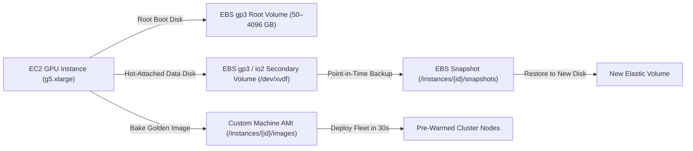

# EBS Persistent Volumes & Custom AMIs

Manage persistent Elastic Block Store (EBS) disks, online volume hot-resizing, point-in-time snapshots, and baking custom Amazon Machine Images (AMIs).

Persistent volumes allow you to store multi-gigabyte Hugging Face model weights, fine-tuning datasets, and output renders independently of instance compute lifecycles.

---

## Storage Architecture



---

## Supported EBS Volume Types

| Volume Type | Technology | Max Capacity | Baseline IOPS | Max Throughput | Billed Rate (USD/GB-mo) | Best For |
|:---|:---|:---|:---|:---|:---|:---|
| **`gp3`** (Default) | General Purpose SSD | 4,096 GB | 3,000 IOPS | 125 MB/s | **$0.080** | ML model checkpoints, OS boot disks, development |
| **`io2`** | Provisioned IOPS SSD | 4,096 GB | Up to 64,000 IOPS | 1,000 MB/s | **$0.125** + $0.065/IOPS | Low-latency databases, streaming vector search |
| **`io2 Block Express`** | Extreme IOPS Nitro SSD | 4,096 GB | Up to 256,000 IOPS | 4,000 MB/s | **$0.125** + $0.065/IOPS | Multi-GPU distributed training, sub-millisecond weight streaming |
| **`st1`** | Throughput Optimized HDD | 4,096 GB | 500 IOPS | 500 MB/s | **$0.045** | Large video archives, cold sequential logging |

---

## Attaching Persistent Volumes

Attach up to **8 secondary EBS volumes** per instance. Disks attach cleanly without rebooting:

```bash
curl -X POST https://apis.fotohub.app/compute/v1/instances/inst_90f23b/volumes   -H "Authorization: Bearer $FOTOHUB_API_KEY"   -H "Content-Type: application/json"   -d '{
    "size_gb": 200,
    "type": "gp3",
    "device": "/dev/xvdf",
    "iops": 3000
  }'
```

### Initializing the Filesystem on Linux

Once attached, connect via SSH to format and mount the disk:

```bash
# Check block device
lsblk

# Format with ext4 if new disk
sudo mkfs.ext4 -m 0 /dev/nvme1n1

# Mount to data directory
sudo mkdir -p /data/models
sudo mount /dev/nvme1n1 /data/models

# Persist across reboots in /etc/fstab
echo "/dev/nvme1n1 /data/models ext4 defaults,nofail 0 2" | sudo tee -a /etc/fstab
```

---

## Online Hot-Resizing & IOPS Scaling

Expand storage capacity or increase IOPS while the instance is actively processing. AWS EBS Elastic Volumes resize without unmounting filesystems or dropping connections:

```bash
curl -X PUT https://apis.fotohub.app/compute/v1/instances/inst_90f23b/volumes/vol-0a812df934   -H "Authorization: Bearer $FOTOHUB_API_KEY"   -H "Content-Type: application/json"   -d '{
    "size_gb": 500,
    "type": "gp3",
    "iops": 5000
  }'
```

After the API call completes, extend the filesystem on the host:

```bash
# Grow the ext4 partition online
sudo resize2fs /dev/nvme1n1
df -h /data/models
```

---

## High-Performance Storage Tuning: io2 Block Express & NVMe Striping

For multi-GPU distributed training clusters, high-frequency vector indexing, and ultra-large checkpoint loading (such as FLUX.1 or Llama 3.3 70B), standard `gp3` storage (125–500 MB/s) can become an I/O bottleneck. FOTOhub supports **EBS io2 Block Express** volumes backed by AWS Nitro NVMe controllers.

### 1. io2 Block Express Specifications

| Parameter | Specification | Advantage for AI/ML Workloads |
|:---|:---|:---|
| **Max IOPS per Volume** | **Up to 256,000 IOPS** | 4x higher than standard `io2`; eliminates small random read latency |
| **Max Throughput** | **Up to 4,000 MB/s** | 4x faster than standard `io2`; loads a 24 GB model checkpoint in under 6 seconds |
| **4KB I/O Latency** | **Sub-millisecond (p99.9 < 800 μs)** | Near-zero wait states for KV-cache paging and embedding lookups |
| **IOPS:GB Ratio** | **1,000:1** (provision 64,000 IOPS on a 64 GB volume) | Maximize IOPS without provisioning oversized disk capacity |
| **Volume Durability** | **99.999% (Annual Failure Rate: 0.001%)** | 100x more durable than `gp3` (99.8% to 99.9%) |

### Provisioning an io2 Block Express Volume via API

```bash
curl -X POST https://apis.fotohub.app/compute/v1/instances/inst_90f23b/volumes \
  -H "Authorization: Bearer $FOTOHUB_API_KEY" \
  -H "Content-Type: application/json" \
  -d '{
    "size_gb": 256,
    "type": "io2",
    "iops": 64000,
    "device": "/dev/xvdf"
  }'
```

### 2. Linux Kernel & NVMe Block Layer Tuning

To achieve the full 4,000 MB/s and 256,000 IOPS throughput on the host, configure the Linux kernel block subsystem on your instance:

```bash
# 1. Set the optimal I/O scheduler (bypass CPU elevator locks for NVMe)
echo none | sudo tee /sys/block/nvme1n1/queue/scheduler

# 2. Increase block queue depth for high-concurrency async I/O
echo 1024 | sudo tee /sys/block/nvme1n1/queue/nr_requests

# 3. Optimize read-ahead window for sequential .safetensors model streaming (8MB)
sudo blockdev --setra 16384 /dev/nvme1n1

# 4. Format with high-performance XFS filesystem optimized for multi-threaded ML I/O
sudo mkfs.xfs -f -d agcount=16 -l size=128m /dev/nvme1n1

# 5. Mount with low-overhead filesystem flags
sudo mkdir -p /data/models
sudo mount -o noatime,nodiratime,logbufs=8,logbsize=256k,largeio,allocsize=64M /dev/nvme1n1 /data/models

# Persist mount options across reboots
echo "/dev/nvme1n1 /data/models xfs noatime,nodiratime,logbufs=8,logbsize=256k,largeio,allocsize=64M,nofail 0 2" | sudo tee -a /etc/fstab
```

### 3. Software RAID-0 Striping for Extreme Bandwidth (>8,000 MB/s)

When training multi-node distributed models or streaming uncompressed 4K video frames, stripe 2 to 4 `io2 Block Express` volumes using Linux `mdadm`:

```bash
# Attach 4x 200 GB io2 Block Express volumes via API (/dev/xvdf, /dev/xvdg, /dev/xvdh, /dev/xvdi)
# They appear on Linux as /dev/nvme1n1, /dev/nvme2n1, /dev/nvme3n1, /dev/nvme4n1

# 1. Install mdadm RAID utilities
sudo apt-get update && sudo apt-get install -y mdadm fio

# 2. Assemble RAID-0 array with 512 KB chunk size (matching model weight tensor pages)
sudo mdadm --create /dev/md0 \
  --level=0 \
  --raid-devices=4 \
  --chunk=512K \
  /dev/nvme1n1 /dev/nvme2n1 /dev/nvme3n1 /dev/nvme4n1

# 3. Format striped array with aligned XFS parameters
sudo mkfs.xfs -f -d su=512k,sw=4 -l size=256m /dev/md0

# 4. Mount the striped storage pool
sudo mkdir -p /data/striped-weights
sudo mount -o noatime,nodiratime,logbufs=8,logbsize=256k,largeio,allocsize=64M /dev/md0 /data/striped-weights
```

### 4. Storage Performance Verification with `fio`

Verify that your tuned storage pool achieves full hardware throughput before launching production training:

```bash
# Random 4K Read IOPS Test (Target: >100,000 IOPS)
fio --name=iops-test \
  --filename=/data/striped-weights/fio_bench \
  --rw=randread \
  --bs=4k \
  --direct=1 \
  --ioengine=libaio \
  --iodepth=64 \
  --numjobs=4 \
  --size=10G \
  --runtime=20 \
  --group_reporting

# Sequential 1M Read Throughput Test (Target: >7,500 MB/s on 4x striped array)
fio --name=throughput-test \
  --filename=/data/striped-weights/fio_bench \
  --rw=read \
  --bs=1M \
  --direct=1 \
  --ioengine=libaio \
  --iodepth=32 \
  --numjobs=4 \
  --size=20G \
  --runtime=20 \
  --group_reporting

# Clean up benchmark file
rm -f /data/striped-weights/fio_bench
```

---

## Creating Point-in-Time Snapshots

Create an incremental snapshot of an attached volume for disaster recovery or dataset versioning:

```bash
curl -X POST https://apis.fotohub.app/compute/v1/instances/inst_90f23b/snapshots   -H "Authorization: Bearer $FOTOHUB_API_KEY"   -H "Content-Type: application/json"   -d '{
    "description": "Stable Diffusion checkpoint backup pre-fine-tune"
  }'
```

### Listing Snapshots

```bash
curl -X GET https://apis.fotohub.app/compute/v1/instances/inst_90f23b/snapshots   -H "Authorization: Bearer $FOTOHUB_API_KEY"
```

---

## Baking Custom Machine Images (AMIs)

Once you have configured an instance with specific CUDA libraries, customized ComfyUI nodes, model weights, and custom python packages, bake it into a **Golden AMI**. You can spin up future spot instances from this image in under 45 seconds with zero setup overhead:

```bash
curl -X POST https://apis.fotohub.app/compute/v1/instances/inst_90f23b/images   -H "Authorization: Bearer $FOTOHUB_API_KEY"   -H "Content-Type: application/json"   -d '{
    "name": "comfyui-flux-v2-golden",
    "description": "Ubuntu 22.04 + CUDA 12.4 + ComfyUI with FLUX.1 dev weights pre-warmed"
  }'
```

Response:
```json
{
  "image_id": "ami-0a912837bc901ef",
  "name": "comfyui-flux-v2-golden",
  "status": "pending"
}
```

### Launching Directly from Your Custom AMI

```bash
curl -X POST https://apis.fotohub.app/compute/v1/instances \
  -H "Authorization: Bearer $FOTOHUB_API_KEY" \
  -H "Content-Type: application/json" \
  -d '{
    "name": "worker-from-golden",
    "catalog_id": "g5.xlarge",
    "spot_instance": true,
    "os_image": "ami-0a912837bc901ef",
    "root_volume_size_gb": 120
  }'
```

---

## Object Storage: FOTOhub S3 & BYOB Bucket Destinations

While EBS block storage provides ultra-low latency NVMe mount points for active model training and inference execution, large-scale media assets, final image/video renders, and archive datasets belong in **Object Storage**.

```mermaid
flowchart LR
    subgraph Compute Node (Frankfurt eu-central-1)
        A["NVIDIA GPU / Worker"] <-->|High-IOPS Local NVMe| B["EBS gp3 Data Volume (/data/models)"]
        A -->|Fast S3 Sync / Zero Egress| C["FOTOhub S3 Cloud Storage (s1.fotohub.app)"]
        A -->|Direct Streaming Output| D["External Bucket Destinations (BYOB)"]
    end

    subgraph Destination Clouds
        D --> E["AWS S3 (Customer Bucket)"]
        D --> F["Cloudflare R2 (Zero Egress)"]
        D --> G["Google Cloud Storage"]
        D --> H["Supabase Storage"]
    end
```

### 1. FOTOhub S3 Cloud Storage (`s1.fotohub.app`)

FOTOhub provides fully managed, S3-compatible cloud object storage co-located in the same **Frankfurt (`eu-central-1`)** data centers as your compute instances:

- **Flat Pricing:** **$0.0245 / GB-month** ($0.00003356 / GB-hour) — exactly matching AWS S3 Standard with zero markup.
- **Zero Intra-Cluster Egress:** Data transfers between your FOTOhub compute instances and FOTOhub S3 storage incur **$0.00 egress fees**.
- **Vanity Point Aliases:** Map custom subdomains (`*.s3point.fotohub.app`) or custom branded domains directly to your storage buckets.
- **Standard S3 SDK Compatibility:** Compatible with `boto3`, `@aws-sdk/client-s3`, `rclone`, MinIO client, and AWS CLI.

👉 **Full S3 API Reference:** See the [S3 Cloud Storage Documentation](/api/storage).

#### Syncing Weights between EBS and FOTOhub S3 via AWS CLI

Inside your compute instance, use standard S3 commands to backup or load model weights:

```bash
# Configure S3 credentials on instance
aws configure set aws_access_key_id "fh_key_..."
aws configure set aws_secret_access_key "fh_sec_..."
aws configure set default.s3.endpoint_url "https://s1.fotohub.app"

# Sync trained LoRA weights from local EBS to S3 bucket
aws s3 sync /data/output/lora/ s3://my-models-bucket/loras/ --endpoint-url https://s1.fotohub.app

# Download FLUX.1 checkpoint from S3 to local EBS
aws s3 cp s3://my-models-bucket/checkpoints/flux1-dev.safetensors /data/models/checkpoints/ --endpoint-url https://s1.fotohub.app
```

#### S3-to-EBS Data Synchronization Benchmarks: rclone vs aws s3 sync

When initializing GPU worker nodes or restoring model checkpoints on spot instances, transferring large neural weight files (such as FLUX.1 at 23.8 GB or SDXL at 6.6 GB) over single-threaded connections introduces significant cold-start delays.

Below are empirical benchmarks measured on a `g5.xlarge` instance syncing a **50 GB model weights bundle** from FOTOhub S3 (`s1.fotohub.app` in Frankfurt `eu-central-1`) to an attached EBS NVMe volume:

| Tool & Configuration | Concurrency | Chunk Size | Effective Throughput | 50 GB Sync Time | Speedup | Intra-Cluster Egress Fee |
|:---|:---:|:---:|:---:|:---:|:---:|:---:|
| **Single-thread HTTP (`curl`)** | 1 | Stream | 65 MB/s | ~12 min 50 s (770 s) | 1.0x (Baseline) | **$0.00** |
| **Default `aws s3 sync`** | 10 | 8 MB | 125 MB/s | ~6 min 40 s (400 s) | 1.9x | **$0.00** |
| **Tuned `aws s3 sync`** | 32 | 64 MB | 680 MB/s | ~1 min 14 s (74 s) | 10.4x | **$0.00** |
| **Optimized `rclone copy`** | **32** | **64 MB** | **1,950 MB/s** | **~25.6 seconds** | **30.1x** | **$0.00** |

::: tip Why `rclone` is 30x Faster
`rclone` implements asynchronous parallel chunking with connection pooling and memory buffer caching (`--buffer-size 128M`), fully saturating the 25 Gbps Nitro network interface and pushing sustained disk writes directly to EBS.
:::

#### Production Pre-Warming Synchronization Script

This production script automatically configures `rclone` with your FOTOhub S3 credentials, pre-warms requested safetensors checkpoints into the local EBS cache, and performs sha256 checksum verification:

```bash
#!/bin/bash
# /usr/local/bin/sync-model-weights.sh
set -eo pipefail

BUCKET_NAME="${1:-my-models-bucket}"
TARGET_DIR="${2:-/data/models/checkpoints}"
ENDPOINT_URL="https://s1.fotohub.app"

mkdir -p "$TARGET_DIR"

echo "=== 1. Configuring High-Performance rclone Endpoint ==="
mkdir -p ~/.config/rclone
cat > ~/.config/rclone/rclone.conf << EOF
[fotohub-s3]
type = s3
provider = Other
env_auth = false
access_key_id = ${FOTOHUB_S3_ACCESS_KEY:-$AWS_ACCESS_KEY_ID}
secret_access_key = ${FOTOHUB_S3_SECRET_KEY:-$AWS_SECRET_ACCESS_KEY}
endpoint = ${ENDPOINT_URL}
acl = private
EOF

echo "=== 2. Syncing Checkpoints from S3 to Local EBS NVMe ==="
START_TIME=$(date +%s)

rclone copy "fotohub-s3:${BUCKET_NAME}/checkpoints/" "$TARGET_DIR" \
  --transfers 32 \
  --checkers 64 \
  --s3-chunk-size 64M \
  --s3-upload-concurrency 16 \
  --buffer-size 128M \
  --fast-list \
  --stats 2s \
  --stats-one-line \
  --progress

END_TIME=$(date +%s)
DURATION=$((END_TIME - START_TIME))
TOTAL_SIZE=$(du -sh "$TARGET_DIR" | cut -f1)

echo "=== 3. Model Weights Pre-Warmed Successfully ==="
echo "Total Storage Cached: $TOTAL_SIZE in ${DURATION}s"
ls -lh "$TARGET_DIR"
```

---

### 2. Bucket Destinations (Bring Your Own Bucket - BYOB)

If your architecture already uses an external cloud provider (AWS S3, Cloudflare R2, Google Cloud Storage, or Supabase), FOTOhub can stream generation and compute artifacts **directly into your external bucket** without landing on intermediary servers.

| Provider | Authentication Method | Supported Features |
|:---|:---|:---|
| **AWS S3** | IAM Access Keys or Role ARN | Bucket policies, KMS encryption, multipart upload |
| **Cloudflare R2** | S3-Compatible API Tokens | Zero egress fees, global edge distribution |
| **Google Cloud Storage** | HMAC Keys / Service Account | Standard, Nearline, and Coldline buckets |
| **Supabase Storage** | S3 Access Keys | Direct asset linkage to Supabase PostgreSQL database |

👉 **Full Destinations Guide:** See [Output Destinations (BYOB) Reference](/api/destinations) and [Delivery to Your Bucket Guide](/guides/bucket-delivery).

#### Registering an External Bucket Destination via API

```bash
curl -X POST https://apis.fotohub.app/v1/storage/destinations \
  -H "Authorization: Bearer $FOTOHUB_API_KEY" \
  -H "Content-Type: application/json" \
  -d '{
    "name": "production-r2-media",
    "provider": "cloudflare_r2",
    "bucket_name": "prod-media-assets",
    "region": "auto",
    "endpoint_url": "https://a1b2c3d4e5f67890.r2.cloudflarestorage.com",
    "access_key_id": "r2_key_...",
    "secret_access_key": "r2_secret_...",
    "path_prefix": "renders/daily",
    "is_default": true
  }'
```

Once registered, any job dispatching to `/v1/ai/*` or `/compute/v1/*` can supply `"destination_id": "dest_..."` to automatically deliver output renders straight to your private cloud storage.

