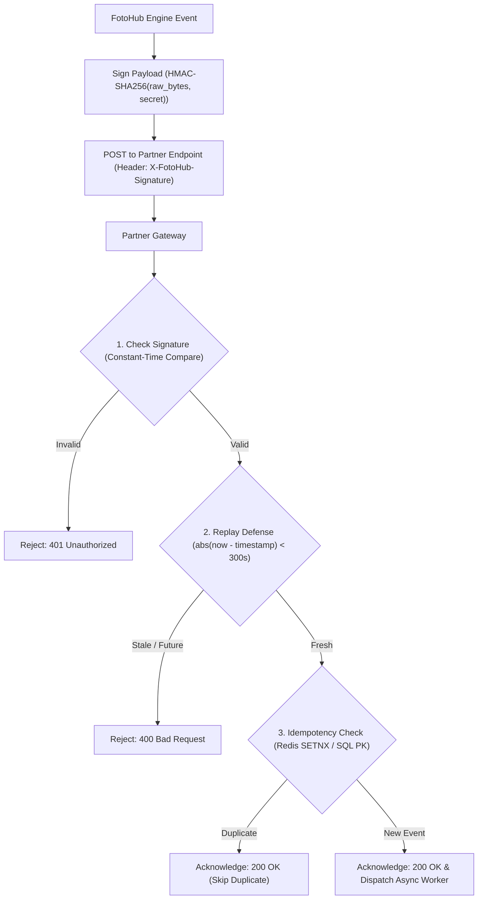

# Webhook Integration & Verification Guide

Build robust, real-time event-driven integrations that react to FOTOhub events without polling.

All webhook deliveries include an `X-FotoHub-Signature` header computed as an HMAC-SHA256 hex digest of the raw request payload.

---

## Security Architecture



---

## Production Verification Code Samples

::: code-group

```python [Python (FastAPI)]
import hmac
import hashlib
from datetime import datetime, timezone
from fastapi import FastAPI, Request, HTTPException, status
from pydantic import BaseModel

app = FastAPI()
WEBHOOK_SECRET = "whsec_your_secret_from_console"
MAX_SKEW_SECONDS = 300  # 5-minute replay defense window

class WebhookPayload(BaseModel):
    event: str
    timestamp: str
    attempt: int
    data: dict

def verify_signature(raw_body: bytes, signature_header: str) -> bool:
    if not signature_header:
        return False
    expected = hmac.new(
        WEBHOOK_SECRET.encode("utf-8"),
        raw_body,
        hashlib.sha256
    ).hexdigest()
    return hmac.compare_digest(signature_header, expected)

@app.post("/webhooks/fotohub")
async def handle_webhook(request: Request):
    # Step 1: Read raw body bytes BEFORE JSON parsing
    raw_body = await request.body()
    signature = request.headers.get("X-FotoHub-Signature", "")

    # Step 2: Constant-time signature verification
    if not verify_signature(raw_body, signature):
        raise HTTPException(
            status_code=status.HTTP_401_UNAUTHORIZED,
            detail="Invalid signature"
        )

    # Step 3: Parse JSON payload
    payload = await request.json()
    event_timestamp_str = payload.get("timestamp")
    
    # Step 4: Replay attack defense
    try:
        event_time = datetime.fromisoformat(event_timestamp_str.replace("Z", "+00:00"))
        now = datetime.now(timezone.utc)
        if abs((now - event_time).total_seconds()) > MAX_SKEW_SECONDS:
            raise HTTPException(
                status_code=status.HTTP_400_BAD_REQUEST,
                detail="Request timestamp outside 300s tolerance window"
            )
    except (ValueError, TypeError):
        raise HTTPException(status_code=400, detail="Invalid timestamp format")

    # Step 5: Process event asynchronously (or push to queue)
    event_type = payload.get("event")
    data = payload.get("data")
    print(f"Verified event {event_type} (attempt {payload.get('attempt')})")

    return {"received": True}
```

```typescript [TypeScript (Express)]
import express, { Request, Response } from "express";
import crypto from "crypto";

const app = express();
const WEBHOOK_SECRET = "whsec_your_secret_from_console";
const MAX_SKEW_SECONDS = 300;

// IMPORTANT: capture raw body Buffer for HMAC verification
app.use("/webhooks/fotohub", express.raw({ type: "application/json" }));

app.post("/webhooks/fotohub", (req: Request, res: Response) => {
  const signature = req.headers["x-fotohub-signature"] as string;
  const rawBody = req.body as Buffer;

  if (!signature || !rawBody) {
    return res.status(401).json({ error: "Missing signature or body" });
  }

  // 1. Calculate HMAC-SHA256
  const expectedSignature = crypto
    .createHmac("sha256", WEBHOOK_SECRET)
    .update(rawBody)
    .digest("hex");

  // 2. Constant-time comparison
  const isValid =
    signature.length === expectedSignature.length &&
    crypto.timingSafeEqual(
      Buffer.from(signature, "utf-8"),
      Buffer.from(expectedSignature, "utf-8")
    );

  if (!isValid) {
    return res.status(401).json({ error: "Invalid signature" });
  }

  const payload = JSON.parse(rawBody.toString("utf-8"));

  // 3. Replay attack defense
  const eventTime = new Date(payload.timestamp).getTime();
  const now = Date.now();
  if (Math.abs(now - eventTime) > MAX_SKEW_SECONDS * 1000) {
    return res.status(400).json({ error: "Timestamp skew exceeds 300s window" });
  }

  // 4. Return 200 immediately
  res.status(200).json({ received: true });
});

app.listen(3000, () => console.log("Webhook server listening on :3000"));
```

```typescript [TypeScript (Next.js App Router)]
// app/api/webhooks/fotohub/route.ts
import { NextRequest, NextResponse } from "next/server";

const WEBHOOK_SECRET = process.env.FOTOHUB_WEBHOOK_SECRET!;
const MAX_SKEW_MS = 300 * 1000;

export async function POST(req: NextRequest) {
  const rawBody = await req.text();
  const signature = req.headers.get("x-fotohub-signature");

  if (!signature) {
    return NextResponse.json({ error: "Missing signature" }, { status: 401 });
  }

  // Verify using Web Crypto API (Edge-compatible)
  const encoder = new TextEncoder();
  const key = await crypto.subtle.importKey(
    "raw",
    encoder.encode(WEBHOOK_SECRET),
    { name: "HMAC", hash: "SHA-256" },
    false,
    ["sign"]
  );

  const calculatedSigBuffer = await crypto.subtle.sign(
    "HMAC",
    key,
    encoder.encode(rawBody)
  );

  const calculatedHex = Array.from(new Uint8Array(calculatedSigBuffer))
    .map((b) => b.toString(16).padStart(2, "0"))
    .join("");

  // Timing safe equality
  if (calculatedHex !== signature) {
    return NextResponse.json({ error: "Invalid signature" }, { status: 401 });
  }

  const payload = JSON.parse(rawBody);

  // Timestamp replay defense
  const eventTime = new Date(payload.timestamp).getTime();
  if (Math.abs(Date.now() - eventTime) > MAX_SKEW_MS) {
    return NextResponse.json({ error: "Expired timestamp" }, { status: 400 });
  }

  return NextResponse.json({ received: true });
}
```

```go [Go]
package main

import (
	"crypto/hmac"
	"crypto/sha256"
	"encoding/hex"
	"encoding/json"
	"io"
	"math"
	"net/http"
	"time"
)

const webhookSecret = "whsec_your_secret_from_console"
const maxSkewSeconds = 300.0

type WebhookEnvelope struct {
	Event     string                 `json:"event"`
	Timestamp string                 `json:"timestamp"`
	Attempt   int                    `json:"attempt"`
	Data      map[string]interface{} `json:"data"`
}

func verifySignature(rawBody []byte, signature string) bool {
	mac := hmac.New(sha256.New, []byte(webhookSecret))
	mac.Write(rawBody)
	expected := hex.EncodeToString(mac.Sum(nil))
	return hmac.Equal([]byte(signature), []byte(expected))
}

func webhookHandler(w http.ResponseWriter, r *http.Request) {
	rawBody, err := io.ReadAll(r.Body)
	if err != nil {
		http.Error(w, "Bad request", http.StatusBadRequest)
		return
	}

	sig := r.Header.Get("X-FotoHub-Signature")
	if !verifySignature(rawBody, sig) {
		http.Error(w, "Invalid signature", http.StatusUnauthorized)
		return
	}

	var env WebhookEnvelope
	if err := json.Unmarshal(rawBody, &env); err != nil {
		http.Error(w, "Invalid JSON", http.StatusBadRequest)
		return
	}

	// Replay defense
	t, err := time.Parse(time.RFC3339, env.Timestamp)
	if err != nil || math.Abs(time.Since(t).Seconds()) > maxSkewSeconds {
		http.Error(w, "Timestamp outside 300s window", http.StatusBadRequest)
		return
	}

	w.WriteHeader(http.StatusOK)
	w.Write([]byte(`{"received":true}`))
}

func main() {
	http.HandleFunc("/webhooks/fotohub", webhookHandler)
	http.ListenAndServe(":3000", nil)
}
```

```bash [cURL]
# Test webhook endpoint locally with generated HMAC-SHA256 signature
SECRET="whsec_your_secret_from_console"
PAYLOAD='{"event":"generation.completed","timestamp":"'$(date -u +"%Y-%m-%dT%H:%M:%SZ")'","attempt":1,"data":{"job_id":"job_123"}}'

SIGNATURE=$(echo -n "$PAYLOAD" | openssl dgst -sha256 -hmac "$SECRET" | sed 's/^.* //')

curl -X POST http://localhost:3000/webhooks/fotohub \
  -H "Content-Type: application/json" \
  -H "X-FotoHub-Signature: $SIGNATURE" \
  -d "$PAYLOAD"
```

:::

---

## Idempotency Implementation

Webhooks may be retried across network interruptions. Always guarantee single-processing semantics using atomic locks or database constraints.

### Pattern 1: Redis `SETNX` (Recommended for high volume)

```python
import redis

r = redis.Redis(host="localhost", port=6379, db=0)

def is_duplicate_event(event_type: str, entity_id: str) -> bool:
    key = f"fotohub:webhook:{event_type}:{entity_id}"
    # Atomically sets the key only if it does not exist (24-hour TTL)
    is_new = r.set(key, "processed", nx=True, ex=86400)
    return not is_new
```

### Pattern 2: SQL Unique Constraint (Recommended for ACID pipelines)

```sql
CREATE TABLE processed_webhooks (
    event_id text PRIMARY KEY,
    event_type text NOT NULL,
    processed_at timestamptz DEFAULT now()
);

-- When processing:
INSERT INTO processed_webhooks (event_id, event_type)
VALUES ('shorts.clip.rendered:clip_3821a9ef', 'shorts.clip.rendered')
ON CONFLICT (event_id) DO NOTHING;
-- Check affected rows: if 0, skip downstream processing.
```

---

## Retry Schedules & Delivery Guarantees

FOTOhub delivers webhooks with automatic exponential backoff:

| Attempt | Backoff Delay | Cumulative Time | Outcome on Failure |
|:---|:---|:---|:---|
| **Attempt 1** | Immediate | 0s | Retry if 5xx or connection timeout |
| **Attempt 2** | 1 second | +1s | Retry if 5xx or connection timeout |
| **Attempt 3** | 4 seconds | +5s | Marked as failed in delivery log |

> [!IMPORTANT]
> **HTTP 4xx Non-Retry Policy**: If your endpoint returns an HTTP 4xx status code (e.g. 401 Unauthorized or 400 Bad Request), delivery fails immediately and will **not** be retried. Only 5xx server errors and network timeouts trigger retries.

### Querying Dead-Letter Logs

If an endpoint is unreachable during a generation, you can query delivery logs via the API to inspect response codes and payload contents. This returns the last 50 attempts (no server-side filtering — filter on the `success` field client-side):

```bash
curl -X GET "https://apis.fotohub.app/v1/console/webhooks/wh_98a12bc/logs" \
  -H "Authorization: Bearer $FOTOHUB_API_KEY"
```
