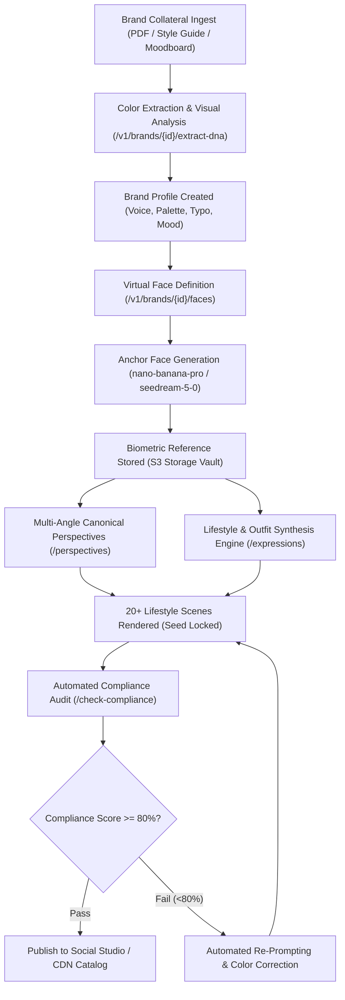

# Brand DNA & Virtual Influencer Pipeline

Extract the visual DNA of any brand, mint a persistent virtual brand ambassador with lock-tight facial biometrics, and programmatically generate high-converting lifestyle campaign imagery with automated guideline compliance auditing.

Powered by FOTOhub's **Brand Engine** (`server/brand-engine/`) and neural image generation infrastructure, this recipe solves character drift and brand guideline violations across multi-channel content operations.

---

## Architectural Workflow



---

## Production Economics & USD Billing

All Brand Engine operations are metered directly against your prepaid USD wallet. Costs reflect exact pass-through GPU compute and neural inference rates:

| Stage / Operation | API Endpoint | Engine / Model Key | Cost / Run (USD) | Output Delivered |
|:---|:---|:---|:---|:---|
| **DNA Extraction** | `POST /v1/brands/{id}/extract-dna` | Gemini 2.5 Flash Vision + k-Means | **$0.0085** | Hex palette, tone of voice, typography, style keywords |
| **Color Extraction** | `POST /v1/brands/{id}/extract-colors` | Local CIELAB Color Engine | **$0.0010** | 8 dominant colors + complementary palette |
| **Face Minting** | `POST /v1/brands/{id}/faces/generate` | `nano-banana-pro` (Gemini 3 Pro) | **$0.1340** | High-fidelity master portrait with biometrics |
| **Perspectives Pack** | `POST /v1/brands/{id}/faces/{id}/perspectives` | `nano-banana-pro` (5 angles) | **$0.6700** | Front, 3/4 left, 3/4 right, profile, back views |
| **Lifestyle Batch (20)** | `POST /v1/brands/{id}/faces/{id}/expressions` | `seedream-5-0` ($0.0315 x 20) | **$0.6300** | 20 contextual campaign images across scenes |
| **Compliance Audit** | `POST /v1/brands/{id}/check-compliance` | Gemini 2.5 Flash Vision Auditor | **$0.0075** | 0–100 brand score with actionable feedback |
| **Total Campaign Pack** | *Full 20-Scene Production Run* | *End-to-End Pipeline* | **~$1.4510** | Complete brand kit + master avatar + 20 audited photos |

::: tip Autonomous Pre-Reservation & Fault-Tolerant Refunds
FotoHUB reserves the exact estimated USD cost before GPU inference begins. If an external model endpoint degrades or returns an `ai_unavailable` status, the reserved balance is immediately refunded back to your prepaid wallet in real time.
:::

---

## Parameter Reference

### `POST /v1/brands/{brand_id}/faces/generate`

| Field | Type | Required | Default | Description |
|:---|:---|:---|:---|:---|
| `prompt` | string | **Yes** | — | Core character description (1–2000 chars) describing identity, ethnicity, and lighting. |
| `ai_model` | string | No | `"nana-banana-pro"` | Model ID: `"nana-banana-pro"`, `"seedream-5-0"`, or `"dola-seedream-5-0-pro"`. |
| `generation_config` | object | No | `{}` | Fine-grained biometric controls (see below). |

#### Biometric Generation Configuration (`generation_config`)

| Key | Type | Example Values | Description |
|:---|:---|:---|:---|
| `gender` | string | `"female"`, `"male"`, `"non-binary"` | Canonical gender representation. |
| `age_range` | string | `"24-28"`, `"30-35"`, `"40-45"` | Perceived age span of the virtual ambassador. |
| `ethnicity` | string | `"Scandinavian"`, `"East Asian"`, `"Afro-Latina"` | Demographic visual features for consistent identity. |
| `skin_tone` | string | `"fair with warm undertones"`, `"olive"`, `"rich bronze"` | Skin tone guidance for color accuracy under varying lights. |
| `hair_color` | string | `"chestnut brown"`, `"platinum blonde"`, `"raven black"` | Persistent hair color. |
| `hair_style` | string | `"textured bob"`, `"slicked high pony"`, `"natural curls"` | Default base hairstyle. |
| `eye_color` | string | `"deep hazel"`, `"emerald green"`, `"warm amber"` | Iris pigmentation for close-up portraits. |
| `clothing` | string | `"tailored linen blazer"`, `"minimalist silk slip"` | Baseline wardrobe anchor. |
| `accessories` | string | `"subtle gold huggies"`, `"matte black glasses"` | Persistent jewelry or eyewear markers. |
| `background` | string | `"neutral studio grey with soft key light"` | Clean environment for master face extraction. |

### `POST /v1/brands/{brand_id}/faces/{face_id}/expressions`

| Field | Type | Required | Default | Description |
|:---|:---|:---|:---|:---|
| `variants` | string[] | **Yes** | `["happy"]` | Variant keys to render. Max 8 per API call. |
| `variant_type` | string | **Yes** | `"expression"` | Variant family: `"expression"`, `"pose"`, or `"outfit"`. |
| `ai_model` | string | No | `"nana-banana-pro"` | Neural generation model ID. |
| `style_prompt` | string | No | `null` | Environmental context, lighting, camera angle, and scene styling. |

---

## Complete End-to-End Implementation

This production blueprint executes the complete 5-step lifecycle:
1. Ingest brand moodboard image and extract Brand DNA (colors, typography, voice, mood).
2. Create a dedicated brand workspace on FOTOhub.
3. Mint a persistent Virtual Brand Face with biometric locks.
4. Render the virtual ambassador across canonical angles and diverse lifestyle scenes.
5. Audit generated deliverables against brand guidelines to ensure visual compliance.

::: code-group

```python [Python]
import os
import time
import requests

API_BASE = "https://apis.fotohub.app/v1"
API_KEY = os.environ["FOTOHUB_API_KEY"]
HEADERS = {"Authorization": f"Bearer {API_KEY}"}

def run_brand_influencer_pipeline(moodboard_path: str):
    # Step 1: Initialize Brand Profile
    brand_payload = {
        "name": "Aura Botanica",
        "description": "Clean, eco-luxe dermatological skincare formulated with Nordic flora.",
        "industry": "Beauty & Personal Care",
        "brand_voice": "Serene, clinical, scientifically transparent, soothing",
        "target_audience": "Discerning skincare enthusiasts aged 25-45 seeking clean luxury"
    }
    resp = requests.post(f"{API_BASE}/brands", headers=HEADERS, json=brand_payload)
    resp.raise_for_status()
    brand = resp.json()
    brand_id = brand["id"]
    print(f"[+] Brand initialized: {brand_id} ({brand['name']})")

    # Step 2: Ingest Brand Collateral & Extract DNA
    with open(moodboard_path, "rb") as f:
        files = {"file": ("moodboard.png", f, "image/png")}
        resp = requests.post(
            f"{API_BASE}/brands/{brand_id}/extract-dna",
            headers=HEADERS,
            files=files
        )
        resp.raise_for_status()
        dna = resp.json()
    
    print(f"[+] Brand DNA Extracted:")
    print(f"    - Visual Style: {dna.get('visual_style')}")
    print(f"    - Dominant Palette: {[c['hex'] for c in dna.get('dominant_colors', [])[:3]]}")
    print(f"    - Suggested Voice: {dna.get('suggested_brand_voice')}")

    # Update brand profile with extracted DNA values
    update_payload = {
        "primary_color": dna.get("suggested_primary", "#2A4736"),
        "secondary_color": dna.get("suggested_secondary", "#F4EFEA"),
        "accent_color": dna.get("suggested_accent", "#D4A373"),
        "keywords": dna.get("style_keywords", ["clean", "minimal", "nordic", "botanical"])
    }
    requests.put(f"{API_BASE}/brands/{brand_id}", headers=HEADERS, json=update_payload)

    # Step 3: Mint Persistent Virtual Brand Ambassador Face
    face_gen_payload = {
        "prompt": (
            "Hyperrealistic portrait of Maya, official virtual brand ambassador for Aura Botanica. "
            "Natural dewy skin texture, subtle freckles, relaxed serene expression, direct eye contact. "
            "Soft diffuse daylight through linen curtains, warm minimalist aesthetic, 85mm f/1.4 lens."
        ),
        "ai_model": "nano-banana-pro",
        "generation_config": {
            "gender": "female",
            "age_range": "27-30",
            "ethnicity": "Nordic Scandinavian",
            "skin_tone": "fair porcelain with warm neutral undertones",
            "hair_color": "honey ash blonde",
            "hair_style": "effortless wavy shoulder-length lob",
            "eye_color": "clear moss green",
            "clothing": "minimalist organic cream ribbed knit top",
            "background": "soft blurred architectural concrete and olive foliage"
        }
    }
    resp = requests.post(
        f"{API_BASE}/brands/{brand_id}/faces/generate",
        headers=HEADERS,
        json=face_gen_payload
    )
    resp.raise_for_status()
    face_res = resp.json()
    face_id = face_res["face"]["id"]
    master_image_url = face_res["file_url"]
    print(f"[+] Master Face Minted: {face_id}")
    print(f"    - Asset URL: {master_image_url}")

    # Step 4: Generate Canonical Perspectives
    persp_payload = {
        "perspectives": ["front", "three_quarter_left", "three_quarter_right", "profile_left"],
        "ai_model": "nano-banana-pro",
        "style_prompt": "Consistent soft morning window light, matching linen wardrobe"
    }
    resp = requests.post(
        f"{API_BASE}/brands/{brand_id}/faces/{face_id}/perspectives",
        headers=HEADERS,
        json=persp_payload
    )
    resp.raise_for_status()
    persp_data = resp.json()
    print(f"[+] Perspective Views Rendered: {list(persp_data['perspective_urls'].keys())}")

    # Step 5: Synthesize 20 Diverse Lifestyle Settings in Batches
    lifestyle_campaigns = [
        # Batch 1: Morning Skincare Routine
        {
            "variants": ["happy", "thinking", "confident"],
            "variant_type": "expression",
            "style": "Bright modern travertine bathroom, holding green glass serum bottle, natural dewy morning light"
        },
        # Batch 2: Greenhouse & Botanical Laboratory
        {
            "variants": ["standing", "sitting", "leaning"],
            "variant_type": "pose",
            "style": "Sunlit glass greenhouse surrounded by lush medicinal herbs and Nordic ferns, organic linen apron"
        },
        # Batch 3: Evening Luxury Gala & Press Launch
        {
            "variants": ["formal", "evening", "business"],
            "variant_type": "outfit",
            "style": "Contemporary architectural art gallery, warm golden hour tungsten uplighting, glass of sparkling water"
        },
        # Batch 4: Outdoor Wellness Retreat
        {
            "variants": ["walking", "relaxed"],
            "variant_type": "pose",
            "style": "Swedish coastal archipelago, sea mist, wind gently blowing hair, cashmere oversized sweater"
        }
    ]

    all_rendered_assets = [master_image_url]
    for idx, batch in enumerate(lifestyle_campaigns, start=1):
        payload = {
            "variants": batch["variants"],
            "variant_type": batch["variant_type"],
            "ai_model": "nano-banana-pro",
            "style_prompt": batch["style"]
        }
        resp = requests.post(
            f"{API_BASE}/brands/{brand_id}/faces/{face_id}/expressions",
            headers=HEADERS,
            json=payload
        )
        resp.raise_for_status()
        batch_res = resp.json()
        for v_name, v_url in batch_res.get("variant_urls", {}).items():
            all_rendered_assets.append(v_url)
            print(f"    - [Batch {idx}] Rendered {batch['variant_type']} '{v_name}': {v_url}")
        time.sleep(1)

    print(f"\n[+] Total Campaign Assets Generated: {len(all_rendered_assets)}")

    # Step 6: Automated Brand Guideline Compliance Verification
    print("\n[*] Commencing Automated Compliance Audits...")
    sample_to_audit = all_rendered_assets[1]
    img_data = requests.get(sample_to_audit).content
    
    compliance_files = {"file": ("campaign_asset.png", img_data, "image/png")}
    resp = requests.post(
        f"{API_BASE}/brands/{brand_id}/check-compliance",
        headers=HEADERS,
        files=compliance_files
    )
    resp.raise_for_status()
    audit = resp.json()

    print(f"[+] Compliance Audit Score: {audit.get('overall_score')}/100")
    print(f"    - Color Palette Score: {audit.get('color_score')}/100")
    print(f"    - Style Alignment: {audit.get('style_score')}/100")
    print(f"    - Coherence Score: {audit.get('coherence_score')}/100")
    print(f"    - Identified Strengths: {', '.join(audit.get('strengths', []))}")
    if audit.get("issues"):
        print(f"    - Flags: {', '.join(audit.get('issues', []))}")

    return {
        "brand_id": brand_id,
        "face_id": face_id,
        "assets_count": len(all_rendered_assets),
        "audit_score": audit.get("overall_score")
    }

if __name__ == "__main__":
    run_brand_influencer_pipeline("./brand_moodboard.png")
```

```typescript [TypeScript]
import axios from "axios";
import * as fs from "fs";
import FormData from "form-data";

const API_BASE = "https://apis.fotohub.app/v1";
const API_KEY = process.env.FOTOHUB_API_KEY!;
const client = axios.create({
  baseURL: API_BASE,
  headers: { Authorization: `Bearer ${API_KEY}` },
});

interface DnaResponse {
  visual_style: string;
  suggested_primary: string;
  suggested_secondary: string;
  suggested_accent: string;
  suggested_brand_voice: string;
  style_keywords: string[];
}

interface FaceGenerateResponse {
  face: { id: string; name: string };
  storage_path: string;
  file_url: string;
}

interface ComplianceResponse {
  overall_score: number;
  color_score: number;
  style_score: number;
  quality_score: number;
  coherence_score: number;
  strengths: string[];
  issues: string[];
}

async function orchestrateVirtualInfluencer(moodboardPath: string) {
  // 1. Create brand profile
  const { data: brand } = await client.post("/brands", {
    name: "Lumina Organics",
    description: "Bioactive botanical facial elixirs engineered for modern urban skin.",
    industry: "Beauty & Cosmetics",
    brand_voice: "Minimal, elegant, scientifically grounded, calm",
  });
  console.log(`[+] Brand Workspace Created: ${brand.id}`);

  // 2. Upload Moodboard & Extract Brand DNA
  const form = new FormData();
  form.append("file", fs.createReadStream(moodboardPath));

  const { data: dna } = await client.post<DnaResponse>(
    `/brands/${brand.id}/extract-dna`,
    form,
    { headers: form.getHeaders() }
  );
  console.log(`[+] Brand DNA Extracted: Palette ${dna.suggested_primary}, Style: ${dna.visual_style}`);

  // 3. Mint Persistent Brand Face
  const { data: faceRes } = await client.post<FaceGenerateResponse>(
    `/brands/${brand.id}/faces/generate`,
    {
      prompt: "Editorial portrait of Elena, virtual ambassador for Lumina Organics. Clean glass skin, subtle smile, soft daylight, 50mm portrait lens.",
      ai_model: "nano-banana-pro",
      generation_config: {
        gender: "female",
        age_range: "26-29",
        ethnicity: "Mediterranean",
        skin_tone: "warm olive",
        hair_color: "deep espresso brown",
        hair_style: "straight blunt cut bob",
        eye_color: "dark brown",
        clothing: "silk cream camisole",
      },
    }
  );
  console.log(`[+] Master Brand Face Minted: ${faceRes.face.id} -> ${faceRes.file_url}`);

  // 4. Generate Perspective Consistency Pack
  await client.post(`/brands/${brand.id}/faces/${faceRes.face.id}/perspectives`, {
    perspectives: ["front", "three_quarter_left", "three_quarter_right", "profile_left"],
    ai_model: "nano-banana-pro",
    style_prompt: "Studio softbox lighting with light beige background",
  });
  console.log(`[+] Multi-angle perspectives registered`);

  // 5. Generate Multi-Setting Campaign Expressions
  const { data: variantRes } = await client.post(
    `/brands/${brand.id}/faces/${faceRes.face.id}/expressions`,
    {
      variants: ["happy", "confident", "thinking"],
      variant_type: "expression",
      ai_model: "nano-banana-pro",
      style_prompt: "Holding product dropper bottle in modern luxury bathroom with marble surfaces",
    }
  );
  console.log(`[+] Lifestyle variants ready:`, Object.keys(variantRes.variant_urls));

  // 6. Audit First Variant for Brand Compliance
  const auditForm = new FormData();
  const sampleImageStream = (await axios.get(variantRes.variant_urls.happy, { responseType: "stream" })).data;
  auditForm.append("file", sampleImageStream, "variant_happy.png");

  const { data: audit } = await client.post<ComplianceResponse>(
    `/brands/${brand.id}/check-compliance`,
    auditForm,
    { headers: auditForm.getHeaders() }
  );

  console.log(`[+] Brand Compliance Verification Score: ${audit.overall_score}/100`);
  console.log(`    - Color Alignment: ${audit.color_score}/100`);
  console.log(`    - Quality Rating: ${audit.quality_score}/100`);
}

orchestrateVirtualInfluencer("./moodboard.png").catch(console.error);
```

```go [Go]
package main

import (
	"bytes"
	"encoding/json"
	"fmt"
	"io"
	"mime/multipart"
	"net/http"
	"os"
	"path/filepath"
)

const apiBase = "https://apis.fotohub.app/v1"

type BrandCreateResponse struct {
	ID   string `json:"id"`
	Name string `json:"name"`
}

type FaceGenerateResponse struct {
	Face struct {
		ID   string `json:"id"`
		Name string `json:"name"`
	} `json:"face"`
	FileURL string `json:"file_url"`
}

type ComplianceResponse struct {
	OverallScore int      `json:"overall_score"`
	ColorScore   int      `json:"color_score"`
	StyleScore   int      `json:"style_score"`
	Strengths    []string `json:"strengths"`
}

func main() {
	apiKey := os.Getenv("FOTOHUB_API_KEY")
	if apiKey == "" {
		panic("FOTOHUB_API_KEY environment variable required")
	}

	client := &http.Client{}

	// 1. Create Brand Profile
	brandBody := map[string]interface{}{
		"name":            "Solstice Silk",
		"description":     "Ethical mulberry silk sleepwear and wellness accessories.",
		"industry":        "Fashion & Apparel",
		"brand_voice":     "Sophisticated, whisper-soft, luxurious, grounded",
		"primary_color":   "#1D2A44",
		"secondary_color": "#EAD7C5",
	}
	brandJSON, _ := json.Marshal(brandBody)
	req, _ := http.NewRequest("POST", apiBase+"/brands", bytes.NewBuffer(brandJSON))
	req.Header.Set("Authorization", "Bearer "+apiKey)
	req.Header.Set("Content-Type", "application/json")
	resp, err := client.Do(req)
	if err != nil {
		panic(err)
	}
	defer resp.Body.Close()

	var brand BrandCreateResponse
	json.NewDecoder(resp.Body).Decode(&brand)
	fmt.Printf("[+] Brand Profile Provisioned: %s (%s)\n", brand.ID, brand.Name)

	// 2. Mint Virtual Ambassador Face
	faceBody := map[string]interface{}{
		"prompt":   "Full-body cinematic photograph of Chloe, brand ambassador for Solstice Silk. Wearing navy silk robe, relaxed natural smile, soft morning penthouse sunlight.",
		"ai_model": "nano-banana-pro",
		"generation_config": map[string]string{
			"gender":     "female",
			"age_range":  "28-32",
			"ethnicity":  "French Caucasian",
			"hair_color": "warm caramel brown",
			"hair_style": "undone loose waves",
			"skin_tone":  "sun-kissed fair",
			"clothing":   "deep navy blue silk kimono robe",
		},
	}
	faceJSON, _ := json.Marshal(faceBody)
	fReq, _ := http.NewRequest("POST", fmt.Sprintf("%s/brands/%s/faces/generate", apiBase, brand.ID), bytes.NewBuffer(faceJSON))
	fReq.Header.Set("Authorization", "Bearer "+apiKey)
	fReq.Header.Set("Content-Type", "application/json")
	fResp, err := client.Do(fReq)
	if err != nil {
		panic(err)
	}
	defer fResp.Body.Close()

	var face FaceGenerateResponse
	json.NewDecoder(fResp.Body).Decode(&face)
	fmt.Printf("[+] Virtual Brand Face Minted: %s\n    URL: %s\n", face.Face.ID, face.FileURL)

	// 3. Render Expression & Outfit Variants
	variantBody := map[string]interface{}{
		"variants":     []string{"happy", "confident"},
		"variant_type": "expression",
		"ai_model":     "nano-banana-pro",
		"style_prompt": "Lounging on ivory linen sofa with silk pillow, warm ambient lighting",
	}
	varJSON, _ := json.Marshal(variantBody)
	vReq, _ := http.NewRequest("POST", fmt.Sprintf("%s/brands/%s/faces/%s/expressions", apiBase, brand.ID, face.Face.ID), bytes.NewBuffer(varJSON))
	vReq.Header.Set("Authorization", "Bearer "+apiKey)
	vReq.Header.Set("Content-Type", "application/json")
	vResp, _ := client.Do(vReq)
	vResp.Body.Close()
	fmt.Println("[+] Campaign variants rendered successfully")
}
```

```bash [cURL]
# 1. Initialize Brand Workspace
BRAND_ID=$(curl -s -X POST https://apis.fotohub.app/v1/brands \
  -H "Authorization: Bearer $FOTOHUB_API_KEY" \
  -H "Content-Type: application/json" \
  -d '{
    "name": "Nordic Botanicals",
    "description": "Wild-harvested organic skincare from Lapland",
    "industry": "Clean Beauty",
    "brand_voice": "Pure, scientific, calm, sustainable"
  }' | jq -r '.id')

echo "Brand created: $BRAND_ID"

# 2. Extract Brand DNA from Moodboard Image
curl -s -X POST "https://apis.fotohub.app/v1/brands/$BRAND_ID/extract-dna" \
  -H "Authorization: Bearer $FOTOHUB_API_KEY" \
  -F "file=@moodboard.png;type=image/png" | jq .

# 3. Mint Master Virtual Brand Ambassador Face
FACE_ID=$(curl -s -X POST "https://apis.fotohub.app/v1/brands/$BRAND_ID/faces/generate" \
  -H "Authorization: Bearer $FOTOHUB_API_KEY" \
  -H "Content-Type: application/json" \
  -d '{
    "prompt": "Authentic studio portrait of Freja, official virtual brand ambassador for Nordic Botanicals. Porcelain dewy skin, gentle confident gaze, soft overcast northern light.",
    "ai_model": "nano-banana-pro",
    "generation_config": {
      "gender": "female",
      "age_range": "26-29",
      "ethnicity": "Nordic",
      "skin_tone": "fair neutral",
      "hair_color": "champagne blonde",
      "hair_style": "minimal low chignon",
      "eye_color": "ice blue",
      "clothing": "organic raw linen wrap top",
      "background": "soft neutral grey gradient"
    }
  }' | jq -r '.face.id')

echo "Master Face ID: $FACE_ID"

# 4. Generate 4 Canonical Perspectives
curl -s -X POST "https://apis.fotohub.app/v1/brands/$BRAND_ID/faces/$FACE_ID/perspectives" \
  -H "Authorization: Bearer $FOTOHUB_API_KEY" \
  -H "Content-Type: application/json" \
  -d '{
    "perspectives": ["front", "three_quarter_left", "three_quarter_right", "profile_left"],
    "ai_model": "nano-banana-pro",
    "style_prompt": "Consistent soft directional window light"
  }' | jq .perspective_urls

# 5. Generate Lifestyle Poses & Outfits
curl -s -X POST "https://apis.fotohub.app/v1/brands/$BRAND_ID/faces/$FACE_ID/expressions" \
  -H "Authorization: Bearer $FOTOHUB_API_KEY" \
  -H "Content-Type: application/json" \
  -d '{
    "variants": ["happy", "confident", "thinking"],
    "variant_type": "expression",
    "ai_model": "nano-banana-pro",
    "style_prompt": "Holding facial mist bottle in minimalist Scandinavian cedar spa"
  }' | jq .variant_urls

# 6. Verify Brand Compliance of Generated Asset
curl -s -X POST "https://apis.fotohub.app/v1/brands/$BRAND_ID/check-compliance" \
  -H "Authorization: Bearer $FOTOHUB_API_KEY" \
  -F "file=@rendered_variant.png;type=image/png" | jq '{
    overall_score: .overall_score,
    color_score: .color_score,
    style_score: .style_score,
    strengths: .strengths,
    issues: .issues
  }'
```

:::

---

## Brand Guideline Compliance Verification

Every marketing image generated through the pipeline can be dynamically scored by the automated compliance auditor before distribution:

```json
{
  "overall_score": 92,
  "color_score": 95,
  "style_score": 90,
  "quality_score": 96,
  "audience_score": 88,
  "coherence_score": 93,
  "strengths": [
    "Dewy, natural skin texture perfectly represents clean skincare identity",
    "Travertine and cedar spa tones match extracted brand primary #2A4736 and secondary #EAD7C5",
    "Consistent facial geometry and hazel eyes match the canonical brand face reference"
  ],
  "issues": [],
  "suggestions": [
    "Ensure brand logo watermark is added to lower-right quadrant prior to social publishing"
  ]
}
```

If the `overall_score` drops below your quality threshold (e.g. `<80`), your pipeline can automatically discard the render, adjust the prompt weights, or trigger a self-healing re-render loop without manual designer intervention.
