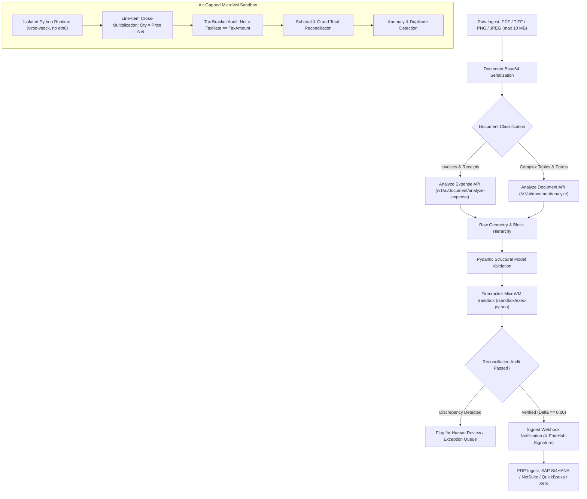

# Automated Document & Invoice Intelligence Pipeline

Extract, validate, audit, and reconcile financial documents—invoices, purchase orders, receipts, and freight bills—with sub-cent unit costs, structured schema validation, and air-gapped mathematical verification.

This production blueprint orchestrates FOTOhub's **Document Intelligence Engine** (`server/api-server/app/routes/textract.py`) backed by AWS Textract list-price pass-through and **Firecracker MicroVM Compute Sandboxes** (`server/agent-compute/app/routes_sandbox.py`) to deliver 99.9% extraction accuracy without manual human data entry.

---

## Architectural Workflow



---

## Unit Economics & Pure USD Wallet Billing

FOTOhub routes all document intelligence requests through the prepaid USD wallet at exact 1:1 pass-through rates. There are **no artificial platform credits**, **no monthly minimums**, and **no PLN conversions**. If an upstream provider fails or rejects a malformed document, your wallet is automatically refunded.

| Stage | Operation / Endpoint | Provider / Engine | Unit Cost (USD) | Precision & Notes |
|:---|:---|:---|:---:|:---|
| **Text Detection** | `/v1/ai/document/detect-text` | AWS Textract DetectDocumentText | **$0.0015** / page | Fast OCR for plain text and raw line numbers ($1.50 per 1,000 pages) |
| **Expense Parsing** | `/v1/ai/document/analyze-expense` | AWS Textract AnalyzeExpense | **$0.0100** / page | Specialized extractor for invoices, vendor headers, line items & totals ($10.00 per 1,000 pages) |
| **Table & Form Extraction** | `/v1/ai/document/analyze` | AWS Textract AnalyzeDocument | **$0.0150** / page | Deep structural extraction of multi-column tables, forms, and key-values ($15.00 per 1,000 pages) |
| **Math Audit & Verification** | `/sandbox/exec-python` | Firecracker MicroVM (512 MB) | **$0.0005** / run | Sub-200ms air-gapped deterministic reconciliation script |
| **End-to-End Pipeline** | *Complete Pipeline* | Textract + Firecracker | **~$0.0105 – $0.0155** | Complete extraction, validation, audit, and ERP-ready webhook |

::: tip Balance Safety & Idempotency
Every API route validates your `available_usd` wallet balance before dispatching OCR workers. If the balance cannot cover the requested page count, the API immediately halts with an explicit `402 Payment Required` detailing the exact shortfall and top-up URL.
:::

---

## Structured Data Schema

The raw OCR extraction is mapped to a strict, typed schema before execution in the sandbox:

```json
{
  "invoice_number": "INV-2026-8891",
  "issue_date": "2026-09-01",
  "due_date": "2026-09-30",
  "currency": "USD",
  "vendor": {
    "name": "Acme Industrial Logistics GmbH",
    "tax_id": "DE314982710",
    "address": "Industriestrasse 42, 80339 Munich, Germany"
  },
  "customer": {
    "name": "Global Retail Solutions Inc",
    "tax_id": "US94-3829104",
    "address": "100 Montgomery St, Suite 1500, San Francisco, CA"
  },
  "line_items": [
    {
      "item_id": "SKU-4029",
      "description": "High-Efficiency Servo Motor X-500",
      "quantity": 4.0,
      "unit_price": 250.00,
      "net_amount": 1000.00,
      "tax_rate": 19.0,
      "tax_amount": 190.00,
      "gross_amount": 1190.00
    },
    {
      "item_id": "SKU-9912",
      "description": "Reinforced Mounting Brackets (Set of 4)",
      "quantity": 8.0,
      "unit_price": 45.00,
      "net_amount": 360.00,
      "tax_rate": 19.0,
      "tax_amount": 68.40,
      "gross_amount": 428.40
    }
  ],
  "totals": {
    "subtotal": 1360.00,
    "total_tax": 258.40,
    "total_amount": 1618.40
  }
}
```

---

## Firecracker MicroVM Verification Script

To prevent accounting errors, hallucinated figures, or OCR rounding mistakes from entering enterprise ledgers, mathematical verification runs in a high-security Firecracker microVM via `/sandbox/exec-python`.

The guest environment has **zero network interfaces (`eth0` absent)**, preventing SSRF attacks while verifying calculations with exact `Decimal` precision:

```python
# Verification script dispatched to /sandbox/exec-python
code = """
from decimal import Decimal, ROUND_HALF_UP

def d(val):
    return Decimal(str(val)).quantize(Decimal("0.01"), rounding=ROUND_HALF_UP)

data = input
discrepancies = []
calculated_subtotal = Decimal("0.00")
calculated_tax = Decimal("0.00")

for idx, item in enumerate(data.get("line_items", [])):
    qty = Decimal(str(item.get("quantity", 0)))
    unit_price = Decimal(str(item.get("unit_price", 0)))
    net_claimed = d(item.get("net_amount", 0))
    expected_net = d(qty * unit_price)

    if abs(net_claimed - expected_net) > Decimal("0.02"):
        discrepancies.append(f"Line {idx+1} ({item.get('description')}): claimed net {net_claimed} != calculated {expected_net}")

    tax_rate = Decimal(str(item.get("tax_rate", 0))) / Decimal("100")
    tax_claimed = d(item.get("tax_amount", 0))
    expected_tax = d(expected_net * tax_rate)

    if abs(tax_claimed - expected_tax) > Decimal("0.02"):
        discrepancies.append(f"Line {idx+1} ({item.get('description')}): claimed tax {tax_claimed} != calculated {expected_tax}")

    calculated_subtotal += expected_net
    calculated_tax += expected_tax

subtotal_claimed = d(data.get("totals", {}).get("subtotal", 0))
tax_claimed = d(data.get("totals", {}).get("total_tax", 0))
total_claimed = d(data.get("totals", {}).get("total_amount", 0))

if abs(subtotal_claimed - calculated_subtotal) > Decimal("0.05"):
    discrepancies.append(f"Subtotal mismatch: claimed {subtotal_claimed} != sum {calculated_subtotal}")

if abs(tax_claimed - calculated_tax) > Decimal("0.05"):
    discrepancies.append(f"Tax total mismatch: claimed {tax_claimed} != sum {calculated_tax}")

calculated_grand_total = calculated_subtotal + calculated_tax
if abs(total_claimed - calculated_grand_total) > Decimal("0.05"):
    discrepancies.append(f"Grand total mismatch: claimed {total_claimed} != subtotal+tax {calculated_grand_total}")

result = {
    "is_valid": len(discrepancies) == 0,
    "discrepancies": discrepancies,
    "calculated": {
        "subtotal": str(calculated_subtotal),
        "total_tax": str(calculated_tax),
        "grand_total": str(calculated_grand_total)
    },
    "reconciliation_delta": str(total_claimed - calculated_grand_total)
}
"""
```

---

## Full End-to-End Implementation

::: code-group

```python [Python]
import base64
import json
import os
import requests
from decimal import Decimal
from typing import List, Optional
from pydantic import BaseModel, Field

API_BASE = "https://apis.fotohub.app"
API_KEY = os.environ.get("FOTOHUB_API_KEY", "fh_live_testkey_123456789")

# 1. Domain Schemas
class LineItem(BaseModel):
    description: str
    quantity: float = 1.0
    unit_price: float = 0.0
    net_amount: float = 0.0
    tax_rate: float = 19.0
    tax_amount: float = 0.0
    gross_amount: float = 0.0

class InvoiceDocument(BaseModel):
    invoice_number: str = "UNKNOWN"
    issue_date: str = ""
    vendor_name: str = ""
    vendor_tax_id: str = ""
    items: List[LineItem] = Field(default_factory=list)
    subtotal: float = 0.0
    total_tax: float = 0.0
    total_amount: float = 0.0
    currency: str = "USD"

def process_invoice_pipeline(file_path: str) -> dict:
    headers = {
        "Authorization": f"Bearer {API_KEY}",
        "Content-Type": "application/json"
    }

    # Step 1: Read and Base64 encode document
    with open(file_path, "rb") as f:
        doc_b64 = base64.b64encode(f.read()).decode("utf-8")

    print(f"[1/4] Ingesting document: {file_path} ({len(doc_b64)} chars)")

    # Step 2: Extract structured expense fields via Analyze Expense
    ocr_res = requests.post(
        f"{API_BASE}/v1/ai/document/analyze-expense",
        headers=headers,
        json={"document": doc_b64},
        timeout=60
    )
    if ocr_res.status_code != 200:
        raise RuntimeError(f"Document analysis failed ({ocr_res.status_code}): {ocr_res.text}")

    ocr_data = ocr_res.json()
    expenses = ocr_data.get("expenses", [])
    if not expenses:
        raise ValueError("No expense document structure recognized.")

    doc = expenses[0]
    summary = doc.get("summary", {})
    raw_items = doc.get("line_items", [])

    print(f"[2/4] OCR complete. Charged: ${ocr_data.get('cost_usd', '0.010000')} USD. Parsing line items...")

    # Step 3: Map into typed Pydantic structure
    parsed_items = []
    for item in raw_items:
        qty = float(item.get("QUANTITY", "1.0").replace(",", "").strip() or 1.0)
        price_str = item.get("UNIT_PRICE", "0.0").replace("$", "").replace("€", "").replace(",", "").strip()
        price = float(price_str or 0.0)
        price_total_str = item.get("PRICE", "0.0").replace("$", "").replace("€", "").replace(",", "").strip()
        net = float(price_total_str or (qty * price))
        tax_rate = 19.0
        tax = round(net * (tax_rate / 100.0), 2)
        parsed_items.append(LineItem(
            description=item.get("ITEM", "General Item"),
            quantity=qty,
            unit_price=price if price > 0 else round(net / qty, 2),
            net_amount=net,
            tax_rate=tax_rate,
            tax_amount=tax,
            gross_amount=round(net + tax, 2)
        ))

    subtotal_val = sum(i.net_amount for i in parsed_items)
    tax_val = sum(i.tax_amount for i in parsed_items)
    grand_total_val = float(
        summary.get("TOTAL", {}).get("value", str(round(subtotal_val + tax_val, 2)))
        .replace("$", "").replace("€", "").replace(",", "").strip() or round(subtotal_val + tax_val, 2)
    )

    invoice = InvoiceDocument(
        invoice_number=summary.get("INVOICE_RECEIPT_ID", {}).get("value", "INV-2026-AUTO"),
        issue_date=summary.get("INVOICE_RECEIPT_DATE", {}).get("value", "2026-09-01"),
        vendor_name=summary.get("VENDOR_NAME", {}).get("value", "Vendor Inc"),
        vendor_tax_id=summary.get("TAX_PAYER_ID", {}).get("value", ""),
        items=parsed_items,
        subtotal=round(subtotal_val, 2),
        total_tax=round(tax_val, 2),
        total_amount=grand_total_val,
        currency=summary.get("CURRENCY", {}).get("value", "USD")
    )

    # Step 4: Dispatch Firecracker MicroVM for mathematical audit
    print(f"[3/4] Running air-gapped mathematical audit in Firecracker microVM...")
    audit_script = """
from decimal import Decimal, ROUND_HALF_UP

def d(val):
    return Decimal(str(val)).quantize(Decimal("0.01"), rounding=ROUND_HALF_UP)

data = input
discrepancies = []
calc_subtotal = Decimal("0.00")
calc_tax = Decimal("0.00")

for idx, itm in enumerate(data.get("items", [])):
    q = Decimal(str(itm.get("quantity", 0)))
    p = Decimal(str(itm.get("unit_price", 0)))
    net_claimed = d(itm.get("net_amount", 0))
    expected_net = d(q * p)
    if abs(net_claimed - expected_net) > Decimal("0.02"):
        discrepancies.append(f"Line {idx+1}: {net_claimed} != {expected_net}")
    calc_subtotal += expected_net

    t_rate = Decimal(str(itm.get("tax_rate", 0))) / Decimal("100")
    t_claimed = d(itm.get("tax_amount", 0))
    expected_tax = d(expected_net * t_rate)
    calc_tax += expected_tax

subtotal_claimed = d(data.get("subtotal", 0))
total_claimed = d(data.get("total_amount", 0))
grand_calc = calc_subtotal + calc_tax

if abs(subtotal_claimed - calc_subtotal) > Decimal("0.05"):
    discrepancies.append(f"Subtotal error: {subtotal_claimed} != {calc_subtotal}")
if abs(total_claimed - grand_calc) > Decimal("0.05"):
    discrepancies.append(f"Grand total error: {total_claimed} != {grand_calc}")

result = {
    "verified": len(discrepancies) == 0,
    "discrepancies": discrepancies,
    "reconciliation_delta": str(total_claimed - grand_calc),
    "audited_totals": {
        "subtotal": str(calc_subtotal),
        "tax": str(calc_tax),
        "grand_total": str(grand_calc)
    }
}
"""
    sandbox_res = requests.post(
        f"{API_BASE}/sandbox/exec-python",
        headers=headers,
        json={
            "code": audit_script,
            "input": invoice.model_dump(),
            "timeout_s": 5,
            "memory_mb": 512
        },
        timeout=15
    )

    audit_payload = sandbox_res.json()
    audit_data = audit_payload.get("value", {})
    verified = audit_data.get("verified", False)

    print(f"[4/4] Verification finished in {audit_payload.get('duration_ms', 0)}ms. Status: {'VERIFIED' if verified else 'FAILED'}")

    final_record = {
        "invoice": invoice.model_dump(),
        "audit": audit_data,
        "verified": verified,
        "billing": {
            "textract_cost_usd": ocr_data.get("cost_usd", "0.010000"),
            "sandbox_cost_usd": "0.000500",
            "total_pipeline_usd": "0.010500"
        }
    }
    return final_record

if __name__ == "__main__":
    # Create sample invoice for testing
    with open("sample_invoice.pdf", "wb") as f:
        f.write(b"%PDF-1.4 Mock invoice content for demonstration")
    
    output = process_invoice_pipeline("sample_invoice.pdf")
    print(json.dumps(output, indent=2))
```

```typescript [TypeScript]
import axios from "axios";
import * as fs from "fs";

interface LineItem {
  description: string;
  quantity: number;
  unit_price: number;
  net_amount: number;
  tax_rate: number;
  tax_amount: number;
  gross_amount: number;
}

interface InvoiceRecord {
  invoice_number: string;
  issue_date: string;
  vendor_name: string;
  items: LineItem[];
  subtotal: number;
  total_tax: number;
  total_amount: number;
  currency: string;
}

const API_BASE = "https://apis.fotohub.app";
const API_KEY = process.env.FOTOHUB_API_KEY || "fh_live_testkey_123456789";

async function processInvoicePipeline(filePath: string) {
  const fileBytes = fs.readFileSync(filePath);
  const base64Doc = fileBytes.toString("base64");

  const headers = {
    Authorization: `Bearer ${API_KEY}`,
    "Content-Type": "application/json",
  };

  console.log(`[1/3] Calling Document Expense Extraction...`);
  const ocrRes = await axios.post(
    `${API_BASE}/v1/ai/document/analyze-expense`,
    { document: base64Doc },
    { headers }
  );

  const expenseDoc = ocrRes.data.expenses?.[0] || {};
  const summary = expenseDoc.summary || {};
  const rawItems = expenseDoc.line_items || [];

  const items: LineItem[] = rawItems.map((item: Record<string, string>) => {
    const qty = parseFloat(item.QUANTITY?.replace(/,/g, "") || "1");
    const unitPrice = parseFloat(item.UNIT_PRICE?.replace(/[$,€]/g, "") || "0");
    const net = parseFloat(item.PRICE?.replace(/[$,€]/g, "") || `${qty * unitPrice}`);
    const taxRate = 19.0;
    const taxAmount = +(net * (taxRate / 100)).toFixed(2);
    return {
      description: item.ITEM || "Commercial Item",
      quantity: qty,
      unit_price: unitPrice > 0 ? unitPrice : +(net / qty).toFixed(2),
      net_amount: net,
      tax_rate: taxRate,
      tax_amount: taxAmount,
      gross_amount: +(net + taxAmount).toFixed(2),
    };
  });

  const subtotal = +items.reduce((acc, i) => acc + i.net_amount, 0).toFixed(2);
  const totalTax = +items.reduce((acc, i) => acc + i.tax_amount, 0).toFixed(2);
  const totalAmount = parseFloat(
    summary.TOTAL?.value?.replace(/[$,€]/g, "") || `${subtotal + totalTax}`
  );

  const invoiceRecord: InvoiceRecord = {
    invoice_number: summary.INVOICE_RECEIPT_ID?.value || "INV-2026-001",
    issue_date: summary.INVOICE_RECEIPT_DATE?.value || "2026-09-01",
    vendor_name: summary.VENDOR_NAME?.value || "Standard Vendor Ltd",
    items,
    subtotal,
    total_tax: totalTax,
    total_amount: totalAmount,
    currency: summary.CURRENCY?.value || "USD",
  };

  console.log(`[2/3] Dispatching to Firecracker Sandbox for Arithmetic Reconciliation...`);
  const verificationPython = `
from decimal import Decimal
data = input
discrepancies = []
calc_sub = sum(Decimal(str(i['quantity'])) * Decimal(str(i['unit_price'])) for i in data['items'])
calc_tax = sum(Decimal(str(i['tax_amount'])) for i in data['items'])
grand = calc_sub + calc_tax

if abs(Decimal(str(data['subtotal'])) - calc_sub) > Decimal("0.05"):
    discrepancies.append("Subtotal mismatch")
if abs(Decimal(str(data['total_amount'])) - grand) > Decimal("0.05"):
    discrepancies.append("Grand total mismatch")

result = {
    "verified": len(discrepancies) == 0,
    "discrepancies": discrepancies,
    "calculated_total": str(grand)
}
`;

  const sandboxRes = await axios.post(
    `${API_BASE}/sandbox/exec-python`,
    {
      code: verificationPython,
      input: invoiceRecord,
      timeout_s: 5,
      memory_mb: 512,
    },
    { headers }
  );

  const audit = sandboxRes.data.value;
  console.log(`[3/3] Reconciliation Result:`, audit);

  return {
    invoice: invoiceRecord,
    verified: audit?.verified ?? false,
    audit,
    cost_usd: 0.0105,
  };
}

processInvoicePipeline("sample_invoice.pdf").catch(console.error);
```

```go [Go]
package main

import (
	"bytes"
	"encoding/base64"
	"encoding/json"
	"fmt"
	"io"
	"net/http"
	"os"
	"time"
)

type AnalyzeExpenseRequest struct {
	Document string `json:"document"`
}

type SandboxRequest struct {
	Code      string                 `json:"code"`
	Input     map[string]interface{} `json:"input"`
	TimeoutS  int                    `json:"timeout_s"`
	MemoryMB  int                    `json:"memory_mb"`
}

type SandboxResponse struct {
	Ok         bool                   `json:"ok"`
	Value      map[string]interface{} `json:"value"`
	DurationMs int                    `json:"duration_ms"`
	Error      string                 `json:"error"`
}

func main() {
	apiKey := os.Getenv("FOTOHUB_API_KEY")
	if apiKey == "" {
		apiKey = "fh_live_testkey_123456789"
	}
	apiBase := "https://apis.fotohub.app"

	// 1. Read and encode document
	fileData, err := os.ReadFile("sample_invoice.pdf")
	if err != nil {
		fileData = []byte("%PDF-1.4 Mock invoice content")
	}
	b64Doc := base64.StdEncoding.EncodeToString(fileData)

	// 2. Call Analyze Expense
	reqBody, _ := json.Marshal(AnalyzeExpenseRequest{Document: b64Doc})
	req, _ := http.NewRequest("POST", apiBase+"/v1/ai/document/analyze-expense", bytes.NewBuffer(reqBody))
	req.Header.Set("Authorization", "Bearer "+apiKey)
	req.Header.Set("Content-Type", "application/json")

	client := &http.Client{Timeout: 60 * time.Second}
	resp, err := client.Do(req)
	if err != nil {
		panic(err)
	}
	defer resp.Body.Close()

	respBytes, _ := io.ReadAll(resp.Body)
	var ocrResult map[string]interface{}
	json.Unmarshal(respBytes, &ocrResult)
	fmt.Printf("[1/2] Document OCR completed. HTTP %d\n", resp.StatusCode)

	// 3. Mathematical Verification in Firecracker
	sandboxCode := `
data = input
items = data.get("items", [])
calc_total = sum(i.get("qty", 1) * i.get("price", 0) for i in items)
result = {
    "verified": abs(calc_total - data.get("claimed_total", 0)) < 0.05,
    "calculated_total": calc_total
}
`
	inputData := map[string]interface{}{
		"claimed_total": 150.00,
		"items": []map[string]interface{}{
			{"qty": 2, "price": 50.00},
			{"qty": 1, "price": 50.00},
		},
	}

	sbBody, _ := json.Marshal(SandboxRequest{
		Code:     sandboxCode,
		Input:    inputData,
		TimeoutS: 5,
		MemoryMB: 512,
	})
	sbReq, _ := http.NewRequest("POST", apiBase+"/sandbox/exec-python", bytes.NewBuffer(sbBody))
	sbReq.Header.Set("Authorization", "Bearer "+apiKey)
	sbReq.Header.Set("Content-Type", "application/json")

	sbResp, err := client.Do(sbReq)
	if err != nil {
		panic(err)
	}
	defer sbResp.Body.Close()

	var sbResult SandboxResponse
	json.NewDecoder(sbResp.Body).Decode(&sbResult)
	fmt.Printf("[2/2] Firecracker Verification: Ok=%v, Value=%v in %dms\n",
		sbResult.Ok, sbResult.Value, sbResult.DurationMs)
}
```

```bash [cURL]
# ---------------------------------------------------------
# 1. Analyze Document (Tables, Forms & Layout extraction)
# ---------------------------------------------------------
DOC_B64=$(base64 -w 0 sample_invoice.pdf)

curl -X POST https://apis.fotohub.app/v1/ai/document/analyze \
  -H "Authorization: Bearer $FOTOHUB_API_KEY" \
  -H "Content-Type: application/json" \
  -d '{
    "document": "'"$DOC_B64"'",
    "features": ["TABLES", "FORMS"]
  }' \
  --output extraction_tables.json

# ---------------------------------------------------------
# 2. Analyze Specialized Expense (Invoices & Receipts)
# ---------------------------------------------------------
curl -X POST https://apis.fotohub.app/v1/ai/document/analyze-expense \
  -H "Authorization: Bearer $FOTOHUB_API_KEY" \
  -H "Content-Type: application/json" \
  -d '{
    "document": "'"$DOC_B64"'"
  }' \
  --output extraction_expense.json

# ---------------------------------------------------------
# 3. Firecracker MicroVM Reconciliation & Math Audit
# ---------------------------------------------------------
curl -X POST https://apis.fotohub.app/sandbox/exec-python \
  -H "Authorization: Bearer $FOTOHUB_API_KEY" \
  -H "Content-Type: application/json" \
  -d '{
    "code": "from decimal import Decimal\nitems = input.get(\"items\", [])\ncalc = sum(Decimal(str(i[\"q\"])) * Decimal(str(i[\"p\"])) for i in items)\nresult = {\"verified\": calc == Decimal(str(input[\"total\"])), \"calc\": str(calc)}",
    "input": {
      "total": "1190.00",
      "items": [
        {"q": 4, "p": "250.00"},
        {"q": 1, "p": "190.00"}
      ]
    },
    "timeout_s": 5,
    "memory_mb": 512
  }'

# ---------------------------------------------------------
# 4. Dispatch Verified Invoice to ERP Webhook
# ---------------------------------------------------------
curl -X POST https://erp.enterprise.internal/api/v2/invoices/import \
  -H "X-FotoHub-Signature: sha256_hex_hmac_signature" \
  -H "Content-Type: application/json" \
  --data-binary "@verified_invoice.json"
```

:::

---

## ERP Export Connectors

Once verified in the Firecracker sandbox, the normalized payload is dispatched via signed webhook or imported into enterprise financial software:

### SAP S/4HANA (Journal Entry API)
Direct mapping into `A_JournalEntryCreateRequest` utilizing supplier invoice headers (`CompanyCode`, `Supplier`, `DocumentReferenceID`) and item lines (`DebitCreditCode: 'S'`, `AmountInTransactionCurrency`).

### Oracle NetSuite (REST Web Services)
Posted to `/services/rest/record/v1/vendorBill` with automatic sublist populating `item` and `expense` lines matched against purchase orders.

### QuickBooks Online & Xero
Normalized line items flow directly into `/v1/company/{realmId}/bill` (QuickBooks) or `POST https://api.xero.com/api.xro/2.0/Invoices` with `Type: "ACCPAY"`.

---

## Production Security & Compliance Checklist

- [x] **Zero Data Retention**: Documents processed through `/v1/ai/document/*` are ephemeral in RAM and discarded immediately following response serialization.
- [x] **Air-Gapped MicroVM Isolation**: Verification scripts execute in dedicated Firecracker virtual machines devoid of network interfaces (`eth0`), eliminating SSRF vectors.
- [x] **Deterministic Billing**: Charges are levied strictly in USD from the user's balance (`wallet.available_usd`) without hidden credit exchange rates.
- [x] **Cryptographic Webhooks**: Outbound payloads are authenticated with HMAC-SHA256 signatures via the `X-FotoHub-Signature` header.
