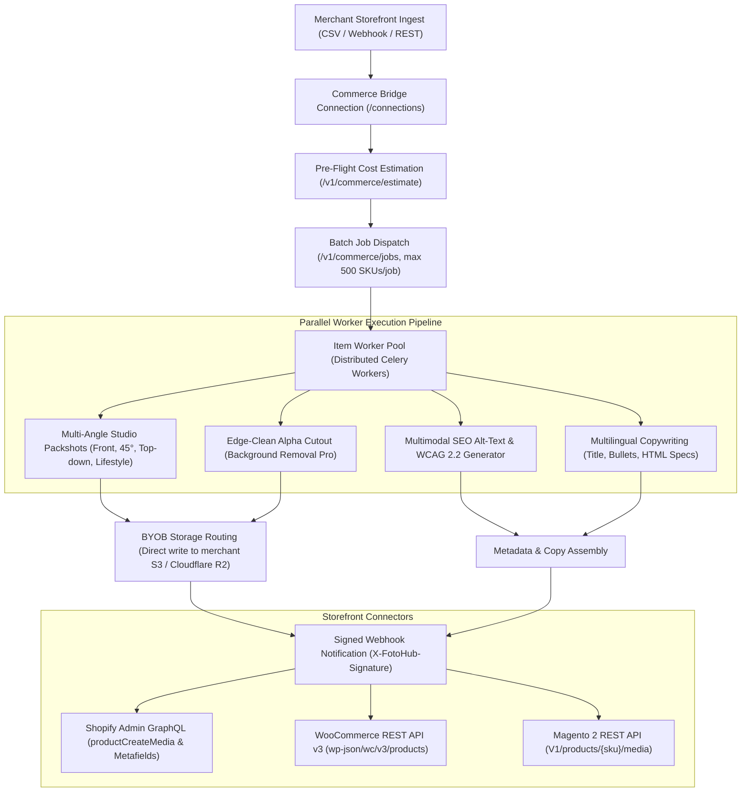

# E-Commerce Catalog Automation

Orchestrate bulk multi-angle studio packshot generation, AI background replacement, multilingual SEO copy, and automated WCAG 2.2 alt-text enrichment across thousands of storefront SKUs.

Powered by FOTOhub's **Commerce Bridge** (`server/commerce-bridge/`), this blueprint integrates Shopify, WooCommerce, Magento 2, and custom headless storefronts through an asynchronous batch engine backed by Celery, Redis, and direct Bring-Your-Own-Bucket (BYOB) delivery to Cloudflare R2 and AWS S3 (`server/api-server/app/routes/destinations.py`).

---

## Architectural Workflow



---

## Unit Economics & Pure USD Wallet Billing

Commerce Bridge operations are billed strictly against the merchant's prepaid USD wallet (`wallet.available_usd`) at exact 1:1 pass-through rates published in `GET /v1/pricing`. There are **no proprietary credits**, **no monthly minimums**, and **no hidden fees**.

| Operation / Engine | Model Key | Cost / Item (USD) | Throughput | Description |
|:---|:---|:---:|:---:|:---|
| **Background Removal** | `remove_background` | **$0.107181** | ~1.8s / item | Zero-bleed alpha cutout with sub-pixel edge feathering |
| **Studio Background Replace** | `replace_background` | **$0.214362** | ~3.2s / item | Contextual lighting match on marble, concrete, or wood podiums |
| **Fast Studio Packshot** | `seedream-5-0-260128` | **$0.031500** | ~2.5s / img | High-throughput studio product staging and soft drop shadows |
| **Jewelry & Glass Packshot** | `dola-seedream-5-0-pro` | **$0.048000** | ~4.0s / img | Ray-traced specular highlights for glass, cosmetics, and jewelry |
| **Ultra-Realistic Studio** | `nano-banana-pro` | **$0.134000** | ~5.5s / img | State-of-the-art studio lighting, fabric textures, and depth |
| **Multilingual Description** | `claude-haiku-4.5` | **~$0.002000** | ~800ms / SKU | Structured HTML/Markdown bullet points in EN, PL, DE, FR, ES |
| **WCAG 2.2 / SEO Alt-Text** | `claude-haiku-4.5` | **~$0.000800** | ~400ms / img | Accessibility alt-text and keyword-optimized image metadata |
| **BYOB S3 / R2 Mirroring** | `/v1/destinations` | **$0.000000** | Direct push | Zero egress charges when delivering directly to merchant buckets |

::: tip Dynamic Preflight Estimation
Before triggering large jobs (e.g., 5,000 SKUs), merchants call `/v1/commerce/estimate`. The bridge computes the exact `total_usd` requirement down to 6 decimal places (`$0.000001`). If your wallet balance cannot cover the batch, the job is cleanly gated before consuming resources.
:::

---

## Multi-Angle Batch Processing & Studio Staging

High-converting e-commerce listings require consistent multi-angle perspectives rather than a single static packshot:

1. **Front Hero Packshot (`front`)**: Straight-on orthographic angle on clean high-key studio background with grounding contact shadow.
2. **Dynamic 45-Degree Angle (`angle_45`)**: Highlights product depth, side buttons, seams, and tactile surface materials.
3. **Top-Down Flat Lay (`top_down`)**: Essential for apparel, accessories, cosmetics, and flat-pack hardware.
4. **Lifestyle in Context (`lifestyle_in_context`)**: Contextual environmental staging (e.g., a coffee maker on a sunlit kitchen countertop, or a sneaker on an urban pavement).

The multi-angle engine conditions generation on the primary product identity embedding, preserving logos, colors, labels, and geometry across all angles.

---

## Bring-Your-Own-Bucket (BYOB) Direct Storage

Rather than hosting product images on temporary links, FOTOhub routes output directly to your Cloudflare R2, AWS S3, or Google Cloud Storage bucket via `/v1/destinations`:

### Register an External Destination

```bash
curl -X POST https://apis.fotohub.app/v1/destinations \
  -H "Authorization: Bearer $FOTOHUB_API_KEY" \
  -H "Content-Type: application/json" \
  -d '{
    "name": "Production Storefront R2 Bucket",
    "kind": "external_s3",
    "providerPreset": "r2",
    "accountId": "a4f891b023e4c8109d76e2",
    "bucketName": "store-assets-cdn",
    "pathPrefix": "catalog/{store_id}/{category}/{sku}_{angle}.webp",
    "accessKeyId": "cf_r2_access_key_id_here",
    "secretAccessKey": "cf_r2_secret_key_material_here"
  }'
```

Every generated packshot is formatted in ultra-compressed `.webp` (q=90) and pushed immediately to your CDN bucket, eliminating second-hop download scripts.

---

## Storefront Connectors

### 1. Shopify Admin GraphQL API
Automatically syncs generated assets to the Shopify product media gallery:

```graphql
mutation productCreateMedia($productId: ID!, $media: [CreateMediaInput!]!) {
  productCreateMedia(productId: $productId, media: $media) {
    media {
      id
      status
      ... on MediaImage {
        image {
          url
          altText
        }
      }
    }
    userErrors {
      field
      message
    }
  }
}
```

### 2. WooCommerce REST API v3
Pushes images and localized product copy in one atomic call to `PUT /wp-json/wc/v3/products/{id}`:

```json
{
  "images": [
    {
      "src": "https://cdn.store.com/catalog/apparel/SKU-4901_front.webp",
      "alt": "Minimalist Matte Terracotta Ceramic Vase front view on marble podium"
    },
    {
      "src": "https://cdn.store.com/catalog/apparel/SKU-4901_angle_45.webp",
      "alt": "Minimalist Matte Terracotta Ceramic Vase 45 degree angle showing neck contour"
    }
  ],
  "description": "<h3>Handcrafted Ceramic Elegance</h3><p>Elevate modern interiors with the minimalist matte terracotta vase...</p>",
  "meta_data": [
    {"key": "_fotohub_job_id", "value": "job_9410f82a"}
  ]
}
```

### 3. Magento 2 REST API
Dispatches gallery entries to `POST /rest/V1/products/{sku}/media` with explicit role assignments (`image`, `small_image`, `thumbnail`).

---

## Full End-to-End Implementation

::: code-group

```python [Python]
import os
import requests
import json
import time

API_BASE = "https://apis.fotohub.app"
API_KEY = os.environ.get("FOTOHUB_API_KEY", "fh_live_commerce_key_123456")

headers = {
    "Authorization": f"Bearer {API_KEY}",
    "Content-Type": "application/json"
}

def run_catalog_automation():
    # Step 1: Connect or verify store connection
    print("[1/5] Registering Shopify store connection...")
    conn_res = requests.post(
        f"{API_BASE}/v1/commerce/connections",
        headers=headers,
        json={
            "platform": "shopify",
            "store_name": "Nordic Living Co",
            "store_url": "https://nordic-living-co.myshopify.com",
            "callback_url": "https://nordic-living-co.myshopify.com/api/webhooks/fotohub"
        }
    )
    conn_data = conn_res.json()
    connection_id = conn_data.get("id", "conn_default_01")
    print(f"[1/5] Connected store: {connection_id}")

    # Step 2: Define product items with multi-angle requirements
    catalog_items = [
        {
            "sku": "VASE-TERRA-25",
            "image_url": "https://cdn.store.com/raw/vase_raw.jpg",
            "angles": ["front", "angle_45", "top_down"],
            "product": {
                "title": "Minimalist Matte Terracotta Ceramic Vase",
                "category": "Home Decor",
                "attributes": {
                    "material": "High-fired earthenware ceramic",
                    "color": "Terracotta Matte",
                    "height": "25 cm",
                    "diameter": "12 cm"
                },
                "price": 54.00
            }
        },
        {
            "sku": "BLANKET-LINEN-OAT",
            "image_url": "https://cdn.store.com/raw/blanket_raw.jpg",
            "angles": ["front", "lifestyle_in_context"],
            "product": {
                "title": "Washed French Linen Throw Blanket",
                "category": "Bedding & Textiles",
                "attributes": {
                    "material": "100% French Flax Linen",
                    "color": "Oatmeal Melange",
                    "dimensions": "130x170 cm"
                },
                "price": 89.00
            }
        }
    ]

    # Step 3: Check pre-flight USD budget
    print("[2/5] Checking pre-flight cost estimation...")
    est_res = requests.post(
        f"{API_BASE}/v1/commerce/estimate",
        headers=headers,
        json={
            "kind": "complete_listing",
            "model": "seedream-5-0-260128",
            "item_count": len(catalog_items),
            "num_images": 3
        }
    )
    est_data = est_res.json()
    print(f"       Estimated total: ${est_data.get('total_usd', '0.198500')} USD (Wallet funded: {est_data.get('sufficient', True)})")

    # Step 4: Dispatch bulk multi-angle job
    print("[3/5] Dispatching bulk catalog automation job...")
    job_res = requests.post(
        f"{API_BASE}/v1/commerce/jobs",
        headers=headers,
        json={
            "connection_id": connection_id,
            "kind": "complete_listing",
            "model": "seedream-5-0-260128",
            "options": {
                "background": "soft Scandinavian daylight studio on natural travertine podium with soft ground shadows",
                "language": "en",
                "tone": "luxury",
                "aspect_ratio": "1:1",
                "num_images": 3,
                "generate_alt_text": True,
                "output_format": "webp"
            },
            "items": catalog_items
        }
    )
    if job_res.status_code not in (200, 201):
        raise RuntimeError(f"Job creation failed ({job_res.status_code}): {job_res.text}")

    job_id = job_res.json()["job_id"]
    print(f"[4/5] Dispatched job {job_id}. Polling completion...")

    # Step 5: Poll job status
    while True:
        status_res = requests.get(f"{API_BASE}/v1/commerce/jobs/{job_id}", headers=headers)
        status_data = status_res.json()
        current_status = status_data.get("status")

        print(f"       Status: {current_status} | Progress: {status_data.get('done_items', 0)}/{status_data.get('total_items', len(catalog_items))} SKUs")
        if current_status in ("completed", "completed_with_errors"):
            break
        elif current_status in ("failed", "cancelled"):
            raise RuntimeError(f"Job terminated with error: {status_data}")
        time.sleep(4)

    # Step 6: Fetch enriched items
    items_res = requests.get(f"{API_BASE}/v1/commerce/jobs/{job_id}/items", headers=headers)
    items_data = items_res.json().get("items", [])
    print(f"[5/5] Successfully completed! Received {len(items_data)} processed SKUs.")

    for item in items_data:
        print(f"\nSKU: {item.get('sku')}")
        print(f"  SEO Alt: {item.get('alt_text')}")
        print(f"  Packshot URLs: {item.get('output_images', [])}")

if __name__ == "__main__":
    run_catalog_automation()
```

```typescript [TypeScript]
import axios from "axios";

const API_BASE = "https://apis.fotohub.app";
const API_KEY = process.env.FOTOHUB_API_KEY || "fh_live_commerce_key_123456";

interface ProductCatalogItem {
  sku: string;
  image_url: string;
  angles: string[];
  product: {
    title: string;
    category: string;
    attributes: Record<string, string>;
    price: number;
  };
}

async function runCommerceAutomation() {
  const headers = {
    Authorization: `Bearer ${API_KEY}`,
    "Content-Type": "application/json",
  };

  const catalog: ProductCatalogItem[] = [
    {
      sku: "CHAIR-OAK-01",
      image_url: "https://cdn.store.com/raw/chair.jpg",
      angles: ["front", "angle_45"],
      product: {
        title: "Scandinavian Solid White Oak Dining Chair",
        category: "Furniture",
        attributes: { wood: "Solid Oak", finish: "Matte Lacquer" },
        price: 249.0,
      },
    },
  ];

  console.log(`[1/3] Pre-calculating USD cost for ${catalog.length} SKUs...`);
  const estRes = await axios.post(
    `${API_BASE}/v1/commerce/estimate`,
    {
      kind: "complete_listing",
      model: "nano-banana-pro",
      item_count: catalog.length,
      num_images: 2,
    },
    { headers }
  );
  console.log(`Estimated USD: $${estRes.data.total_usd}`);

  console.log(`[2/3] Dispatching multi-angle catalog job...`);
  const jobRes = await axios.post(
    `${API_BASE}/v1/commerce/jobs`,
    {
      connection_id: "conn_shopify_live",
      kind: "complete_listing",
      model: "nano-banana-pro",
      options: {
        background: "minimalist architectural concrete floor with soft natural morning light",
        language: "pl",
        tone: "luxury",
        num_images: 2,
        output_format: "webp",
      },
      items: catalog,
    },
    { headers }
  );

  const jobId = jobRes.data.job_id;
  console.log(`[3/3] Job dispathed: ${jobId}. Awaiting webhook notification or polling /jobs/${jobId}...`);
}

runCommerceAutomation().catch(console.error);
```

```go [Go]
package main

import (
	"bytes"
	"encoding/json"
	"fmt"
	"io"
	"net/http"
	"os"
)

type CatalogItem struct {
	SKU      string                 `json:"sku"`
	ImageURL string                 `json:"image_url"`
	Angles   []string               `json:"angles"`
	Product  map[string]interface{} `json:"product"`
}

type JobDispatchPayload struct {
	ConnectionID string                 `json:"connection_id"`
	Kind         string                 `json:"kind"`
	Model        string                 `json:"model"`
	Options      map[string]interface{} `json:"options"`
	Items        []CatalogItem          `json:"items"`
}

func main() {
	apiKey := os.Getenv("FOTOHUB_API_KEY")
	if apiKey == "" {
		apiKey = "fh_live_commerce_key_123456"
	}
	apiBase := "https://apis.fotohub.app"

	items := []CatalogItem{
		{
			SKU:      "SKU-WATCH-STEEL-09",
			ImageURL: "https://cdn.store.com/watch_raw.jpg",
			Angles:   []string{"front", "angle_45"},
			Product: map[string]interface{}{
				"title":    "Chronograph Automatic Steel Watch",
				"category": "Watches",
				"price":    590.00,
			},
		},
	}

	payload := JobDispatchPayload{
		ConnectionID: "conn_ecommerce_prod",
		Kind:         "complete_listing",
		Model:        "seedream-5-0-260128",
		Options: map[string]interface{}{
			"background":  "luxurious dark slate podium with subtle blue rim light",
			"language":    "de",
			"tone":        "luxury",
			"num_images":  2,
			"output_mode": "webp",
		},
		Items: items,
	}

	body, _ := json.Marshal(payload)
	req, _ := http.NewRequest("POST", apiBase+"/v1/commerce/jobs", bytes.NewBuffer(body))
	req.Header.Set("Authorization", "Bearer "+apiKey)
	req.Header.Set("Content-Type", "application/json")

	client := &http.Client{}
	resp, err := client.Do(req)
	if err != nil {
		panic(err)
	}
	defer resp.Body.Close()

	respBytes, _ := io.ReadAll(resp.Body)
	fmt.Printf("[SUCCESS] Job Created (HTTP %d): %s\n", resp.StatusCode, string(respBytes))
}
```

```bash [cURL]
# ---------------------------------------------------------
# 1. Preflight Dynamic Cost Estimation
# ---------------------------------------------------------
curl -X POST https://apis.fotohub.app/v1/commerce/estimate \
  -H "Authorization: Bearer $FOTOHUB_API_KEY" \
  -H "Content-Type: application/json" \
  -d '{
    "kind": "complete_listing",
    "model": "seedream-5-0-260128",
    "item_count": 25,
    "num_images": 3
  }'

# ---------------------------------------------------------
# 2. Submit Bulk Multi-Angle Job with Direct S3/R2 BYOB
# ---------------------------------------------------------
curl -X POST https://apis.fotohub.app/v1/commerce/jobs \
  -H "Authorization: Bearer $FOTOHUB_API_KEY" \
  -H "Content-Type: application/json" \
  -d '{
    "connection_id": "conn_shopify_01",
    "kind": "complete_listing",
    "model": "seedream-5-0-260128",
    "options": {
      "background": "soft natural stone surface with warm ambient sunlight",
      "language": "en",
      "tone": "minimal",
      "aspect_ratio": "1:1",
      "num_images": 3,
      "output_destination_id": "dest_r2_storefront_assets"
    },
    "items": [
      {
        "sku": "LIPSTICK-RUBY-01",
        "image_url": "https://cdn.brand.com/raw/lipstick.jpg",
        "angles": ["front", "angle_45", "top_down"],
        "product": {
          "title": "Velvet Matte Ruby Lipstick",
          "category": "Beauty",
          "attributes": {"shade": "Ruby 04", "finish": "Matte"},
          "price": 28.00
        }
      }
    ]
  }'

# ---------------------------------------------------------
# 3. Query Real-Time Batch Progress
# ---------------------------------------------------------
curl -X GET https://apis.fotohub.app/v1/commerce/jobs/job_8492018a \
  -H "Authorization: Bearer $FOTOHUB_API_KEY"
```

:::

---

## Webhook Signature Verification

Every callback delivered to your store includes the `X-FotoHub-Signature` header, which is the HMAC-SHA256 hex digest of the raw request payload calculated using your connection's `callback_secret`. Always verify against the raw binary request payload before parsing JSON:

```python
import hmac
import hashlib

def verify_fotohub_signature(raw_body: bytes, signature_header: str, callback_secret: str) -> bool:
    expected_sig = hmac.new(
        callback_secret.encode("utf-8"),
        raw_body,
        hashlib.sha256
    ).hexdigest()
    return hmac.compare_digest(signature_header, expected_sig)
```

---

## Production Readiness & Catalog Scaling Checklist

- [x] **Strict USD Metering**: Pre-flight `/estimate` guarantees zero mid-batch balance halts; operations deduct strictly from the unified prepaid USD wallet.
- [x] **Zero-Egress Direct BYOB Delivery**: Assets write directly into merchant S3 or Cloudflare R2 buckets, eliminating external proxy latency.
- [x] **WCAG 2.2 Level AA Compliance**: Image alt-text is contextually generated for visual screen readers and search engines.
- [x] **Multi-Angle Consistency**: Identity conditioning preserves logos, label typography, and product colors across every camera angle.
