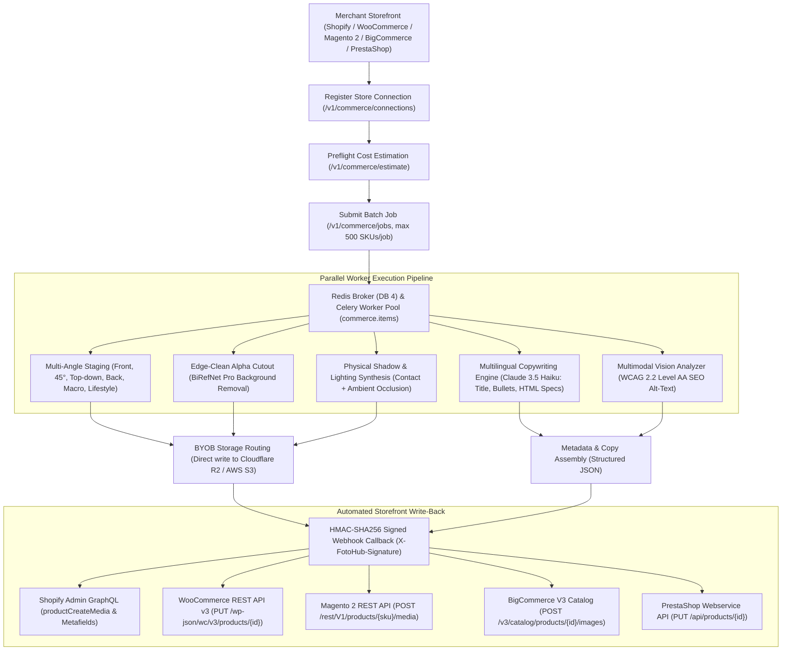

# E-Commerce Catalog Automation

Orchestrate bulk multi-angle studio packshot generation, AI background replacement, physical contact shadows, multilingual SEO copywriting, and automated WCAG 2.2 Level AA alt-text enrichment across multi-thousand SKU enterprise storefronts.

Powered by FOTOhub's **Commerce Bridge**, this blueprint integrates Shopify, WooCommerce, Magento 2, BigCommerce, PrestaShop, and custom headless storefronts through an asynchronous batch engine backed by Celery, Redis (`commerce.items`), Supabase state storage, and direct Bring-Your-Own-Bucket (BYOB) delivery to Cloudflare R2 and AWS S3 via [`/v1/destinations`](/api/surface-map#account-keys-and-money).

---

## Architectural Workflow & Commerce Bridge Topology

The Commerce Bridge acts as an intelligent orchestration gateway between your e-commerce platform and FOTOhub's compute clusters. Rather than calling raw image generation endpoints synchronously, store plugins register a persistent connection and dispatch batch jobs:



### Core Architecture Components

1. **Store Connections (`/v1/commerce/connections`)**:
   Represents a registered storefront. Upon creation, the bridge issues a unique `callback_secret` used for HMAC-SHA256 webhook signature signing. Secrets are displayed once upon creation and stored with Fernet symmetric encryption.
2. **Preflight Cost Estimation (`/v1/commerce/estimate`)**:
   Calculates exact US Dollar requirements down to 6 decimal places (`$0.000001`) before batch execution. If the prepaid USD wallet balance (`wallet.available_usd`) cannot cover the job, the batch is gated before consuming resources.
3. **Distributed Job Fan-Out (`/v1/commerce/jobs`)**:
   Accepts up to 500 SKUs per job. Jobs are split into granular item tasks and enqueued into Celery (`commerce.items`). Distributed workers process items in parallel, ensuring a single failed SKU or bad image URL never halts the rest of the batch.
4. **State Machine & Retry Policy**:
   - **Job Statuses**: `queued` ➔ `processing` ➔ `completed` (or `completed_with_errors`, `failed`, `cancelled`).
   - **Item Statuses**: `queued` ➔ `processing` ➔ `completed` (or `failed`, `cancelled`).
   - Failed items can be re-run with exponential backoff using `POST /v1/commerce/jobs/{id}/retry-failed`.
5. **Zero-Egress BYOB Routing**:
   Generated packshots are written directly to the merchant's Cloudflare R2 or AWS S3 bucket via pre-configured destination IDs, eliminating intermediary download proxies and egress bandwidth costs.
6. **Signed Asynchronous Callbacks**:
   Delivers JSON payloads to your store webhook URL with the `X-FotoHub-Signature` header, enabling asynchronous storefront write-backs.

---

## Unit Economics & Pure USD Prepaid Wallet Billing

All Commerce Bridge operations are billed strictly against the merchant's prepaid USD wallet balance (`wallet.available_usd`) at exact rates published in `GET /v1/pricing`. Billing operates on transparent US Dollar figures (`balance_usd`, `usd_charged`). There are **no artificial currencies**, **no proprietary points**, and **no monthly minimums**.

| Operation / Engine | Model Key | Unit Price (USD) | Hardware Node | Typical Runtime | Output Description |
|:---|:---|:---:|:---:|:---:|:---|
| **Background Removal Pro** | `remove_background` | **$0.107181** | GPU4 (A10G) | ~1.8s / item | Zero-bleed alpha cutout with sub-pixel edge feathering |
| **Studio Background Replace** | `replace_background` | **$0.214362** | GPU4 (A10G) | ~3.2s / item | Contextual lighting match on marble, travertine, or wood podiums |
| **Fast Studio Packshot** | `seedream-5-0-260128` | **$0.031500** | GPU5 (A10G) | ~2.5s / img | High-throughput studio product staging and soft drop shadows |
| **Jewelry & Specular Packshot**| `dola-seedream-5-0-pro` | **$0.048000** | GPU5 (A10G) | ~4.0s / img | Ray-traced specular highlights for jewelry, glass, and cosmetics |
| **Ultra-Realistic Studio** | `nano-banana-pro` | **$0.134000** | GPU5 (A10G) | ~5.5s / img | Premium fabric textures, micro-reflections, and deep lighting |
| **Fast Detail Upscale** | `stability_fast-upscale` | **$0.053591** | GPU4 (A10G) | ~1.5s / img | 2x / 4x super-resolution sharpening for zoom view |
| **Product Recolor / Variant** | `stability_search-recolor`| **$0.080000** | GPU4 (A10G) | ~2.8s / img | Photorealistic color variant generation from hex codes |
| **Visual Scene Analysis** | `photo-analysis` | **$0.012000** | CPU / Vision API | ~600ms / img | Structural geometry, primary color, and framing analysis |
| **Multilingual Description** | `claude-haiku-4.5` | **~$0.002000** | Bedrock Claude | ~800ms / SKU | Structured HTML/Markdown bullet points in EN, DE, FR, ES, PL |
| **WCAG 2.2 / SEO Alt-Text** | `claude-haiku-4.5` | **~$0.000800** | Bedrock Claude | ~400ms / img | Accessibility alt-text and keyword-optimized image metadata |
| **BYOB Direct S3/R2 Delivery** | `/v1/destinations` | **$0.000000** | Direct push | Real-time | Zero egress fees when delivering directly to merchant buckets |

### Dynamic Preflight Cost Estimation (`/v1/commerce/estimate`)

Before triggering large catalog updates (e.g., 2,500 SKUs), merchants call `/v1/commerce/estimate`. The bridge computes the exact USD requirement down to 6 decimal places (`$0.000001`):

```bash
curl -X POST "https://apis.fotohub.app/v1/commerce/estimate"   -H "Authorization: Bearer $FOTOHUB_API_KEY"   -H "Content-Type: application/json"   -d '{
    "kind": "complete_listing",
    "model": "seedream-5-0-260128",
    "item_count": 100,
    "num_images": 3
  }'
```

**Preflight Response Payload:**

```json
{
  "usd_per_item": 0.097300,
  "total_usd": 9.730000,
  "available_usd": 154.205000,
  "sufficient": true,
  "breakdown": {
    "packshots_usd": 0.094500,
    "copywriting_usd": 0.002000,
    "alt_text_usd": 0.000800
  }
}
```

::: tip Preflight Wallet Verification
If `sufficient` is `false`, the bridge returns HTTP 402 with `error: "insufficient_funds"`. The job is cleanly rejected before consuming compute resources, preventing half-finished catalog batches.
:::

---

## Studio Staging, Lighting & Shadow Engineering

High-converting e-commerce listings require consistent multi-angle perspectives rather than a single static packshot. The Commerce Bridge multi-angle engine conditions generation on primary product identity embeddings, preserving logos, typography, colors, and geometry across every perspective:

```
┌─────────────────────────────────────────────────────────────────────────┐
│                    MULTI-ANGLE CAMERA PERSPECTIVES                      │
├─────────────────┬─────────────────┬─────────────────┬───────────────────┤
│ 1. front        │ 2. angle_45     │ 3. top_down     │ 4. back           │
│ Hero packshot,  │ Three-quarter   │ Flat-lay view   │ Rear closures,    │
│ orthographic,   │ depth, seams &  │ for apparel,    │ ports, care tags  │
│ contact shadow  │ bevel contours  │ watches & tech  │ & connectors      │
├─────────────────┴─────────────────┴─────────────────┴───────────────────┤
│ 5. macro_detail                   │ 6. lifestyle_in_context             │
│ High-magnification surface        │ Architectural environmental         │
│ texture, stitching, gemstones     │ staging (kitchen, living room, gym) │
└─────────────────────────────────────────────────────────────────────────┘
```

### 1. The 6 Commercial Packshot Perspectives

1. **Front Hero Packshot (`front`)**: Straight-on orthographic angle on a clean studio background with grounded ambient contact shadows. Primary catalog thumbnail.
2. **Dynamic 45-Degree Angle (`angle_45`)**: Three-quarter angle highlighting product depth, side buttons, seams, zippers, and tactile surface finishes.
3. **Top-Down Flat Lay (`top_down`)**: Overhead 90-degree angle essential for apparel, watches, cosmetic palettes, and flat-pack hardware.
4. **Rear Packshot (`back`)**: Documents rear closures, ports, technical labels, and structural fastenings.
5. **Macro Material Detail (`macro_detail`)**: High-magnification shot revealing fabric weave, leather grain, dial etching, or metal brushing.
6. **Lifestyle in Context (`lifestyle_in_context`)**: Contextual environmental staging (e.g., a ceramic mug on a sunlit oak breakfast bar, or running shoes on urban asphalt).

### 2. Studio Lighting & Shadow Synthesis

Photorealistic product integration requires accurate physical lighting simulation:

- **Contact Shadow**: Tight, dark occlusion shadow rendered directly under the object's base contact points, grounding the product to prevent floating artifacts.
- **Directional Softbox Shadow**: Diffused secondary shadow matching the angle and color temperature of the key studio light (typically 5200K daylight balance).
- **Subtle Floor Reflection**: Configurable Fresnel reflection for glossy surfaces such as polished marble, tempered glass, or lacquered acrylic podiums.
- **Curated Studio Presets**:
  - `travertine_minimal`: Warm natural sunlight on a rough-hewn Italian travertine stone pedestal.
  - `carrara_marble`: High-key studio light with soft gray veining and subtle specular reflections.
  - `urban_concrete`: Neutral diffused daylight on industrial brushed concrete.
  - `scandinavian_oak`: Soft organic morning light on solid white oak tabletop.
  - `dark_slate_luxury`: Dramatic low-key rim lighting on charcoal slate, designed for luxury watches and jewelry.

---

## Multilingual SEO Copywriting & WCAG 2.2 Alt-Text Engineering

### 1. Structured Copywriting Engine (Claude 3.5 Haiku)

For each SKU, the bridge orchestrates structured prompts through Claude 3.5 Haiku, extracting technical attributes and producing search-optimized copy:

- **E-Commerce Title**: Keyword-rich, brand-consistent title under 70 characters.
- **Short Summary**: Engaging 2-sentence hook highlighting primary customer benefits.
- **Feature Bullets**: 4 to 6 scannable bullet points detailing materials, dimensions, and specifications.
- **Technical HTML Specifications Table**: Clean, semantic HTML table formatted for product tabs.
- **SEO Meta Description**: High-CTR meta snippet (145–155 characters) incorporating primary category keywords.
- **Multilingual Localization**: Native generation in `en`, `de`, `fr`, `es`, `it`, `nl`, `pl`, and `ja`.

### 2. WCAG 2.2 Level AA Alt-Text Generation

Accessible e-commerce storefronts must comply with WCAG 2.2 Success Criterion 1.1.1 (Non-text Content). The vision engine generates concise, screen-reader-optimized alt-text adhering to strict enterprise guidelines:

- **Structured Format**: `[Product Brand & Name] + [Angle/Perspective] + [Material & Color] + [Setting/Surface]`.
- **Zero Redundant Fluff**: Never begins with "image of", "photo of", or "picture showing".
- **Screen Reader Clarity**: Keeps descriptions under 125 characters to avoid reader buffer overflows.
- **Search Engine Keyword Alignment**: Contextually integrates verified colorways and category taxonomy.

**Example Generated Alt-Text:**
> `Minimalist Terracotta Ceramic Vase front view on travertine stone podium with soft daylight shadows`

---

## Bring-Your-Own-Bucket (BYOB) Direct Storage Delivery

Avoid intermediary download scripts by routing output assets directly to your private AWS S3, Cloudflare R2, or Google Cloud Storage bucket via `/v1/destinations`:

```bash
curl -X POST "https://apis.fotohub.app/v1/destinations"   -H "Authorization: Bearer $FOTOHUB_API_KEY"   -H "Content-Type: application/json"   -d '{
    "name": "Production Storefront R2 Bucket",
    "kind": "external_s3",
    "providerPreset": "r2",
    "accountId": "a4f891b023e4c8109d76e2",
    "bucketName": "store-assets-cdn",
    "pathPrefix": "catalog/{store_id}/{category}/{sku}_{angle}.webp",
    "accessKeyId": "cf_r2_access_key_id_here",
    "secretAccessKey": "cf_r2_secret_key_material_here"
  }'
```

Every packshot is encoded in ultra-compressed `.webp` (q=90) and written directly to your CDN domain. Your store receives final CDN URLs immediately upon completion.

---

## Full End-to-End Implementation

The following 4-way code snippets demonstrate creating a store connection, pre-estimating USD costs, dispatching a multi-angle catalog job, polling status, and reading enriched SKU results.

::: code-group

```python [Python]
import os
import time
import requests
from typing import Dict, Any, List

API_BASE = "https://apis.fotohub.app"
API_KEY = os.environ.get("FOTOHUB_API_KEY", "fh_live_commerce_key_123456")

headers = {
    "Authorization": f"Bearer {API_KEY}",
    "Content-Type": "application/json"
}

def run_catalog_automation_pipeline():
    # Step 1: Register or retrieve store connection
    print("[1/5] Registering Shopify store connection...")
    conn_res = requests.post(
        f"{API_BASE}/v1/commerce/connections",
        headers=headers,
        json={
            "platform": "shopify",
            "store_name": "Nordic Living Co",
            "store_url": "https://nordic-living-co.myshopify.com",
            "callback_url": "https://nordic-living-co.myshopify.com/api/webhooks/fotohub"
        }
    )
    if conn_res.status_code not in (200, 201):
        raise RuntimeError(f"Connection registration failed: {conn_res.text}")
    
    conn_data = conn_res.json()
    connection_id = conn_data.get("id")
    callback_secret = conn_data.get("callback_secret")
    print(f"[1/5] Store connected! ID: {connection_id} (Secret saved for HMAC verification)")

    # Step 2: Define catalog items with multi-angle requirements
    catalog_items: List[Dict[str, Any]] = [
        {
            "sku": "VASE-TERRA-25",
            "image_url": "https://cdn.nordic-living.com/raw/vase_raw.jpg",
            "angles": ["front", "angle_45", "top_down"],
            "product": {
                "title": "Minimalist Matte Terracotta Ceramic Vase",
                "category": "Home Decor",
                "attributes": {
                    "material": "High-fired earthenware ceramic",
                    "color": "Terracotta Matte",
                    "height": "25 cm",
                    "diameter": "12 cm"
                },
                "price": 54.00
            }
        },
        {
            "sku": "CHAIR-OAK-01",
            "image_url": "https://cdn.nordic-living.com/raw/chair_raw.jpg",
            "angles": ["front", "angle_45", "lifestyle_in_context"],
            "product": {
                "title": "Solid White Oak Dining Chair",
                "category": "Furniture",
                "attributes": {
                    "material": "FSC-certified solid white oak",
                    "finish": "Matte natural lacquer",
                    "width": "48 cm",
                    "depth": "52 cm"
                },
                "price": 249.00
            }
        }
    ]

    # Step 3: Run preflight USD cost estimation
    print(f"[2/5] Running preflight cost estimation for {len(catalog_items)} SKUs...")
    est_res = requests.post(
        f"{API_BASE}/v1/commerce/estimate",
        headers=headers,
        json={
            "kind": "complete_listing",
            "model": "seedream-5-0-260128",
            "item_count": len(catalog_items),
            "num_images": 3
        }
    )
    est_data = est_res.json()
    total_cost_usd = est_data.get("total_usd", 0.0)
    available_usd = est_data.get("available_usd", 0.0)
    is_sufficient = est_data.get("sufficient", False)

    print(f"       Estimated USD: ${total_cost_usd:.4f} | Wallet Balance: ${available_usd:.4f} USD | Sufficient: {is_sufficient}")
    if not is_sufficient:
        raise ValueError(f"Insufficient wallet funds: ${available_usd:.4f} available, need ${total_cost_usd:.4f} USD.")

    # Step 4: Dispatch bulk multi-angle job
    print("[3/5] Dispatching bulk catalog automation job...")
    job_res = requests.post(
        f"{API_BASE}/v1/commerce/jobs",
        headers=headers,
        json={
            "connection_id": connection_id,
            "kind": "complete_listing",
            "model": "seedream-5-0-260128",
            "options": {
                "background": "soft daylight studio on natural travertine podium with soft ground shadows",
                "language": "en",
                "tone": "luxury",
                "aspect_ratio": "1:1",
                "num_images": 3,
                "generate_alt_text": True,
                "output_format": "webp"
            },
            "items": catalog_items
        }
    )
    if job_res.status_code not in (200, 201):
        raise RuntimeError(f"Job dispatch failed (HTTP {job_res.status_code}): {job_res.text}")

    job_id = job_res.json()["job_id"]
    print(f"[4/5] Dispatched Job ID: {job_id}. Polling Celery worker pool...")

    # Step 5: Poll job progress until completion
    while True:
        status_res = requests.get(f"{API_BASE}/v1/commerce/jobs/{job_id}", headers=headers)
        status_data = status_res.json()
        current_status = status_data.get("status")
        done_items = status_data.get("done_items", 0)
        total_items = status_data.get("total_items", len(catalog_items))

        print(f"       Status: {current_status} | Progress: {done_items}/{total_items} SKUs complete...")
        if current_status in ("completed", "completed_with_errors"):
            break
        elif current_status in ("failed", "cancelled"):
            raise RuntimeError(f"Job ended abnormally: {status_data}")

        time.sleep(4)

    # Step 6: Fetch processed catalog items
    items_res = requests.get(f"{API_BASE}/v1/commerce/jobs/{job_id}/items", headers=headers)
    items_data = items_res.json().get("items", [])
    print(f"
[5/5] Success! Retrieved {len(items_data)} enriched products:")

    for item in items_data:
        print(f"
------------------------------------------------------------")
        print(f"SKU: {item.get('sku')} | Status: {item.get('status')}")
        print(f"SEO Alt Text: {item.get('alt_text')}")
        print(f"Generated Description:
{item.get('description')}")
        print("Packshot CDN URLs:")
        for url in item.get("output_images", []):
            print(f"  - {url}")

if __name__ == "__main__":
    run_catalog_automation_pipeline()
```

```typescript [TypeScript]
import axios from "axios";

const API_BASE = "https://apis.fotohub.app";
const API_KEY = process.env.FOTOHUB_API_KEY || "fh_live_commerce_key_123456";

interface ProductCatalogItem {
  sku: string;
  image_url: string;
  angles: string[];
  product: {
    title: string;
    category: string;
    attributes: Record<string, string>;
    price: number;
  };
}

interface EstimateResponse {
  usd_per_item: number;
  total_usd: number;
  available_usd: number;
  sufficient: boolean;
}

interface JobDispatchResponse {
  job_id: string;
  status: string;
  total_items: number;
}

interface JobItemResult {
  sku: string;
  status: string;
  alt_text: string;
  description: string;
  output_images: string[];
}

async function runCommerceAutomation() {
  const headers = {
    Authorization: `Bearer ${API_KEY}`,
    "Content-Type": "application/json",
  };

  const catalog: ProductCatalogItem[] = [
    {
      sku: "CHAIR-OAK-01",
      image_url: "https://cdn.nordic-living.com/raw/chair.jpg",
      angles: ["front", "angle_45"],
      product: {
        title: "Scandinavian Solid White Oak Dining Chair",
        category: "Furniture",
        attributes: { wood: "Solid Oak", finish: "Matte Lacquer" },
        price: 249.0,
      },
    },
  ];

  // 1. Dynamic Preflight Estimation
  console.log(`[1/4] Calculating preflight USD cost for ${catalog.length} SKUs...`);
  const estRes = await axios.post<EstimateResponse>(
    `${API_BASE}/v1/commerce/estimate`,
    {
      kind: "complete_listing",
      model: "nano-banana-pro",
      item_count: catalog.length,
      num_images: 2,
    },
    { headers }
  );

  const { total_usd, available_usd, sufficient } = estRes.data;
  console.log(`       Required: $${total_usd.toFixed(4)} USD | Available: $${available_usd.toFixed(4)} USD`);

  if (!sufficient) {
    throw new Error(`Insufficient wallet balance: need $${total_usd.toFixed(4)}, but have $${available_usd.toFixed(4)} USD.`);
  }

  // 2. Dispatch Multi-Angle Batch
  console.log(`[2/4] Dispatching multi-angle batch job...`);
  const jobRes = await axios.post<JobDispatchResponse>(
    `${API_BASE}/v1/commerce/jobs`,
    {
      connection_id: "conn_shopify_nordic_01",
      kind: "complete_listing",
      model: "nano-banana-pro",
      options: {
        background: "minimalist architectural concrete floor with soft natural morning light",
        language: "en",
        tone: "luxury",
        num_images: 2,
        output_format: "webp",
      },
      items: catalog,
    },
    { headers }
  );

  const jobId = jobRes.data.job_id;
  console.log(`[3/4] Job queued: ${jobId}. Polling execution...`);

  // 3. Polling Job Progress
  let finished = false;
  while (!finished) {
    await new Promise((resolve) => setTimeout(resolve, 4000));
    const statusRes = await axios.get<{ status: string; done_items: number; total_items: number }>(
      `${API_BASE}/v1/commerce/jobs/${jobId}`,
      { headers }
    );

    const { status, done_items, total_items } = statusRes.data;
    console.log(`       Status: ${status} (${done_items}/${total_items})`);

    if (status === "completed" || status === "completed_with_errors") {
      finished = true;
    } else if (status === "failed" || status === "cancelled") {
      throw new Error(`Job execution failed with status: ${status}`);
    }
  }

  // 4. Fetch Enriched SKUs
  console.log(`[4/4] Fetching enriched product data...`);
  const itemsRes = await axios.get<{ items: JobItemResult[] }>(
    `${API_BASE}/v1/commerce/jobs/${jobId}/items`,
    { headers }
  );

  for (const item of itemsRes.data.items) {
    console.log(`
SKU: ${item.sku}`);
    console.log(`Alt: ${item.alt_text}`);
    console.log(`Images:`, item.output_images);
  }
}

runCommerceAutomation().catch(console.error);
```

```go [Go]
package main

import (
	"bytes"
	"encoding/json"
	"fmt"
	"io"
	"net/http"
	"os"
	"time"
)

type CatalogItem struct {
	SKU      string                 `json:"sku"`
	ImageURL string                 `json:"image_url"`
	Angles   []string               `json:"angles"`
	Product  map[string]interface{} `json:"product"`
}

type JobPayload struct {
	ConnectionID string                 `json:"connection_id"`
	Kind         string                 `json:"kind"`
	Model        string                 `json:"model"`
	Options      map[string]interface{} `json:"options"`
	Items        []CatalogItem          `json:"items"`
}

type EstimateResponse struct {
	TotalUSD     float64 `json:"total_usd"`
	AvailableUSD float64 `json:"available_usd"`
	Sufficient   bool    `json:"sufficient"`
}

type JobCreateResponse struct {
	JobID  string `json:"job_id"`
	Status string `json:"status"`
}

func main() {
	apiKey := os.Getenv("FOTOHUB_API_KEY")
	if apiKey == "" {
		apiKey = "fh_live_commerce_key_123456"
	}
	apiBase := "https://apis.fotohub.app"

	client := &http.Client{Timeout: 60 * time.Second}

	items := []CatalogItem{
		{
			SKU:      "SKU-WATCH-STEEL-09",
			ImageURL: "https://cdn.store.com/watch_raw.jpg",
			Angles:   []string{"front", "angle_45"},
			Product: map[string]interface{}{
				"title":    "Chronograph Automatic Steel Watch",
				"category": "Watches",
				"price":    590.00,
			},
		},
	}

	// 1. Dynamic Preflight Estimation
	estBody, _ := json.Marshal(map[string]interface{}{
		"kind":       "complete_listing",
		"model":      "seedream-5-0-260128",
		"item_count": len(items),
		"num_images": 2,
	})
	estReq, _ := http.NewRequest("POST", apiBase+"/v1/commerce/estimate", bytes.NewBuffer(estBody))
	estReq.Header.Set("Authorization", "Bearer "+apiKey)
	estReq.Header.Set("Content-Type", "application/json")

	estResp, err := client.Do(estReq)
	if err != nil {
		panic(err)
	}
	defer estResp.Body.Close()

	var est EstimateResponse
	json.NewDecoder(estResp.Body).Decode(&est)
	fmt.Printf("[1/3] Preflight check: Total $%.4f USD (Wallet Available: $%.4f USD, OK: %t)
",
		est.TotalUSD, est.AvailableUSD, est.Sufficient)

	if !est.Sufficient {
		panic("Prepaid USD wallet balance insufficient to cover batch")
	}

	// 2. Dispatch Bulk Job
	payload := JobPayload{
		ConnectionID: "conn_ecommerce_prod_01",
		Kind:         "complete_listing",
		Model:        "seedream-5-0-260128",
		Options: map[string]interface{}{
			"background":  "luxurious dark slate podium with subtle blue rim light",
			"language":    "de",
			"tone":        "luxury",
			"num_images":  2,
			"output_mode": "webp",
		},
		Items: items,
	}

	body, _ := json.Marshal(payload)
	req, _ := http.NewRequest("POST", apiBase+"/v1/commerce/jobs", bytes.NewBuffer(body))
	req.Header.Set("Authorization", "Bearer "+apiKey)
	req.Header.Set("Content-Type", "application/json")

	resp, err := client.Do(req)
	if err != nil {
		panic(err)
	}
	defer resp.Body.Close()

	var jobRes JobCreateResponse
	json.NewDecoder(resp.Body).Decode(&jobRes)
	fmt.Printf("[2/3] Job dispatched successfully: %s (Status: %s)
", jobRes.JobID, jobRes.Status)

	// 3. Poll Until Complete
	for {
		time.Sleep(4 * time.Second)
		pollReq, _ := http.NewRequest("GET", fmt.Sprintf("%s/v1/commerce/jobs/%s", apiBase, jobRes.JobID), nil)
		pollReq.Header.Set("Authorization", "Bearer "+apiKey)
		pResp, err := client.Do(pollReq)
		if err != nil {
			continue
		}
		var st map[string]interface{}
		json.NewDecoder(pResp.Body).Decode(&st)
		pResp.Body.Close()

		status := st["status"].(string)
		fmt.Printf("      Poll Status: %s...
", status)
		if status == "completed" || status == "completed_with_errors" {
			fmt.Println("[3/3] Catalog batch completed successfully!")
			break
		} else if status == "failed" || status == "cancelled" {
			panic("Job failed during worker execution")
		}
	}
}
```

```bash [cURL]
# ---------------------------------------------------------
# 1. Register Merchant Store Connection
# ---------------------------------------------------------
curl -X POST "https://apis.fotohub.app/v1/commerce/connections"   -H "Authorization: Bearer $FOTOHUB_API_KEY"   -H "Content-Type: application/json"   -d '{
    "platform": "shopify",
    "store_name": "Atelier Modern",
    "store_url": "https://atelier-modern.myshopify.com",
    "callback_url": "https://atelier-modern.myshopify.com/webhooks/fotohub"
  }'

# ---------------------------------------------------------
# 2. Preflight Dynamic Cost Estimation
# ---------------------------------------------------------
curl -X POST "https://apis.fotohub.app/v1/commerce/estimate"   -H "Authorization: Bearer $FOTOHUB_API_KEY"   -H "Content-Type: application/json"   -d '{
    "kind": "complete_listing",
    "model": "seedream-5-0-260128",
    "item_count": 50,
    "num_images": 3
  }'

# ---------------------------------------------------------
# 3. Submit Bulk Multi-Angle Job with Direct S3/R2 BYOB
# ---------------------------------------------------------
curl -X POST "https://apis.fotohub.app/v1/commerce/jobs"   -H "Authorization: Bearer $FOTOHUB_API_KEY"   -H "Content-Type: application/json"   -d '{
    "connection_id": "conn_shopify_01",
    "kind": "complete_listing",
    "model": "seedream-5-0-260128",
    "options": {
      "background": "soft natural stone surface with warm ambient sunlight",
      "language": "en",
      "tone": "luxury",
      "aspect_ratio": "1:1",
      "num_images": 3,
      "output_destination_id": "dest_r2_storefront_assets"
    },
    "items": [
      {
        "sku": "LIPSTICK-RUBY-01",
        "image_url": "https://cdn.brand.com/raw/lipstick.jpg",
        "angles": ["front", "angle_45", "top_down"],
        "product": {
          "title": "Velvet Matte Ruby Lipstick",
          "category": "Beauty",
          "attributes": {"shade": "Ruby 04", "finish": "Matte"},
          "price": 28.00
        }
      }
    ]
  }'

# ---------------------------------------------------------
# 4. Query Real-Time Batch Progress
# ---------------------------------------------------------
curl -X GET "https://apis.fotohub.app/v1/commerce/jobs/job_8492018a"   -H "Authorization: Bearer $FOTOHUB_API_KEY"

# ---------------------------------------------------------
# 5. Fetch Completed Items & Enriched Media
# ---------------------------------------------------------
curl -X GET "https://apis.fotohub.app/v1/commerce/jobs/job_8492018a/items?status=completed"   -H "Authorization: Bearer $FOTOHUB_API_KEY"
```

:::

---

## Storefront Connectors & Write-Back Implementations

### 1. Shopify Admin GraphQL API

To attach generated packshots and SEO alt-text to Shopify, use `productCreateMedia` with `MediaImage` inputs:

```graphql
mutation productCreateMedia($productId: ID!, $media: [CreateMediaInput!]!) {
  productCreateMedia(productId: $productId, media: $media) {
    media {
      id
      status
      ... on MediaImage {
        image {
          url
          altText
          width
          height
        }
      }
    }
    userErrors {
      field
      message
    }
  }
}
```

**GraphQL Variables Payload:**

```json
{
  "productId": "gid://shopify/Product/8492049182",
  "media": [
    {
      "originalSource": "https://cdn.store.com/catalog/decor/VASE-TERRA-25_front.webp",
      "alt": "Minimalist Matte Terracotta Ceramic Vase front hero view on travertine podium",
      "mediaContentType": "IMAGE"
    },
    {
      "originalSource": "https://cdn.store.com/catalog/decor/VASE-TERRA-25_angle_45.webp",
      "alt": "Minimalist Matte Terracotta Ceramic Vase 45 degree angle showing neck contour",
      "mediaContentType": "IMAGE"
    }
  ]
}
```

### 2. WooCommerce REST API v3

Updates product gallery images, localized descriptions, and tracking metadata in one atomic call to `PUT /wp-json/wc/v3/products/{id}`:

```json
{
  "images": [
    {
      "src": "https://cdn.store.com/catalog/decor/VASE-TERRA-25_front.webp",
      "alt": "Minimalist Matte Terracotta Ceramic Vase front view on travertine stone podium"
    },
    {
      "src": "https://cdn.store.com/catalog/decor/VASE-TERRA-25_angle_45.webp",
      "alt": "Minimalist Matte Terracotta Ceramic Vase 45-degree angle showing tactile texture"
    },
    {
      "src": "https://cdn.store.com/catalog/decor/VASE-TERRA-25_top_down.webp",
      "alt": "Minimalist Matte Terracotta Ceramic Vase overhead flat-lay view"
    }
  ],
  "description": "<h3>Handcrafted Architectural Elegance</h3><p>Elevate contemporary interiors with our minimalist matte terracotta vase. Hand-thrown from high-fired earthenware with a rich mineral finish.</p><ul><li><strong>Material:</strong> High-fired earthenware ceramic</li><li><strong>Dimensions:</strong> 25 cm height x 12 cm diameter</li><li><strong>Water Resistance:</strong> 100% watertight glazed interior</li></ul>",
  "meta_data": [
    {"key": "_fotohub_job_id", "value": "job_9410f82a"},
    {"key": "_fotohub_processed_at", "value": "2026-09-06T12:00:00Z"}
  ]
}
```

### 3. Magento 2 REST API

Attaches images with explicit storefront gallery roles (`image`, `small_image`, `thumbnail`) to `POST /rest/V1/products/{sku}/media`:

```json
{
  "entry": {
    "media_type": "image",
    "label": "Minimalist Matte Terracotta Ceramic Vase - Studio Packshot",
    "position": 1,
    "disabled": false,
    "types": ["image", "small_image", "thumbnail"],
    "content": {
      "base64_encoded_data": "/9j/4AAQSkZJRgABAQEASABIAAD...",
      "type": "image/webp",
      "name": "VASE-TERRA-25_front.webp"
    }
  }
}
```

### 4. BigCommerce V3 Catalog API

Uploads gallery images and sets WCAG 2.2 alt-text via `POST /v3/catalog/products/{product_id}/images`:

```json
{
  "image_url": "https://cdn.store.com/catalog/decor/VASE-TERRA-25_front.webp",
  "is_thumbnail": true,
  "sort_order": 1,
  "description": "Minimalist Matte Terracotta Ceramic Vase front view on stone pedestal"
}
```

---

## Production Webhook Receivers with HMAC-SHA256 Signature Verification

Every callback delivered to your store includes the `X-FotoHub-Signature` header, which is the HMAC-SHA256 hex digest of the raw request payload calculated using your connection's `callback_secret`.

::: warning Always verify against the raw binary payload
Do not parse or re-serialize JSON before HMAC calculation. Whitespace or key order variations will invalidate the cryptographic signature.
:::

### 1. Python (FastAPI / Starlette) Webhook Receiver

```python
import hmac
import hashlib
from fastapi import FastAPI, Request, HTTPException, Header, status
from pydantic import BaseModel
from typing import Dict, Any, List

app = FastAPI(title="FOTOhub Store Webhook Receiver")
CALLBACK_SECRET = os.environ.get("FOTOHUB_CALLBACK_SECRET", "sec_live_94810a82bf")

@app.post("/api/webhooks/fotohub", status_code=status.HTTP_200_OK)
async def handle_fotohub_webhook(
    request: Request,
    x_fotohub_signature: str = Header(..., alias="X-FotoHub-Signature")
):
    # Read raw binary payload before any JSON deserialization
    raw_body: bytes = await request.body()

    # Compute expected HMAC-SHA256 digest
    computed_signature = hmac.new(
        CALLBACK_SECRET.encode("utf-8"),
        raw_body,
        hashlib.sha256
    ).hexdigest()

    # Timing-safe comparison against timing attacks
    if not hmac.compare_digest(x_fotohub_signature, computed_signature):
        raise HTTPException(status_code=401, detail="Invalid HMAC signature")

    payload: Dict[str, Any] = await request.json()
    event: str = payload.get("event", "")

    if event == "commerce.item.completed":
        item_data = payload.get("data", {})
        sku = item_data.get("sku")
        images = item_data.get("output_images", [])
        alt_text = item_data.get("alt_text", "")
        print(f"[WEBHOOK] Item {sku} processed! Updating storefront media with {len(images)} packshots.")
        # Trigger storefront catalog write-back asynchronously here

    elif event == "commerce.job.completed":
        job_data = payload.get("data", {})
        job_id = job_data.get("job_id")
        print(f"[WEBHOOK] Batch job {job_id} completely finished.")

    return {"received": True}
```

### 2. TypeScript (Express / Node.js) Webhook Receiver

```typescript
import express, { Request, Response } from "express";
import crypto from "crypto";

const app = express();
const CALLBACK_SECRET = process.env.FOTOHUB_CALLBACK_SECRET || "sec_live_94810a82bf";

// Capture raw body buffer for HMAC verification
app.post(
  "/api/webhooks/fotohub",
  express.raw({ type: "application/json" }),
  (req: Request, res: Response): void => {
    const signature = req.headers["x-fotohub-signature"] as string;
    if (!signature) {
      res.status(401).json({ error: "Missing X-FotoHub-Signature header" });
      return;
    }

    const rawBuffer = req.body as Buffer;
    const expectedSig = crypto
      .createHmac("sha256", CALLBACK_SECRET)
      .update(rawBuffer)
      .digest("hex");

    const sigBuffer = Buffer.from(signature, "hex");
    const expectedBuffer = Buffer.from(expectedSig, "hex");

    if (
      sigBuffer.length !== expectedBuffer.length ||
      !crypto.timingSafeEqual(sigBuffer, expectedBuffer)
    ) {
      res.status(401).json({ error: "Invalid signature digest" });
      return;
    }

    const payload = JSON.parse(rawBuffer.toString("utf8"));
    console.log(`[WEBHOOK] Received valid event: ${payload.event}`);

    if (payload.event === "commerce.item.completed") {
      const { sku, output_images, alt_text } = payload.data;
      console.log(`Updated SKU ${sku}: ${output_images.length} images, Alt: ${alt_text}`);
    }

    res.status(200).json({ success: true });
  }
);

app.listen(3000, () => console.log("Webhook listener active on port 3000"));
```

### 3. PHP (Laravel Controller) Webhook Receiver

```php
<?php

namespace App\Http\Controllers;

use Illuminate\Http\Request;
use Illuminate\Http\JsonResponse;
use Illuminate\Support\Facades\Log;

class FotoHubWebhookController extends Controller
{
    /**
     * Handle incoming FOTOhub signed webhook callback.
     */
    public function handle(Request $request): JsonResponse
    {
        $signature = $request->header('X-FotoHub-Signature');
        if (empty($signature)) {
            return response()->json(['error' => 'Missing X-FotoHub-Signature'], 401);
        }

        $secret = config('services.fotohub.callback_secret');
        // Fetch raw unprocessed request content
        $rawPayload = $request->getContent();

        $expectedSig = hash_hmac('sha256', $rawPayload, $secret);

        // Constant-time string comparison to prevent timing attacks
        if (!hash_equals($expectedSig, $signature)) {
            Log::warning('FotoHub webhook HMAC verification failed', ['provided' => $signature]);
            return response()->json(['error' => 'Signature verification failed'], 401);
        }

        $payload = json_decode($rawPayload, true);
        $event = $payload['event'] ?? '';

        if ($event === 'commerce.item.completed') {
            $item = $payload['data'];
            $sku = $item['sku'];
            $images = $item['output_images'] ?? [];
            $altText = $item['alt_text'] ?? '';

            Log::info("FotoHub enriched item SKU {$sku}", ['images' => count($images)]);
            // Dispatch queued database sync job
        }

        return response()->json(['status' => 'acknowledged'], 200);
    }
}
```

---

## Production WooCommerce Bulk Catalog Sync Scripts

### 1. Python WooCommerce Bulk Catalog Automation

This production script connects to your WooCommerce REST API, scans for products missing secondary packshots, estimates USD budget, triggers a Commerce Bridge batch, and writes back high-res packshots and localized descriptions:

```python
import os
import time
import requests
from woocommerce import API as WooCommerceAPI

# Initialize WooCommerce REST Client
wcapi = WooCommerceAPI(
    url="https://store.example.com",
    consumer_key=os.environ.get("WC_CONSUMER_KEY", "ck_..."),
    consumer_secret=os.environ.get("WC_CONSUMER_SECRET", "cs_..."),
    version="wc/v3",
    timeout=30
)

FOTOHUB_BASE = "https://apis.fotohub.app"
FOTOHUB_KEY = os.environ.get("FOTOHUB_API_KEY", "fh_live_commerce_key_123456")
fh_headers = {"Authorization": f"Bearer {FOTOHUB_KEY}", "Content-Type": "application/json"}

def sync_woocommerce_catalog():
    print("[1/5] Querying WooCommerce for draft or published products...")
    # Fetch page 1 of products
    products = wcapi.get("products", params={"per_page": 20, "status": "publish"}).json()
    print(f"[1/5] Discovered {len(products)} products in WooCommerce catalog.")

    batch_items = []
    product_map = {}

    for p in products:
        sku = p.get("sku") or f"WC-PROD-{p['id']}"
        images = p.get("images", [])
        if not images:
            continue
        
        # Only process if product has only 1 image (needs packshot expansion)
        if len(images) <= 1:
            raw_url = images[0].get("src")
            product_map[sku] = p["id"]
            batch_items.append({
                "sku": sku,
                "image_url": raw_url,
                "angles": ["front", "angle_45", "top_down"],
                "product": {
                    "title": p.get("name"),
                    "category": p.get("categories", [{}])[0].get("name", "General"),
                    "price": float(p.get("price") or 0.0)
                }
            })

    if not batch_items:
        print("All products already have complete multi-angle galleries. Exiting.")
        return

    print(f"[2/5] Selected {len(batch_items)} products requiring studio packshots.")

    # Preflight USD estimation
    est_res = requests.post(
        f"{FOTOHUB_BASE}/v1/commerce/estimate",
        headers=fh_headers,
        json={
            "kind": "complete_listing",
            "model": "seedream-5-0-260128",
            "item_count": len(batch_items),
            "num_images": 3
        }
    ).json()

    print(f"       Estimated USD Cost: ${est_res.get('total_usd', 0):.4f} (Wallet OK: {est_res.get('sufficient')})")
    if not est_res.get("sufficient", False):
        raise ValueError("Insufficient USD balance in FOTOhub prepaid wallet.")

    # Dispatch batch job
    print("[3/5] Dispatching batch to FOTOhub Commerce Bridge...")
    job_res = requests.post(
        f"{FOTOHUB_BASE}/v1/commerce/jobs",
        headers=fh_headers,
        json={
            "connection_id": "conn_wc_store_01",
            "kind": "complete_listing",
            "model": "seedream-5-0-260128",
            "options": {
                "background": "soft daylight studio with natural stone podium and soft ground shadow",
                "language": "en",
                "num_images": 3,
                "generate_alt_text": True
            },
            "items": batch_items
        }
    ).json()

    job_id = job_res["job_id"]
    print(f"[4/5] Job {job_id} dispatched. Awaiting worker processing...")

    # Poll status
    while True:
        st = requests.get(f"{FOTOHUB_BASE}/v1/commerce/jobs/{job_id}", headers=fh_headers).json()
        print(f"       Status: {st['status']} ({st.get('done_items', 0)}/{len(batch_items)})")
        if st["status"] in ("completed", "completed_with_errors"):
            break
        time.sleep(5)

    # Write-back results to WooCommerce
    print("[5/5] Writing enriched assets and metadata back to WooCommerce...")
    items_data = requests.get(f"{FOTOHUB_BASE}/v1/commerce/jobs/{job_id}/items", headers=fh_headers).json()["items"]

    for item in items_data:
        sku = item["sku"]
        wc_id = product_map.get(sku)
        if not wc_id or item["status"] != "completed":
            continue

        new_images = [{"src": url, "alt": item.get("alt_text", "")} for url in item.get("output_images", [])]
        update_data = {
            "images": new_images,
            "description": item.get("description", "")
        }

        update_res = wcapi.put(f"products/{wc_id}", update_data)
        if update_res.status_code == 200:
            print(f"       [UPDATED] WooCommerce Product #{wc_id} ({sku}) with {len(new_images)} packshots.")
        else:
            print(f"       [ERROR] Failed to update #{wc_id}: {update_res.text}")

if __name__ == "__main__":
    sync_woocommerce_catalog()
```

### 2. PHP WooCommerce Bulk Sync Script (WP-CLI / Cron Compatible)

```php
<?php
/**
 * FOTOhub WooCommerce Standalone Batch Sync Script
 * Usage: php fotohub_wc_sync.php
 */

$apiBase = 'https://apis.fotohub.app';
$apiKey = getenv('FOTOHUB_API_KEY') ?: 'fh_live_commerce_key_123456';
$wcUrl = 'https://store.example.com';
$wcKey = getenv('WC_CONSUMER_KEY') ?: 'ck_...';
$wcSecret = getenv('WC_CONSUMER_SECRET') ?: 'cs_...';

function apiRequest($url, $method = 'GET', $data = null, $headers = []) {
    $ch = curl_init($url);
    curl_setopt($ch, CURLOPT_CUSTOMREQUEST, $method);
    curl_setopt($ch, CURLOPT_RETURNTRANSFER, true);
    if ($data !== null) {
        curl_setopt($ch, CURLOPT_POSTFIELDS, json_encode($data));
    }
    curl_setopt($ch, CURLOPT_HTTPHEADER, array_merge(['Content-Type: application/json'], $headers));
    $response = curl_exec($ch);
    $status = curl_getinfo($ch, CURLINFO_HTTP_CODE);
    curl_close($ch);
    return ['status' => $status, 'data' => json_decode($response, true)];
}

// 1. Fetch WooCommerce Products
echo "[1/4] Fetching WooCommerce products...
";
$authHeader = 'Authorization: Basic ' . base64_encode("{$wcKey}:{$wcSecret}");
$wcRes = apiRequest("{$wcUrl}/wp-json/wc/v3/products?per_page=10", 'GET', null, [$authHeader]);
$products = $wcRes['data'];

$items = [];
foreach ($products as $p) {
    if (!empty($p['images'])) {
        $items[] = [
            'sku' => $p['sku'] ?: 'SKU-' . $p['id'],
            'image_url' => $p['images'][0]['src'],
            'angles' => ['front', 'angle_45'],
            'product' => [
                'title' => $p['name'],
                'category' => !empty($p['categories']) ? $p['categories'][0]['name'] : 'General',
                'price' => (float)$p['price']
            ]
        ];
    }
}

// 2. Preflight Estimation
echo "[2/4] Checking USD wallet balance via preflight estimation...
";
$fhAuth = 'Authorization: Bearer ' . $apiKey;
$est = apiRequest("{$apiBase}/v1/commerce/estimate", 'POST', [
    'kind' => 'complete_listing',
    'model' => 'seedream-5-0-260128',
    'item_count' => count($items),
    'num_images' => 2
], [$fhAuth]);

if (empty($est['data']['sufficient'])) {
    die("Error: Insufficient USD wallet balance for batch run.
");
}
echo "       Preflight check passed: \${$est['data']['total_usd']} USD required.
";

// 3. Dispatch Job
echo "[3/4] Dispatching batch job to FOTOhub Commerce Bridge...
";
$job = apiRequest("{$apiBase}/v1/commerce/jobs", 'POST', [
    'connection_id' => 'conn_wc_prod',
    'kind' => 'complete_listing',
    'model' => 'seedream-5-0-260128',
    'options' => [
        'background' => 'clean minimal white studio with soft ambient contact shadow',
        'language' => 'en',
        'num_images' => 2,
        'generate_alt_text' => true
    ],
    'items' => $items
], [$fhAuth]);

$jobId = $job['data']['job_id'];
echo "[4/4] Job dispatched: {$jobId}. Polling status...
";

// 4. Poll Loop
while (true) {
    sleep(5);
    $st = apiRequest("{$apiBase}/v1/commerce/jobs/{$jobId}", 'GET', null, [$fhAuth]);
    $status = $st['data']['status'];
    echo "       Progress: {$status} ({$st['data']['done_items']}/{$st['data']['total_items']})
";
    if ($status === 'completed' || $status === 'completed_with_errors') {
        echo "Batch execution complete! Store write-back ready.
";
        break;
    }
}
```

---

## Troubleshooting, Edge Cases & Performance Tuning

| Scenario / Error | Cause | Resolution Strategy |
|:---|:---|:---|
| `402 Payment Required` | Prepaid USD wallet balance is below the required preflight threshold | Top up your unified prepaid USD wallet at [fotohub.app/console](https://fotohub.app/console). The bridge guarantees zero overdraft charges. |
| `429 Too Many Requests` | Storefront API rate limit reached during write-back | Throttle Celery concurrency in `fotohub-commerce-worker.service` (`--concurrency=4`) or configure store API burst tokens. |
| `commerce.job.completed_with_errors` | Individual product image URLs unreachable (HTTP 404 or CDN token expired) | Query `GET /v1/commerce/jobs/{id}/items?status=failed` to view error details, then invoke `POST /jobs/{id}/retry-failed`. |
| Webhook HMAC Verification Mismatch | Request body was parsed or sanitized before hashing | Verify signature strictly against the raw byte stream (`request.body()`, `request.getContent()`, or `express.raw()`). |
| Multi-Angle Identity Bleed | Small brand logos distorted on extreme 45-degree angle | Provide high-resolution source imagery (min 1500x1500px) and select the `nano-banana-pro` engine for fine typographic detail. |

---

## Production Readiness & Catalog Scaling Checklist

Before launching multi-thousand SKU catalog automation campaigns, verify against this operational checklist:

- [x] **Strict USD Prepaid Budgeting**: Dynamic preflight `/estimate` is invoked prior to job dispatch, validating `wallet.available_usd` coverage.
- [x] **Zero-Egress Direct BYOB Delivery**: Assets write directly into merchant S3 or Cloudflare R2 buckets, eliminating external proxy latency.
- [x] **WCAG 2.2 Level AA Compliance**: Contextual image alt-text is generated for visual screen readers and validated under 125 characters.
- [x] **Cryptographic Webhook Security**: All incoming callbacks verify the `X-FotoHub-Signature` HMAC-SHA256 digest using constant-time comparisons.
- [x] **Multi-Angle Identity Consistency**: Studio packshots preserve typography, materials, and Pantone color accuracy across all perspectives.
- [x] **Isolated SKU Retries**: Partial batch failures are handled with `POST /jobs/{id}/retry-failed` without reprocessing completed products.
