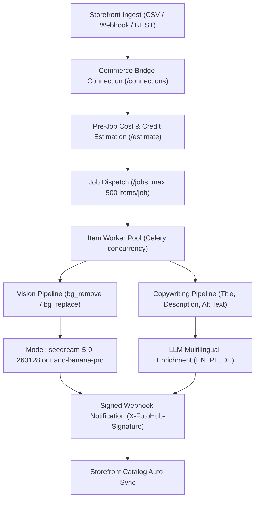

# E-Commerce Catalog Automation

Orchestrate bulk product packshot generation, studio background replacement, and multilingual SEO listing enrichment across thousands of store SKUs.

Powered by FOTOhub's **Commerce Bridge** (`server/commerce-bridge/`), this blueprint connects Shopify, WooCommerce, Magento 2, PrestaShop, and custom storefronts through a unified asynchronous batch engine backed by Celery and Redis.

---

## Architectural Workflow



---

## Operations & USD Pricing

Commerce Bridge operations are billed directly against the merchant's prepaid USD wallet at exact 1:1 pass-through rates published in `GET /v1/pricing`:

| Job Kind | Operation / Model Key | Cost / Item (USD) | Description |
|:---|:---|:---|:---|
| `bg_remove` | `remove_background` | **$0.107181** | Clean alpha isolation with edge feathering |
| `bg_replace` | `replace_background` | **$0.214362** | Studio background replacement (marble, wood, minimal) |
| `image_generate` | `seedream-5-0-260128` | **$0.031500** | Ultra-fast lifestyle scene packshot generation |
| `image_generate` | `dola-seedream-5-0-pro` | **$0.048000** | Enhanced reflections for jewelry & electronics |
| `image_generate` | `nano-banana-pro` | **$0.134000** | State-of-the-art studio lighting and textures |
| `description` | `claude-haiku-4.5` | **~$0.002000** | Structured HTML/Markdown multilingual product copy |
| `alt_text` | `claude-haiku-4.5` | **~$0.000800** | Image SEO and accessibility alt descriptions |
| `complete_listing` | `seedream-5-0` + copy | **~$0.034300** | Full suite: packshot + description + alt text |

::: tip Dynamic Preflight Estimation
The `/v1/commerce/estimate` endpoint inspects current live rates from `GET /v1/pricing` and calculates the exact `total_usd` required before dispatching thousands of items. If your wallet balance (`available_usd`) cannot cover the run, the job is gated prior to execution.
:::

---

## Implementation Guide

### 1. Register Store Connection

First, register a connection to receive a dedicated signing secret:

```bash
curl -X POST https://apis.fotohub.app/v1/commerce/connections \
  -H "Authorization: Bearer $FOTOHUB_API_KEY" \
  -H "Content-Type: application/json" \
  -d '{
    "platform": "shopify",
    "store_name": "Nordic Home Goods",
    "store_url": "https://nordic-home.myshopify.com",
    "callback_url": "https://nordic-home.myshopify.com/api/webhooks/fotohub"
  }'
```

Response:
```json
{
  "id": "conn_4910a8d",
  "status": "active",
  "callback_secret": "cbsec_98f12a34bc7e89..."
}
```

### 2. Submit Bulk Catalog Job

::: code-group

```python [Python]
from fotohub import FotoHub
import os

client = FotoHub(api_key=os.environ["FOTOHUB_API_KEY"])

# Submit 50 SKUs for background replacement and listing copywriting
catalog_items = [
    {
        "sku": "SKU-CERAMIC-VASE-01",
        "image_url": "https://cdn.store.com/raw/vase_raw.jpg",
        "product": {
            "title": "Minimalist Matte Ceramic Vase",
            "category": "Home Decor",
            "attributes": {"color": "Terracotta", "height": "25cm", "material": "Ceramic"},
            "price": 49.99
        }
    },
    {
        "sku": "SKU-LINEN-THROW-02",
        "image_url": "https://cdn.store.com/raw/throw_raw.jpg",
        "product": {
            "title": "Washed French Linen Throw Blanket",
            "category": "Bedding",
            "attributes": {"color": "Oatmeal", "size": "130x170cm"},
            "price": 89.00
        }
    }
]

# Step 1: Pre-calculate cost
estimate = client.post("/v1/commerce/estimate", {
    "kind": "complete_listing",
    "model": "seedream-5-0-260128",
    "item_count": len(catalog_items)
})
print(f"Total USD required: ${estimate['total_usd']:.4f} (Sufficient: {estimate['sufficient']})")

# Step 2: Dispatch batch job
job = client.post("/v1/commerce/jobs", {
    "connection_id": "conn_4910a8d",
    "kind": "complete_listing",
    "model": "seedream-5-0-260128",
    "options": {
        "background": "soft daylight marble podium with subtle shadows",
        "language": "en",
        "tone": "luxury",
        "aspect_ratio": "1:1"
    },
    "items": catalog_items
})

print(f"Dispatched job {job['job_id']}: status {job['status']}")
```

```typescript [TypeScript]
import { FotoHub } from "fotohub";

const client = new FotoHub({ apiKey: process.env.FOTOHUB_API_KEY! });

async function processCatalog() {
  const job = await client.post("/v1/commerce/jobs", {
    connection_id: "conn_4910a8d",
    kind: "complete_listing",
    model: "nano-banana-pro",
    options: {
      background: "clean white studio with soft ground shadow",
      language: "pl",
      tone: "professional",
      aspect_ratio: "1:1",
    },
    items: [
      {
        sku: "PL-CHAIR-001",
        image_url: "https://cdn.store.pl/raw/chair.jpg",
        product: {
          title: "Krzesło Drewniane Dębowe Scandi",
          category: "Meble",
          attributes: { material: "Dąb lity", kolor: "Naturalny" },
          price: 499.0,
        },
      },
    ],
  });

  console.log("Commerce Job dispathed:", job.data.job_id);
}

processCatalog();
```

```go [Go]
package main

import (
	"bytes"
	"encoding/json"
	"fmt"
	"io"
	"net/http"
	"os"
)

func main() {
	payload := map[string]interface{}{
		"connection_id": "conn_4910a8d",
		"kind":          "bg_replace",
		"model":         "seedream-5-0-260128",
		"options": map[string]interface{}{
			"background": "neutral architectural concrete podium",
		},
		"items": []map[string]interface{}{
			{
				"sku":       "ACC-WATCH-09",
				"image_url": "https://cdn.store.com/watch.jpg",
			},
		},
	}

	body, _ := json.Marshal(payload)
	req, _ := http.NewRequest("POST", "https://apis.fotohub.app/v1/commerce/jobs", bytes.NewBuffer(body))
	req.Header.Set("Authorization", "Bearer "+os.Getenv("FOTOHUB_API_KEY"))
	req.Header.Set("Content-Type", "application/json")

	resp, err := http.DefaultClient.Do(req)
	if err != nil {
		panic(err)
	}
	defer resp.Body.Close()

	respBody, _ := io.ReadAll(resp.Body)
	fmt.Println("Job Status:", string(respBody))
}
```

```bash [cURL]
curl -X POST https://apis.fotohub.app/v1/commerce/jobs \
  -H "Authorization: Bearer $FOTOHUB_API_KEY" \
  -H "Content-Type: application/json" \
  -d '{
    "connection_id": "conn_4910a8d",
    "kind": "complete_listing",
    "model": "seedream-5-0-260128",
    "options": {
      "background": "luxury wooden shelf",
      "language": "en",
      "tone": "luxury"
    },
    "items": [
      {
        "sku": "PARFUM-01",
        "image_url": "https://cdn.store.com/perfume.png",
        "product": {
          "title": "Amber & Cedarwood Eau de Parfum",
          "category": "Fragrance"
        }
      }
    ]
  }'
```

:::

---

## Webhook Callback Signature Verification

Every callback delivered to your store includes the `X-FotoHub-Signature` header, which is the HMAC-SHA256 hex digest of the raw request payload calculated using your `callback_secret`.

```python
import hmac
import hashlib

def verify_commerce_callback(raw_body: bytes, signature: str, secret: str) -> bool:
    expected = hmac.new(secret.encode("utf-8"), raw_body, hashlib.sha256).hexdigest()
    return hmac.compare_digest(signature, expected)
```
