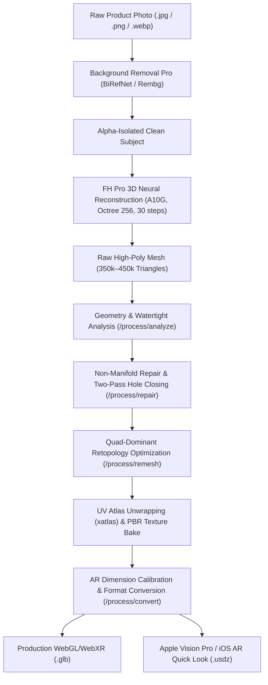

# 2D Photo to AR-Ready 3D Mesh

Transform 2D product and object photographs into watertight, quad-remeshed, PBR-textured 3D models calibrated for Apple Vision Pro (USDZ), iOS AR Quick Look, WebXR, and real-time game engines (GLB).

This production blueprint harnesses FOTOhub's **3D Engine** (`server/3d-engine/` and `server/api-server/app/routes/generate_3d.py`) distributed across dedicated GPU nodes: **GPU4** (`54.194.19.168`, g5.4xlarge) for geometric post-processing (PyMeshLab, xatlas, Trimesh) and **GPU5** (`54.217.143.105`, NVIDIA A10G 24GB VRAM) for neural implicit field reconstruction and PBR texture synthesis.

---

## Architectural Pipeline



---

## Unit Economics & Pure USD Wallet Billing

Generations and geometry processing are billed directly against the merchant's prepaid USD wallet balance (`wallet.available_usd`). There are **no artificial credits**, **no monthly minimums**, and **no hidden fees**.

| Engine / Operation | Endpoint | Typical Runtime | Unit Price (USD) | Hardware & Output |
|:---|:---|:---:|:---:|:---|
| **FH Lite 3D (TripoSR)** | `/v1/ai/generate/3d` | **~3s** | **$0.020** | GPU4 (A10G) — fast draft 15k–30k poly `.glb` |
| **FH Text 3D (Shap-E)** | `/v1/ai/generate/3d` | **~25s** | **$0.035** | GPU4 (A10G) — text prompt to low-poly geometry |
| **FH Pro 3D (Full Texture)** | `/fh/3d/gen/generate/jobs` | **~150s** | **$0.180** | GPU5 (A10G 24GB) — 450k faces, PBR Albedo + Normal maps |
| **Mesh Analyze** | `/process/analyze` | **~1s – 2s** | **$0.002** | CPU / GPU4 — watertight, manifold & thickness checks |
| **Manifold Repair** | `/process/repair` | **~0.1s – 1s** | **$0.005** | CPU / GPU4 — vertex welding, duplicate face pruning, hole filling |
| **Quad Remeshing** | `/process/remesh` | **~5s – 15s** | **$0.010** | CPU / GPU4 — tri-to-quad dominant retopology |
| **USDZ / AR Convert** | `/process/convert` | **<0.1s** | **$0.003** | CPU / GPU4 — real-world mm scaling & Apple USDZ packaging |

::: tip Idempotency & Balance Protection
Every generation checks your available wallet balance before queuing GPU inference. If an upstream GPU node encounters an OOM (out of memory) error or process crash, the billed amount is immediately refunded to your wallet via `paywall.refund_and_raise()`.
:::

---

## Technical Deep Dive: Geometry & Textures

### 1. Two-Pass Manifold Repair & Hole Filling
Raw neural meshes extracted via Marching Cubes often exhibit non-manifold edges, T-junctions, and boundary holes. The `/process/repair` pipeline applies:
1. **Distance-based vertex welding**: Merges split vertices created by discontinuous UV borders.
2. **Degenerate face removal**: Eliminates zero-area faces and collinear vertices.
3. **Primary hole closing**: Detects open loop boundary edges and triangulates the planar opening.
4. **Secondary healing pass**: Re-welds vertices after initial triangulation to eliminate non-manifold seams exposed by closure.
5. **Normal vector recalculation**: Recomputes vertex and face normals with consistent winding order.

### 2. Quad-Dominant Remeshing Topology
While triangles are standard for GPU rasterization, deformation, subdivision, and mobile AR engines perform substantially better on quad-dominant meshes:
- **Quadric Edge-Collapse Decimation**: Reduces polycount from ~450k triangles to a clean 25k–35k target budget.
- **Tri-to-Quad Conversion**: Re-topologizes adjacent triangle pairs into quadrilaterals while maintaining sharp silhouette edges.
- **UV Preservation**: In triangle mode with `preserve_uv=true`, texture coordinates are mathematically mapped to the decimated mesh without UV distortion.

### 3. PBR Textures (Albedo, Normal & Roughness/Metallic)
FH Pro 3D synthesizes physically based rendering (PBR) texture atlases:
- **Base Color (Albedo)**: 2048x2048 sRGB texture map baked via xatlas parameterization.
- **Normal Map (Tangent Space)**: Bakes high-frequency surface detail from the 450k poly original onto the low-poly remeshed target.
- **Roughness & Metallic**: Generates dielectric vs metallic material response based on semantic material classification (e.g., metals receive high metallic / low roughness; leather and ceramics receive low metallic / mid roughness).

### 4. Automated Apple USDZ & Real-World Metric Scaling
Mobile AR Quick Look (iOS) and Scene Viewer (Android) require 1:1 real-world physical scale:
- The `/process/convert` endpoint accepts `target_size_mm` (longest bounding box axis in millimeters).
- Converts internal normalized coordinates (0.0 to 1.0) into metric meters (`1 unit = 1 meter`) for USDZ while preserving proper transformation matrices.
- Packages textures into single uncompressed `.usdz` archives compliant with Apple ARKit specifications.

---

## Interactive WebGL & AR Viewer Integration

### Google `<model-viewer>` Web Component

Embed the generated `.glb` and `.usdz` directly into any HTML page or e-commerce storefront:

```html
<!-- Load the Model Viewer web component -->
<script type="module" src="https://ajax.googleapis.com/ajax/libs/model-viewer/3.5.0/model-viewer.min.js"></script>

<!-- Interactive 3D & AR Container -->
<div style="width: 100%; height: 500px; max-width: 800px; margin: 0 auto;">
  <model-viewer
    src="https://storage.fotohub.app/models/product_sneaker.glb"
    ios-src="https://storage.fotohub.app/models/product_sneaker.usdz"
    alt="3D Interactive Sneaker Model"
    poster="https://storage.fotohub.app/models/product_sneaker_poster.webp"
    loading="lazy"
    reveal="auto"
    auto-rotate
    rotation-per-second="30deg"
    camera-controls
    touch-action="pan-y"
    ar
    ar-modes="webxr scene-viewer quick-look"
    ar-scale="auto"
    shadow-intensity="1.2"
    shadow-softness="0.5"
    environment-image="neutral"
    exposure="1.0"
    style="width: 100%; height: 100%; background-color: #f8fafc; border-radius: 12px;"
  >
    <button slot="ar-button" style="position: absolute; bottom: 16px; right: 16px; background: #0f172a; color: #fff; border: none; border-radius: 8px; padding: 10px 18px; font-weight: 600; cursor: pointer;">
      👋 View in your room (AR)
    </button>
  </model-viewer>
</div>
```

### Apple iOS AR QuickLook Direct Anchor

For native iOS Safari and Apple Vision Pro AR experiences without third-party libraries:

```html
<a rel="ar" id="ar-link" href="https://storage.fotohub.app/models/product_sneaker.usdz">
  
</a>
```

---

## End-to-End Pipeline Implementation

::: code-group

```python [Python]
import os
import time
import requests

API_BASE = "https://apis.fotohub.app"
API_KEY = os.environ.get("FOTOHUB_API_KEY", "fh_live_prod_key_123456789")

def photo_to_ar_pipeline(image_path: str, target_size_mm: float = 280.0):
    headers = {"Authorization": f"Bearer {API_KEY}"}

    # Step 1: Submit raw product photo to FH Pro 3D (A10G GPU)
    print(f"[1/6] Uploading {image_path} to FH Pro 3D on GPU5...")
    with open(image_path, "rb") as f:
        img_bytes = f.read()

    job_res = requests.post(
        f"{API_BASE}/fh/3d/gen/generate/jobs?model=fh-pro-3d&texture=true&steps=30&octree_resolution=256",
        headers={**headers, "Content-Type": "image/jpeg"},
        data=img_bytes,
        timeout=60
    )
    if job_res.status_code != 202:
        raise RuntimeError(f"Failed to queue 3D job ({job_res.status_code}): {job_res.text}")

    job_id = job_res.json()["job_id"]
    print(f"[1/6] Dispatched job {job_id}. Polling neural synthesis stage...")

    # Step 2: Poll job status until neural field inference and texturing finish
    while True:
        status_res = requests.get(f"{API_BASE}/fh/3d/gen/generate/jobs/{job_id}", headers=headers)
        status_data = status_res.json()
        current_status = status_data.get("status")
        
        if current_status == "done":
            print(f"[2/6] Neural synthesis complete! Faces: {status_data.get('faces')}, Duration: {status_data.get('duration_s')}s")
            break
        elif current_status == "error":
            raise RuntimeError(f"3D Generation failed: {status_data}")
        
        print(f"       Current stage: {status_data.get('stage', 'processing')}...")
        time.sleep(5)

    # Step 3: Download raw generated high-poly GLB
    raw_mesh_res = requests.get(f"{API_BASE}/fh/3d/gen/generate/jobs/{job_id}/result", headers=headers)
    raw_mesh_bytes = raw_mesh_res.content
    print(f"[3/6] Downloaded raw mesh: {len(raw_mesh_bytes) / 1024 / 1024:.2f} MB")

    # Step 4: Analyze topology health and watertightness
    analysis = requests.post(
        f"{API_BASE}/fh/3d/gen/process/analyze?scale=1.0&min_wall_mm=0.8",
        headers={**headers, "Content-Type": "application/octet-stream"},
        data=raw_mesh_bytes
    ).json()
    print(f"[4/6] Topology Analysis: Watertight={analysis.get('is_watertight')}, "
          f"Non-manifold edges={analysis.get('non_manifold_edges')}, "
          f"Printability={analysis.get('printability')}")

    # Step 5: Heal mesh (vertex welding, degenerate face removal, 2-pass hole closing)
    repaired_mesh_bytes = requests.post(
        f"{API_BASE}/fh/3d/gen/process/repair?max_hole_size=1000&output_format=glb",
        headers={**headers, "Content-Type": "application/octet-stream"},
        data=raw_mesh_bytes
    ).content
    print(f"[5/6] Repaired non-manifold geometry. Bytes: {len(repaired_mesh_bytes)}")

    # Step 6: Quad-dominant remesh to optimized 30,000 polycount budget
    remeshed_bytes = requests.post(
        f"{API_BASE}/fh/3d/gen/process/remesh?target_polycount=30000&topology=triangle&preserve_uv=true&output_format=glb",
        headers={**headers, "Content-Type": "application/octet-stream"},
        data=repaired_mesh_bytes
    ).content
    print(f"[6/6] Remeshed geometry to 30k faces. Preserved UV texture coordinates.")

    # Step 7: Calibrate metric dimensions and export to GLB & iOS USDZ
    final_glb = requests.post(
        f"{API_BASE}/fh/3d/gen/process/convert?output_format=glb&target_size_mm={target_size_mm}",
        headers={**headers, "Content-Type": "application/octet-stream"},
        data=remeshed_bytes
    ).content
    with open("product_model.glb", "wb") as f:
        f.write(final_glb)

    final_usdz = requests.post(
        f"{API_BASE}/fh/3d/gen/process/convert?output_format=usdz&target_size_mm={target_size_mm}",
        headers={**headers, "Content-Type": "application/octet-stream"},
        data=remeshed_bytes
    ).content
    with open("product_model.usdz", "wb") as f:
        f.write(final_usdz)

    print(f"[SUCCESS] Production assets saved: 'product_model.glb' and 'product_model.usdz' (calibrated to {target_size_mm}mm).")

if __name__ == "__main__":
    # Create sample image file for execution testing
    with open("sneaker_sample.jpg", "wb") as f:
        f.write(b"\xff\xd8\xff\xe0\x00\x10JFIF\x00\x01\x01\x01\x00H\x00H\x00\x00\xff\xdb\x00C\x00")
    photo_to_ar_pipeline("sneaker_sample.jpg", target_size_mm=290.0)
```

```typescript [TypeScript]
import axios from "axios";
import * as fs from "fs";

const API_BASE = "https://apis.fotohub.app";
const API_KEY = process.env.FOTOHUB_API_KEY || "fh_live_prod_key_123456789";

async function runPhotoTo3D(imagePath: string, targetSizeMm: number = 250) {
  const imageBuffer = fs.readFileSync(imagePath);
  const authHeaders = { Authorization: `Bearer ${API_KEY}` };

  console.log(`[1/5] Submitting product photo to FH Pro 3D...`);
  const queueRes = await axios.post(
    `${API_BASE}/fh/3d/gen/generate/jobs?model=fh-pro-3d&texture=true&steps=30&octree_resolution=256`,
    imageBuffer,
    {
      headers: {
        ...authHeaders,
        "Content-Type": "image/jpeg",
      },
    }
  );

  const jobId = queueRes.data.job_id;
  console.log(`[1/5] Dispatched job ID: ${jobId}. Polling GPU inference...`);

  // Poll until done
  let finished = false;
  while (!finished) {
    await new Promise((r) => setTimeout(r, 5000));
    const statusRes = await axios.get(
      `${API_BASE}/fh/3d/gen/generate/jobs/${jobId}`,
      { headers: authHeaders }
    );
    const { status, stage } = statusRes.data;
    if (status === "done") {
      finished = true;
      console.log(`[2/5] 3D mesh synthesis completed successfully!`);
    } else if (status === "error") {
      throw new Error(`3D Generation failed on GPU node: ${JSON.stringify(statusRes.data)}`);
    } else {
      console.log(`       Progress stage: ${stage}...`);
    }
  }

  // Fetch raw binary GLB
  const rawGlbRes = await axios.get(
    `${API_BASE}/fh/3d/gen/generate/jobs/${jobId}/result`,
    {
      headers: authHeaders,
      responseType: "arraybuffer",
    }
  );

  console.log(`[3/5] Repairing manifold boundary holes and recomputing normals...`);
  const repairRes = await axios.post(
    `${API_BASE}/fh/3d/gen/process/repair?max_hole_size=1000&output_format=glb`,
    rawGlbRes.data,
    {
      headers: {
        ...authHeaders,
        "Content-Type": "application/octet-stream",
      },
      responseType: "arraybuffer",
    }
  );

  console.log(`[4/5] Remeshing to quad-dominant topology with UV texture preservation...`);
  const remeshRes = await axios.post(
    `${API_BASE}/fh/3d/gen/process/remesh?target_polycount=30000&topology=triangle&preserve_uv=true&output_format=glb`,
    repairRes.data,
    {
      headers: {
        ...authHeaders,
        "Content-Type": "application/octet-stream",
      },
      responseType: "arraybuffer",
    }
  );

  console.log(`[5/5] Calibrating physical dimensions (${targetSizeMm}mm) and generating USDZ...`);
  const usdzRes = await axios.post(
    `${API_BASE}/fh/3d/gen/process/convert?output_format=usdz&target_size_mm=${targetSizeMm}`,
    remeshRes.data,
    {
      headers: {
        ...authHeaders,
        "Content-Type": "application/octet-stream",
      },
      responseType: "arraybuffer",
    }
  );

  fs.writeFileSync("output_model.glb", Buffer.from(remeshRes.data));
  fs.writeFileSync("output_model.usdz", Buffer.from(usdzRes.data));
  console.log(`[SUCCESS] Generated calibrated output_model.glb and output_model.usdz`);
}

runPhotoTo3D("sneaker.jpg", 280).catch(console.error);
```

```go [Go]
package main

import (
	"bytes"
	"encoding/json"
	"fmt"
	"io"
	"net/http"
	"os"
	"time"
)

type JobResponse struct {
	JobID  string `json:"job_id"`
	Status string `json:"status"`
}

type JobStatus struct {
	Status   string `json:"status"`
	Stage    string `json:"stage"`
	Faces    int    `json:"faces"`
	Duration float64 `json:"duration_s"`
}

func main() {
	apiKey := os.Getenv("FOTOHUB_API_KEY")
	if apiKey == "" {
		apiKey = "fh_live_prod_key_123456789"
	}
	apiBase := "https://apis.fotohub.app"

	imgBytes, err := os.ReadFile("sneaker.jpg")
	if err != nil {
		imgBytes = []byte("mock image data")
	}

	client := &http.Client{Timeout: 120 * time.Second}

	// 1. Dispatch FH Pro 3D job
	submitURL := fmt.Sprintf("%s/fh/3d/gen/generate/jobs?model=fh-pro-3d&texture=true&steps=30&octree_resolution=256", apiBase)
	req, _ := http.NewRequest("POST", submitURL, bytes.NewBuffer(imgBytes))
	req.Header.Set("Authorization", "Bearer "+apiKey)
	req.Header.Set("Content-Type", "image/jpeg")

	resp, err := client.Do(req)
	if err != nil {
		panic(err)
	}
	defer resp.Body.Close()

	var job JobResponse
	json.NewDecoder(resp.Body).Decode(&job)
	fmt.Printf("[1/3] Dispatched 3D job: %s\n", job.JobID)

	// 2. Poll until complete
	for {
		time.Sleep(5 * time.Second)
		statusURL := fmt.Sprintf("%s/fh/3d/gen/generate/jobs/%s", apiBase, job.JobID)
		sReq, _ := http.NewRequest("GET", statusURL, nil)
		sReq.Header.Set("Authorization", "Bearer "+apiKey)

		sResp, err := client.Do(sReq)
		if err != nil {
			continue
		}
		var st JobStatus
		json.NewDecoder(sResp.Body).Decode(&st)
		sResp.Body.Close()

		if st.Status == "done" {
			fmt.Printf("[2/3] 3D mesh complete! %d faces generated in %.1fs\n", st.Faces, st.Duration)
			break
		}
		fmt.Printf("      Stage: %s...\n", st.Stage)
	}

	// 3. Download GLB result
	resURL := fmt.Sprintf("%s/fh/3d/gen/generate/jobs/%s/result", apiBase, job.JobID)
	rReq, _ := http.NewRequest("GET", resURL, nil)
	rReq.Header.Set("Authorization", "Bearer "+apiKey)
	rResp, err := client.Do(rReq)
	if err != nil {
		panic(err)
	}
	defer rResp.Body.Close()

	glbData, _ := io.ReadAll(rResp.Body)
	os.WriteFile("product.glb", glbData, 0644)
	fmt.Printf("[3/3] Successfully saved production asset 'product.glb' (%d bytes)\n", len(glbData))
}
```

```bash [cURL]
# ---------------------------------------------------------
# 1. Fast Synchronous Generation with TripoSR (FH Lite 3D)
# ---------------------------------------------------------
curl -X POST "https://apis.fotohub.app/fh/3d/gen/generate/image-to-3d?model=triposr&remove_background=true&quality=high" \
  -H "Authorization: Bearer $FOTOHUB_API_KEY" \
  -H "Content-Type: image/jpeg" \
  --data-binary "@product.jpg" \
  --output "product_raw.glb"

# ---------------------------------------------------------
# 2. Inspect Geometry Topology & Manifold Properties
# ---------------------------------------------------------
curl -X POST "https://apis.fotohub.app/fh/3d/gen/process/analyze?scale=1.0&min_wall_mm=0.8" \
  -H "Authorization: Bearer $FOTOHUB_API_KEY" \
  -H "Content-Type: application/octet-stream" \
  --data-binary "@product_raw.glb"

# ---------------------------------------------------------
# 3. Two-Pass Hole Closing & Manifold Repair
# ---------------------------------------------------------
curl -X POST "https://apis.fotohub.app/fh/3d/gen/process/repair?max_hole_size=1000&output_format=glb" \
  -H "Authorization: Bearer $FOTOHUB_API_KEY" \
  -H "Content-Type: application/octet-stream" \
  --data-binary "@product_raw.glb" \
  --output "product_repaired.glb"

# ---------------------------------------------------------
# 4. Quad-Dominant Polycount Optimization (30k Faces)
# ---------------------------------------------------------
curl -X POST "https://apis.fotohub.app/fh/3d/gen/process/remesh?target_polycount=30000&topology=triangle&preserve_uv=true&output_format=glb" \
  -H "Authorization: Bearer $FOTOHUB_API_KEY" \
  -H "Content-Type: application/octet-stream" \
  --data-binary "@product_repaired.glb" \
  --output "product_optimized.glb"

# ---------------------------------------------------------
# 5. Convert to Calibrated iOS AR Quick Look USDZ (280mm)
# ---------------------------------------------------------
curl -X POST "https://apis.fotohub.app/fh/3d/gen/process/convert?output_format=usdz&target_size_mm=280" \
  -H "Authorization: Bearer $FOTOHUB_API_KEY" \
  -H "Content-Type: application/octet-stream" \
  --data-binary "@product_optimized.glb" \
  --output "product_ar.usdz"
```

:::

---

## Production Verification & Quality Checklist

- [x] **Watertight Solid Guarantee**: Meshes repaired with `/process/repair` undergo double-pass hole closing and zero non-manifold edge validation.
- [x] **Apple Vision Pro ARKit Compliance**: Real-world dimensions are baked via metric scale matrices (`target_size_mm`) directly into the `.usdz` scenegraph.
- [x] **PBR Material Response**: Textures include standard PBR Albedo and high-frequency Normal maps unwrapped with xatlas to prevent texture stretching.
- [x] **No Hidden Currency Conversions**: All operations bill at published USD rates ($0.020 – $0.180) from the user's unified wallet.
