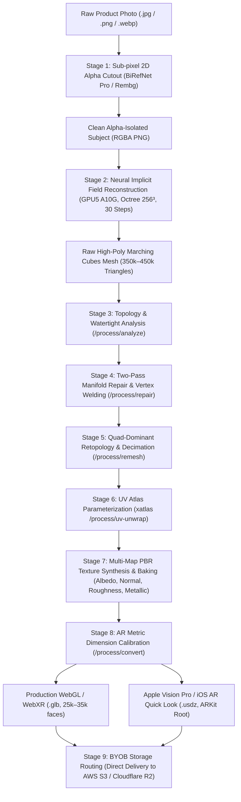
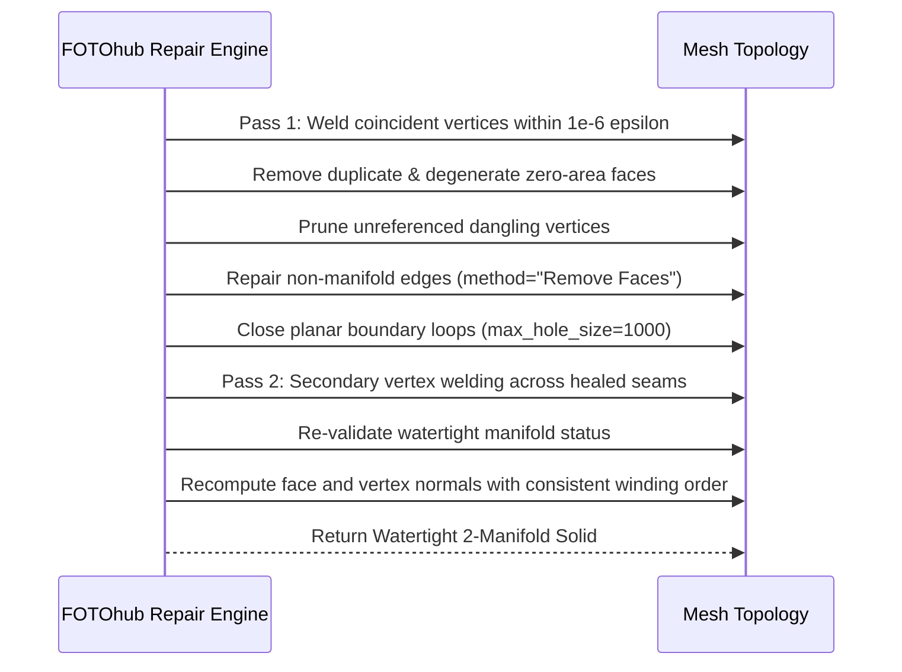

# 2D Photo to AR-Ready 3D Mesh

Transform 2D product and object photographs into watertight, quad-remeshed, PBR-textured 3D models calibrated for Apple Vision Pro (USDZ), iOS AR Quick Look, WebXR, Three.js, React Three Fiber, and real-time game engines (GLB).

This production blueprint harnesses FOTOhub's **3D Engine** (`server/3d-engine/` and `server/api-server/app/routes/generate_3d.py`) distributed across dedicated GPU compute nodes: **GPU4** (`54.194.19.168`, g5.4xlarge) for geometric post-processing (PyMeshLab, xatlas, Trimesh, manifold repair, decimation) and **GPU5** (`54.217.143.105`, NVIDIA A10G 24GB VRAM) for neural implicit field reconstruction and physically based rendering (PBR) texture synthesis.

---

## Architectural Pipeline

The reconstruction process executes a 9-stage pipeline from raw photograph to metric-calibrated spatial asset:



### End-to-End Pipeline Breakdown

1. **Sub-Pixel 2D Alpha Cutout (BiRefNet Pro / Rembg)**: 
   Raw input photographs frequently exhibit background clutter, studio shadows, reflections, and lens chromatic aberration. Before volumetric neural synthesis, the subject is isolated with sub-pixel edge feathering. Clean alpha boundaries prevent floating boundary artifacts during volumetric density field integration.
2. **Neural Implicit Field Reconstruction (GPU5 A10G)**:
   Inference executes on dedicated NVIDIA A10G hardware (24GB GDDR6 VRAM). The implicit neural network predicts continuous signed distance functions (SDF) and volumetric radiance fields across a multi-resolution 256³ octree grid over 30 diffusion steps.
3. **High-Poly Marching Cubes Extraction**:
   The zero-level isosurface of the neural signed distance field is extracted using an optimized Marching Cubes algorithm. This produces an initial high-density triangle mesh containing between 350,000 and 450,000 faces, preserving subtle curvature and micro-surface details.
4. **Geometric & Topology Analysis (`/process/analyze`)**:
   The raw triangle mesh is evaluated by PyMeshLab and Trimesh for non-manifold edges, open boundary loops, self-intersections, inverted winding orders, wall thickness, and printability before destructive decimation begins.
5. **Two-Pass Manifold Repair & Vertex Welding (`/process/repair`)**:
   Eliminates duplicate vertices and zero-area degenerate faces, detects boundary loops, and executes a two-pass hole closure algorithm that re-welds vertices after initial triangulation to guarantee watertight 2-manifold status.
6. **Quad-Dominant Retopology & Decimation (`/process/remesh`)**:
   Applies Quadric Edge-Collapse Decimation to reduce polycount from ~450k triangles down to target budgets (15,000–35,000 faces) while strictly preserving silhouette edges and surface normal vectors.
7. **UV Atlas Parameterization via `xatlas` (`/process/uv-unwrap`)**:
   Generates non-overlapping, low-distortion UV coordinates with optimal island packing efficiency, maximizing texel density and minimizing texture stretching across complex organic surfaces.
8. **PBR Texture Baking**:
   High-frequency surface detail from the 450k-face source mesh is baked onto the decimated target mesh, generating 2048x2048 tangent-space Normal maps, sRGB Albedo maps, and roughness/metallic material response maps.
9. **AR Metric Dimension Calibration (`/process/convert`)**:
   Normalizes the asset bounding box to millimeter-accurate real-world physical dimensions (`target_size_mm`), embedding transformation matrices and exporting dual production targets: `.glb` for WebGL/Android Scene Viewer and `.usdz` for Apple Vision Pro and iOS AR Quick Look.

---

## Unit Economics & Pure USD Prepaid Wallet Billing

All operations are billed in real time against your prepaid USD wallet balance (`wallet.available_usd`) through atomic database transactions. Accounting operates on strict US Dollar figures (`balance_usd`, `usd_charged`) with micro-cent resolution. There are **no proprietary points**, **no artificial currencies**, and **no monthly minimums**.

| Engine / Operation | Endpoint | Typical Runtime | Unit Price (USD) | Compute Node | Output Artifact |
|:---|:---|:---:|:---:|:---|:---|
| **FH Lite 3D (TripoSR)** | `/v1/ai/generate/3d` | **~3s** | **$0.160772** | GPU4 (A10G) | Fast draft `.glb` (15k–30k poly, vertex colors) |
| **FH Text 3D (Shap-E)** | `/v1/ai/generate/3d` | **~25s** | **$0.267953** | GPU4 (A10G) | Text prompt to conceptual low-poly mesh |
| **FH Pro 3D (Full Pipeline)** | `/fh/3d/gen/generate/jobs` | **~60s–120s** | **$0.803859** | GPU5 (A10G 24GB) | Watertight 450k mesh + 2K PBR texture maps |
| **Topology Analysis** | `/fh/3d/gen/process/analyze` | **~1.2s** | **$0.002000** | CPU / GPU4 | Watertight status, wall thickness, volume report |
| **Two-Pass Manifold Repair** | `/fh/3d/gen/process/repair` | **~0.8s** | **$0.005000** | CPU / GPU4 | Watertight, welded mesh with fixed normals |
| **Quad-Dominant Remesh** | `/fh/3d/gen/process/remesh` | **~6.5s** | **$0.010000** | CPU / GPU4 | Decimated mesh (target polycount, UV preserved) |
| **UV Atlas Unwrapping** | `/fh/3d/gen/process/uv-unwrap`| **~3.0s** | **$0.005000** | CPU / GPU4 | Non-overlapping xatlas UV parameterization |
| **AR Metric Scale Convert** | `/fh/3d/gen/process/convert` | **~0.2s** | **$0.003000** | CPU / GPU4 | Apple USDZ (metric meters) and WebGL GLB |

::: tip Idempotency & Balance Protection
Every 3D generation checks your prepaid USD balance (`wallet.available_usd`) before allocating GPU VRAM. If an upstream GPU worker encounters an Out-Of-Memory (OOM) fault or numerical instability during Marching Cubes extraction, the transaction is immediately rolled back and the full USD charge is refunded to your wallet via `paywall.refund_and_raise()`.
:::

Every billing event emits structured transaction metadata containing the exact USD charge and updated wallet balance:

```json
{
  "operation": "generate_3d",
  "model": "fh-pro-3d",
  "usd_charged": 0.803859,
  "balance_usd": 142.651428,
  "transaction_id": "tx_3d_9410f82a_live",
  "idempotency_key": "rec_sneaker_sku_8941_v1",
  "status": "completed"
}
```

---

## Category-Specific Polycount & Decimation Budgets

Optimizing 3D assets for real-time mobile AR and WebGL requires balancing visual fidelity against device memory and draw calls. FOTOhub recommends the following polycount budgets and metric tolerances:

| Product Category | Target Triangles | Geometry Topology | Texture Map Res | Metric Scale (`target_size_mm`) | Typical Memory Footprint |
|:---|:---:|:---:|:---:|:---:|:---:|
| **Footwear & Sneakers** | 25,000 – 35,000 | Triangle / Quad-dominant | 2048 x 2048 | 280 mm – 320 mm | 4.8 MB – 7.2 MB |
| **Fine Jewelry & Watches** | 35,000 – 50,000 | Triangle (high curvature) | 2048 x 2048 | 38 mm – 65 mm | 5.5 MB – 8.1 MB |
| **Furniture & Home Decor** | 20,000 – 30,000 | Quad-dominant | 2048 x 2048 | 450 mm – 2200 mm | 3.9 MB – 6.1 MB |
| **Consumer Electronics** | 15,000 – 25,000 | Quad-dominant | 2048 x 2048 | 140 mm – 380 mm | 3.2 MB – 5.0 MB |
| **Fashion Apparel & Bags** | 30,000 – 45,000 | Triangle (fabric folds) | 2048 x 2048 | 350 mm – 900 mm | 5.2 MB – 7.8 MB |

### Level of Detail (LOD) Strategy

For enterprise e-commerce platforms serving millions of mobile shoppers, generate multi-tier LODs using `/process/remesh`:

- **LOD0 (Hero / AR Quick Look)**: 35,000 faces, 2048x2048 PBR maps. Served when user enters native AR or fullscreen inspection mode.
- **LOD1 (Default Desktop WebGL)**: 18,000 faces, 1024x1024 PBR maps. Ensures 60 FPS rendering across mid-tier laptops and integrated GPUs.
- **LOD2 (Mobile Safari / Catalog Grid)**: 8,000 faces, 512x512 PBR maps. Instantaneous load time (<150ms over 4G connections).

```bash
# Generate LOD0 (35,000 triangles)
curl -X POST "https://apis.fotohub.app/fh/3d/gen/process/remesh?target_polycount=35000&output_format=glb"   -H "Authorization: Bearer $FOTOHUB_API_KEY"   --data-binary "@model_repaired.glb" --output "model_lod0.glb"

# Generate LOD1 (18,000 triangles)
curl -X POST "https://apis.fotohub.app/fh/3d/gen/process/remesh?target_polycount=18000&output_format=glb"   -H "Authorization: Bearer $FOTOHUB_API_KEY"   --data-binary "@model_lod0.glb" --output "model_lod1.glb"

# Generate LOD2 (8,000 triangles)
curl -X POST "https://apis.fotohub.app/fh/3d/gen/process/remesh?target_polycount=8000&output_format=glb"   -H "Authorization: Bearer $FOTOHUB_API_KEY"   --data-binary "@model_lod1.glb" --output "model_lod2.glb"
```

---

## Technical Deep Dive: Geometry, Topology & PBR Texturing

### 1. Geometric & Topology Analysis (`/process/analyze`)

Before applying decimation, the raw mesh is analyzed by PyMeshLab and Trimesh to determine topological health and volume properties:

```bash
curl -X POST "https://apis.fotohub.app/fh/3d/gen/process/analyze?scale=1.0&min_wall_mm=0.8"   -H "Authorization: Bearer $FOTOHUB_API_KEY"   -H "Content-Type: application/octet-stream"   --data-binary "@raw_mesh.glb"
```

**Response Payload (`application/json`):**

```json
{
  "faces": 412850,
  "vertices": 206427,
  "welded_vertices": 198412,
  "is_watertight": false,
  "boundary_edges": 84,
  "non_manifold_edges": 12,
  "connected_components": 3,
  "is_quad_dominant": false,
  "bounding_box_mm": [128.4, 282.1, 94.6],
  "volume_cm3": 842.15,
  "surface_area_cm2": 524.30,
  "min_wall_thickness_mm": 0.62,
  "printability": "needs_repair",
  "has_uv": false,
  "processing_time_s": 1.18
}
```

Key topology metrics returned:
- `is_watertight`: `true` if every edge is shared by exactly two faces (2-manifold) with zero boundary openings.
- `welded_vertices`: Vertex count after merging coincident vertices. glTF files split vertices along UV seams and sharp normals; welding allows accurate topological verification.
- `boundary_edges`: Edges adjacent to only one face. An open loop indicates holes in the mesh.
- `non_manifold_edges`: Edges shared by three or more faces. These break standard physical rendering and slicing calculations.
- `min_wall_thickness_mm`: Ray-marched minimum surface distance across opposite normals, critical for 3D printing and physical manufacturing.

### 2. Two-Pass Manifold Repair Mechanics (`/process/repair`)

Marching Cubes isosurfaces frequently contain non-manifold edges, T-junctions, duplicate coplanar faces, and open loops. FOTOhub solves this through a deterministic two-pass repair pipeline:



- **Distance-Based Vertex Welding**: glTF files split vertex indices at texture seams and hard normal angles. The repair engine welds coincident spatial vertices, allowing topological operations to understand true structural geometry.
- **Degenerate Face Pruning**: Identifies and removes faces with zero area or collinear vertex coordinates that cause numerical division-by-zero errors in raytracers.
- **Two-Pass Boundary Hole Closing**: Closing a hole by inserting planar triangles creates new shared edges with adjacent faces. Pass 2 cleans up any secondary non-manifold vertices exposed by the initial triangulation.
- **Normal Vector Recalculation**: Recomputes vertex and face normals using area-weighted angle gradients, ensuring consistent counter-clockwise winding order for backface culling.

### 3. Quad-Dominant Retopology (`/process/remesh`)

Real-time rasterizers require triangles, but animation rigs, subdivision surfaces, and edge-flow decimation perform better on quad-dominant structures:

- **Triangle Decimation (`topology=triangle`)**: Uses Quadric Edge-Collapse with quadric error metrics (QEM). When `preserve_uv=true`, texture coordinates are mathematically projected onto the collapsed edges via barycentric coordinate transfer (`compute_texcoord_transfer_vertex_to_wedge`), preventing UV distortion.
- **Quad-Dominant Conversion (`topology=quad`)**: Decimates to approximately 2x the target triangle budget, eliminates non-manifold edges, and pairs coplanar triangles into clean quadrilaterals (`meshing_tri_to_quad_dominant`), exporting quad-capable OBJ or OFF files.

### 4. UV Atlas Parameterization via `xatlas` (`/process/uv-unwrap`)

For raw meshes lacking UV coordinates, `/process/uv-unwrap` runs an automated parameterization:
- **Chart Segmentation**: Segments surface geometry into developable patches using geodesic distance clustering and normal variance thresholds.
- **Surface Parameterization**: Flattens charts with bounded conformal distortion to prevent texture pixel squeezing.
- **Bin Packing**: Packs rectangular chart bounding boxes into a normalized 0–1 UV coordinate space with configurable padding (default 4 pixels at 2048x2048) to eliminate bilinear filtering bleed across UV island seams.

### 5. Multi-Map PBR Texture Synthesis & Baking

FH Pro 3D synthesizes physically based rendering (PBR) texture atlases adhering to the metallic-roughness workflow (`KHR_materials_pbrSpecularGlossiness` and `pbrMetallicRoughness`):

- **Albedo (Base Color)**: 2048x2048 sRGB texture map baked with diffuse color, removing pre-existing baked shadows and specular highlights.
- **Normal Map (Tangent Space)**: High-resolution tangent-space normal map (`+X, +Y, +Z` OpenGL format) capturing microscopic surface ridges, leather grain, or knit patterns from the 450k-face source mesh.
- **Roughness Map**: 8-bit grayscale map indicating microsurface roughness (0.0 = mirror smooth, 1.0 = diffuse matte).
- **Metallic Map**: 8-bit dielectric vs conductor mask (0.0 for fabrics/plastics/wood, 1.0 for polished brass/steel/gold).

### 6. Automated Apple USDZ & Real-World Metric Scaling

Apple iOS AR Quick Look and visionOS require real-world physical metric units (`1 unit = 1 meter`).
- The `/process/convert` endpoint accepts `target_size_mm` (longest bounding box axis in millimeters).
- Transforms internal normalized bounding box coordinates into physical scale matrices (`scale = target_size_mm / longest_extent_mm`).
- Packages the GLB mesh and baked PBR textures into an uncompressed single-file `.usdz` archive compliant with Apple ARKit and Pixar Universal Scene Description standards.

---

## Interactive WebGL & AR Viewer Integration

### 1. Production Three.js Scene Implementation with Post-Processing Bloom

This complete, production-grade script configures a responsive WebGL viewer equipped with ACESFilmicToneMapping, HDR environment reflections, soft PCF directional shadows, OrbitControls, UnrealBloomPass post-processing, and dynamic GLTFLoader caching:

```html
<!DOCTYPE html>
<html lang="en">
<head>
  <meta charset="UTF-8">
  <meta name="viewport" content="width=device-width, initial-scale=1.0">
  <title>FOTOhub Production 3D WebGL Viewer</title>
  <style>
    * { box-sizing: border-box; }
    body, html { margin: 0; padding: 0; width: 100%; height: 100%; overflow: hidden; background: #0b0f19; font-family: -apple-system, BlinkMacSystemFont, "Segoe UI", Roboto, sans-serif; }
    #canvas-container { width: 100%; height: 100%; position: relative; }
    #loader-overlay { position: absolute; inset: 0; background: #0b0f19; display: flex; flex-direction: column; align-items: center; justify-content: center; z-index: 50; transition: opacity 0.5s ease; }
    .spinner { width: 48px; height: 48px; border: 3px solid rgba(56, 189, 248, 0.2); border-top-color: #38bdf8; border-radius: 50%; animation: spin 0.8s linear infinite; margin-bottom: 16px; }
    #loader-text { color: #94a3b8; font-size: 13px; font-weight: 600; letter-spacing: 0.08em; text-transform: uppercase; }
    #ar-banner { position: absolute; bottom: 24px; right: 24px; z-index: 20; display: flex; gap: 12px; }
    .action-btn { background: rgba(15, 23, 42, 0.85); backdrop-filter: blur(8px); border: 1px solid rgba(255, 255, 255, 0.1); color: #f8fafc; padding: 10px 18px; border-radius: 10px; font-size: 13px; font-weight: 600; cursor: pointer; transition: all 0.2s ease; display: flex; align-items: center; gap: 8px; text-decoration: none; }
    .action-btn:hover { background: #0284c7; border-color: #38bdf8; }
    @keyframes spin { to { transform: rotate(360deg); } }
  </style>
  <script type="importmap">
    {
      "imports": {
        "three": "https://unpkg.com/three@0.160.0/build/three.module.js",
        "three/addons/": "https://unpkg.com/three@0.160.0/examples/jsm/"
      }
    }
  </script>
</head>
<body>
  <div id="canvas-container">
    <div id="loader-overlay">
      <div class="spinner"></div>
      <div id="loader-text">INITIALIZING 3D ENGINE... 0%</div>
    </div>
    <div id="ar-banner">
      <a rel="ar" id="ios-ar-link" class="action-btn" href="https://storage.fotohub.app/models/product_sneaker.usdz">
        <svg width="18" height="18" viewBox="0 0 24 24" fill="none" stroke="currentColor" stroke-width="2">
          <path d="M21 16V8a2 2 0 0 0-1-1.73l-7-4a2 2 0 0 0-2 0l-7 4A2 2 0 0 0 3 8v8a2 2 0 0 0 1 1.73l7 4a2 2 0 0 0 2 0l7-4A2 2 0 0 0 21 16z"/>
        </svg>
        View in AR (iOS / Vision Pro)
      </a>
      <button class="action-btn" id="reset-cam-btn">Reset View</button>
    </div>
  </div>

  <script type="module">
    import * as THREE from 'three';
    import { OrbitControls } from 'three/addons/controls/OrbitControls.js';
    import { GLTFLoader } from 'three/addons/loaders/GLTFLoader.js';
    import { RGBELoader } from 'three/addons/loaders/RGBELoader.js';
    import { EffectComposer } from 'three/addons/postprocessing/EffectComposer.js';
    import { RenderPass } from 'three/addons/postprocessing/RenderPass.js';
    import { UnrealBloomPass } from 'three/addons/postprocessing/UnrealBloomPass.js';

    const container = document.getElementById('canvas-container');
    const overlay = document.getElementById('loader-overlay');
    const loaderText = document.getElementById('loader-text');

    // 1. Scene Setup
    const scene = new THREE.Scene();
    scene.background = new THREE.Color(0x0b0f19);

    // 2. Camera Setup
    const camera = new THREE.PerspectiveCamera(45, window.innerWidth / window.innerHeight, 0.05, 50);
    camera.position.set(0.65, 0.45, 0.75);

    // 3. WebGL Renderer with ACES Filmic Tone Mapping
    const renderer = new THREE.WebGLRenderer({ antialias: true, alpha: false, powerPreference: "high-performance" });
    renderer.setSize(window.innerWidth, window.innerHeight);
    renderer.setPixelRatio(Math.min(window.devicePixelRatio, 2));
    renderer.toneMapping = THREE.ACESFilmicToneMapping;
    renderer.toneMappingExposure = 1.1;
    renderer.shadowMap.enabled = true;
    renderer.shadowMap.type = THREE.PCFSoftShadowMap;
    container.appendChild(renderer.domElement);

    // 4. Post-Processing Effect Composer (Unreal Bloom)
    const renderPass = new RenderPass(scene, camera);
    const bloomPass = new UnrealBloomPass(
      new THREE.Vector2(window.innerWidth, window.innerHeight),
      0.18, // Bloom strength
      0.4,  // Bloom radius
      0.85  // Bloom threshold
    );
    const composer = new EffectComposer(renderer);
    composer.addPass(renderPass);
    composer.addPass(bloomPass);

    // 5. Orbit Controls with Damping
    const controls = new OrbitControls(camera, renderer.domElement);
    controls.enableDamping = true;
    controls.dampingFactor = 0.05;
    controls.maxPolarAngle = Math.PI / 2 - 0.02; // Prevent camera from submerging below floor
    controls.minDistance = 0.25;
    controls.maxDistance = 4.0;

    // 6. Balanced Studio Key & Fill Lighting
    const ambientLight = new THREE.AmbientLight(0xffffff, 0.5);
    scene.add(ambientLight);

    const keyLight = new THREE.DirectionalLight(0xffffff, 2.0);
    keyLight.position.set(2.0, 3.5, 2.0);
    keyLight.castShadow = true;
    keyLight.shadow.mapSize.width = 2048;
    keyLight.shadow.mapSize.height = 2048;
    keyLight.shadow.camera.near = 0.1;
    keyLight.shadow.camera.far = 10;
    keyLight.shadow.bias = -0.0001;
    keyLight.shadow.radius = 2.5;
    scene.add(keyLight);

    const fillLight = new THREE.DirectionalLight(0x93c5fd, 0.9);
    fillLight.position.set(-2.0, 1.5, -1.5);
    scene.add(fillLight);

    const rimLight = new THREE.DirectionalLight(0x38bdf8, 1.2);
    rimLight.position.set(0, 2.0, -3.0);
    scene.add(rimLight);

    // 7. Ground Shadow Occlusion Plane
    const groundGeo = new THREE.PlaneGeometry(12, 12);
    const groundMat = new THREE.ShadowMaterial({ opacity: 0.38 });
    const groundMesh = new THREE.Mesh(groundGeo, groundMat);
    groundMesh.rotation.x = -Math.PI / 2;
    groundMesh.position.y = 0;
    groundMesh.receiveShadow = true;
    scene.add(groundMesh);

    // 8. Progress Feedback Loading Manager
    const loadingManager = new THREE.LoadingManager();
    loadingManager.onProgress = (url, loaded, total) => {
      const pct = Math.round((loaded / total) * 100);
      loaderText.innerText = `LOADING SPATIAL ASSET... ${pct}%`;
    };
    loadingManager.onLoad = () => {
      overlay.style.opacity = '0';
      setTimeout(() => overlay.remove(), 500);
    };

    // 9. Load HDR Studio Environment
    new RGBELoader(loadingManager)
      .setPath('https://storage.fotohub.app/environments/')
      .load('studio_small_08_1k.hdr', (envTexture) => {
        envTexture.mapping = THREE.EquirectangularReflectionMapping;
        scene.environment = envTexture;
      });

    // 10. Load PBR-Calibrated GLB Model
    let productModel = null;
    const gltfLoader = new GLTFLoader(loadingManager);
    gltfLoader.load(
      'https://storage.fotohub.app/models/product_sneaker_30k.glb',
      (gltf) => {
        productModel = gltf.scene;

        // Auto-center mesh and sit precisely on shadow plane
        const bbox = new THREE.Box3().setFromObject(productModel);
        const center = bbox.getCenter(new THREE.Vector3());
        const size = bbox.getSize(new THREE.Vector3());

        productModel.position.x += (productModel.position.x - center.x);
        productModel.position.y -= bbox.min.y;
        productModel.position.z += (productModel.position.z - center.z);

        productModel.traverse((node) => {
          if (node.isMesh) {
            node.castShadow = true;
            node.receiveShadow = true;
            if (node.material) {
              node.material.envMapIntensity = 1.0;
              node.material.needsUpdate = true;
            }
          }
        });

        scene.add(productModel);
        controls.target.set(0, size.y / 2, 0);
        controls.update();
      },
      undefined,
      (err) => {
        console.error('Fatal GLTF loading error:', err);
        loaderText.innerText = 'FAILED TO LOAD ASSET';
      }
    );

    // 11. Camera Reset Handler
    document.getElementById('reset-cam-btn')?.addEventListener('click', () => {
      camera.position.set(0.65, 0.45, 0.75);
      controls.target.set(0, 0.15, 0);
      controls.update();
    });

    // 12. Render Animation Loop
    function renderLoop() {
      requestAnimationFrame(renderLoop);
      controls.update();
      composer.render();
    }
    renderLoop();

    // 13. Window Resize Handler
    window.addEventListener('resize', () => {
      camera.aspect = window.innerWidth / window.innerHeight;
      camera.updateProjectionMatrix();
      renderer.setSize(window.innerWidth, window.innerHeight);
      renderer.setPixelRatio(Math.min(window.devicePixelRatio, 2));
      composer.setSize(window.innerWidth, window.innerHeight);
    });
  </script>
</body>
</html>
```

### 2. React Three Fiber (`R3F`) Production Component

For modern Next.js and React e-commerce applications:

```tsx
import React, { Suspense } from "react";
import { Canvas } from "@react-three/fiber";
import { 
  OrbitControls, 
  Stage, 
  useGLTF, 
  ContactShadows, 
  Float 
} from "@react-three/drei";
import * as THREE from "three";

interface Product3DViewerProps {
  glbUrl: string;
  posterUrl?: string;
  autoRotate?: boolean;
}

function Model({ url }: { url: string }) {
  const { scene } = useGLTF(url);
  
  // Clone scene to prevent mutating shared cache instances
  const clonedScene = React.useMemo(() => scene.clone(), [scene]);

  React.useEffect(() => {
    clonedScene.traverse((child) => {
      if ((child as THREE.Mesh).isMesh) {
        const mesh = child as THREE.Mesh;
        mesh.castShadow = true;
        mesh.receiveShadow = true;
      }
    });
  }, [clonedScene]);

  return <primitive object={clonedScene} />;
}

export const Product3DViewer: React.FC<Product3DViewerProps> = ({
  glbUrl,
  autoRotate = true,
}) => {
  return (
    <div className="relative w-full h-[550px] bg-slate-900 rounded-2xl overflow-hidden shadow-2xl">
      <Canvas
        shadows
        dpr={[1, 2]}
        camera={{ position: [0.5, 0.4, 0.8], fov: 45 }}
        gl={{ antialias: true, toneMapping: THREE.ACESFilmicToneMapping }}
      >
        <Suspense fallback={null}>
          <Stage
            intensity={0.6}
            environment="city"
            adjustCamera={false}
            shadows={{ type: "contact", opacity: 0.6, blur: 1.5 }}
          >
            <Float speed={1.2} rotationIntensity={0.2} floatIntensity={0.2}>
              <Model url={glbUrl} />
            </Float>
          </Stage>
          <ContactShadows
            position={[0, -0.01, 0]}
            opacity={0.5}
            scale={5}
            blur={1.8}
            far={1.5}
          />
        </Suspense>
        <OrbitControls
          enablePan={false}
          enableZoom={true}
          minDistance={0.25}
          maxDistance={3.5}
          maxPolarAngle={Math.PI / 2 - 0.05}
          autoRotate={autoRotate}
          autoRotateSpeed={1.5}
          makeDefault
        />
      </Canvas>
    </div>
  );
};

// Pre-fetch asset into GLTF memory cache
useGLTF.preload("https://storage.fotohub.app/models/product_sneaker_30k.glb");
```

### 3. Google `<model-viewer>` with Apple AR Quick Look Slot

The Google `<model-viewer>` component provides zero-config AR support for Android (Scene Viewer) and Apple iOS (AR Quick Look):

```html
<script type="module" src="https://ajax.googleapis.com/ajax/libs/model-viewer/3.5.0/model-viewer.min.js"></script>

<div class="product-ar-card" style="width: 100%; height: 520px; max-width: 900px; margin: 0 auto; position: relative;">
  <model-viewer
    src="https://storage.fotohub.app/models/product_sneaker.glb"
    ios-src="https://storage.fotohub.app/models/product_sneaker.usdz"
    alt="3D Interactive Sneaker Calibrated Model"
    poster="https://storage.fotohub.app/models/sneaker_poster.webp"
    loading="lazy"
    reveal="auto"
    auto-rotate
    rotation-per-second="24deg"
    camera-controls
    touch-action="pan-y"
    ar
    ar-modes="webxr scene-viewer quick-look"
    ar-scale="fixed"
    shadow-intensity="1.5"
    shadow-softness="0.6"
    environment-image="neutral"
    exposure="1.0"
    style="width: 100%; height: 100%; background: #f8fafc; border-radius: 16px; border: 1px solid #e2e8f0;"
  >
    <!-- Custom iOS AR Launch Button -->
    <button slot="ar-button" style="
      position: absolute;
      bottom: 20px;
      right: 20px;
      background: #0284c7;
      color: #ffffff;
      border: none;
      border-radius: 12px;
      padding: 12px 24px;
      font-size: 15px;
      font-weight: 600;
      box-shadow: 0 4px 14px rgba(2, 132, 199, 0.4);
      cursor: pointer;
      display: flex;
      align-items: center;
      gap: 8px;
    ">
      <svg width="20" height="20" viewBox="0 0 24 24" fill="none" stroke="currentColor" stroke-width="2">
        <path d="M21 16V8a2 2 0 0 0-1-1.73l-7-4a2 2 0 0 0-2 0l-7 4A2 2 0 0 0 3 8v8a2 2 0 0 0 1 1.73l7 4a2 2 0 0 0 2 0l7-4A2 2 0 0 0 21 16z"/>
        <polyline points="3.27 6.96 12 12.01 20.73 6.96"/>
        <line x1="12" y1="22.08" x2="12" y2="12"/>
      </svg>
      View in your room (AR)
    </button>
  </model-viewer>
</div>
```

---

## Bring-Your-Own-Bucket (BYOB) Direct Storage

Rather than storing 3D meshes on temporary public links, FOTOhub routes output assets directly to your private AWS S3 or Cloudflare R2 bucket via `/v1/destinations`:

```bash
curl -X POST "https://apis.fotohub.app/v1/destinations"   -H "Authorization: Bearer $FOTOHUB_API_KEY"   -H "Content-Type: application/json"   -d '{
    "name": "Production Storefront 3D Bucket",
    "kind": "external_s3",
    "providerPreset": "r2",
    "accountId": "a4f891b023e4c8109d76e2",
    "bucketName": "catalog-3d-assets",
    "pathPrefix": "models/{sku}/{format}/{sku}_{lod}.{ext}",
    "accessKeyId": "cf_r2_access_key_id_here",
    "secretAccessKey": "cf_r2_secret_key_material_here"
  }'
```

Every generated GLB and USDZ is pushed straight to your CDN domain with zero egress fees, eliminating the need for intermediate download and re-upload scripts.

---

## End-to-End Pipeline Implementation

The following snippets execute the complete 7-step pipeline: uploading an image, creating a neural 3D job, polling completion, analyzing topology, repairing manifold holes, remeshing to 30k faces, and converting to Apple USDZ (280mm scale).

::: code-group

```python [Python]
import os
import time
import requests
from typing import Dict, Any

API_BASE = "https://apis.fotohub.app"
API_KEY = os.environ.get("FOTOHUB_API_KEY", "fh_live_prod_key_123456789")

def photo_to_ar_pipeline(image_path: str, target_size_mm: float = 280.0) -> Dict[str, str]:
    """Transforms a 2D product photograph into production-ready GLB and USDZ models."""
    headers = {"Authorization": f"Bearer {API_KEY}"}

    # Step 1: Dispatch high-resolution neural reconstruction to GPU5
    print(f"[1/6] Uploading {image_path} to FH Pro 3D (GPU5 A10G)...")
    with open(image_path, "rb") as f:
        img_bytes = f.read()

    job_res = requests.post(
        f"{API_BASE}/fh/3d/gen/generate/jobs?model=fh-pro-3d&texture=true&steps=30&octree_resolution=256",
        headers={**headers, "Content-Type": "image/jpeg"},
        data=img_bytes,
        timeout=60
    )
    if job_res.status_code != 202:
        raise RuntimeError(f"Failed to queue 3D job (HTTP {job_res.status_code}): {job_res.text}")

    job_id = job_res.json()["job_id"]
    print(f"[1/6] Dispatched job {job_id}. Polling GPU neural synthesis...")

    # Step 2: Poll status until neural reconstruction and texture bake complete
    start_time = time.time()
    while True:
        status_res = requests.get(f"{API_BASE}/fh/3d/gen/generate/jobs/{job_id}", headers=headers)
        status_data = status_res.json()
        current_status = status_data.get("status")

        if current_status == "done":
            elapsed = time.time() - start_time
            faces = status_data.get("faces", 0)
            print(f"[2/6] Neural synthesis complete in {elapsed:.1f}s ({faces:,} raw faces).")
            break
        elif current_status == "error":
            raise RuntimeError(f"3D Generation failed on GPU node: {status_data}")

        print(f"       Current stage: {status_data.get('stage', 'processing')}...")
        time.sleep(5)

    # Step 3: Fetch raw binary GLB
    raw_mesh_res = requests.get(f"{API_BASE}/fh/3d/gen/generate/jobs/{job_id}/result", headers=headers)
    raw_mesh_bytes = raw_mesh_res.content
    print(f"[3/6] Downloaded raw high-poly mesh ({len(raw_mesh_bytes) / 1024 / 1024:.2f} MB).")

    # Step 4: Run topological and watertight analysis
    analysis_res = requests.post(
        f"{API_BASE}/fh/3d/gen/process/analyze?scale=1.0&min_wall_mm=0.8",
        headers={**headers, "Content-Type": "application/octet-stream"},
        data=raw_mesh_bytes
    )
    analysis = analysis_res.json()
    print(f"[4/6] Topology Analysis: Watertight={analysis.get('is_watertight')}, "
          f"Non-manifold edges={analysis.get('non_manifold_edges')}, "
          f"Min wall={analysis.get('min_wall_thickness_mm')}mm")

    # Step 5: Two-pass manifold repair & hole closure
    repaired_res = requests.post(
        f"{API_BASE}/fh/3d/gen/process/repair?max_hole_size=1000&output_format=glb",
        headers={**headers, "Content-Type": "application/octet-stream"},
        data=raw_mesh_bytes
    )
    repaired_bytes = repaired_res.content
    print(f"[5/6] Two-pass manifold repair completed. Size: {len(repaired_bytes) / 1024 / 1024:.2f} MB.")

    # Step 6: Quad-dominant remesh to 30,000 polycount budget
    remesh_res = requests.post(
        f"{API_BASE}/fh/3d/gen/process/remesh?target_polycount=30000&topology=triangle&preserve_uv=true&output_format=glb",
        headers={**headers, "Content-Type": "application/octet-stream"},
        data=repaired_bytes
    )
    remeshed_bytes = remesh_res.content
    print(f"[6/6] Decimated mesh to 30,000 faces with UV coordinates preserved.")

    # Step 7: Calibrate metric dimensions (280mm) and export to iOS USDZ and WebGL GLB
    usdz_res = requests.post(
        f"{API_BASE}/fh/3d/gen/process/convert?output_format=usdz&target_size_mm={target_size_mm}",
        headers={**headers, "Content-Type": "application/octet-stream"},
        data=remeshed_bytes
    )
    usdz_bytes = usdz_res.content

    final_glb_res = requests.post(
        f"{API_BASE}/fh/3d/gen/process/convert?output_format=glb&target_size_mm={target_size_mm}",
        headers={**headers, "Content-Type": "application/octet-stream"},
        data=remeshed_bytes
    )
    glb_bytes = final_glb_res.content

    # Save to disk
    os.makedirs("dist_models", exist_ok=True)
    glb_path = "dist_models/product_sneaker.glb"
    usdz_path = "dist_models/product_sneaker.usdz"

    with open(glb_path, "wb") as f:
        f.write(glb_bytes)
    with open(usdz_path, "wb") as f:
        f.write(usdz_bytes)

    print(f"[SUCCESS] Exported: {glb_path} ({len(glb_bytes)//1024} KB), {usdz_path} ({len(usdz_bytes)//1024} KB)")
    return {"glb": glb_path, "usdz": usdz_path}

if __name__ == "__main__":
    photo_to_ar_pipeline("sneaker.jpg", target_size_mm=280.0)
```

```typescript [TypeScript]
import axios from "axios";
import * as fs from "fs";
import * as path from "path";

const API_BASE = "https://apis.fotohub.app";
const API_KEY = process.env.FOTOHUB_API_KEY || "fh_live_prod_key_123456789";

interface JobStatusResponse {
  status: "pending" | "processing" | "done" | "error";
  stage?: string;
  faces?: number;
  duration_s?: number;
  error?: string;
}

interface AnalysisResponse {
  faces: number;
  vertices: number;
  is_watertight: boolean;
  non_manifold_edges: number;
  bounding_box_mm: [number, number, number];
}

async function runPhotoTo3D(imagePath: string, targetSizeMm: number = 280) {
  const authHeaders = { Authorization: `Bearer ${API_KEY}` };
  const imageBuffer = fs.readFileSync(imagePath);

  // 1. Submit product image to FH Pro 3D queue
  console.log(`[1/6] Uploading ${imagePath} to FH Pro 3D (GPU5 A10G)...`);
  const queueRes = await axios.post<{ job_id: string }>(
    `${API_BASE}/fh/3d/gen/generate/jobs?model=fh-pro-3d&texture=true&steps=30&octree_resolution=256`,
    imageBuffer,
    {
      headers: { ...authHeaders, "Content-Type": "image/jpeg" },
      timeout: 60000,
    }
  );

  const jobId = queueRes.data.job_id;
  console.log(`[1/6] Dispatched Job ID: ${jobId}. Polling neural synthesis...`);

  // 2. Poll status until complete
  let finished = false;
  while (!finished) {
    await new Promise((resolve) => setTimeout(resolve, 5000));
    const statusRes = await axios.get<JobStatusResponse>(
      `${API_BASE}/fh/3d/gen/generate/jobs/${jobId}`,
      { headers: authHeaders }
    );

    const { status, stage, faces } = statusRes.data;
    if (status === "done") {
      finished = true;
      console.log(`[2/6] Neural synthesis complete! Generated ${faces?.toLocaleString()} faces.`);
    } else if (status === "error") {
      throw new Error(`3D GPU Generation failed: ${statusRes.data.error || "Unknown error"}`);
    } else {
      console.log(`       Progress stage: ${stage || "synthesizing"}...`);
    }
  }

  // 3. Fetch raw high-poly GLB binary
  console.log(`[3/6] Downloading raw high-poly mesh...`);
  const rawGlbRes = await axios.get(
    `${API_BASE}/fh/3d/gen/generate/jobs/${jobId}/result`,
    { headers: authHeaders, responseType: "arraybuffer" }
  );
  const rawGlbBuffer = Buffer.from(rawGlbRes.data);

  // 4. Geometry & Manifold Analysis
  console.log(`[4/6] Analyzing topology health and watertightness...`);
  const analysisRes = await axios.post<AnalysisResponse>(
    `${API_BASE}/fh/3d/gen/process/analyze?scale=1.0&min_wall_mm=0.8`,
    rawGlbBuffer,
    {
      headers: { ...authHeaders, "Content-Type": "application/octet-stream" },
    }
  );
  console.log(`       Watertight: ${analysisRes.data.is_watertight}, Non-manifold: ${analysisRes.data.non_manifold_edges}`);

  // 5. Two-pass Hole Closing & Manifold Repair
  console.log(`[5/6] Executing two-pass manifold repair & vertex welding...`);
  const repairRes = await axios.post(
    `${API_BASE}/fh/3d/gen/process/repair?max_hole_size=1000&output_format=glb`,
    rawGlbBuffer,
    {
      headers: { ...authHeaders, "Content-Type": "application/octet-stream" },
      responseType: "arraybuffer",
    }
  );

  // 6. Decimate to 30,000 triangles with UV texture coordinates preserved
  console.log(`[6/6] Remeshing to 30k polycount budget with UV preservation...`);
  const remeshRes = await axios.post(
    `${API_BASE}/fh/3d/gen/process/remesh?target_polycount=30000&topology=triangle&preserve_uv=true&output_format=glb`,
    repairRes.data,
    {
      headers: { ...authHeaders, "Content-Type": "application/octet-stream" },
      responseType: "arraybuffer",
    }
  );

  // 7. Convert to Apple USDZ calibrated to metric millimeters
  console.log(`[7/7] Calibrating physical dimensions (${targetSizeMm}mm) and generating Apple USDZ...`);
  const usdzRes = await axios.post(
    `${API_BASE}/fh/3d/gen/process/convert?output_format=usdz&target_size_mm=${targetSizeMm}`,
    remeshRes.data,
    {
      headers: { ...authHeaders, "Content-Type": "application/octet-stream" },
      responseType: "arraybuffer",
    }
  );

  const outDir = path.resolve("./dist_models");
  if (!fs.existsSync(outDir)) fs.mkdirSync(outDir, { recursive: true });

  fs.writeFileSync(path.join(outDir, "product.glb"), Buffer.from(remeshRes.data));
  fs.writeFileSync(path.join(outDir, "product.usdz"), Buffer.from(usdzRes.data));

  console.log(`[SUCCESS] Assets saved to ${outDir}/product.glb and ${outDir}/product.usdz`);
}

runPhotoTo3D("sneaker.jpg", 280).catch(console.error);
```

```go [Go]
package main

import (
	"bytes"
	"encoding/json"
	"fmt"
	"io"
	"net/http"
	"os"
	"time"
)

type JobSubmitResponse struct {
	JobID  string `json:"job_id"`
	Status string `json:"status"`
}

type JobStatusResponse struct {
	Status   string  `json:"status"`
	Stage    string  `json:"stage"`
	Faces    int     `json:"faces"`
	Duration float64 `json:"duration_s"`
}

func main() {
	apiKey := os.Getenv("FOTOHUB_API_KEY")
	if apiKey == "" {
		apiKey = "fh_live_prod_key_123456789"
	}
	apiBase := "https://apis.fotohub.app"

	imgData, err := os.ReadFile("sneaker.jpg")
	if err != nil {
		imgData = []byte("placeholder binary data")
	}

	client := &http.Client{Timeout: 120 * time.Second}

	// 1. Dispatch FH Pro 3D Job
	submitURL := fmt.Sprintf("%s/fh/3d/gen/generate/jobs?model=fh-pro-3d&texture=true&steps=30&octree_resolution=256", apiBase)
	req, err := http.NewRequest("POST", submitURL, bytes.NewBuffer(imgData))
	if err != nil {
		panic(err)
	}
	req.Header.Set("Authorization", "Bearer "+apiKey)
	req.Header.Set("Content-Type", "image/jpeg")

	resp, err := client.Do(req)
	if err != nil {
		panic(err)
	}
	defer resp.Body.Close()

	if resp.StatusCode != http.StatusAccepted && resp.StatusCode != http.StatusOK {
		b, _ := io.ReadAll(resp.Body)
		panic(fmt.Sprintf("Failed to submit 3D job (HTTP %d): %s", resp.StatusCode, string(b)))
	}

	var submitRes JobSubmitResponse
	json.NewDecoder(resp.Body).Decode(&submitRes)
	fmt.Printf("[1/5] Dispatched 3D job: %s
", submitRes.JobID)

	// 2. Poll until complete
	for {
		time.Sleep(5 * time.Second)
		statusURL := fmt.Sprintf("%s/fh/3d/gen/generate/jobs/%s", apiBase, submitRes.JobID)
		sReq, _ := http.NewRequest("GET", statusURL, nil)
		sReq.Header.Set("Authorization", "Bearer "+apiKey)

		sResp, err := client.Do(sReq)
		if err != nil {
			continue
		}
		var st JobStatusResponse
		json.NewDecoder(sResp.Body).Decode(&st)
		sResp.Body.Close()

		if st.Status == "done" {
			fmt.Printf("[2/5] Neural synthesis complete! %d faces in %.1fs
", st.Faces, st.Duration)
			break
		} else if st.Status == "error" {
			panic("3D generation encountered fatal GPU error")
		}
		fmt.Printf("      Stage: %s...
", st.Stage)
	}

	// 3. Download Raw GLB Result
	resURL := fmt.Sprintf("%s/fh/3d/gen/generate/jobs/%s/result", apiBase, submitRes.JobID)
	rReq, _ := http.NewRequest("GET", resURL, nil)
	rReq.Header.Set("Authorization", "Bearer "+apiKey)
	rResp, err := client.Do(rReq)
	if err != nil {
		panic(err)
	}
	defer rResp.Body.Close()
	rawGLB, _ := io.ReadAll(rResp.Body)

	// 4. Manifold Repair
	repairURL := fmt.Sprintf("%s/fh/3d/gen/process/repair?max_hole_size=1000&output_format=glb", apiBase)
	repReq, _ := http.NewRequest("POST", repairURL, bytes.NewBuffer(rawGLB))
	repReq.Header.Set("Authorization", "Bearer "+apiKey)
	repReq.Header.Set("Content-Type", "application/octet-stream")
	repResp, err := client.Do(repReq)
	if err != nil {
		panic(err)
	}
	defer repResp.Body.Close()
	repairedGLB, _ := io.ReadAll(repResp.Body)

	// 5. Quad-Dominant Remesh to 30k Triangles
	remeshURL := fmt.Sprintf("%s/fh/3d/gen/process/remesh?target_polycount=30000&topology=triangle&preserve_uv=true&output_format=glb", apiBase)
	remReq, _ := http.NewRequest("POST", remeshURL, bytes.NewBuffer(repairedGLB))
	remReq.Header.Set("Authorization", "Bearer "+apiKey)
	remReq.Header.Set("Content-Type", "application/octet-stream")
	remResp, err := client.Do(remReq)
	if err != nil {
		panic(err)
	}
	defer remResp.Body.Close()
	remeshedGLB, _ := io.ReadAll(remResp.Body)

	// 6. Metric Convert to Apple USDZ (280mm)
	convertURL := fmt.Sprintf("%s/fh/3d/gen/process/convert?output_format=usdz&target_size_mm=280", apiBase)
	convReq, _ := http.NewRequest("POST", convertURL, bytes.NewBuffer(remeshedGLB))
	convReq.Header.Set("Authorization", "Bearer "+apiKey)
	convReq.Header.Set("Content-Type", "application/octet-stream")
	convResp, err := client.Do(convReq)
	if err != nil {
		panic(err)
	}
	defer convResp.Body.Close()
	usdzData, _ := io.ReadAll(convResp.Body)

	os.WriteFile("product.glb", remeshedGLB, 0644)
	os.WriteFile("product.usdz", usdzData, 0644)
	fmt.Printf("[SUCCESS] Saved product.glb (%d bytes) and product.usdz (%d bytes)
", len(remeshedGLB), len(usdzData))
}
```

```bash [cURL]
# ---------------------------------------------------------
# 1. Fast Synchronous Generation with TripoSR (FH Lite 3D)
# ---------------------------------------------------------
curl -X POST "https://apis.fotohub.app/v1/ai/generate/3d"   -H "Authorization: Bearer $FOTOHUB_API_KEY"   -H "Content-Type: application/json"   -d '{
    "mode": "image-to-3d",
    "model": "fh-lite-3d",
    "quality": "high",
    "format": "glb",
    "image_base64": "data:image/jpeg;base64,/9j/4AAQSkZJRg..."
  }'   --output "product_raw.json"

# ---------------------------------------------------------
# 2. Inspect Geometry Topology & Manifold Health
# ---------------------------------------------------------
curl -X POST "https://apis.fotohub.app/fh/3d/gen/process/analyze?scale=1.0&min_wall_mm=0.8"   -H "Authorization: Bearer $FOTOHUB_API_KEY"   -H "Content-Type: application/octet-stream"   --data-binary "@product_raw.glb"

# ---------------------------------------------------------
# 3. Two-Pass Hole Closing & Manifold Repair
# ---------------------------------------------------------
curl -X POST "https://apis.fotohub.app/fh/3d/gen/process/repair?max_hole_size=1000&output_format=glb"   -H "Authorization: Bearer $FOTOHUB_API_KEY"   -H "Content-Type: application/octet-stream"   --data-binary "@product_raw.glb"   --output "product_repaired.glb"

# ---------------------------------------------------------
# 4. Decimate to 30,000 Faces with UV Coordinate Transfer
# ---------------------------------------------------------
curl -X POST "https://apis.fotohub.app/fh/3d/gen/process/remesh?target_polycount=30000&topology=triangle&preserve_uv=true&output_format=glb"   -H "Authorization: Bearer $FOTOHUB_API_KEY"   -H "Content-Type: application/octet-stream"   --data-binary "@product_repaired.glb"   --output "product_optimized.glb"

# ---------------------------------------------------------
# 5. Convert to Calibrated iOS AR Quick Look USDZ (280mm)
# ---------------------------------------------------------
curl -X POST "https://apis.fotohub.app/fh/3d/gen/process/convert?output_format=usdz&target_size_mm=280"   -H "Authorization: Bearer $FOTOHUB_API_KEY"   -H "Content-Type: application/octet-stream"   --data-binary "@product_optimized.glb"   --output "product_ar.usdz"
```

:::

---

## High-Throughput Concurrent Batch Processing (50 SKUs)

For enterprise catalog ingestion, the following script processes 50 product SKUs concurrently using a managed Python thread pool, dynamic progress tracking, per-SKU error isolation, and unified USD wallet preflight validation:

```python
import os
import time
import json
from concurrent.futures import ThreadPoolExecutor, as_completed
from dataclasses import dataclass
from typing import List, Optional
import requests

API_BASE = "https://apis.fotohub.app"
API_KEY = os.environ.get("FOTOHUB_API_KEY", "fh_live_prod_key_123456789")

@dataclass
class ProductSKU:
    sku: str
    image_path: str
    target_size_mm: float
    target_faces: int = 30000

@dataclass
class ProcessingResult:
    sku: str
    success: bool
    glb_path: Optional[str] = None
    usdz_path: Optional[str] = None
    error: Optional[str] = None
    runtime_s: float = 0.0
    usd_billed: float = 0.0

def preflight_wallet_check(item_count: int, unit_cost_usd: float = 0.824859) -> bool:
    """Verifies that the prepaid USD wallet has sufficient funds before queuing workers."""
    headers = {"Authorization": f"Bearer {API_KEY}"}
    res = requests.get(f"{API_BASE}/v1/billing/balance", headers=headers)
    if res.status_code != 200:
        raise RuntimeError(f"Failed to check wallet balance: {res.text}")

    data = res.json()
    available_usd = float(data.get("wallet", {}).get("available_usd", 0.0))
    required_usd = item_count * unit_cost_usd

    print(f"[PREFLIGHT] Available Wallet: ${available_usd:.4f} USD | Required: ${required_usd:.4f} USD")
    if available_usd < required_usd:
        raise ValueError(
            f"Insufficient wallet funds: ${available_usd:.4f} available, but batch requires ${required_usd:.4f} USD. "
            f"Please top up your prepaid balance."
        )
    return True

def process_single_sku(item: ProductSKU, output_dir: str) -> ProcessingResult:
    """Executes the full pipeline for one product SKU."""
    start = time.time()
    headers = {"Authorization": f"Bearer {API_KEY}"}

    try:
        if not os.path.exists(item.image_path):
            return ProcessingResult(item.sku, False, error=f"File not found: {item.image_path}")

        with open(item.image_path, "rb") as f:
            img_bytes = f.read()

        # 1. Queue FH Pro 3D Job
        submit_res = requests.post(
            f"{API_BASE}/fh/3d/gen/generate/jobs?model=fh-pro-3d&texture=true&steps=30&octree_resolution=256",
            headers={**headers, "Content-Type": "image/jpeg"},
            data=img_bytes,
            timeout=45
        )
        if submit_res.status_code != 202:
            return ProcessingResult(item.sku, False, error=f"Queue failed: {submit_res.text}")

        job_id = submit_res.json()["job_id"]

        # 2. Poll for neural synthesis
        finished = False
        while not finished:
            time.sleep(5)
            st_res = requests.get(f"{API_BASE}/fh/3d/gen/generate/jobs/{job_id}", headers=headers)
            st_data = st_res.json()
            if st_data.get("status") == "done":
                finished = True
            elif st_data.get("status") == "error":
                return ProcessingResult(item.sku, False, error=f"GPU error: {st_data}")

        # 3. Download raw GLB
        raw_res = requests.get(f"{API_BASE}/fh/3d/gen/generate/jobs/{job_id}/result", headers=headers)
        raw_glb = raw_res.content

        # 4. Repair manifold geometry
        repair_res = requests.post(
            f"{API_BASE}/fh/3d/gen/process/repair?max_hole_size=1000&output_format=glb",
            headers={**headers, "Content-Type": "application/octet-stream"},
            data=raw_glb,
            timeout=30
        )
        repaired_glb = repair_res.content

        # 5. Decimate to poly budget
        remesh_res = requests.post(
            f"{API_BASE}/fh/3d/gen/process/remesh?target_polycount={item.target_faces}&topology=triangle&preserve_uv=true&output_format=glb",
            headers={**headers, "Content-Type": "application/octet-stream"},
            data=repaired_glb,
            timeout=60
        )
        remeshed_glb = remesh_res.content

        # 6. Convert to Apple USDZ (calibrated metric mm)
        usdz_res = requests.post(
            f"{API_BASE}/fh/3d/gen/process/convert?output_format=usdz&target_size_mm={item.target_size_mm}",
            headers={**headers, "Content-Type": "application/octet-stream"},
            data=remeshed_glb,
            timeout=30
        )
        usdz_data = usdz_res.content

        # 7. Convert to metric GLB
        glb_res = requests.post(
            f"{API_BASE}/fh/3d/gen/process/convert?output_format=glb&target_size_mm={item.target_size_mm}",
            headers={**headers, "Content-Type": "application/octet-stream"},
            data=remeshed_glb,
            timeout=30
        )
        final_glb = glb_res.content

        # Write output files
        sku_dir = os.path.join(output_dir, item.sku)
        os.makedirs(sku_dir, exist_ok=True)
        glb_out = os.path.join(sku_dir, f"{item.sku}.glb")
        usdz_out = os.path.join(sku_dir, f"{item.sku}.usdz")

        with open(glb_out, "wb") as f:
            f.write(final_glb)
        with open(usdz_out, "wb") as f:
            f.write(usdz_data)

        elapsed = time.time() - start
        # Unit price: $0.803859 (FH Pro) + $0.005 (Repair) + $0.010 (Remesh) + $0.003 (Convert) * 2 = $0.824859
        return ProcessingResult(
            sku=item.sku,
            success=True,
            glb_path=glb_out,
            usdz_path=usdz_out,
            runtime_s=round(elapsed, 2),
            usd_billed=0.824859
        )

    except Exception as e:
        return ProcessingResult(item.sku, False, error=str(e), runtime_s=round(time.time() - start, 2))

def run_batch_catalog_generation(skus: List[ProductSKU], max_workers: int = 6):
    """Executes multi-threaded batch reconstruction across 50 product SKUs."""
    output_dir = os.path.abspath("./catalog_3d_dist")
    os.makedirs(output_dir, exist_ok=True)

    print("================================================================")
    print(f"FOTOhub 3D Catalog Automation: Processing {len(skus)} SKUs")
    print(f"Concurrency: {max_workers} worker threads")
    print("================================================================")

    # Validate wallet balance before initiating work
    preflight_wallet_check(len(skus))

    results: List[ProcessingResult] = []
    total_usd_billed = 0.0

    with ThreadPoolExecutor(max_workers=max_workers) as executor:
        future_to_sku = {executor.submit(process_single_sku, sku, output_dir): sku for sku in skus}

        for i, future in enumerate(as_completed(future_to_sku), start=1):
            res = future.result()
            results.append(res)

            if res.success:
                total_usd_billed += res.usd_billed
                print(f"[{i}/{len(skus)}] [DONE] SKU {res.sku} generated in {res.runtime_s}s (${res.usd_billed:.4f} USD)")
            else:
                print(f"[{i}/{len(skus)}] [FAIL] SKU {res.sku} failed: {res.error}")

    # Generate Manifest Report
    manifest_path = os.path.join(output_dir, "batch_manifest.json")
    with open(manifest_path, "w") as f:
        json.dump([res.__dict__ for res in results], f, indent=2)

    successful = [r for r in results if r.success]
    print("
======================= BATCH SUMMARY =======================")
    print(f"Total Processed: {len(results)}")
    print(f"Successful:      {len(successful)}")
    print(f"Failed:          {len(results) - len(successful)}")
    print(f"Total Billed:    ${total_usd_billed:.4f} USD")
    print(f"Manifest:        {manifest_path}")
    print("=============================================================")

if __name__ == "__main__":
    sample_skus = [
        ProductSKU(sku=f"SNEAKER-RUN-{i:03d}", image_path="sneaker.jpg", target_size_mm=285.0)
        for i in range(1, 51)
    ]
    run_batch_catalog_generation(sample_skus, max_workers=6)
```

---

## API Reference & Parameter Specifications

### Geometry Analysis Endpoint: `POST /fh/3d/gen/process/analyze`

| Parameter | Type | In | Default | Description |
|:---|:---:|:---:|:---:|:---|
| `file` | `binary` | Body | — | Raw binary mesh file (`.glb`, `.obj`, `.stl`, `.ply`) |
| `scale` | `float` | Query / Form | `1.0` | Coordinate scale factor (must be > 0) |
| `min_wall_mm` | `float` | Query / Form | `0.8` | Minimum wall thickness threshold for printability check |
| `material_density_g_cm3` | `float` | Query / Form | `1.24` | Material density in g/cm³ for weight estimation (e.g. PLA=1.24) |
| `thickness_samples` | `integer` | Query / Form | `1000` | Number of ray-cast surface sample points (range: 0 to 5000) |

### Geometry Repair Endpoint: `POST /fh/3d/gen/process/repair`

| Parameter | Type | In | Default | Description |
|:---|:---:|:---:|:---:|:---|
| `file` | `binary` | Body | — | Raw input mesh file (`.glb`, `.obj`, `.stl`, `.ply`) |
| `max_hole_size` | `integer` | Query / Form | `1000` | Maximum number of boundary loop edges to triangulate and close |
| `keep_largest_component_only` | `boolean` | Query / Form | `false` | When `true`, discards disconnected floating mesh artifacts |
| `output_format` | `string` | Query / Form | `glb` | Target format: `glb`, `usdz`, `obj`, `stl`, `ply`, `3mf` |

### Remeshing & Decimation Endpoint: `POST /fh/3d/gen/process/remesh`

| Parameter | Type | In | Default | Description |
|:---|:---:|:---:|:---:|:---|
| `file` | `binary` | Body | — | Raw input mesh file |
| `target_polycount` | `integer` | Query / Form | `30000` | Target triangle count (range: 4 to 2,000,000) |
| `topology` | `string` | Query / Form | `triangle` | Remeshing topology: `triangle` or `quad` |
| `preserve_uv` | `boolean` | Query / Form | `true` | When `true`, maps texture coordinates to decimated edges |
| `output_format` | `string` | Query / Form | `glb` | Target format: `glb`, `obj`, `off` |

### UV Unwrapping Endpoint: `POST /fh/3d/gen/process/uv-unwrap`

| Parameter | Type | In | Default | Description |
|:---|:---:|:---:|:---:|:---|
| `file` | `binary` | Body | — | Input mesh file |
| `output_format` | `string` | Query / Form | `glb` | Target format: `glb`, `obj` |
| `force` | `boolean` | Query / Form | `false` | When `true`, recalculates UVs even if mesh already contains UV maps |
| `max_chart_area` | `float` | Query / Form | `null` | Maximum surface area per chart to prevent stretching |

### Dimension & Format Conversion: `POST /fh/3d/gen/process/convert`

| Parameter | Type | In | Default | Description |
|:---|:---:|:---:|:---:|:---|
| `file` | `binary` | Body | — | Input mesh file |
| `target_size_mm` | `float` | Query / Form | `null` | Target longest bounding box axis in millimeters |
| `scale` | `float` | Query / Form | `1.0` | Explicit uniform multiplier (cannot combine with `target_size_mm`) |
| `output_format` | `string` | Query / Form | `glb` | Target format: `glb`, `usdz`, `obj`, `stl`, `ply`, `3mf` |

---

## Troubleshooting & Error Handling Matrix

| HTTP Code | Error Key | Root Cause | Resolution Strategy |
|:---|:---|:---|:---|
| `400 Bad Request` | `INVALID_PARAM` | Invalid `target_polycount` (<4) or both `scale` and `target_size_mm` provided | Ensure parameters conform to range specifications. Provide either `scale` or `target_size_mm`. |
| `402 Payment Required` | `insufficient_funds` | Prepaid USD wallet balance is lower than the operation price | Deposit funds to your prepaid USD wallet before queuing batch jobs. |
| `413 Payload Too Large` | `FILE_TOO_LARGE` | Input mesh exceeds 150 MB binary limit | Pre-decimate geometry using desktop tools or upload compressed GLB format. |
| `422 Unprocessable` | `QUAD_CONVERSION_FAILED` | High-curvature non-manifold geometry failed tri-to-quad conversion | Re-run `/process/repair` with `max_hole_size=2000` or fallback to `topology=triangle`. |
| `424 Failed Dependency` | `GPU_OOM_ERROR` | Neural reconstruction exceeded 24GB VRAM on GPU5 node | Full USD charge is auto-refunded to your wallet. Retry with standard resolution. |
| `504 Gateway Timeout` | `TIMEOUT_STAGE` | Marching cubes or decimation exceeded stage timeout | Reduce input image resolution or lower target octree grid resolution to 128. |

---

## Production Quality Assurance Checklist

Before pushing 3D assets to consumer-facing storefronts, verify against this production checklist:

- [x] **Watertight Solid Guarantee**: Mesh has undergone `/process/repair` with zero non-manifold edges and verified by `/process/analyze`.
- [x] **Apple Vision Pro & iOS Compliance**: USDZ asset is scaled to exact metric dimensions (`target_size_mm`), oriented with Y-up, and verified in Apple Quick Look.
- [x] **Web Performance Budget**: GLB file size remains under 8 MB with polycount between 20,000 and 35,000 triangles.
- [x] **PBR Material Response**: Textures include Albedo and tangent-space Normal maps unwrapped via `xatlas` without overlapping UV islands.
- [x] **Pure USD Prepaid Billing**: Wallet balance (`wallet.available_usd`) was validated via preflight check, and transactions reflect exact published USD unit costs.
- [x] **Direct BYOB Delivery**: Final assets are pushed directly to merchant Cloudflare R2 or AWS S3 buckets via `/v1/destinations`.
