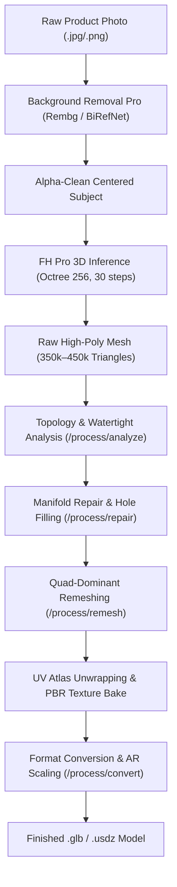

# 2D Photo to AR-Ready 3D Mesh

Transform standard product or object photographs into watertight, quad-remeshed, PBR-textured 3D models formatted for Apple Vision Pro (USDZ), WebXR, and Unreal Engine (GLB).

This pipeline utilizes FOTOhub's **3D Engine** (`server/3d-engine/` and `server/3d-pro/`) hosted across dedicated GPU nodes (GPU4 for mesh processing and GPU5 with NVIDIA A10G 24GB VRAM for FH Pro 3D neural field rendering).

---

## Production Pipeline



---

## Stage Breakdown

### 1. Alpha Isolation
Uses FOTOhub Background Removal Pro to remove studio reflections and produce a zero-bleed RGBA cutout.

### 2. Neural 3D Synthesis (`FH Pro 3D`)
Infers neural implicit surfaces from single images. Generates ~450,000 triangular faces with full geometric symmetry in ~150 seconds.

### 3. Mesh Repair & Topology Cleaning
Raw neural meshes contain non-manifold edges, self-intersections, and open boundaries. The `/process/repair` endpoint executes:
- Vertex welding (welding co-located vertices within epsilon distance).
- Duplicate and degenerate face elimination.
- **Two-pass hole closing**: Closes surface holes, re-welds vertices, and eliminates new non-manifold edges exposed by initial closures.
- Winding order and surface normal recalculation.

### 4. Quad Remeshing
Reduces triangle density while re-topologizing to quad-dominant geometry suitable for rigging, subdivision, and mobile AR rendering.

### 5. AR Export & Dimension Normalization
Converts coordinate conventions and bakes real-world bounding dimensions in millimeters (`target_size_mm`) for 1:1 scale in AR Quick Look (iOS) and Scene Viewer (Android).

---

## Code Example: Full Conversion Script

::: code-group

```python [Python]
from fotohub import FotoHub
import os
import time

client = FotoHub(api_key=os.environ["FOTOHUB_API_KEY"])

def convert_photo_to_ar_3d(image_path: str, target_size_mm: float = 250.0):
    # Step 1: Upload image & trigger FH Pro 3D generation
    print("Submitting image for 3D reconstruction...")
    with open(image_path, "rb") as f:
        img_data = f.read()

    job = client.post(
        "/fh/3d/gen/generate/jobs?model=fh-pro-3d&texture=true&steps=30&octree_resolution=256",
        content=img_data,
        headers={"Content-Type": "image/jpeg"}
    )
    job_id = job["job_id"]
    print(f"3D job started: {job_id}")

    # Step 2: Poll for completion
    while True:
        status = client.get(f"/fh/3d/gen/generate/jobs/{job_id}")
        if status["status"] == "done":
            break
        elif status["status"] == "error":
            raise RuntimeError(f"3D Generation failed: {status}")
        print(f"Stage: {status.get('stage', 'processing')}...")
        time.sleep(5)

    raw_glb_bytes = client.get(f"/fh/3d/gen/generate/jobs/{job_id}/result").content

    # Step 3: Check topology & mesh health
    analysis = client.post(
        "/fh/3d/gen/process/analyze?scale=1.0&min_wall_mm=0.8",
        content=raw_glb_bytes,
        headers={"Content-Type": "application/octet-stream"}
    )
    print(f"Watertight: {analysis['is_watertight']}, Non-manifold edges: {analysis['non_manifold_edges']}")

    # Step 4: Repair non-manifold geometry & close boundary holes
    repaired_glb = client.post(
        "/fh/3d/gen/process/repair?max_hole_size=1000&output_format=glb",
        content=raw_glb_bytes,
        headers={"Content-Type": "application/octet-stream"}
    ).content

    # Step 5: Remesh to optimal polycount (35k quads)
    remeshed_glb = client.post(
        "/fh/3d/gen/process/remesh?target_polycount=35000&topology=triangle&preserve_uv=true&output_format=glb",
        content=repaired_glb,
        headers={"Content-Type": "application/octet-stream"}
    ).content

    # Step 6: Convert to calibrated AR GLB
    final_glb = client.post(
        f"/fh/3d/gen/process/convert?output_format=glb&target_size_mm={target_size_mm}",
        content=remeshed_glb,
        headers={"Content-Type": "application/octet-stream"}
    ).content

    with open("product_ar.glb", "wb") as f:
        f.write(final_glb)
    print("Saved production AR model: product_ar.glb")

convert_photo_to_ar_3d("sneaker.jpg", target_size_mm=310.0)
```

```typescript [TypeScript]
import axios from "axios";
import * as fs from "fs";

const API_KEY = process.env.FOTOHUB_API_KEY!;
const BASE_URL = "https://apis.fotohub.app/fh/3d/gen";

async function photoTo3D(filePath: string) {
  const fileBuffer = fs.readFileSync(filePath);

  // 1. Submit to Pro 3D
  const submitRes = await axios.post(
    `${BASE_URL}/generate/jobs?model=fh-pro-3d&texture=true&steps=30`,
    fileBuffer,
    {
      headers: {
        Authorization: `Bearer ${API_KEY}`,
        "Content-Type": "image/jpeg",
      },
    }
  );

  const jobId = submitRes.data.job_id;
  console.log(`Job dispathed: ${jobId}`);

  // 2. Poll until done
  let done = false;
  while (!done) {
    await new Promise((r) => setTimeout(r, 5000));
    const check = await axios.get(`${BASE_URL}/generate/jobs/${jobId}`, {
      headers: { Authorization: `Bearer ${API_KEY}` },
    });
    if (check.data.status === "done") done = true;
  }

  // 3. Download raw mesh
  const resultRes = await axios.get(`${BASE_URL}/generate/jobs/${jobId}/result`, {
    headers: { Authorization: `Bearer ${API_KEY}` },
    responseType: "arraybuffer",
  });

  // 4. Clean and repair
  const repairRes = await axios.post(
    `${BASE_URL}/process/repair?max_hole_size=1000&output_format=glb`,
    resultRes.data,
    {
      headers: {
        Authorization: `Bearer ${API_KEY}`,
        "Content-Type": "application/octet-stream",
      },
      responseType: "arraybuffer",
    }
  );

  fs.writeFileSync("output_ar.glb", repairRes.data);
  console.log("Successfully generated repaired 3D mesh: output_ar.glb");
}

photoTo3D("product.jpg");
```

```go [Go]
package main

import (
	"bytes"
	"fmt"
	"io"
	"net/http"
	"os"
)

func main() {
	apiKey := os.Getenv("FOTOHUB_API_KEY")
	imgData, err := os.ReadFile("chair.png")
	if err != nil {
		panic(err)
	}

	// Submit raw body to generate/image-to-3d
	req, _ := http.NewRequest(
		"POST",
		"https://apis.fotohub.app/fh/3d/gen/generate/image-to-3d?model=triposr&remove_background=true",
		bytes.NewBuffer(imgData),
	)
	req.Header.Set("Authorization", "Bearer "+apiKey)
	req.Header.Set("Content-Type", "image/png")

	resp, err := http.DefaultClient.Do(req)
	if err != nil {
		panic(err)
	}
	defer resp.Body.Close()

	glbData, _ := io.ReadAll(resp.Body)
	os.WriteFile("chair.glb", glbData, 0644)
	fmt.Println("Generated 3D asset chair.glb")
}
```

```bash [cURL]
# 1. Direct fast generation with TripoSR and automatic background removal
curl -X POST "https://apis.fotohub.app/fh/3d/gen/generate/image-to-3d?model=triposr&remove_background=true" \
  -H "Authorization: Bearer $FOTOHUB_API_KEY" \
  -H "Content-Type: image/jpeg" \
  --data-binary "@sneaker.jpg" \
  --output "sneaker_raw.glb"

# 2. Repair topology and manifold edges
curl -X POST "https://apis.fotohub.app/fh/3d/gen/process/repair?output_format=glb&max_hole_size=1000" \
  -H "Authorization: Bearer $FOTOHUB_API_KEY" \
  -H "Content-Type: application/octet-stream" \
  --data-binary "@sneaker_raw.glb" \
  --output "sneaker_repaired.glb"
```

:::
