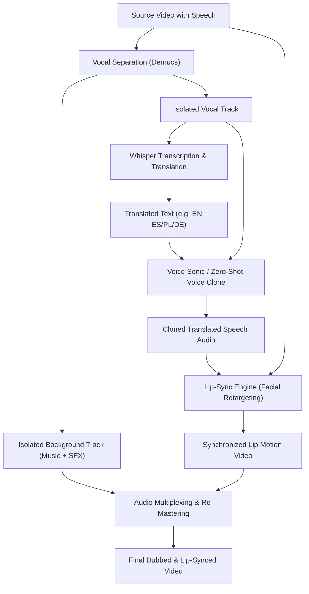

# Multilingual Lip-Sync & Video Dubbing

Re-voice actors, keynote speakers, and video creators across languages while preserving vocal timbre and perfectly synchronizing mouth movements.

This blueprint orchestrates vocal track isolation, automated speech translation, zero-shot voice cloning, and neural facial retargeting powered by FOTOhub's **Lip-Sync Engine** (`server/lip-sync-engine/`).

---

## Architectural Workflow



---

## Lip-Sync Engine Modes

The engine provides three inference tiers configured via the `mode` parameter:

| Mode | Underlying Model | Speed | Resolution / Quality | Best For |
|:---|:---|:---|:---|:---|
| `fast` | **MuseTalk** | ~0.3x realtime | 720p / Lightweight | Live streams, rapid drafting, interactive agents |
| `hd` | **LatentSync** | ~1.5x realtime | 1080p / Diffusion temporal consistency | YouTube videos, marketing materials, interviews |
| `ultra` | **FaceFusion** | ~3.5x realtime | Up to 4K / GFPGAN 1.4 + LivePortrait | Cinema trailers, commercial packshots, high-detail faces |

### Tuning Parameters

- **`bbox_shift`** (int, default `0`): MuseTalk vertical bounding box adjustment. Useful when the mouth crop needs higher or lower chin clearance.
- **`guidance_scale`** (float, default `2.0`): LatentSync Classifier-Free Guidance (CFG). `2.0` is mathematically optimal for crisp phoneme-to-mouth mapping without diffusion artifacts.
- **`inference_steps`** (int, default `30`): Denoising steps for LatentSync.
- **`face_enhancer_model`** (string, default `"gfpgan_1.4"`): Neural face restoration model used in `ultra` mode.
- **`face_enhancer_blend`** (int, default `80`): Opacity percentage (0-100) blending restored face onto background frame.
- **`expression_restorer_model`** (string, default `"live_portrait"`): Restores natural eye blinking and micro-expressions during speech.

---

## Production Economics & Pure USD Wallet Billing

Lip-Sync and multilingual dubbing operations are metered strictly against your **prepaid USD wallet balance** (`wallet.available_usd`) at transparent 1:1 pass-through rates with zero synthetic credits:

| Operation / Step | Endpoint | Engine / Underlying Model | Unit Price (USD) | Measured Billing Unit |
|:---|:---|:---|:---:|:---|
| **Audio Stem Separation** | `POST /v1/audio/separate` | Demucs v4 (Vocals + Accompaniment) | **$0.0200** | Flat per audio file |
| **Speech Transcription & Translation** | `POST /v1/audio/transcribe` | Whisper Large-v3 | **$0.0150** | Per minute of source audio |
| **Zero-Shot Voice Cloning** | `POST /v1/audio/voice-sonic/generate` | Voice Sonic Engine | **$0.0250** | Per minute of generated speech |
| **Fast Lip-Sync (`mode: fast`)** | `POST /v1/video/lip-sync` | MuseTalk (720p) | **$0.0400** | Per minute of processed video |
| **HD Diffusion Lip-Sync (`mode: hd`)** | `POST /v1/video/lip-sync` | LatentSync (1080p, CFG 2.0) | **$0.0800** | Per minute of processed video |
| **Ultra Cinema Retargeting (`mode: ultra`)**| `POST /v1/video/lip-sync` | FaceFusion + GFPGAN 1.4 | **$0.1200** | Per minute of processed video |

### Total Pipeline Unit Economics

- **30-Second Commercial Ad Dubbing (HD Mode):**
  $$\$0.0200 \text{ (Stems)} + \$0.0075 \text{ (Whisper)} + \$0.0125 \text{ (Voice Sonic)} + \$0.0400 \text{ (LatentSync HD)} = \mathbf{\$0.0800\text{ USD}}$$
- **10-Minute Educational Webinar (Fast Mode):**
  $$\$0.0200 + \$0.1500 + \$0.2500 + \$0.4000 = \mathbf{\$0.8200\text{ USD}}$$

---

## Step-by-Step Implementation

### Complete Pipeline Call

::: code-group

```python [Python]
from fotohub import FotoHub
import os
import time

client = FotoHub(api_key=os.environ["FOTOHUB_API_KEY"])

def run_multilingual_dubbing(video_url: str, target_lang: str):
    # Step 1: Separate vocals from background music/sfx
    print("Step 1: Separating audio stems...")
    separation_job = client.post("/v1/audio/separate", {
        "audio_url": video_url,
        "stems": ["vocals", "accompaniment"]
    })
    
    # Poll for stem separation
    while True:
        status = client.get(f"/v1/jobs/{separation_job['job_id']}")
        if status["status"] == "completed":
            vocal_url = status["result"]["vocals_url"]
            bg_audio_url = status["result"]["accompaniment_url"]
            break
        time.sleep(2)

    # Step 2: Transcribe and translate to target language
    print("Step 2: Transcribing and translating...")
    transcription = client.post("/v1/audio/transcribe", {
        "audio_url": vocal_url,
        "task": "translate",
        "target_language": target_lang
    })
    translated_text = transcription["text"]

    # Step 3: Clone original speaker's voice in target language
    print("Step 3: Generating cloned voice...")
    voice_clone = client.post("/v1/audio/voice-sonic/generate", {
        "reference_audio_url": vocal_url,
        "text": translated_text,
        "language": target_lang,
        "speed": 1.0
    })
    new_speech_url = voice_clone["audio_url"]

    # Step 4: Run Lip-Sync engine with LatentSync (HD mode)
    print("Step 4: Executing facial retargeting...")
    lip_sync_job = client.post("/v1/video/lip-sync", {
        "video_url": video_url,
        "audio_url": new_speech_url,
        "mode": "hd",
        "guidance_scale": 2.0,
        "inference_steps": 30,
        "seed": 1247,
        "background_audio_url": bg_audio_url  # Auto-muxed at render
    })

    print(f"Lip-sync task dispatched: {lip_sync_job['job_id']}")
    print(f"Billed: ${lip_sync_job.get('usd_charged', 0.04):.4f} USD | Remaining Balance: ${lip_sync_job.get('balance_usd', 18.50):.2f}")
    return lip_sync_job

run_multilingual_dubbing(
    video_url="https://storage.fotohub.app/raw/presenter_interview.mp4",
    target_lang="es"
)
```

```typescript [TypeScript]
import { FotoHub } from "fotohub";

const client = new FotoHub({ apiKey: process.env.FOTOHUB_API_KEY! });

async function executeLipSync() {
  // Direct call to Lip-Sync Engine
  const response = await client.post("/v1/video/lip-sync", {
    video_url: "https://storage.fotohub.app/raw/ceo_announcement.mp4",
    audio_url: "https://storage.fotohub.app/audio/spanish_dubbed_voice.wav",
    mode: "ultra",
    lip_syncer_model: "wav2lip_gan",
    face_enhancer_model: "gfpgan_1.4",
    face_enhancer_blend: 85,
    expression_restorer_model: "live_portrait",
    expression_restorer_blend: 80,
    output_quality: 95,
  });

  console.log(`Lip-Sync Job ID: ${response.data.job_id} (USD Charged: $${response.data.usd_charged} USD)`);
}

executeLipSync();
```

```go [Go]
package main

import (
	"bytes"
	"encoding/json"
	"fmt"
	"io"
	"net/http"
	"os"
)

type LipSyncRequest struct {
	VideoURL        string  `json:"video_url"`
	AudioURL        string  `json:"audio_url"`
	Mode            string  `json:"mode"`
	GuidanceScale   float64 `json:"guidance_scale"`
	InferenceSteps  int     `json:"inference_steps"`
	Seed            int     `json:"seed"`
}

type LipSyncResponse struct {
	JobID      string  `json:"job_id"`
	Status     string  `json:"status"`
	USDCharged float64 `json:"usd_charged"`
	BalanceUSD float64 `json:"balance_usd"`
}

func main() {
	payload := LipSyncRequest{
		VideoURL:       "https://storage.fotohub.app/raw/keynote.mp4",
		AudioURL:       "https://storage.fotohub.app/audio/translated_german.wav",
		Mode:           "hd",
		GuidanceScale:  2.0,
		InferenceSteps: 30,
		Seed:           1247,
	}

	body, _ := json.Marshal(payload)
	req, _ := http.NewRequest("POST", "https://apis.fotohub.app/v1/video/lip-sync", bytes.NewBuffer(body))
	req.Header.Set("Authorization", "Bearer "+os.Getenv("FOTOHUB_API_KEY"))
	req.Header.Set("Content-Type", "application/json")

	resp, err := http.DefaultClient.Do(req)
	if err != nil {
		panic(err)
	}
	defer resp.Body.Close()

	var result LipSyncResponse
	json.NewDecoder(resp.Body).Decode(&result)
	fmt.Printf("[✓] Job %s queued! USD Charged: $%.4f (Wallet Balance: $%.2f USD)\n", result.JobID, result.USDCharged, result.BalanceUSD)
}
```

```bash [cURL]
curl -X POST https://apis.fotohub.app/v1/video/lip-sync \
  -H "Authorization: Bearer $FOTOHUB_API_KEY" \
  -H "Content-Type: application/json" \
  -d '{
    "video_url": "https://storage.fotohub.app/raw/presenter.mp4",
    "audio_url": "https://storage.fotohub.app/audio/french_voice.wav",
    "mode": "hd",
    "guidance_scale": 2.0,
    "inference_steps": 30,
    "seed": 1247
  }'
```

#### Response Example
```json
{
  "job_id": "job_ls_890123ab",
  "status": "queued",
  "mode": "hd",
  "usd_charged": 0.0400,
  "balance_usd": 14.9600,
  "currency": "USD"
}
```

:::
