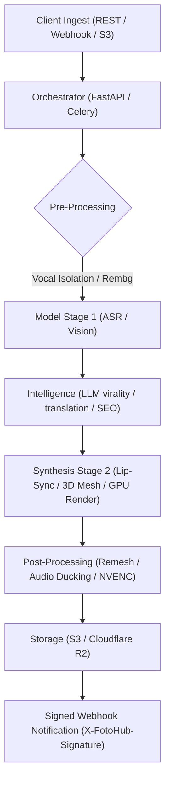

# Multimodal Automation Recipes

End-to-end production blueprints combining multiple FOTOhub engines into automated creative pipelines.

Each blueprint integrates perception, audio separation, neural rendering, physical simulation, and LLM reasoning into unified workflows backed by FOTOhub's distributed GPU infrastructure.

---

## The Recipe Matrix

| Blueprint | Primary Engines | Modalities | Typical Runtime | Target Output |
|:---|:---|:---|:---|:---|
| **[Video to Viral Shorts](./video-to-shorts.md)** | Shorts Engine, Whisper, NVENC | Video → Audio → Text → Video | 45s – 180s | 9:16 Shorts with dynamic captions, B-roll & face-tracking |
| **[Lip-Sync Dubbing](./lip-sync-dubbing.md)** | Lip-Sync Engine, Voice Sonic, Demucs | Video + Audio → Audio → Video | 15s – 60s | Multilingual dubbed video with synchronized lip motion |
| **[2D Photo to AR 3D](./image-to-3d.md)** | 3D Engine, Background Removal Pro, PyMeshLab | Image → Mesh → Texture → AR | 90s – 180s | Manifold, quad-remeshed PBR `.glb` / `.usdz` |
| **[E-Commerce Catalog](./ecommerce-catalog-automation.md)** | Commerce Bridge, Image Engine, LLM | Product Data + Photo → Packshot + Copy | 5s – 15s / SKU | Studio product packshots + multilingual SEO listings |

---

## Architectural Lifecycle

Every recipe follows a standard asynchronous lifecycle to maintain non-blocking client interactions while coordinating heavy GPU inference:

### Key Principles

1. **Deterministic Quality**: Every recipe incorporates self-checking heuristics—such as non-manifold edge checks in 3D or retention curve simulations in video clipping—before marking jobs completed.
2. **Predictable Billing**: Workflows meter credits dynamically or bill against the unified prepaid USD wallet. Cost estimates are available via `/estimate` endpoints before executing pipeline batches.
3. **Idempotency & Replay Safety**: Critical endpoints accept `idempotency_key` parameters to guarantee single-execution semantics across network retries.
4. **Hardware Affinity**: Tasks automatically schedule to hardware tailored for the workload:
   - **T4 (16 GB)** for speech recognition, Demucs audio separation, and lightweight texturing.
   - **A10G (24 GB)** for TripoSR, FH Pro 3D, FaceFusion 4K enhancers, and ComfyUI pipelines.
   - **Firecracker microVMs** for untrusted code execution, script compilation, and agent sandboxing.

---

## Getting Started

Select a recipe to view architecture diagrams, parameter specifications, and code samples in Python, TypeScript, Go, and cURL:

- **[Video to Viral Shorts](./video-to-shorts.md)** — Transform webinars, podcasts, and long-form streams into vertical shorts.
- **[Lip-Sync Dubbing](./lip-sync-dubbing.md)** — Revoice actors and creators across languages while matching exact mouth phonemes.
- **[2D Photo to AR 3D](./image-to-3d.md)** — Convert single or multi-angle product photography into 3D assets ready for WebXR and Apple Vision Pro.
- **[E-Commerce Catalog Automation](./ecommerce-catalog-automation.md)** — Ingest catalog CSVs, strip ugly backgrounds, generate studio scenes, and write structured SEO descriptions.
