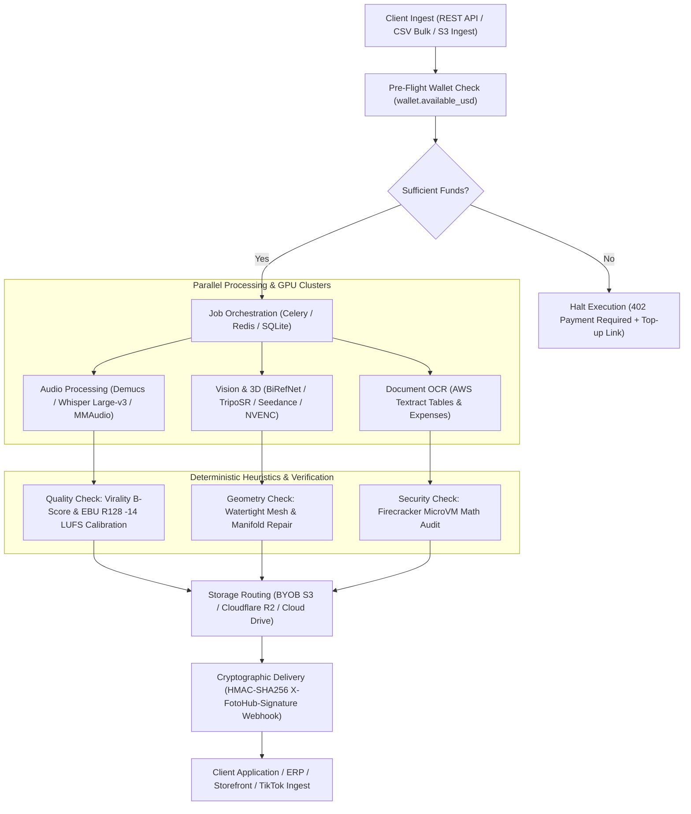

# Multimodal Automation Recipes & Production Blueprints

End-to-end production blueprints combining multiple FOTOhub engines into automated creative pipelines, enterprise document processors, and generative workflows.

Every recipe unifies perception, physical simulation, neural field rendering, and LLM reasoning into reproducible, fault-tolerant pipelines backed by FOTOhub's distributed GPU nodes and air-gapped Firecracker compute microVMs.

---

## Executive Recipe Matrix

Explore all production recipes across media automation, creative brand studios, and enterprise e-commerce pipelines. All costs are billed in **pure USD** from your prepaid wallet at transparent 1:1 pass-through rates.

| # | Blueprint | Category | Complexity | Modalities | Typical Runtime | Unit Cost (USD) | Hardware & Acceleration | Target Output |
|:--|:---|:---|:---:|:---|:---:|:---:|:---|:---|
| **01** | **[Video to Viral Shorts](./video-to-shorts.md)** | Media & Video | ⭐⭐⭐⭐ Advanced | Video → Audio → Text → Video | 45s – 180s | **$0.15 – $0.25** / short | EC2 GPU NVENC + Whisper Large-v3 | 9:16 Shorts with dynamic karaoke captions, face tracking & B-roll |
| **02** | **[Podcast to Viral Clips](./podcast-to-clips.md)** | Media & Video | ⭐⭐⭐⭐ Advanced | Video → Audio → Text → Video | 60s – 120s | **$0.75** / job ($0.15 / clip) | EC2 GPU NVENC + Claude 3.5 B-Score | Multi-speaker stacked/pip 9:16 shorts with -14 LUFS mastering |
| **03** | **[Automated UGC Video Ads](./ugc-video-campaigns.md)** | Media & Video | ⭐⭐⭐⭐ Advanced | URL / SKU → Script → Video | 30s – 90s | **$1.75** / 30s ad | NVIDIA A10G 24GB (Seedance + BytePlus + Gemini TTS) | Engaging 9:16 vertical TikTok/Reels UGC ads with synthetic creators |
| **04** | **[Video Sound Design & Foley](./video-sound-design.md)** | Media & Video | ⭐⭐⭐ Medium | Video → Foley + Music → Mix | 10s – 35s | **$0.22** / 15s sequence | GPU2 A10G (MMAudio :8799 + MiniMax Music) | Multi-track stem audio with sidechain auto-ducking (-16dB) & MMAudio SFX |
| **05** | **[Multilingual Lip-Sync Dubbing](./lip-sync-dubbing.md)** | Media & Video | ⭐⭐⭐⭐ Advanced | Video + Audio → Audio → Video | 20s – 60s / min | **$0.04 – $0.12** / min | NVIDIA T4 16GB / A10G (Demucs + Wav2Lip) | Translated video with phoneme-accurate lip motion & preserved acoustics |
| **06** | **[Virtual Try-On Fashion Studio](./virtual-tryon-fashion.md)** | Brand & Creative | ⭐⭐⭐⭐ Advanced | Model + Garment → Image | 8s – 20s / look | **$0.0350** / look | NVIDIA A10G 24GB (virtual-try-on-001 / SAM2 / CodeFormer) | Photorealistic apparel draping with realistic folds, luxury backgrounds & 4K super-resolution |
| **07** | **[Brand DNA & Virtual Influencers](./brand-dna-virtual-influencers.md)** | Brand & Creative | ⭐⭐⭐⭐ Advanced | Face Embeddings → Image | 6s – 18s / img | **$0.0315 – $0.1340** / img | NVIDIA A10G 24GB (nano-banana-pro / seedream-5-0) | Zero-drift virtual brand ambassadors with biometrics & automated compliance verification |
| **08** | **[Automated Social Publisher](./social-auto-publisher.md)** | Brand & Creative | ⭐⭐⭐ Medium | Master Asset → Multi-Platform | 4s – 12s / bundle | **$0.0083** / campaign | Firecracker MicroVM + Social Engine OAuth | Multi-platform scheduled publishing (TikTok, IG Reels, YT Shorts, X) with AI copy & analytics |
| **09** | **[2D Photo to AR 3D Assets](./image-to-3d.md)** | Enterprise & Commerce | ⭐⭐⭐⭐⭐ Enterprise | 2D Photo → 3D Mesh → AR | 3s (Lite) – 150s (Pro) | **$0.020 – $0.180** / model | GPU4 + GPU5 (NVIDIA A10G 24GB VRAM) | Watertight quad-remeshed PBR `.glb` & calibrated Apple iOS `.usdz` |
| **10** | **[E-Commerce Catalog Automation](./ecommerce-catalog-automation.md)** | Enterprise & Commerce | ⭐⭐⭐⭐ Advanced | SKU Photo + CSV → Listing | 2.5s – 5.5s / SKU | **$0.0315 – $0.1340** / img | Celery Worker Pool + Cloudflare R2 BYOB | Multi-angle studio packshots, WCAG 2.2 alt-text & Shopify sync |
| **11** | **[Document & Invoice Intelligence](./document-intelligence-pipeline.md)** | Enterprise & Commerce | ⭐⭐⭐⭐⭐ Enterprise | PDF / Scans → JSON → ERP | 1.2s – 2.5s / page | **$0.0105 – $0.0155** / page | AWS Textract + Firecracker MicroVM | Air-gapped OCR, Pydantic schema validation & math-audited ERP export |

---

## Architectural Lifecycle

Every recipe follows an asynchronous, event-driven lifecycle designed for low latency, zero web server blocking, and deterministic resilience:

---

## Core Architectural Guarantees

### 1. Pure USD Wallet Billing (Zero Credits, Zero PLN)
FOTOhub routes all automation recipes through your unified prepaid USD wallet (`wallet.available_usd`). 
- **Exact Pass-Through**: Pay exact provider unit costs without credit markups.
- **No Float Conversions**: Billed with 6-decimal precision (`$0.000001`) to eliminate rounding discrepancies.
- **Fail-Safe Refunds**: If an upstream node encounters a GPU timeout, out-of-memory condition, or network error, `paywall.refund_and_raise()` immediately returns 100% of the funds to your balance.

### 2. Hardware-Affinity Scheduling
Workloads are assigned to specialized computing tiers based on physical requirements:
- **Firecracker MicroVMs**: Sub-200ms cold boot runtimes executing air-gapped code (`/sandbox/exec-python`) with no network access (`virtio-vsock` only).
- **GPU1**: Dedicated Shorts Engine and WhisperX speech transcription orchestrator.
- **GPU2 (51.102.148.42)**: Dedicated audio synthesis node hosting **Stable Audio** (:8798) and **MMAudio** (:8799) for real-time Foley synthesis.
- **GPU3**: High-precision neural lip-sync engine (MuseTalk, LatentSync, FaceFusion).
- **GPU4 & GPU5**: NVIDIA A10G nodes for FH Pro 3D neural implicit fields, TripoSR, and ComfyUI pipelines.
- **Hardware NVENC Nodes**: EC2 GPU accelerated instances running FFmpeg NVENC for high-throughput 60fps video composition.

### 3. Bring Your Own Bucket (BYOB) & Direct Delivery
Never pay egress fees or store sensitive business assets on third-party servers. Register your external storage once via `/v1/destinations`:
- Supports **AWS S3**, **Cloudflare R2**, **Google Cloud Storage** (S3-compatible), **Backblaze B2**, and **DigitalOcean Spaces**.
- Direct publishing to social destinations (TikTok, Instagram Reels, YouTube Shorts) via `/v1/posts`.

### 4. Idempotency & Cryptographic Verification
- **Idempotency Keys**: All state-mutating endpoints accept an `idempotency_key` parameter, preventing duplicate generation charges during transient network reconnects.
- **Signed Webhooks**: Outbound notifications include the `X-FotoHub-Signature` header calculated using HMAC-SHA256 over raw binary request payloads.

---

## Getting Started

Select a recipe below to access architecture diagrams, request schemas, and production code snippets in Python, TypeScript, Go, and cURL:

### Media & Video Automation
- **[Video to Viral Shorts](./video-to-shorts.md)** — Transform webinars, interviews, and long-form streams into vertical shorts with dynamic captions.
- **[Podcast to Viral Shorts Studio](./podcast-to-clips.md)** — Ingest 60-min podcast episodes, track multi-speaker dialogue in 9:16 stacked/pip layouts, and normalize to -14 LUFS.
- **[Automated UGC Video Ads](./ugc-video-campaigns.md)** — Ingest product URLs, generate 3 viral hooks, cast AI UGC actors, synthesize Gemini/Azure voice, and render multi-scene ads.
- **[Video Sound Design & Foley](./video-sound-design.md)** — Detect visual kinetic cues, synthesize Foley effects with MMAudio on GPU2, generate music, and apply sidechain ducking.
- **[Multilingual Lip-Sync Dubbing](./lip-sync-dubbing.md)** — Revoice actors across languages while matching exact mouth phonemes.

### Brand & Creative Studio
- **[Virtual Try-On Fashion Studio](./virtual-tryon-fashion.md)** — High-fidelity apparel draping with realistic folds, luxury studio backgrounds, and 4K super-resolution.
- **[Brand DNA & Virtual Influencers](./brand-dna-virtual-influencers.md)** — Zero-drift synthetic brand ambassadors, multi-angle perspectives, and automated guideline compliance audits.
- **[Automated Social Publisher](./social-auto-publisher.md)** — Multi-channel automated social scheduling and publishing to TikTok, IG Reels, YouTube Shorts, and X with AI copy and engagement tracking.

### Enterprise & E-Commerce
- **[2D Photo to AR 3D Assets](./image-to-3d.md)** — Convert single or multi-angle photos into watertight, quad-remeshed PBR `.glb` and Apple Vision Pro `.usdz`.
- **[E-Commerce Catalog Automation](./ecommerce-catalog-automation.md)** — Ingest CSVs, strip backgrounds, generate multi-angle studio scenes, and sync with Shopify/WooCommerce.
- **[Document & Invoice Intelligence](./document-intelligence-pipeline.md)** — Ingest invoices, extract multi-column tables, validate math in Firecracker microVMs, and export to ERPs.
