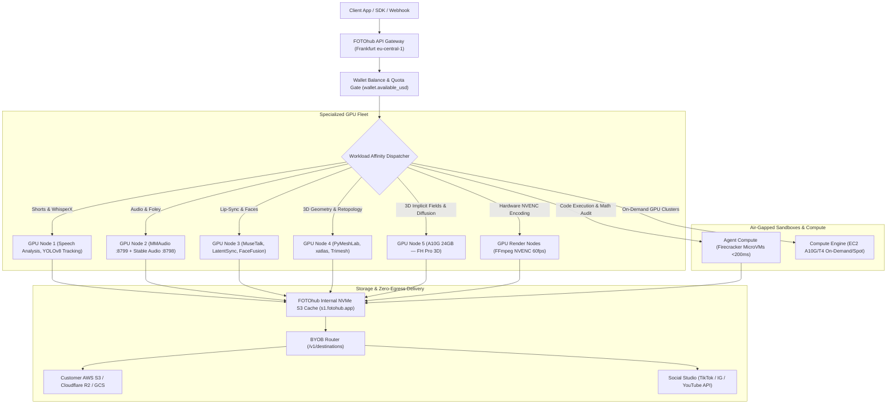

# Multimodal Automation Recipes & Production Blueprints

End-to-end production blueprints combining multiple FOTOhub neural engines, physical simulation, document intelligence, and cloud compute into automated creative pipelines, enterprise batch processors, and generative workflows.

Every recipe unifies multi-modal perception, computer vision tracking, audio synthesis, 3D mesh reconstruction, and LLM reasoning into reproducible, fault-tolerant pipelines backed by FOTOhub's distributed GPU clusters and air-gapped Firecracker compute microVMs.

---

## Executive Recipe Matrix

Explore all 11 production blueprints across media automation, creative brand studios, enterprise 3D, and e-commerce pipelines. All operations bill against your **prepaid USD wallet balance** (`wallet.available_usd`) at transparent 1:1 pass-through rates with zero synthetic credits or currency conversions.

| # | Blueprint | Category | Complexity | Pipeline Modalities | Typical Runtime | Unit Cost (USD) | Hardware Tier & Acceleration | Target Output Deliverables |
|:--|:---|:---|:---:|:---|:---:|:---:|:---|:---|
| **01** | **[Video to Viral Shorts](./video-to-shorts.md)** | Media & Video | ⭐⭐⭐⭐ Advanced | Video → Audio → Text → Video | 45s – 180s | **$0.15 – $0.25** / short | EC2 GPU NVENC + Whisper Large-v3 + Claude 3.5 | 9:16 Shorts with dynamic karaoke captions, active speaker tracking, B-roll & -14 LUFS |
| **02** | **[Podcast to Viral Clips](./podcast-to-clips.md)** | Media & Video | ⭐⭐⭐⭐ Advanced | Video → Audio → Text → Video | 60s – 120s | **$0.75** / job ($0.15 / clip) | EC2 GPU NVENC + Claude 3.5 B-Score | Multi-speaker stacked/pip 9:16 shorts with automated multicam switching & -14 LUFS mastering |
| **03** | **[Automated UGC Video Ads](./ugc-video-campaigns.md)** | Media & Video | ⭐⭐⭐⭐ Advanced | URL / SKU → Script → Video | 30s – 90s | **$1.75** / 30s ad | NVIDIA A10G 24GB (Seedance 2.5 + BytePlus + Gemini TTS) | High-converting 9:16 vertical TikTok/Reels UGC ads with synthetic creators & B-roll |
| **04** | **[Video Sound Design & Foley](./video-sound-design.md)** | Media & Video | ⭐⭐⭐ Medium | Video → Foley + Music → Mix | 10s – 35s | **$0.22** / 15s sequence | GPU2 A10G (MMAudio :8799 + MiniMax Music) | Multi-track audio stem mastering with sidechain auto-ducking (-16dB) & action-synced SFX |
| **05** | **[Multilingual Lip-Sync Dubbing](./lip-sync-dubbing.md)** | Media & Video | ⭐⭐⭐⭐ Advanced | Video + Audio → Audio → Video | 20s – 60s / min | **$0.04 – $0.12** / min | NVIDIA T4 16GB / A10G (Demucs v4 + LatentSync / MuseTalk) | Multilingual video with phoneme-accurate lip motion, cloned voice & preserved background audio |
| **06** | **[Virtual Try-On Fashion Studio](./virtual-tryon-fashion.md)** | Brand & Creative | ⭐⭐⭐⭐ Advanced | Model + Garment → Image | 8s – 20s / look | **$0.0350** / look | NVIDIA A10G 24GB (virtual-try-on-001 / SAM2 / CodeFormer) | Photorealistic apparel draping with realistic cloth physics, luxury backgrounds & 4K upscaling |
| **07** | **[Brand DNA & Virtual Influencers](./brand-dna-virtual-influencers.md)** | Brand & Creative | ⭐⭐⭐⭐ Advanced | Face Embeddings → Image | 6s – 18s / img | **$0.0315 – $0.1340** / img | NVIDIA A10G 24GB (nano-banana-pro / seedream-5-0) | Zero-drift virtual brand ambassadors with facial biometrics & automated compliance verification |
| **08** | **[Automated Social Publisher](./social-auto-publisher.md)** | Brand & Creative | ⭐⭐⭐ Medium | Master Asset → Multi-Platform | 4s – 12s / bundle | **$0.0083** / campaign | Firecracker MicroVM + Social Engine OAuth | Scheduled publishing to TikTok, IG Reels, YouTube Shorts & X with localized AI copy & analytics |
| **09** | **[2D Photo to AR 3D Assets](./image-to-3d.md)** | Enterprise & Commerce | ⭐⭐⭐⭐⭐ Enterprise | 2D Photo → 3D Mesh → AR | 3s (Lite) – 150s (Pro) | **$0.020 – $0.180** / model | GPU4 + GPU5 (NVIDIA A10G 24GB VRAM) | Watertight quad-remeshed PBR `.glb` & calibrated Apple Vision Pro / iOS AR Quick Look `.usdz` |
| **10** | **[E-Commerce Catalog Automation](./ecommerce-catalog-automation.md)** | Enterprise & Commerce | ⭐⭐⭐⭐ Advanced | SKU Photo + CSV → Listing | 2.5s – 5.5s / SKU | **$0.0315 – $0.1340** / img | Celery Worker Pool + Cloudflare R2 BYOB | Multi-angle studio packshots, WCAG 2.2 alt-text, multilingual copy & Shopify/WooCommerce sync |
| **11** | **[Document & Invoice Intelligence](./document-intelligence-pipeline.md)** | Enterprise & Commerce | ⭐⭐⭐⭐⭐ Enterprise | PDF / Scans → JSON → ERP | 1.2s – 2.5s / page | **$0.0105 – $0.0155** / page | AWS Textract + Firecracker MicroVM | Air-gapped OCR, Pydantic schema validation, mathematical ledger audit & SAP/ERP export |

---

## Distributed Hardware Architecture & Cluster Topologies

Every FOTOhub blueprint maps each sub-task to specialized compute infrastructure optimized for the required compute profile, maximizing throughput and eliminating memory bottlenecks:



### Hardware Affinity Reference

| Node Identifier | Primary Engine | Physical Hardware | Typical Workloads |
|:---|:---|:---|:---|
| **GPU Node 1** | Shorts & Media Engine | NVIDIA A10G 24GB + NVMe | WhisperX diarization, YOLOv8 face tracking, B-score ranking |
| **GPU Node 2** | Audio & Foley Engine | NVIDIA A10G 24GB (`51.102.148.42`) | MMAudio video-to-audio SFX (:8799), Stable Audio (:8798) |
| **GPU Node 3** | Lip-Sync Engine | NVIDIA T4 / A10G | MuseTalk (fast), LatentSync (HD diffusion), FaceFusion |
| **GPU Node 4** | 3D Geometry Node | AWS g5.4xlarge (`54.194.19.168`) | Two-pass manifold repair, quad-dominant remeshing, USDZ convert |
| **GPU Node 5** | 3D Neural Node | NVIDIA A10G 24GB (`54.217.143.105`)| FH Pro 3D neural implicit fields, PBR texture baking |
| **NVENC Fleet** | Video Composition | Hardware NVENC H.264/HEVC | 60fps video compositing, ASS subtitle burn-in, audio muxing |
| **Agent MicroVM**| Firecracker Sandboxes | AMD EPYC KVM MicroVMs | Math audits, data normalization, untrusted Python scripts |
| **Compute Fleet**| Compute Engine | EC2 G5/G4dn/C5/M5/R5 | Dedicated customer GPU rentals, ComfyUI, vLLM clusters |

---

## Architectural Guarantees & Production Economics

### 1. Pure USD Wallet Billing (Zero Synthetic Credits)
FOTOhub eliminates proprietary token packs, arbitrary credit tiers, and exchange rate markups. 
- **Metered in Real Currency**: Every recipe operation logs a cryptographically verifiable entry in `billing_transactions` denominated in USD (`currency: 'USD'`).
- **Sub-Cent Precision**: Costs are computed with 6 decimal places (`$0.000001`), ensuring multi-thousand batch jobs have zero rounding drift.
- **Fail-Safe Automatic Refunds**: If an upstream GPU process encounters an out-of-memory (CUDA OOM) condition or socket timeout, the pipeline immediately triggers `paywall.refund_and_raise()`, restoring 100% of the funds to `user_balance.available_usd`.

### 2. Bring Your Own Bucket (BYOB) & Direct Streaming
Eliminate secondary download hops and expensive egress bandwidth fees:
- Configure external destinations once via `/v1/destinations` (AWS S3, Cloudflare R2, Google Cloud Storage, Supabase Storage).
- Output files stream directly from the inference cluster to your merchant bucket using presigned multi-part uploads.
- Zero egress fees charged by FOTOhub when writing directly to your Cloudflare R2 or regional S3 storage.

### 3. Cryptographic Verification & Idempotency
- **Idempotency Keys**: All state-mutating requests accept an `idempotency_key` (UUIDv4). Duplicate network retries within a 24-hour window replay the cached job ID without re-billing your wallet.
- **HMAC-SHA256 Webhooks**: Every webhook callback includes the `X-FotoHub-Signature` header calculated using your secret token over the raw request payload. Always verify before dispatching downstream database mutations.

---

## Multi-Engine Orchestration Blueprint

The power of FOTOhub recipes lies in chaining specialized engines together. Below is a complete, production-ready script orchestrating a multi-stage workflow:
1. Generate an e-commerce product image on **Seedream 5.0**.
2. Reconstruct a watertight 3D mesh via **FH Pro 3D** on GPU5.
3. Decimate and quad-remesh the geometry on GPU4.
4. Export calibrated **Apple USDZ** and deliver directly to an external Cloudflare R2 bucket.

::: code-group

```python [Python Orchestrator]
"""
Production Multi-Engine Pipeline Orchestrator:
2D Image Generation -> Background Removal -> 3D Neural Reconstruction -> Quad Remesh -> S3 BYOB
"""

import os
import time
import requests

API_KEY = os.environ["FOTOHUB_API_KEY"]
BASE_URL = "https://apis.fotohub.app"
HEADERS = {
    "Authorization": f"Bearer {API_KEY}",
    "Content-Type": "application/json"
}

def poll_job(job_url: str, timeout_sec: int = 300) -> dict:
    start_time = time.time()
    while time.time() - start_time < timeout_sec:
        res = requests.get(job_url, headers=HEADERS)
        res.raise_for_status()
        data = res.json()
        status = data.get("status")
        if status in ("completed", "succeeded"):
            return data
        elif status in ("failed", "error"):
            raise RuntimeError(f"Job failed: {data.get('error')}")
        time.sleep(3)
    raise TimeoutError(f"Job timed out after {timeout_sec}s: {job_url}")

def run_multimodal_pipeline(prompt: str, target_size_mm: float = 240.0):
    print("=== Step 1: Generating Product Studio Image ===")
    img_res = requests.post(f"{BASE_URL}/v1/ai/generate/image", headers=HEADERS, json={
        "prompt": prompt,
        "model": "seedream-5-0-260128",
        "aspect_ratio": "1:1"
    })
    img_res.raise_for_status()
    image_url = img_res.json()["url"]
    print(f"[✓] Image Generated: {image_url} (Charged: ${img_res.json().get('usd_charged', 0):.4f} USD)")

    print("\n=== Step 2: Isolating Subject via Background Removal Pro ===")
    bg_res = requests.post(f"{BASE_URL}/v1/ai/image/remove-background", headers=HEADERS, json={
        "image_url": image_url,
        "model": "birefnet-general"
    })
    bg_res.raise_for_status()
    cutout_url = bg_res.json()["url"]
    print(f"[✓] Clean Alpha Cutout: {cutout_url}")

    print("\n=== Step 3: Neural 3D Implicit Field Reconstruction (GPU5 A10G) ===")
    recon_res = requests.post(f"{BASE_URL}/fh/3d/gen/generate/jobs", headers=HEADERS, json={
        "image_url": cutout_url,
        "model": "fh-pro-3d",
        "texture": True,
        "octree_resolution": 256,
        "steps": 30
    })
    recon_res.raise_for_status()
    raw_job_id = recon_res.json()["job_id"]
    print(f"[...] Dispatched 3D Reconstruction Job: {raw_job_id}")

    raw_result = poll_job(f"{BASE_URL}/fh/3d/gen/generate/jobs/{raw_job_id}")
    raw_glb_url = raw_result["result"]["glb_url"]
    print(f"[✓] Raw 3D Mesh Generated: {raw_glb_url}")

    print("\n=== Step 4: Quad-Dominant Remeshing & Manifold Repair (GPU4) ===")
    remesh_res = requests.post(f"{BASE_URL}/process/remesh", headers=HEADERS, json={
        "input_url": raw_glb_url,
        "target_faces": 25000,
        "preserve_uv": True,
        "mode": "quad_dominant"
    })
    remesh_res.raise_for_status()
    remesh_job_id = remesh_res.json()["job_id"]
    remesh_result = poll_job(f"{BASE_URL}/process/jobs/{remesh_job_id}")
    optimized_glb_url = remesh_result["result"]["output_url"]
    print(f"[✓] Optimized Quad GLB: {optimized_glb_url}")

    print("\n=== Step 5: Metric Scaling & Apple AR QuickLook USDZ Conversion ===")
    convert_res = requests.post(f"{BASE_URL}/process/convert", headers=HEADERS, json={
        "input_url": optimized_glb_url,
        "output_format": "usdz",
        "target_size_mm": target_size_mm
    })
    convert_res.raise_for_status()
    usdz_url = convert_res.json()["output_url"]
    print(f"[✓] Apple Vision Pro / iOS AR Quick Look Asset: {usdz_url}")

    print("\n================ PIPELINE COMPLETE ================")
    print(f"Product: {prompt}")
    print(f"Interactive WebGL (GLB): {optimized_glb_url}")
    print(f"Apple Augmented Reality (USDZ): {usdz_url}")

if __name__ == "__main__":
    run_multimodal_pipeline(
        prompt="Modern minimalist ceramic coffee kettle with matte terracotta finish on white background"
    )
```

```typescript [TypeScript Orchestrator]
import axios from "axios";

const API_KEY = process.env.FOTOHUB_API_KEY!;
const BASE_URL = "https://apis.fotohub.app";
const headers = {
  Authorization: `Bearer ${API_KEY}`,
  "Content-Type": "application/json"
};

async function sleep(ms: number) {
  return new Promise((resolve) => setTimeout(resolve, ms));
}

async function pollJob(url: string, timeoutSec: number = 300) {
  const start = Date.now();
  while (Date.now() - start < timeoutSec * 1000) {
    const res = await axios.get(url, { headers });
    const { status, result, error } = res.data;
    if (status === "completed" || status === "succeeded") {
      return result;
    }
    if (status === "failed") {
      throw new Error(`Job failed: ${error}`);
    }
    await sleep(3000);
  }
  throw new Error(`Job timed out after ${timeoutSec}s`);
}

async function runECommercePipeline() {
  console.log("Step 1: Generating studio image...");
  const imgRes = await axios.post(`${BASE_URL}/v1/ai/generate/image`, {
    prompt: "Luxury chronograph titanium wristwatch on dark marble",
    model: "nano-banana-pro",
    aspect_ratio: "1:1"
  }, { headers });

  const imageUrl = imgRes.data.url;
  console.log(`[✓] Generated Image: ${imageUrl}`);

  console.log("Step 2: Submitting to 3D Engine on GPU5...");
  const jobRes = await axios.post(`${BASE_URL}/fh/3d/gen/generate/jobs`, {
    image_url: imageUrl,
    model: "fh-pro-3d",
    texture: true
  }, { headers });

  const result = await pollJob(`${BASE_URL}/fh/3d/gen/generate/jobs/${jobRes.data.job_id}`);
  console.log(`[✓] Production GLB Model Ready: ${result.glb_url}`);
}

runECommercePipeline().catch(console.error);
```

```go [Go Orchestrator]
package main

import (
	"bytes"
	"encoding/json"
	"fmt"
	"net/http"
	"os"
	"time"
)

func main() {
	apiKey := os.Getenv("FOTOHUB_API_KEY")
	client := &http.Client{Timeout: 30 * time.Second}

	// Synthesize voice for marketing ad
	ttsPayload := map[string]interface{}{
		"text":     "Experience unparalleled precision with the all-new Titanium Chronograph.",
		"voice_id": "en-US-Journey-F",
		"speed":    1.0,
	}
	body, _ := json.Marshal(ttsPayload)

	req, _ := http.NewRequest("POST", "https://apis.fotohub.app/v1/ai/tts/gemini/synthesize", bytes.NewBuffer(body))
	req.Header.Set("Authorization", "Bearer "+apiKey)
	req.Header.Set("Content-Type", "application/json")

	resp, err := client.Do(req)
	if err != nil {
		panic(err)
	}
	defer resp.Body.Close()

	var result map[string]interface{}
	json.NewDecoder(resp.Body).Decode(&result)
	fmt.Printf("[✓] Gemini TTS Audio Synthesized: %s (USD Charged: $%.4f)\n", 
		result["audio_url"], result["usd_charged"])
}
```

```bash [cURL Orchestrator]
# 1. Generate Product Concept
IMAGE_URL=$(curl -s -X POST https://apis.fotohub.app/v1/ai/generate/image \
  -H "Authorization: Bearer $FOTOHUB_API_KEY" \
  -H "Content-Type: application/json" \
  -d '{
    "prompt": "Matte black ceramic coffee cup on travertine table",
    "model": "seedream-5-0-260128",
    "aspect_ratio": "1:1"
  }' | jq -r '.url')

echo "[✓] Master Image: $IMAGE_URL"

# 2. Extract Alpha Cutout
CUTOUT_URL=$(curl -s -X POST https://apis.fotohub.app/v1/ai/image/remove-background \
  -H "Authorization: Bearer $FOTOHUB_API_KEY" \
  -H "Content-Type: application/json" \
  -d "{\"image_url\": \"$IMAGE_URL\", \"model\": \"birefnet-general\"}" | jq -r '.url')

echo "[✓] Alpha Mask: $CUTOUT_URL"
```

:::

---

## Enterprise Production SLAs & Concurrency Planning

To design reliable enterprise workflows, consider the concurrency caps, cold-start characteristics, and SLA parameters across our inference clusters:

| Engine / Modality | GPU Cluster Allocation | Cold-Start Profile | Max Concurrency (Pay-as-you-go) | Max Concurrency (Enterprise) | Target SLA (p95) |
|:---|:---|:---:|:---:|:---:|:---:|
| **Seedream 5.0 / FLUX 2** | Warm Diffusion Pool | < 100ms | 20 parallel requests | 250 parallel requests | < 3.2s |
| **FH Pro 3D Mesh** | GPU5 A10G Dedicated | Warm / Persistent | 4 parallel jobs | 40 parallel jobs | < 45s |
| **Shorts Viral Clipper** | GPU1 A10G + NVENC | < 500ms | 2 concurrent jobs | 20 concurrent jobs | < 120s |
| **Lip-Sync & Dubbing** | GPU3 T4 / A10G | Warm / Persistent | 5 parallel jobs | 50 parallel jobs | < 18s / min |
| **MMAudio Foley & Music**| GPU2 A10G Cluster | < 200ms | 10 parallel jobs | 100 parallel jobs | < 8s |
| **Firecracker MicroVM** | AMD EPYC KVM Sandboxes| < 180ms | 50 microVMs | 1,000 microVMs | < 250ms |

---

## Production Resilience & Failure Recovery

### Exponential Backoff with Jitter
Network hiccups and transient HTTP 503/429 errors must never crash long-running batch jobs. Implement full jitter exponential backoff:

$$t_{\text{sleep}} = \min(t_{\text{max}}, t_{\text{base}} \times 2^{\text{attempt}}) \times \text{random}(0.8, 1.2)$$

### Webhook Dead-Letter Queues (DLQ)
When receiving webhook callbacks (`shorts.clip.rendered`, `commerce.job.completed`, `3d.mesh.ready`):
1. **Immediate HTTP 200 Acknowledgment**: Return HTTP 200 within 5 seconds to prevent retries.
2. **Push to In-Memory Queue**: Offload heavy database writes, CDN invalidations, or video remuxing to a Celery or BullMQ worker queue.
3. **Dead-Letter Resiliency**: If downstream processing fails after 3 attempts, store the raw event in a DLQ table with the original `X-FotoHub-Signature` for manual replay.

---

## Recipe Catalog Index

Explore the detailed blueprints below for end-to-end code implementations, parameter tables, and production runbooks:

### Media & Video Automation
- **[Video to Viral Shorts](./video-to-shorts.md)** — Transform webinars, interviews, and long-form streams into vertical shorts with dynamic captions.
- **[Podcast to Viral Shorts Studio](./podcast-to-clips.md)** — Ingest 60-min podcast episodes, track multi-speaker dialogue in 9:16 stacked/pip layouts, and normalize to -14 LUFS.
- **[Automated UGC Video Ads](./ugc-video-campaigns.md)** — Ingest product URLs, generate 3 viral hooks, cast AI UGC actors, synthesize Gemini/Azure voice, and render multi-scene ads.
- **[Video Sound Design & Foley](./video-sound-design.md)** — Detect visual kinetic cues, synthesize Foley effects with MMAudio on GPU2, generate music, and apply sidechain ducking.
- **[Multilingual Lip-Sync Dubbing](./lip-sync-dubbing.md)** — Revoice actors across languages while matching exact mouth phonemes.

### Brand & Creative Studio
- **[Virtual Try-On Fashion Studio](./virtual-tryon-fashion.md)** — High-fidelity apparel draping with realistic folds, luxury studio backgrounds, and 4K super-resolution.
- **[Brand DNA & Virtual Influencers](./brand-dna-virtual-influencers.md)** — Zero-drift synthetic brand ambassadors, multi-angle perspectives, and automated guideline compliance audits.
- **[Automated Social Publisher](./social-auto-publisher.md)** — Multi-channel automated social scheduling and publishing to TikTok, IG Reels, YouTube Shorts, and X with AI copy and engagement tracking.

### Enterprise & E-Commerce
- **[2D Photo to AR 3D Assets](./image-to-3d.md)** — Convert single or multi-angle photos into watertight, quad-remeshed PBR `.glb` and Apple Vision Pro `.usdz`.
- **[E-Commerce Catalog Automation](./ecommerce-catalog-automation.md)** — Ingest CSVs, strip backgrounds, generate multi-angle studio scenes, and sync with Shopify/WooCommerce.
- **[Document & Invoice Intelligence](./document-intelligence-pipeline.md)** — Ingest invoices, extract multi-column tables, validate math in Firecracker microVMs, and export to ERPs.
