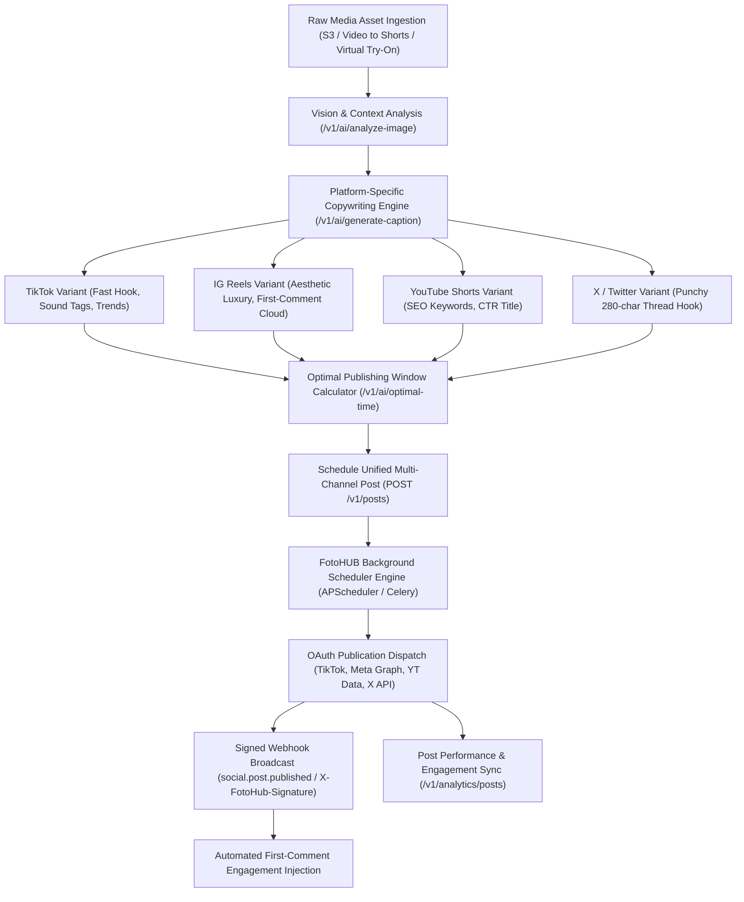

# Automated Social Studio & Multi-Platform Publisher

Turn raw creative video and image assets into high-converting, platform-tailored social campaigns automatically scheduled, published, and tracked across TikTok, Instagram Reels, YouTube Shorts, and X (Twitter).

Powered by FOTOhub's **Social Studio** (`server/social-engine/`), this recipe links vision analysis, LLM copywriting, multi-account OAuth dispatch, automated first-comment hashtag strategies, and post-publish performance analytics into a single autonomous pipeline.

---

## Architectural Workflow



---

## Production Economics & USD Billing

Social Studio operations are billed directly against your prepaid USD wallet at exact pass-through rates:

| Operation | Endpoint | Engine / Service | Cost / Request (USD) | Description |
|:---|:---|:---|:---|:---|
| **AI Caption Generation** | `POST /v1/ai/generate-caption` | Gemini 2.5 Flash / Claude Haiku | **$0.0015** | Generates 3 platform-tailored copy variants |
| **Hashtag Recommendation** | `POST /v1/ai/suggest-hashtags` | Social Trend Indexer + LLM | **$0.0008** | Returns 15–30 viral & niche hashtags |
| **Optimal Time Scoring** | `POST /v1/ai/optimal-time` | Audience Analytics Engine | **$0.0010** | Calculates high-engagement publication slot |
| **Multi-Platform Publish** | `POST /v1/posts/{id}/publish` | Direct OAuth Dispatch Engine | **$0.0050** | Handles transcoding, uploads, & retry logic |
| **Analytics Aggregation** | `GET /v1/analytics/posts` | Background Social Syncer | **Free** | Real-time views, likes, shares, CTR metrics |
| **Total Automated Campaign** | *4 Platforms + Copy + Analytics* | *Complete Pipeline* | **~$0.0083** | Less than 1 cent per fully syndicated post |

---

## Parameter Specifications

### `POST /v1/posts`

| Parameter | Type | Required | Default | Description |
|:---|:---|:---|:---|:---|
| `text` | string | **Yes** | — | Default baseline copy across platforms (up to 25,000 characters). |
| `target_accounts` | string[] | **Yes** | — | Array of connected `social_account` UUIDs. |
| `scheduled_at` | string (ISO) | No | `null` | Target publishing datetime in UTC (e.g. `"2026-09-12T18:30:00Z"`). If omitted, saved as `draft`. |
| `media` | object[] | No | `[]` | Media array with `{url, type, alt_text, thumbnail_url}`. `type` must be `"video"`, `"image"`, or `"gif"`. |
| `post_type` | string | No | `"post"` | Post format: `"post"`, `"reel"`, `"story"`, `"carousel"`, or `"thread"`. |
| `variants` | object[] | No | `[]` | Platform-specific overrides (see `ContentVariant` schema below). |
| `hashtags` | string[] | No | `[]` | General hashtag list automatically appended to the post caption. |
| `first_comment` | string | No | `null` | Automated immediate reply posted to Instagram or TikTok (ideal for hashtag clouds). |
| `campaign_id` | uuid | No | `null` | Optional tracking identifier for campaign-level attribution. |

#### Platform Variant Override (`variants[]`)

| Field | Type | Required | Description |
|:---|:---|:---|:---|
| `platform` | string | **Yes** | `"tiktok"`, `"instagram"`, `"youtube"`, `"twitter"`, `"facebook"`, or `"linkedin"`. |
| `text` | string | No | Platform-tailored copy overriding the global `text`. |
| `hashtags` | string[] | No | Platform-specific hashtag array. |
| `post_type` | string | No | Platform-specific format (e.g. `"reel"` on Instagram, `"short"` on YouTube). |
| `first_comment` | string | No | Platform-specific initial comment. |

---

## Complete End-to-End Implementation

This blueprint performs the following pipeline:
1. Fetch connected platform accounts (TikTok, Instagram, YouTube Shorts).
2. Generate platform-optimized captions and hashtags using multi-modal AI.
3. Compute the optimal posting time based on historic account engagement.
4. Schedule a multi-platform post with platform-specific overrides and automated first comments.
5. Set up a secure webhook receiver to handle `social.post.published` events.
6. Poll post-publish performance analytics (views, likes, shares, engagement rate).

::: code-group

```python [Python]
import os
import hmac
import hashlib
import time
import requests
from datetime import datetime, timezone, timedelta

API_BASE = "https://apis.fotohub.app/v1"
API_KEY = os.environ["FOTOHUB_API_KEY"]
HEADERS = {
    "Authorization": f"Bearer {API_KEY}",
    "Content-Type": "application/json"
}

def automated_social_pipeline(video_url: str):
    print("--- 1. Fetch Connected Social Accounts ---")
    accts_resp = requests.get(f"{API_BASE}/accounts", headers=HEADERS)
    accts_resp.raise_for_status()
    accounts = accts_resp.json().get("accounts", [])
    
    # Filter target channels: TikTok, Instagram, YouTube
    channel_map = {a["platform"]: a["id"] for a in accounts if a.get("status") == "active"}
    print(f"[+] Active Channels Found: {list(channel_map.keys())}")
    
    if not channel_map:
        raise RuntimeError("No active social accounts connected. Connect accounts in FotoHUB Console.")

    print("\n--- 2. Generate Platform-Tailored Captions via LLM ---")
    base_topic = "Behind-the-scenes virtual fashion shoot created in 16 seconds with AI"
    
    # Generate TikTok Hook
    tiktok_copy_resp = requests.post(
        f"{API_BASE}/ai/generate-caption",
        headers=HEADERS,
        json={
            "platform": "tiktok",
            "topic": base_topic,
            "tone": "casual",
            "include_emojis": True,
            "include_cta": True,
            "count": 1
        }
    )
    tiktok_caption = tiktok_copy_resp.json()["captions"][0]

    # Generate Instagram Reels Aesthetic Caption
    ig_copy_resp = requests.post(
        f"{API_BASE}/ai/generate-caption",
        headers=HEADERS,
        json={
            "platform": "instagram",
            "topic": base_topic,
            "tone": "professional",
            "include_emojis": True,
            "include_cta": False,
            "count": 1
        }
    )
    ig_caption = ig_copy_resp.json()["captions"][0]

    # Suggest Curated Hashtag Cloud for Instagram First Comment
    tag_resp = requests.post(
        f"{API_BASE}/ai/suggest-hashtags",
        headers=HEADERS,
        json={
            "content": f"{base_topic} {ig_caption}",
            "platform": "instagram",
            "count": 15,
            "include_trending": True,
            "include_niche": True
        }
    )
    ig_hashtags = tag_resp.json()["hashtags"]
    ig_first_comment = " ".join(f"#{tag}" for tag in ig_hashtags)

    print(f"[+] TikTok Caption: {tiktok_caption[:60]}...")
    print(f"[+] Instagram Caption: {ig_caption[:60]}...")
    print(f"[+] Instagram Hashtag Cloud: {len(ig_hashtags)} tags prepared for First-Comment injection")

    print("\n--- 3. Calculate Optimal Publishing Schedule ---")
    first_acct_id = list(channel_map.values())[0]
    first_platform = list(channel_map.keys())[0]
    
    time_resp = requests.post(
        f"{API_BASE}/ai/optimal-time",
        headers=HEADERS,
        json={
            "account_id": first_acct_id,
            "platform": first_platform,
            "timezone": "UTC",
            "days_ahead": 3
        }
    )
    time_data = time_resp.json()
    optimal_slots = time_data.get("optimal_times", [])
    
    # Fallback to tomorrow at 18:00 UTC if analytics has no history
    if optimal_slots:
        scheduled_time = optimal_slots[0]
    else:
        scheduled_time = (datetime.now(timezone.utc) + timedelta(days=1)).replace(
            hour=18, minute=0, second=0, microsecond=0
        ).isoformat()
    
    print(f"[+] Scheduled Publishing Window: {scheduled_time}")

    print("\n--- 4. Schedule Multi-Platform Campaign ---")
    post_payload = {
        "text": "Revolutionizing fashion packshots with AI on FOTOhub.app ⚡",
        "post_type": "reel",
        "target_accounts": list(channel_map.values()),
        "scheduled_at": scheduled_time,
        "media": [
            {
                "url": video_url,
                "type": "video",
                "alt_text": "Behind-the-scenes fashion model virtual try-on workflow"
            }
        ],
        "variants": [
            {
                "platform": "tiktok",
                "text": tiktok_caption,
                "post_type": "post"
            },
            {
                "platform": "instagram",
                "text": ig_caption,
                "post_type": "reel",
                "first_comment": ig_first_comment
            },
            {
                "platform": "youtube",
                "text": f"Virtual Try-On AI Studio #Shorts\n\n{base_topic}",
                "post_type": "reel"
            }
        ]
    }

    create_resp = requests.post(f"{API_BASE}/posts", headers=HEADERS, json=post_payload)
    create_resp.raise_for_status()
    post = create_resp.json()
    post_id = post["id"]
    print(f"[+] Post Scheduled Successfully! Post ID: {post_id}")
    print(f"    - Target Accounts: {len(channel_map)} channels")
    print(f"    - Status: {post['status']}")

    return post_id

def verify_fotohub_webhook(payload_body: bytes, signature_header: str, secret: str) -> bool:
    """Verify HMAC-SHA256 signature from X-FotoHub-Signature header."""
    computed_sig = hmac.new(
        secret.encode("utf-8"),
        payload_body,
        hashlib.sha256
    ).hexdigest()
    return hmac.compare_digest(computed_sig, signature_header)

def fetch_post_analytics(post_id: str):
    """Retrieve post analytics after publication."""
    print(f"\n--- 5. Retrieving Campaign Analytics for {post_id} ---")
    resp = requests.get(f"{API_BASE}/analytics/posts", headers=HEADERS, params={"limit": 10})
    resp.raise_for_status()
    results = resp.json().get("data", [])
    
    for r in results:
        if r.get("post_id") == post_id:
            print(f"[+] Platform: {r.get('platform')}")
            print(f"    - Live URL: {r.get('url')}")
            print(f"    - Impressions: {r.get('impressions', 0)}")
            print(f"    - Engagement Rate: {r.get('engagement_rate', 0.0)}%")
            print(f"    - Clicks: {r.get('clicks', 0)}")

if __name__ == "__main__":
    scheduled_post_id = automated_social_pipeline(
        video_url="https://static.fotohub.app/demo/renders/virtual_tryon_reel.mp4"
    )
```

```typescript [TypeScript]
import axios from "axios";
import crypto from "crypto";

const API_BASE = "https://apis.fotohub.app/v1";
const API_KEY = process.env.FOTOHUB_API_KEY!;
const client = axios.create({
  baseURL: API_BASE,
  headers: {
    Authorization: `Bearer ${API_KEY}`,
    "Content-Type": "application/json",
  },
});

interface Account {
  id: string;
  platform: string;
  account_name: string;
  status: string;
}

interface PostResponse {
  id: string;
  status: string;
  scheduled_at: string;
}

async function orchestrateSocialPublisher(videoUrl: string) {
  // 1. Fetch connected channels
  const { data: acctData } = await client.get<{ accounts: Account[] }>("/accounts");
  const accounts = acctData.accounts.filter((a) => a.status === "active");
  const accountIds = accounts.map((a) => a.id);
  console.log(`[+] Connected channels: ${accounts.map((a) => a.platform).join(", ")}`);

  // 2. Multi-Platform AI Copywriting
  const topic = "AI Virtual Try-On Fashion Studio workflow in 4K resolution";

  const [tiktokRes, igRes, tagsRes] = await Promise.all([
    client.post("/ai/generate-caption", {
      platform: "tiktok",
      topic,
      tone: "casual",
      include_emojis: true,
      include_cta: true,
    }),
    client.post("/ai/generate-caption", {
      platform: "instagram",
      topic,
      tone: "professional",
      include_emojis: true,
    }),
    client.post("/ai/suggest-hashtags", {
      content: topic,
      platform: "instagram",
      count: 20,
    }),
  ]);

  const tiktokCaption = tiktokRes.data.captions[0];
  const igCaption = igRes.data.captions[0];
  const igFirstComment = tagsRes.data.hashtags.map((t: string) => `#${t}`).join(" ");

  // 3. Compute Schedule Slot (Tomorrow at 17:30 UTC)
  const scheduledDate = new Date(Date.now() + 24 * 60 * 60 * 1000);
  scheduledDate.setUTCHours(17, 30, 0, 0);

  // 4. Schedule Unified Post
  const { data: post } = await client.post<PostResponse>("/posts", {
    text: "Revolutionizing digital fashion shoots with FotoHUB ⚡",
    target_accounts: accountIds,
    scheduled_at: scheduledDate.toISOString(),
    media: [{ url: videoUrl, type: "video" }],
    variants: [
      { platform: "tiktok", text: tiktokCaption, post_type: "post" },
      {
        platform: "instagram",
        text: igCaption,
        post_type: "reel",
        first_comment: igFirstComment,
      },
      {
        platform: "youtube",
        text: `Virtual Fashion Studio Demo | #Shorts\n\n${topic}`,
        post_type: "reel",
      },
    ],
  });

  console.log(`[✓] Multi-Channel Post Scheduled: ${post.id} for ${post.scheduled_at}`);
}

// Webhook Verification Helper
export function verifySignature(rawBody: string, signature: string, secret: string): boolean {
  const hash = crypto.createHmac("sha256", secret).update(rawBody).digest("hex");
  return crypto.timingSafeEqual(Buffer.from(hash), Buffer.from(signature));
}

orchestrateSocialPublisher(
  "https://static.fotohub.app/demo/renders/virtual_tryon_reel.mp4"
).catch(console.error);
```

```go [Go]
package main

import (
	"bytes"
	"crypto/hmac"
	"crypto/sha256"
	"encoding/hex"
	"encoding/json"
	"fmt"
	"net/http"
	"os"
	"time"
)

const apiBase = "https://apis.fotohub.app/v1"

type Account struct {
	ID       string `json:"id"`
	Platform string `json:"platform"`
	Status   string `json:"status"`
}

type AccountsResponse struct {
	Accounts []Account `json:"accounts"`
}

type CaptionResponse struct {
	Captions []string `json:"captions"`
}

type PostCreateResponse struct {
	ID          string `json:"id"`
	Status      string `json:"status"`
	ScheduledAt string `json:"scheduled_at"`
}

func main() {
	apiKey := os.Getenv("FOTOHUB_API_KEY")
	if apiKey == "" {
		panic("FOTOHUB_API_KEY is required")
	}

	client := &http.Client{}

	// 1. Fetch Accounts
	req, _ := http.NewRequest("GET", apiBase+"/accounts", nil)
	req.Header.Set("Authorization", "Bearer "+apiKey)
	resp, err := client.Do(req)
	if err != nil {
		panic(err)
	}
	defer resp.Body.Close()

	var accts AccountsResponse
	json.NewDecoder(resp.Body).Decode(&accts)

	var targetIDs []string
	for _, a := range accts.Accounts {
		if a.Status == "active" {
			targetIDs = append(targetIDs, a.ID)
		}
	}
	fmt.Printf("[+] Active Accounts Found: %d\n", len(targetIDs))

	// 2. Generate Captions
	captionBody := map[string]interface{}{
		"platform": "tiktok",
		"topic":    "Automated fashion packshot rendering in 4K with AI",
		"tone":     "casual",
		"count":    1,
	}
	capJSON, _ := json.Marshal(captionBody)
	cReq, _ := http.NewRequest("POST", apiBase+"/ai/generate-caption", bytes.NewBuffer(capJSON))
	cReq.Header.Set("Authorization", "Bearer "+apiKey)
	cReq.Header.Set("Content-Type", "application/json")
	cResp, _ := client.Do(cReq)
	defer cResp.Body.Close()

	var capRes CaptionResponse
	json.NewDecoder(cResp.Body).Decode(&capRes)
	tiktokCopy := capRes.Captions[0]

	// 3. Schedule Multi-Platform Post
	scheduledTime := time.Now().Add(24 * time.Hour).UTC().Format(time.RFC3339)
	postBody := map[string]interface{}{
		"text":            "AI Studio Fashion Automation on FOTOhub ⚡",
		"target_accounts": targetIDs,
		"scheduled_at":    scheduledTime,
		"media": []map[string]string{
			{
				"url":  "https://static.fotohub.app/demo/renders/virtual_tryon_reel.mp4",
				"type": "video",
			},
		},
		"variants": []map[string]interface{}{
			{
				"platform":  "tiktok",
				"text":      tiktokCopy,
				"post_type": "post",
			},
		},
	}
	pJSON, _ := json.Marshal(postBody)
	pReq, _ := http.NewRequest("POST", apiBase+"/posts", bytes.NewBuffer(pJSON))
	pReq.Header.Set("Authorization", "Bearer "+apiKey)
	pReq.Header.Set("Content-Type", "application/json")

	pResp, err := client.Do(pReq)
	if err != nil {
		panic(err)
	}
	defer pResp.Body.Close()

	var created PostCreateResponse
	json.NewDecoder(pResp.Body).Decode(&created)
	fmt.Printf("[✓] Post Scheduled: %s at %s\n", created.ID, created.ScheduledAt)
}

// VerifyWebhookHMAC validates incoming X-FotoHub-Signature headers
func VerifyWebhookHMAC(payload []byte, signature, secret string) bool {
	mac := hmac.New(sha256.New, []byte(secret))
	mac.Write(payload)
	expectedMAC := hex.EncodeToString(mac.Sum(nil))
	return hmac.Equal([]byte(signature), []byte(expectedMAC))
}
```

```bash [cURL]
# 1. Fetch Connected Accounts
ACCOUNTS_JSON=$(curl -s -X GET https://apis.fotohub.app/v1/accounts \
  -H "Authorization: Bearer $FOTOHUB_API_KEY")

ACCOUNT_IDS=$(echo $ACCOUNTS_JSON | jq -r '[.accounts[] | select(.status == "active") | .id]')
echo "Active accounts: $ACCOUNT_IDS"

# 2. Generate TikTok Caption
TIKTOK_CAPTION=$(curl -s -X POST https://apis.fotohub.app/v1/ai/generate-caption \
  -H "Authorization: Bearer $FOTOHUB_API_KEY" \
  -H "Content-Type: application/json" \
  -d '{
    "platform": "tiktok",
    "topic": "AI virtual try-on fashion studio",
    "tone": "casual",
    "count": 1
  }' | jq -r '.captions[0]')

# 3. Suggest Instagram Hashtags
HASHTAGS_ARRAY=$(curl -s -X POST https://apis.fotohub.app/v1/ai/suggest-hashtags \
  -H "Authorization: Bearer $FOTOHUB_API_KEY" \
  -H "Content-Type: application/json" \
  -d '{
    "content": "Virtual try-on studio and AI fashion photography",
    "platform": "instagram",
    "count": 15
  }' | jq -r '.hashtags')

# 4. Schedule Multi-Platform Post
curl -s -X POST https://apis.fotohub.app/v1/posts \
  -H "Authorization: Bearer $FOTOHUB_API_KEY" \
  -H "Content-Type: application/json" \
  -d '{
    "text": "Automate your e-commerce fashion catalog with FOTOhub.app ⚡",
    "target_accounts": '"$ACCOUNT_IDS"',
    "scheduled_at": "2026-09-12T18:00:00Z",
    "media": [
      {
        "url": "https://static.fotohub.app/demo/renders/virtual_tryon_reel.mp4",
        "type": "video"
      }
    ],
    "variants": [
      {
        "platform": "tiktok",
        "text": "'"$TIKTOK_CAPTION"'",
        "post_type": "post"
      },
      {
        "platform": "instagram",
        "text": "Editorial virtual fashion studio in 4K resolution.",
        "post_type": "reel",
        "first_comment": "#digitalfashion #virtualtryon #fashiontech #3dfashion"
      }
    ]
  }' | jq '{id: .id, status: .status, scheduled_at: .scheduled_at}'
```

:::

---

## Webhook Notifications & Event Handling

When a scheduled post is successfully dispatched to social platforms, FOTOhub fires a signed HTTP `POST` event to your configured webhook URL:

```http
POST /api/webhooks/fotohub HTTP/1.1
Host: your-store.com
X-FotoHub-Signature: 8f7d93b4e18ac... (HMAC-SHA256)
Content-Type: application/json

{
  "event": "social.post.published",
  "timestamp": "2026-09-12T18:00:04Z",
  "post_id": "sp_98fa32b1",
  "results": [
    {
      "platform": "tiktok",
      "success": true,
      "platform_post_id": "71982348719238",
      "url": "https://www.tiktok.com/@fotohubapp/video/71982348719238"
    },
    {
      "platform": "instagram",
      "success": true,
      "platform_post_id": "17992019284729",
      "url": "https://www.instagram.com/reel/C89xYz12/",
      "first_comment_posted": true
    }
  ]
}
```

Use the `url` from each platform result to automatically log live campaign links back into your CRM, Slack notifications, or marketing dashboard.
