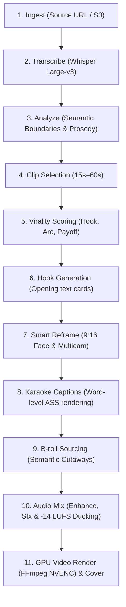

# Video to Viral Shorts Pipeline

Automatically turn webinars, podcasts, and YouTube long-form videos into high-engagement vertical Shorts, Reels, and TikToks.

This pipeline runs through FOTOhub's **Shorts Engine** (`server/shorts-engine/`), an automated assembly graph that executes speech-to-text, LLM viral moment scoring, computer-vision face tracking for 9:16 reframing, animated karaoke captioning, automated B-roll insertion, background audio ducking, EBU R128 loudness normalization (-14 LUFS), and hardware-accelerated NVENC video composition.

> [!TIP] Specialized Media Recipes
> - For multi-speaker interviews and studio podcasts, see the dedicated **[Long-Form Podcast to Viral Shorts Studio](./podcast-to-clips.md)** recipe.
> - For generating performance ads from e-commerce product URLs, see **[Automated UGC Video Ads](./ugc-video-campaigns.md)**.
> - For adding customized sound effects, Foley, and ambient audio, see **[AI Video Sound Design & Foley](./video-sound-design.md)**.

---

## Pipeline Architecture



---

## The 11 Processing Steps

### 1. Ingest
Extracts audio tracks and normalizes video codecs. Validates dimensions, frame rate (30/60 fps), and container headers.
- **Timeout**: 300s
- **Supported Formats**: MP4, MOV, MKV, WebM, or direct YouTube/HTTP URLs.

### 2. Transcribe
Processes audio with Whisper Large-v3 / WhisperX to produce word-level timestamps (`start_ms`, `end_ms`, `confidence`, `speaker_id`).
- **Word Timings**: Normalized and passed downstream to the caption and B-roll alignment engines.

### 3. Analyze
Identifies structural topic shifts, speaker turn-taking, acoustic energy spikes (laughter, excitement), and shot boundary changes.

### 4. Clip Selection
Extracts coherent narrative units between 15 and 60 seconds with self-contained context and payoffs.

### 5. Virality Scoring (B-Score)
An LLM (Claude 3.5 / Haiku 4.5 / DeepSeek) evaluates each candidate clip across five core virality dimensions (0–100):
- **Hook Strength (30%)**: Does the opening 3 seconds provoke curiosity or emotion?
- **Content Value (25%)**: Is the insight actionable and self-contained?
- **Emotional Impact (20%)**: Acoustic energy peaks and vocal conviction.
- **Pacing & Energy (15%)**: Pacing maintained without dead air or filler words.
- **Visual Appeal (10%)**: Speaker expression and landmark alignment.

### 6. Hooks Generation
Generates a dynamic 2–3 second high-contrast headline card overlaid at the start of the video to maximize thumb-stop rates.

### 7. Smart 9:16 Reframe & Multicam
Computer vision face detection and landmark tracking keep the active speaker centered in the 1080x1920 viewport:
- Smooth camera panning with easing algorithms to prevent jarring jumps.
- **Multi-speaker support**: Supports `stack` (Host top / Guest bottom with `dim_inactive: 0.18`) or automatic dynamic camera cuts.

### 8. Animated Karaoke Captions
Generates word-by-word highlighted captions rendered directly into the video stream via custom Advanced SubStation Alpha (`.ass`) tracks:
- Preset font families, bounce animations, shadow contours, and auto-inserted contextual emojis.

### 9. B-Roll Insertion
Scans transcript keywords to overlay contextual stock footage or AI-generated visual cutaways to mask cuts and maintain visual stimulation.

### 10. Audio Enhancement & -14 LUFS Ducking
Removes filler words (`um`, `uh`), trims dead silence, enhances vocal clarity with high-pass filtering and de-essing, applies 2-pass EBU R128 loudness normalization (-14 LUFS), and inserts background music with automatic speech-activated ducking (-16dB).

### 11. NVENC GPU Rendering & Cover
Composites video layers, caption tracks, audio stems, and color LUTs using hardware-accelerated NVENC encoding on EC2 GPU nodes. Produces the final MP4 along with a high-CTR cover thumbnail.

---

## Implementation Guide

### Submitting a Long-Form Video Job (`POST /v1/shorts/clips`)

FotoHUB provides the unified `/v1/shorts/clips` endpoint to trigger the complete 11-step pipeline as one asynchronous job with signed webhook delivery:

::: code-group

```python [Python]
"""Submit a long-form video to FotoHUB Shorts Engine."""

import os
import requests

API_KEY = os.environ.get("FOTOHUB_API_KEY", "fh_live_sample_key")
BASE_URL = "https://apis.fotohub.app"

response = requests.post(
    f"{BASE_URL}/v1/shorts/clips",
    headers={
        "Authorization": f"Bearer {API_KEY}",
        "Content-Type": "application/json"
    },
    json={
        "source_url": "https://storage.fotohub.app/raw/podcast_ep42.mp4",
        "title": "AI Infrastructure Keynote 2026",
        "max_clips": 3,
        "min_duration": 20,
        "max_duration": 60,
        "aspect_ratio": "9:16",
        "caption_style": "karaoke",
        "captions": True,
        "reframe": True,
        "hooks": True,
        "covers": True,
        "broll": True,
        "enhance_audio": True,
        "remove_filler": True,
        "retention_model": True,
        "webhook_url": "https://api.yourdomain.com/webhooks/fotohub",
        "webhook_secret": "whsec_live_secret_key_123",
        "settings": {
            "multicam": "stack",
            "multicam_dim": 0.18,
            "caption_highlight_color": "#FFDF00",
            "audio": {
                "target_lufs": -14.0,
                "denoise": True
            }
        }
    },
    timeout=30
)

response.raise_for_status()
job = response.json()
print(f"Clipping job submitted: {job['job_id']}")
print(f"Fee billed: ${job.get('charged_usd', 0):.2f} USD")
```

```typescript [TypeScript]
/**
 * Submit long-form video to FotoHUB Shorts Engine in TypeScript.
 */

const API_KEY = process.env.FOTOHUB_API_KEY || "fh_live_sample_key";

async function createViralShorts() {
  const response = await fetch("https://apis.fotohub.app/v1/shorts/clips", {
    method: "POST",
    headers: {
      Authorization: `Bearer ${API_KEY}`,
      "Content-Type": "application/json",
    },
    body: JSON.stringify({
      source_url: "https://storage.fotohub.app/raw/keynote_2026.mp4",
      title: "Keynote 2026 Highlights",
      max_clips: 3,
      min_duration: 20,
      max_duration: 60,
      aspect_ratio: "9:16",
      caption_style: "karaoke",
      captions: true,
      reframe: true,
      hooks: true,
      covers: true,
      broll: true,
      enhance_audio: true,
      remove_filler: true,
      retention_model: true,
      webhook_url: "https://api.yourdomain.com/webhooks/fotohub",
      webhook_secret: "whsec_live_secret_key_123",
      settings: {
        multicam: "stack",
        multicam_dim: 0.18,
        audio: { target_lufs: -14.0, denoise: true },
      },
    }),
  });

  const data = await response.json();
  console.log("Clipping job created:", data.job_id);
}

createViralShorts();
```

```go [Go]
package main

import (
	"bytes"
	"encoding/json"
	"fmt"
	"io"
	"net/http"
	"os"
)

func main() {
	payload := map[string]interface{}{
		"source_url":     "https://storage.fotohub.app/raw/interview_ep1.mp4",
		"title":          "Tech Interview Highlights",
		"max_clips":      3,
		"min_duration":   20,
		"max_duration":   60,
		"aspect_ratio":   "9:16",
		"caption_style":  "karaoke",
		"captions":       true,
		"reframe":        true,
		"hooks":          true,
		"covers":         true,
		"enhance_audio":  true,
		"remove_filler":  true,
		"webhook_url":    "https://api.yourdomain.com/webhooks/fotohub",
		"webhook_secret": "whsec_live_secret_key_123",
	}

	body, _ := json.Marshal(payload)
	req, _ := http.NewRequest("POST", "https://apis.fotohub.app/v1/shorts/clips", bytes.NewBuffer(body))
	req.Header.Set("Authorization", "Bearer "+os.Getenv("FOTOHUB_API_KEY"))
	req.Header.Set("Content-Type", "application/json")

	resp, err := http.DefaultClient.Do(req)
	if err != nil {
		panic(err)
	}
	defer resp.Body.Close()

	respBody, _ := io.ReadAll(resp.Body)
	fmt.Println("Job Response:", string(respBody))
}
```

```bash [cURL]
curl -X POST https://apis.fotohub.app/v1/shorts/clips \
  -H "Authorization: Bearer $FOTOHUB_API_KEY" \
  -H "Content-Type: application/json" \
  -d '{
    "source_url": "https://storage.fotohub.app/raw/stream.mp4",
    "title": "Conference Stream Highlights",
    "max_clips": 3,
    "min_duration": 20,
    "max_duration": 60,
    "aspect_ratio": "9:16",
    "caption_style": "karaoke",
    "captions": true,
    "reframe": true,
    "hooks": true,
    "covers": true,
    "broll": true,
    "enhance_audio": true,
    "remove_filler": true,
    "retention_model": true,
    "webhook_url": "https://api.yourdomain.com/webhooks/fotohub",
    "webhook_secret": "whsec_live_secret_key_123",
    "settings": {
      "multicam": "stack",
      "multicam_dim": 0.18,
      "audio": {
        "target_lufs": -14.0,
        "denoise": true
      }
    }
  }'
```

:::

---

## Webhook Notifications

FotoHUB signs every webhook with `HMAC-SHA256` in the `X-FotoHub-Signature` header.

### Event: `shorts.clip.rendered`

Delivered each time an individual short is completed:

```json
{
  "event": "shorts.clip.rendered",
  "timestamp": "2026-09-06T15:30:00Z",
  "job_id": "job_908f0a21",
  "data": {
    "clip_id": "clip_3821a9ef",
    "virality_score": 94,
    "title": "Why MicroVMs Beat Containers for Security",
    "hook": "Stop running customer code in shared Docker containers.",
    "duration_s": 42.6,
    "video_url": "https://storage.fotohub.app/shorts/job_908f0a21/clip_01.mp4",
    "cover_url": "https://storage.fotohub.app/shorts/job_908f0a21/cover_01.jpg",
    "retention_score": 88.5,
    "aspect_ratio": "9:16"
  }
}
```

### Event: `shorts.job.completed`

Fired when all clips in the project have finished processing:

```json
{
  "event": "shorts.job.completed",
  "timestamp": "2026-09-06T15:32:15Z",
  "job_id": "job_908f0a21",
  "data": {
    "total_clips": 3,
    "total_runtime_s": 135.2,
    "processing_time_s": 84.7,
    "clips": [
      {
        "clip_id": "clip_3821a9ef",
        "score": 94,
        "url": "https://storage.fotohub.app/shorts/job_908f0a21/clip_01.mp4"
      },
      {
        "clip_id": "clip_99a80b12",
        "score": 87,
        "url": "https://storage.fotohub.app/shorts/job_908f0a21/clip_02.mp4"
      },
      {
        "clip_id": "clip_12d45c88",
        "score": 81,
        "url": "https://storage.fotohub.app/shorts/job_908f0a21/clip_03.mp4"
      }
    ]
  }
}
```

---

## Exact USD Pricing Breakdown

All clipping jobs and individual step operations bill against your **prepaid USD wallet balance** (`wallet.available_usd`). There are no subscriptions, credits, or hidden conversion fees.

| Service Item | USD Price | Billing Scope |
|:---|:---:|:---|
| **Full Clipping Job (`shorts_clip_job`)** | **$0.75 / job** | Covers the complete 11-step pipeline for up to 30 extracted clips. |
| **Video Ingest (`shorts_ingest`)** | $0.05 / request | Container decode & audio extraction |
| **WhisperX Transcribe (`shorts_transcribe`)** | $0.05 / request | Acoustic word timestamps |
| **Scene Detection (`shorts_detect_scenes`)** | $0.08 / request | Shot cut detection |
| **Clip Generation (`shorts_generate_clips`)** | $0.12 / request | AI narrative scoring |
| **Captions (`shorts_captions`)** | $0.05 / request | ASS subtitle track compilation |
| **Smart Reframe (`shorts_reframe`)** | $0.08 / request | Face tracking & 9:16 crop |
| **GPU Render (`shorts_render`)** | $0.12 / request | Hardware NVENC video composition |

A 60-minute video yielding 3 viral shorts costs **$0.75 USD total**, or **$0.25 per rendered short**.
