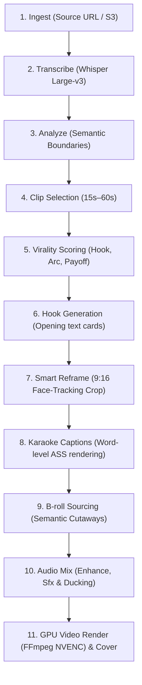

# Video to Viral Shorts Pipeline

Automatically turn webinars, podcasts, and YouTube long-form videos into high-engagement vertical Shorts, Reels, and TikToks.

This pipeline runs through FOTOhub's **Shorts Engine** (`server/shorts-engine/`), an 11-step automated assembly graph that executes speech-to-text, LLM viral moment scoring, computer-vision face tracking for 9:16 reframing, animated karaoke captioning, automated B-roll insertion, background audio ducking, and hardware-accelerated video composition.

---

## Pipeline Architecture



---

## The 11 Processing Steps

### 1. Ingest
Extracts audio tracks and normalizes video codecs. Validates dimensions, frame rate (30/60 fps), and container headers.
- **Timeout**: 300s
- **Supported Formats**: MP4, MOV, MKV, WebM, or direct YouTube/HTTP URLs.

### 2. Transcribe
Processes audio with Whisper Large-v3 to produce word-level timestamps (`start_ms`, `end_ms`, `confidence`, `speaker_id`).
- **Word Timings**: Normalized and passed downstream to the caption and B-roll alignment engines.

### 3. Analyze
Identifies structural topic shifts, speaker turn-taking, acoustic energy spikes (laughter, excitement), and shot boundary changes.

### 4. Clip Selection
Extracts coherent narrative units between 15 and 60 seconds with self-contained context.

### 5. Virality Scoring
An LLM evaluates each candidate clip across four core virality dimensions (0–100):
- **Hook Strength**: Does the opening 3 seconds provoke curiosity or emotion?
- **Retention Arc**: Is information pacing maintained without dead air?
- **Punchline/Payoff**: Does the segment resolve with actionable insight or humor?
- **Trend Relevance**: Matches current social media conversation patterns.

### 6. Hooks Generation
Generates a dynamic 2–3 second high-contrast headline card overlaid at the start of the video to maximize thumb-stop rates.

### 7. Smart 9:16 Reframe
Computer vision face detection and landmark tracking keep the active speaker centered in the 1080x1920 viewport:
- Smooth camera panning with easing algorithms to prevent jarring jumps.
- Multi-speaker support: Automatically switches camera focus or splits the screen into horizontal speaker tiles.

### 8. Animated Karaoke Captions
Generates word-by-word highlighted captions rendered directly into the video stream via custom Advanced SubStation Alpha (`.ass`) tracks:
- Preset font families, bounce animations, shadow contours, and auto-inserted contextual emojis.

### 9. B-Roll Insertion
Scans transcript keywords to overlay contextual stock footage or AI-generated visual cutaways to mask cuts and maintain visual stimulation.

### 10. Audio Enhancement & Ducking
Removes filler words (`um`, `uh`), trims dead silence, enhances vocal clarity, and inserts background music with automatic speech-activated ducking (music volume attenuates -18dB whenever speech is active).

### 11. NVENC GPU Rendering & Cover
Composites video layers, caption tracks, audio stems, and color LUTs using hardware-accelerated NVENC encoding on EC2 GPU nodes. Produces the final MP4 along with a high-CTR cover thumbnail.

---

## Implementation Guide

### Submitting a Long-Form Video Job

::: code-group

```python [Python]
from fotohub import FotoHub
import os

client = FotoHub(api_key=os.environ["FOTOHUB_API_KEY"])

# Submit long-form video for automated shorts generation
job = client.post(
    "/v1/shorts/projects",
    json={
        "name": "Podcast Episode 42 Highlights",
        "source_url": "https://storage.fotohub.app/raw/podcast_ep42.mp4",
        "mode": "clip",
        "settings": {
            "target_clip_count": 3,
            "min_clip_duration_s": 20,
            "max_clip_duration_s": 55,
            "aspect_ratio": "9:16",
            "face_tracking": True,
            "caption_style": {
                "preset": "karaoke_glow",
                "font_family": "Montserrat",
                "highlight_color": "#FFDF00",
                "emojis_enabled": True
            },
            "audio_enhance": True,
            "filler_removal": "aggressive",
            "silence_removal": True,
            "sound_effects": True,
            "background_music": {
                "enabled": True,
                "genre": "upbeat_lofi",
                "ducking_db": -16.0
            }
        },
        "webhook_url": "https://api.yourdomain.com/webhooks/fotohub"
    }
)

print(f"Project initiated: {job['project_id']}, status: {job['status']}")
```

```typescript [TypeScript]
import { FotoHub } from "fotohub";

const client = new FotoHub({ apiKey: process.env.FOTOHUB_API_KEY! });

async function createViralShorts() {
  const response = await client.post("/v1/shorts/projects", {
    name: "Keynote 2026 AI Highlights",
    source_url: "https://storage.fotohub.app/raw/keynote_2026.mp4",
    mode: "clip",
    settings: {
      target_clip_count: 5,
      aspect_ratio: "9:16",
      face_tracking: true,
      caption_style: {
        preset: "viral_bounce",
        font_family: "Geist",
        highlight_color: "#10B981",
        emojis_enabled: true,
      },
      audio_enhance: true,
      filler_removal: "moderate",
      silence_removal: true,
      sound_effects: true,
    },
    webhook_url: "https://api.yourdomain.com/webhooks/fotohub",
  });

  console.log("Project created:", response.data.project_id);
}

createViralShorts();
```

```go [Go]
package main

import (
	"bytes"
	"encoding/json"
	"fmt"
	"io"
	"net/http"
	"os"
)

type ProjectRequest struct {
	Name       string                 `json:"name"`
	SourceURL  string                 `json:"source_url"`
	Mode       string                 `json:"mode"`
	Settings   map[string]interface{} `json:"settings"`
	WebhookURL string                 `json:"webhook_url"`
}

func main() {
	payload := ProjectRequest{
		Name:      "Tech Interview Ep1",
		SourceURL: "https://storage.fotohub.app/raw/interview_ep1.mp4",
		Mode:      "clip",
		Settings: map[string]interface{}{
			"target_clip_count": 3,
			"aspect_ratio":      "9:16",
			"face_tracking":     true,
			"audio_enhance":     true,
			"silence_removal":   true,
			"caption_style": map[string]interface{}{
				"preset":          "karaoke_glow",
				"highlight_color": "#F59E0B",
			},
		},
		WebhookURL: "https://api.yourdomain.com/webhooks/fotohub",
	}

	body, _ := json.Marshal(payload)
	req, _ := http.NewRequest("POST", "https://apis.fotohub.app/v1/shorts/projects", bytes.NewBuffer(body))
	req.Header.Set("Authorization", "Bearer "+os.Getenv("FOTOHUB_API_KEY"))
	req.Header.Set("Content-Type", "application/json")

	resp, err := http.DefaultClient.Do(req)
	if err != nil {
		panic(err)
	}
	defer resp.Body.Close()

	respBody, _ := io.ReadAll(resp.Body)
	fmt.Println("Created Project:", string(respBody))
}
```

```bash [cURL]
curl -X POST https://apis.fotohub.app/v1/shorts/projects \
  -H "Authorization: Bearer $FOTOHUB_API_KEY" \
  -H "Content-Type: application/json" \
  -d '{
    "name": "Conference Stream Clip",
    "source_url": "https://storage.fotohub.app/raw/stream.mp4",
    "mode": "clip",
    "settings": {
      "target_clip_count": 3,
      "aspect_ratio": "9:16",
      "face_tracking": true,
      "caption_style": {
        "preset": "karaoke_glow",
        "font_family": "Montserrat",
        "highlight_color": "#FFDF00",
        "emojis_enabled": true
      },
      "audio_enhance": true,
      "silence_removal": true
    },
    "webhook_url": "https://api.yourdomain.com/webhooks/fotohub"
  }'
```

:::

---

## Polling and Webhook Notifications

While progress can be checked via `GET /v1/shorts/projects/{project_id}`, production workflows should listen for webhook callbacks signed with `X-FotoHub-Signature`.

### Event: `shorts.clip.rendered`

Delivered each time an individual short is completed:

```json
{
  "event": "shorts.clip.rendered",
  "timestamp": "2026-09-06T15:30:00Z",
  "attempt": 1,
  "data": {
    "project_id": "proj_908f0a21",
    "clip_id": "clip_3821a9ef",
    "virality_score": 94,
    "title": "Why MicroVMs Beat Containers for Security",
    "hook": "Stop running customer code in shared Docker containers.",
    "duration_s": 42.6,
    "video_url": "https://storage.fotohub.app/shorts/proj_908f0a21/clip_01.mp4",
    "cover_url": "https://storage.fotohub.app/shorts/proj_908f0a21/cover_01.jpg",
    "retention_score": 88.5,
    "aspect_ratio": "9:16"
  }
}
```

### Event: `shorts.job.completed`

Fired when all clips in the project have finished processing:

```json
{
  "event": "shorts.job.completed",
  "timestamp": "2026-09-06T15:32:15Z",
  "attempt": 1,
  "data": {
    "project_id": "proj_908f0a21",
    "total_clips": 3,
    "total_runtime_s": 135.2,
    "processing_time_s": 84.7,
    "clips": [
      {
        "clip_id": "clip_3821a9ef",
        "score": 94,
        "url": "https://storage.fotohub.app/shorts/proj_908f0a21/clip_01.mp4"
      },
      {
        "clip_id": "clip_99a80b12",
        "score": 87,
        "url": "https://storage.fotohub.app/shorts/proj_908f0a21/clip_02.mp4"
      },
      {
        "clip_id": "clip_12d45c88",
        "score": 81,
        "url": "https://storage.fotohub.app/shorts/proj_908f0a21/clip_03.mp4"
      }
    ]
  }
}
```
