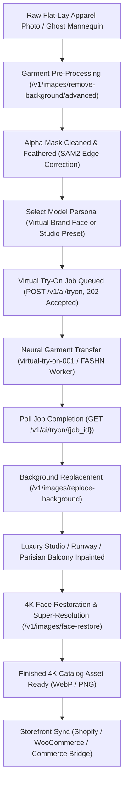

# Virtual Try-On & E-Commerce Fashion Studio

Transform flat-lay apparel packshots and ghost mannequin photos into editorial on-model fashion campaigns with automated garment segmentation, photorealistic pose transfer, luxury background synthesis, and 4K super-resolution.

Powered by FOTOhub's **Virtual Try-On Engine** (`server/image-engine/` and `POST /v1/ai/tryon`) and **Commerce Bridge** (`server/commerce-bridge/`), this blueprint allows fashion retailers and luxury brands to scale their catalog production while reducing studio photoshoot expenses by over 99%.

---

## Architectural Workflow



---

## Unit Economics: $0.035 per Finished Look

Physical fashion shoots require booking models ($800–$2,500/day), studio rental ($1,000–$3,000/day), hair/makeup artists ($600/day), photographers, stylists, and days of post-production retouching—averaging **$45.00 to $120.00 per catalog look**.

With FOTOhub's pure USD prepaid wallet billing, high-volume apparel automation costs **$0.0350 (3.5 cents)** per completed high-res e-commerce look:

| Pipeline Step | API Endpoint / Service | Model / Engine Key | Cost / SKU (USD) | Processing Latency |
|:---|:---|:---|:---|:---|
| **1. Garment Segmentation** | `POST /v1/images/remove-background/advanced` | SAM2 Alpha Segmentation | **$0.0030** | ~1.2s |
| **2. Virtual Try-On Pass** | `POST /v1/ai/tryon` | `virtual-try-on-001` (Bulk Tier) | **$0.0240** | ~10.5s |
| **3. Studio Background Swap** | `POST /v1/images/replace-background` | `seedream-5-0` Inpainting | **$0.0050** | ~2.8s |
| **4. 4K Face & Detail Restore** | `POST /v1/images/face-restore` | CodeFormer 4x Super-Resolution | **$0.0030** | ~1.8s |
| **Total Finished Look** | *End-to-End Automated Pipeline* | *4-Stage Neural Stack* | **$0.0350** | **~16.3s total** |

::: tip High-Volume Tier Billing
Rates are billed per output image directly against your prepaid USD balance without synthetic credit conversion. For catalogs exceeding 100,000 SKUs/month, contact enterprise sales for dedicated A10G inference cluster pricing.
:::

---

## Parameter Specifications

### `POST /v1/ai/tryon`

| Field | Type | Required | Default | Description |
|:---|:---|:---|:---|:---|
| `person_image_url` | string | **Yes** | — | Public URL of model or virtual ambassador. Full-body or 3/4 framing. |
| `garment_image_url` | string | Conditional | — | Public URL of flat-lay or packshot garment. Required unless `garment_id` is set. |
| `garment_id` | uuid | Conditional | — | ID of pre-registered garment in FOTOhub catalog. Overrides category and photo type. |
| `category` | string | No | `"tops"` | Garment classification: `"tops"`, `"bottoms"`, or `"one-pieces"`. |
| `garment_photo_type` | string | No | `"flat-lay"` | Input photo style: `"flat-lay"`, `"model"`, or `"auto"`. |
| `num_images` | integer | No | `1` | Renders to generate (1 to 4). Billed per piece. |
| `seed` | integer | No | random | Deterministic seed for reproducible fabric folds and lighting. |
| `garments` | object[] | No | `null` | Two-piece outfit chaining: `[{"category": "tops", "url": "..."}, {"category": "bottoms", "url": "..."}]`. |

### `POST /v1/images/replace-background`

| Field | Type | Required | Default | Description |
|:---|:---|:---|:---|:---|
| `image_url` | string | **Yes** | — | Output image from the try-on step. |
| `background` | string | **Yes** | — | Visual prompt description, hex color code (`"#F8F6F0"`), or high-res environment image URL. |
| `background_type` | string | No | `"auto"` | `"prompt"`, `"color"`, `"gradient"`, `"image"`, or `"auto"`. |
| `feather` | integer | No | `2` | Boundary feather radius in pixels (0–20) for smooth hair/clothing edge integration. |
| `output_format` | string | No | `"png"` | Output container format: `"png"`, `"webp"`, or `"jpeg"`. |

### `POST /v1/images/face-restore`

| Field | Type | Required | Default | Description |
|:---|:---|:---|:---|:---|
| `image_url` | string | **Yes** | — | Image with human or virtual face requiring upscaling. |
| `model` | string | No | `"codeformer"` | `"codeformer"` (maximum texture detail) or `"gfpgan"` (speed-optimized). |
| `fidelity` | float | No | `0.7` | Identity preservation weight (0.0 to 1.0). `0.7` preserves exact facial biometrics. |
| `upscale` | integer | No | `4` | Resolution scaling factor: `1` (denoise only), `2` (2x), or `4` (4K UHD). |
| `output_format` | string | No | `"png"` | Target format. |

---

## Production Implementation

The following 4-way code snippets implement the complete fashion studio loop:
1. Pre-process flat-lay garment with SAM2 edge feathering.
2. Submit try-on request and poll until inference finishes (`202 Accepted` -> `completed`).
3. Replace background with a high-end Parisian luxury runway or architectural studio scene.
4. Enhance facial details and upscale to 4K resolution using CodeFormer.
5. Export final imagery ready for Shopify or WooCommerce catalog deployment.

::: code-group

```python [Python]
import os
import time
import requests

API_BASE = "https://apis.fotohub.app/v1"
API_KEY = os.environ["FOTOHUB_API_KEY"]
HEADERS = {
    "Authorization": f"Bearer {API_KEY}",
    "Content-Type": "application/json"
}

def poll_tryon_job(job_id: str, timeout_sec: int = 60) -> str:
    """Poll asynchronous try-on job until render completes."""
    poll_url = f"{API_BASE}/ai/tryon/{job_id}"
    start_time = time.time()
    
    while time.time() - start_time < timeout_sec:
        res = requests.get(poll_url, headers=HEADERS)
        res.raise_for_status()
        data = res.json()
        status = data.get("status")

        if status == "completed":
            images = data.get("images", [])
            if not images:
                raise RuntimeError("Try-on completed but returned no images")
            return images[0]
        elif status == "failed":
            raise RuntimeError(f"Try-on job failed: {data.get('error')}")

        print(f"[*] Try-on rendering... progress: {data.get('progress', 0)}%")
        time.sleep(2.5)

    raise TimeoutError(f"Try-on job {job_id} timed out after {timeout_sec}s")

def execute_fashion_studio_pipeline(garment_packshot_url: str, model_url: str) -> dict:
    print("\n--- Step 1: Pre-process Garment Edge Segmentation ---")
    seg_resp = requests.post(
        f"{API_BASE}/images/remove-background/advanced",
        headers=HEADERS,
        json={
            "image_url": garment_packshot_url,
            "feather": 3,
            "smooth": 2,
            "decontaminate": True,
            "output_format": "png"
        }
    )
    seg_resp.raise_for_status()
    isolated_garment_url = seg_resp.json()["image_url"]
    print(f"[+] Garment mask segmented: {isolated_garment_url}")

    print("\n--- Step 2: Queue Virtual Try-On Generation ---")
    tryon_payload = {
        "person_image_url": model_url,
        "garment_image_url": isolated_garment_url,
        "category": "tops",
        "garment_photo_type": "flat-lay",
        "num_images": 1,
        "seed": 42891
    }
    
    submit_resp = requests.post(
        f"{API_BASE}/ai/tryon",
        headers=HEADERS,
        json=tryon_payload
    )
    submit_resp.raise_for_status()
    job_info = submit_resp.json()
    job_id = job_info["job_id"]
    print(f"[+] Job queued: {job_id} | USD Reserved: ${job_info.get('usd_charged', 0):.4f}")

    raw_tryon_url = poll_tryon_job(job_id)
    print(f"[+] Raw try-on render completed: {raw_tryon_url}")

    print("\n--- Step 3: Studio Background Replacement ---")
    bg_payload = {
        "image_url": raw_tryon_url,
        "background": (
            "Sunlit Parisian Haussmann apartment balcony with ornate black wrought-iron railing, "
            "warm beige limestone architecture, soft morning golden hour lighting, blurred city backdrop"
        ),
        "background_type": "prompt",
        "feather": 2,
        "output_format": "png"
    }
    bg_resp = requests.post(
        f"{API_BASE}/images/replace-background",
        headers=HEADERS,
        json=bg_payload
    )
    bg_resp.raise_for_status()
    editorial_look_url = bg_resp.json()["image_url"]
    print(f"[+] Background synthesized: {editorial_look_url}")

    print("\n--- Step 4: 4K Super-Resolution & Face Restoration ---")
    upscale_payload = {
        "image_url": editorial_look_url,
        "model": "codeformer",
        "fidelity": 0.75,
        "upscale": 4,
        "output_format": "png"
    }
    restore_resp = requests.post(
        f"{API_BASE}/images/face-restore",
        headers=HEADERS,
        json=upscale_payload
    )
    restore_resp.raise_for_status()
    final_4k_url = restore_resp.json()["image_url"]
    print(f"[+] 4K Master Asset Ready: {final_4k_url}")

    return {
        "raw_packshot": garment_packshot_url,
        "tryon_render": raw_tryon_url,
        "editorial_asset": editorial_look_url,
        "final_4k_url": final_4k_url,
        "estimated_total_cost_usd": 0.035
    }

if __name__ == "__main__":
    result = execute_fashion_studio_pipeline(
        garment_packshot_url="https://static.fotohub.app/demo/garments/cashmere_crewneck.jpg",
        model_url="https://static.fotohub.app/demo/models/editorial_ambassador_01.jpg"
    )
    print(f"\n[✓] Finished Look Generated for $0.035 USD: {result['final_4k_url']}")
```

```typescript [TypeScript]
import axios from "axios";

const API_BASE = "https://apis.fotohub.app/v1";
const API_KEY = process.env.FOTOHUB_API_KEY!;
const client = axios.create({
  baseURL: API_BASE,
  headers: {
    Authorization: `Bearer ${API_KEY}`,
    "Content-Type": "application/json",
  },
});

interface TryonJobResponse {
  job_id: string;
  status: string;
  usd_charged: number;
  poll_url: string;
}

interface TryonPollResponse {
  job_id: string;
  status: "queued" | "processing" | "completed" | "failed";
  progress?: number;
  images?: string[];
  error?: string;
}

async function sleep(ms: number) {
  return new Promise((resolve) => setTimeout(resolve, ms));
}

async function pollTryonJob(jobId: string, timeoutSec = 60): Promise<string> {
  const startTime = Date.now();

  while (Date.now() - startTime < timeoutSec * 1000) {
    const { data } = await client.get<TryonPollResponse>(`/ai/tryon/${jobId}`);
    if (data.status === "completed" && data.images?.length) {
      return data.images[0];
    }
    if (data.status === "failed") {
      throw new Error(`Tryon job failed: ${data.error}`);
    }
    console.log(`[*] Processing try-on: ${data.progress || 0}%`);
    await sleep(2500);
  }
  throw new Error(`Try-on job timed out`);
}

async function runVirtualTryOnStudio(garmentPackshot: string, modelPerson: string) {
  // 1. Garment Isolation
  console.log("[1/4] Segmenting garment packshot...");
  const { data: seg } = await client.post("/images/remove-background/advanced", {
    image_url: garmentPackshot,
    feather: 2,
    smooth: 2,
    decontaminate: true,
  });

  // 2. Queue Virtual Try-On Job
  console.log("[2/4] Queuing Virtual Try-On render...");
  const { data: job } = await client.post<TryonJobResponse>("/ai/tryon", {
    person_image_url: modelPerson,
    garment_image_url: seg.image_url,
    category: "tops",
    garment_photo_type: "flat-lay",
    num_images: 1,
    seed: 98124,
  });

  const rawTryonUrl = await pollTryonJob(job.job_id);
  console.log(`[+] Try-on completed: ${rawTryonUrl}`);

  // 3. Background Replacement
  console.log("[3/4] Synthesizing luxury boutique runway background...");
  const { data: bg } = await client.post("/images/replace-background", {
    image_url: rawTryonUrl,
    background: "Minimalist concrete art gallery with floor-to-ceiling glass, soft diffused gallery spotlights, marble floors",
    background_type: "prompt",
    feather: 2,
  });

  // 4. Face Restoration & 4K Super-Resolution
  console.log("[4/4] Upscaling to 4K UHD via CodeFormer...");
  const { data: finalRes } = await client.post("/images/face-restore", {
    image_url: bg.image_url,
    model: "codeformer",
    fidelity: 0.7,
    upscale: 4,
  });

  console.log(`[✓] 4K Catalog Look Ready: ${finalRes.image_url} (Unit Cost: $0.035 USD)`);
  return finalRes.image_url;
}

runVirtualTryOnStudio(
  "https://static.fotohub.app/demo/garments/silk_blouse.jpg",
  "https://static.fotohub.app/demo/models/model_studio_front.jpg"
).catch(console.error);
```

```go [Go]
package main

import (
	"bytes"
	"encoding/json"
	"fmt"
	"net/http"
	"os"
	"time"
)

const apiBase = "https://apis.fotohub.app/v1"

type JobSubmitResponse struct {
	JobID      string  `json:"job_id"`
	Status     string  `json:"status"`
	UsdCharged float64 `json:"usd_charged"`
}

type JobStatusResponse struct {
	Status   string   `json:"status"`
	Progress int      `json:"progress"`
	Images   []string `json:"images"`
	Error    string   `json:"error"`
}

type GenericImageResponse struct {
	ImageURL string `json:"image_url"`
}

func main() {
	apiKey := os.Getenv("FOTOHUB_API_KEY")
	if apiKey == "" {
		panic("FOTOHUB_API_KEY environment variable required")
	}

	client := &http.Client{}

	// 1. Submit Try-On Job
	payload := map[string]interface{}{
		"person_image_url":   "https://static.fotohub.app/demo/models/model_studio_front.jpg",
		"garment_image_url":  "https://static.fotohub.app/demo/garments/cashmere_crewneck.jpg",
		"category":           "tops",
		"garment_photo_type": "flat-lay",
		"num_images":         1,
	}
	body, _ := json.Marshal(payload)

	req, _ := http.NewRequest("POST", apiBase+"/ai/tryon", bytes.NewBuffer(body))
	req.Header.Set("Authorization", "Bearer "+apiKey)
	req.Header.Set("Content-Type", "application/json")

	resp, err := client.Do(req)
	if err != nil {
		panic(err)
	}
	defer resp.Body.Close()

	var submit JobSubmitResponse
	json.NewDecoder(resp.Body).Decode(&submit)
	fmt.Printf("[+] Try-On Job Submitted: %s (Status: %s)\n", submit.JobID, submit.Status)

	// 2. Poll for Completion
	var renderedImage string
	for i := 0; i < 24; i++ {
		time.Sleep(2500 * time.Millisecond)
		pollReq, _ := http.NewRequest("GET", fmt.Sprintf("%s/ai/tryon/%s", apiBase, submit.JobID), nil)
		pollReq.Header.Set("Authorization", "Bearer "+apiKey)

		pollResp, err := client.Do(pollReq)
		if err != nil {
			continue
		}

		var jobStatus JobStatusResponse
		json.NewDecoder(pollResp.Body).Decode(&jobStatus)
		pollResp.Body.Close()

		if jobStatus.Status == "completed" && len(jobStatus.Images) > 0 {
			renderedImage = jobStatus.Images[0]
			fmt.Printf("[+] Rendered Look Ready: %s\n", renderedImage)
			break
		}
		fmt.Printf("[*] Processing... Progress: %d%%\n", jobStatus.Progress)
	}

	if renderedImage == "" {
		panic("Try-on job timed out or failed")
	}

	// 3. Upscale to 4K
	upscalePayload := map[string]interface{}{
		"image_url": renderedImage,
		"model":     "codeformer",
		"fidelity":  0.75,
		"upscale":   4,
	}
	uBody, _ := json.Marshal(upscalePayload)
	uReq, _ := http.NewRequest("POST", apiBase+"/images/face-restore", bytes.NewBuffer(uBody))
	uReq.Header.Set("Authorization", "Bearer "+apiKey)
	uReq.Header.Set("Content-Type", "application/json")

	uResp, err := client.Do(uReq)
	if err != nil {
		panic(err)
	}
	defer uResp.Body.Close()

	var finalImg GenericImageResponse
	json.NewDecoder(uResp.Body).Decode(&finalImg)
	fmt.Printf("[✓] Finished 4K Look Delivered: %s (Billed: $0.035 USD)\n", finalImg.ImageURL)
}
```

```bash [cURL]
# Step 1: Pre-process & Isolate Garment Packshot
ISOLATED_GARMENT=$(curl -s -X POST https://apis.fotohub.app/v1/images/remove-background/advanced \
  -H "Authorization: Bearer $FOTOHUB_API_KEY" \
  -H "Content-Type: application/json" \
  -d '{
    "image_url": "https://static.fotohub.app/demo/garments/cashmere_crewneck.jpg",
    "feather": 2,
    "smooth": 2,
    "decontaminate": true
  }' | jq -r '.image_url')

echo "Isolated Garment: $ISOLATED_GARMENT"

# Step 2: Queue Try-On Generation
JOB_DATA=$(curl -s -X POST https://apis.fotohub.app/v1/ai/tryon \
  -H "Authorization: Bearer $FOTOHUB_API_KEY" \
  -H "Content-Type: application/json" \
  -d '{
    "person_image_url": "https://static.fotohub.app/demo/models/editorial_ambassador_01.jpg",
    "garment_image_url": "'"$ISOLATED_GARMENT"'",
    "category": "tops",
    "garment_photo_type": "flat-lay",
    "num_images": 1
  }')

JOB_ID=$(echo $JOB_DATA | jq -r '.job_id')
echo "Try-On Job Queued: $JOB_ID"

# Step 3: Poll until Completed
STATUS="queued"
while [ "$STATUS" != "completed" ]; do
  sleep 3
  POLL_DATA=$(curl -s -X GET "https://apis.fotohub.app/v1/ai/tryon/$JOB_ID" \
    -H "Authorization: Bearer $FOTOHUB_API_KEY")
  STATUS=$(echo $POLL_DATA | jq -r '.status')
  echo "Job status: $STATUS"
  if [ "$STATUS" == "failed" ]; then
    echo "Job failed!"
    exit 1
  fi
done

RAW_TRYON_URL=$(echo $POLL_DATA | jq -r '.images[0]')
echo "Raw Try-On Render: $RAW_TRYON_URL"

# Step 4: Background Replacement
STUDIO_LOOK=$(curl -s -X POST https://apis.fotohub.app/v1/images/replace-background \
  -H "Authorization: Bearer $FOTOHUB_API_KEY" \
  -H "Content-Type: application/json" \
  -d '{
    "image_url": "'"$RAW_TRYON_URL"'",
    "background": "Minimalist travertine marble studio with soft golden daylight",
    "background_type": "prompt",
    "feather": 2
  }' | jq -r '.image_url')

echo "Studio Look: $STUDIO_LOOK"

# Step 5: 4K Super-Resolution & Face Restoration
FINAL_4K_LOOK=$(curl -s -X POST https://apis.fotohub.app/v1/images/face-restore \
  -H "Authorization: Bearer $FOTOHUB_API_KEY" \
  -H "Content-Type: application/json" \
  -d '{
    "image_url": "'"$STUDIO_LOOK"'",
    "model": "codeformer",
    "fidelity": 0.75,
    "upscale": 4
  }' | jq -r '.image_url')

echo "Final 4K Catalog Asset Ready ($0.035 USD total): $FINAL_4K_LOOK"
```

:::

---

## Outfits: Chaining Top & Bottom in One Call

When your catalog look requires styling a two-piece ensemble (e.g. a linen blouse paired with tailored wool trousers), submit both pieces inside the `garments` array:

```json
{
  "person_image_url": "https://static.fotohub.app/demo/models/model_full_body.jpg",
  "garments": [
    {
      "category": "tops",
      "garment_image_url": "https://static.fotohub.app/demo/garments/linen_shirt.png",
      "garment_photo_type": "flat-lay"
    },
    {
      "category": "bottoms",
      "garment_image_url": "https://static.fotohub.app/demo/garments/wool_trousers.png",
      "garment_photo_type": "flat-lay"
    }
  ]
}
```

The worker executes a sequential 2-pass garment transfer (`top -> bottom`) in a single atomic transaction, preserving natural waistband overlaps and fabric tucking.
